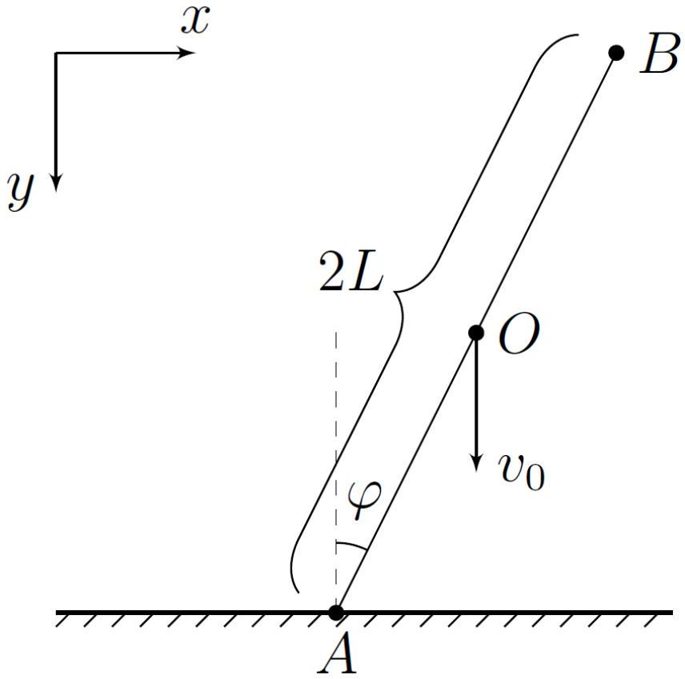

## Road to IPhO

## Частично неупругая поверхность

Упругие и абсолютно неупругие соударения - лишь модели, в рамках которых решаются большинство задач. Они оказываются применимыми при взаимодействии некоторых материалов.

Например, моделью упругих соударений хорошо описывается «Колыбель Ньютона», в которой металлические шарики, подвешенные на нитях, соударяются друг с другом таким образом, что при соударениях между шариками потери механической энергии оказываются незначительными.

Моделью абсолютно неупругого соударения описывается куда большее количество явлений, такие как, например, падение камня на асфальт или же баллистический маятник.

В действительности, все соударения являются частично неупругими. Например, если без начальной скорости отпустить резиновый шарик, то при каждом соударении с поверхностью пола его скорость будет уменьшаться. В качестве примера частично неупругого взаимодействия также хорошо подходит и явление гистерезиса, когда тела, обладающие хорошими упругими свойствами, имеют остаточную деформацию после воздействия на них большим внешним усилием.

Характеристикой частично неупругого соударения является коэффициент восстановления $k$, причём $0<k<1$. При отсутствии трения между соприкасающимися поверхностями он определяется следующим образом:

Пусть $E_{0}$ - суммарная кинетическая энергия сталкивающихся тел прямо перед их соударением, а $W$ - максимальная потеря их суммарной кинетической энергии, ушедшая на деформацию контактирующих поверхностей.

Тогда сразу после соударения тел их суммарная кинетическая энергия равна $E=E_{0}-E_{\text {деф }}$, где $E_{\text {деф }}-$ остаточная энергия деформации поверхностей, равная

$$
E_{\text {деф }}=W(1-k) .
$$

Поясним полученный результат на примере шарика, прыгающего на частично упругой поверхности:
Если шарик отпустить без начальной скорости с высоты $H$ над горизонтальной поверхностью с коэффициентом восстановления $k$, то после соударения с ней шарик подпрыгнет на высоту $h=k H$.

Перейдём к основной задаче.
На горизонтальную поверхность с коэффициентом восстановления $k$ поступательно со скоростью $v_{0}$ падает однородный стержень $A B$ массы $m$ и длины $2 L$, составляющий угол $\varphi$ с вертикалью. Коэффициент трения стержня о поверхность равен $\mu$. Стержень касается поверхности концом $A$.

Направим ось $x$ горизонтально (вправо), а ось $y$ - вертикально (вниз).
Обозначим во время удара за $v_{x}$ и $v_{y}$ проекции скорости центра стержня $O$ на оси координат, за $\omega$ угловую скорость стержня (направление вращения по часовой стрелке), а за $v_{A x}$ и $v_{A y}$ - проекции скорости точки $A$ на оси $x$ и $y$ соответственно.

Также за $F_{x}$ обозначим проекцию силы трения на ось $x$, а за $N$ - силу нормальной реакции поверхности $\left(N_{y}=-N\right)$.

Считайте, что в процессе удара угол $\varphi$ остаётся постоянным.

## Road to IPhO

Часть А. Возможные виды удара (2.5 балла)
| A1 | Выразите $\dot{v}_{x}$ через $F_{x}$ и $m$. | 0.1 |
| :--- | :--- | :--- |
| A2 | Выразите $\dot{\omega}$ через $F_{x}, N, L, \varphi$ и $m$. | 0.4 |
| A3 | Выразите $v_{A x}$ через $\omega, v_{x}, \varphi$ и $L$. | 0.1 |
| A4 | Докажите, что $v_{A x} \leq 0$ при любых значениях $\mu$ и $\varphi$. | 0.4 |

Таким образом, возможны две ситуации:

1. Проскальзывание в процессе удара отсутствует;
2. При проскальзывании $F_{x}>0$.

Далее вам предстоит выяснить, при каких соотношениях $\varphi$ и $\mu$ реализуется каждая из них.
Необходимым условием реализации второй ситуации является $v_{A x}<0$. Далее в рамках данной части задачи это условие выполняется.

| A5 | Выразите $v_{A_{x}}$ через $v_{x}, \varphi$ и $\mu$. | 0.1 |
| :--- | :--- | :--- |
| A6 | При каком минимально возможном значении $\mu_{0}$ проскальзывание невозможно ни при каких значениях угла $\varphi$ ? | 0.6 |

A7 Для $\mu<\mu_{0}$ найдите все значения угла $\varphi$, при которых проскальзывание возможно. Границы диапазона $\mathbf{0 . 8}$ углов выразите через $\mu$.

Мы получили условия, при которых возникает каждый из видов взаимодействия стержня с поверхностью. Перейдём к описанию процессов соударения.

Поскольку в данной системе возможно проскальзывание, кинетическая энергия, помимо остаточной деформации поверхности, также может переходить и в тепловыделение под действием силы трения.

После удара кинетическая энергия стержня $E$ равна:

$$
E=E_{0}-E_{\text {деф }}+A_{\text {тр }}
$$

где $A_{\text {тр }}$ - работа силы трения, а $E_{0}$ и $E_{\text {деф }}$ определяется так же, как и во введении.
Также рамках данной задачи можно считать, что сила трения, возникающая в системе, не приводит к дополнительным деформациям поверхности.

Часть В. Отсутствие проскальзывания (3.5 балла)
В этой части задачи во всех пунктах считайте, что $\mu>\mu_{0}$.

| B1 | Выразите $v_{x}$ через $\omega, L$ и $\varphi$. | 0.2 |
| :--- | :--- | :--- |
| B2 | Выразите $v_{y}$ через $v_{0}, \omega, L$ и $\varphi$. | 0.6 |
| B3 | Найдите максимальную энергию $W$, ушедшую на деформацию поверхности. Ответ выразите через $m, v_{0}$ и $\varphi$. | 0.8 |
| B4 | Найдите $\omega_{\mathrm{K}}$ после удара. Ответ выразите через $v_{0}, L, \varphi$ и $k$. | 1.2 |
| B5 | Найдите скорость точки $A$ стержня $v_{A к}$ сразу после удара. Ответ выразите через $v_{0}, \varphi$ и $k$. | 0.3 |

## Road to IPhO

В6 На каком расстоянии $L_{A C}$ от точки $A$ находится точка $C$ стержня, скорость которой сразу после удара ми- 0.4
нимальна?
Ответ выразите через $L, \varphi$ и $k$.

Часть С. Удар при наличии проскальзывания (4 балла)
В этой части задачи считайте, что $\mu<\mu_{0}$, а угол $\varphi$ попадает в диапазон, найденный в пункте A7.

| C1 | Выразите $\omega$ и $v_{y}$ через $v_{x}, v_{0}, L, \mu$ и $\varphi$. | 0.4 |
| :--- | :--- | :--- |
| C2 | Найдите максимальную энергию $W$, ушедшую на деформацию поверхности. Ответ выразите через $m, v_{0}$, $\mu$ и $\varphi$. | 1.2 |
| C3 | Найдите $v_{x \mathrm{~K}}$ после удара. Ответ выразите через $v_{0}, \mu, \varphi$ и $k$. | 1.4 |
| C4 | Найдите работу силы трения $A_{\text {тр }}$ в процессе удара. Ответ выразите через $m, v_{0}, \mu, \varphi$ и $k$. | 1.0 |
