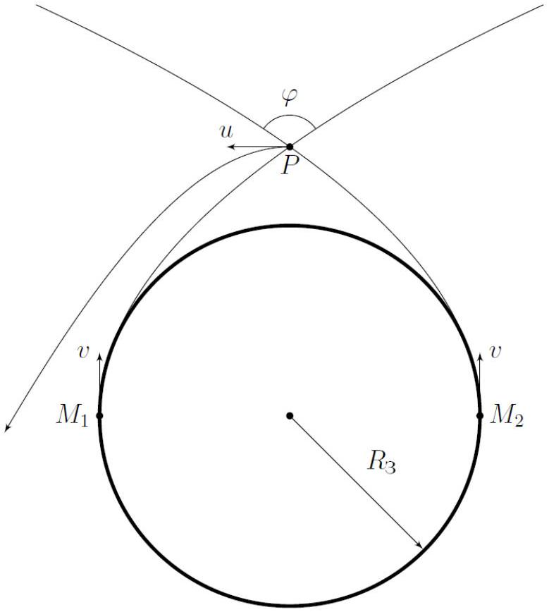
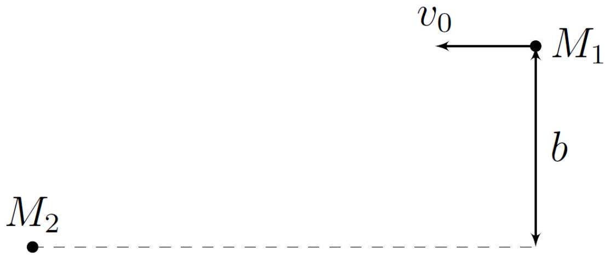

## Road to IPhO

## Два спутника

В 1973 году был предложен способ вывода спутников на гиперболическую орбиту с помощью гравитационного манёвра, который Вам предлагается проанализировать.

В рамках данной задачи исследуется движение двух спутников 1 и 2, запущенных с противоположных полюсов Земли с одинаковыми по модулю и направлению скоростями $v$ по касательной к ней. Спутник 2 выводят на орбиту через малое время $\tau$ после запуска первого.

Если на орбиту вывести только один из спутников, то его траектория будет представлять собой параболу.

Масса спутника 1 равна $M_{1}$, а спутника $2-M_{2} \gg M_{1}$.
Сопротивлением газа в атмосфере можно пренебречь, как и влиянием гравитационного притяжения со стороны других тел.

Масса Земли $M_{3} \gg M_{2}$, радиус Земли $-R_{3}$, гравитационная постоянная $-G$.
Обозначим за $P$ точку пересечения эллиптических орбит спутников, а за $\varphi$ - угол между направлениями их скоростей в данной точке.

Движение спутника 1 состоит из трёх участков:

1. Движение по параболической орбите;
2. Взаимодействие со спутником 2 вблизи точки $P$;
3. Дальнейшее движение по гиперболической орбите в поле тяжести Земли.

## Часть А. Траектория одного из спутников (3.3 балла)

В данной части задачи вам предстоит приближённо описать траекторию спутников до точки пересечения $P$ их орбит.

## Road to IPhO

| A3 | Чему равен угол $\varphi$ между направлениями скоростей спутников в точке $P$ ? | 0.8 |
| :--- | :--- | :--- |
| A4 | Найдите время $t_{0}$, через которое спутники достигают точки $P$. Ответ выразите через $G, R_{3}$ и $M_{3}$. | 1.5 |

Здесь и далее считайте, что $\tau \ll t_{0}$. При приближении спутников к точке $P$ их взаимодействием с Землёй можно пренебречь.

Часть В. Взаимодействие спутников (4.0 балла)
В1 Считая, что вблизи точки $P$ спутники двигались вдоль прямых, направления которых совпадали с направлениями их скоростей в данной точке, найдите относительную скорость спутников $v_{0}$, а также минимальное расстояние $b$ между ними, пренебрегая их гравитационным взаимодействием.

Ответ выразите через $v$ и $\tau$.
Далее считайте, что в системе отсчёта спутника 2 орбита спутника 1 представляет собой гиперболу с прицельным параметром $b$ на их бесконечно большом удалении. Также считайте, что на бесконечно большом удалении относительная скорость спутников равна $v_{0}$, найденной в предыдущем пункте.

Когда взаимодействием спутников 1 и 2 вновь можно пренебречь, скорость спутника 1 в системе отсчёта Земли равна $u$ и направлена перпендикулярно линии, соединяющей его с Землёй.

B2 Найдите $u$. Ответ выразите через $v$. 1.0

B3 Найдите $\tau$. Ответ выразите через $G, M_{2}, M_{3}$ и $R_{3}$. 2.3

Часть С. Повторное движение в поле тяжести Земли (2.7 балла)
После взаимодействия со спутником 2 орбита спутника 1 в поле тяжести Земли представляет собой гиперболу.

| C1 | Найдите скорость $v_{\infty}$ спутника 1 на бесконечно большом удалении от Земли. Ответ выразите через $v$. | 1.0 |
| :--- | :--- | :--- |
| C2 | Найдите угол $\varphi_{\infty}$ между векторами $\vec{u}$ и $\vec{v}_{\infty}$. | 1.5 |
| C3 | Возможно ли действительно вывести спутник на орбиту таким образом? Ответ обоснуйте. | 0.2 |
