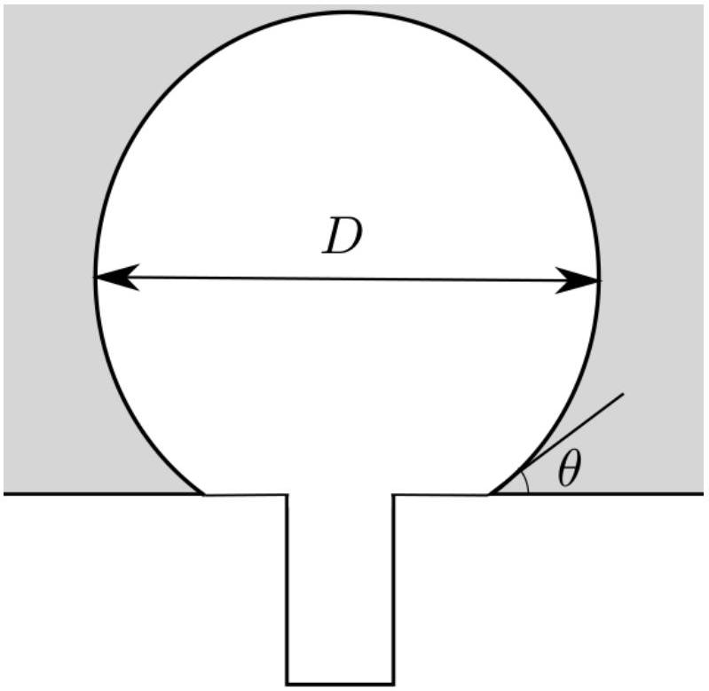
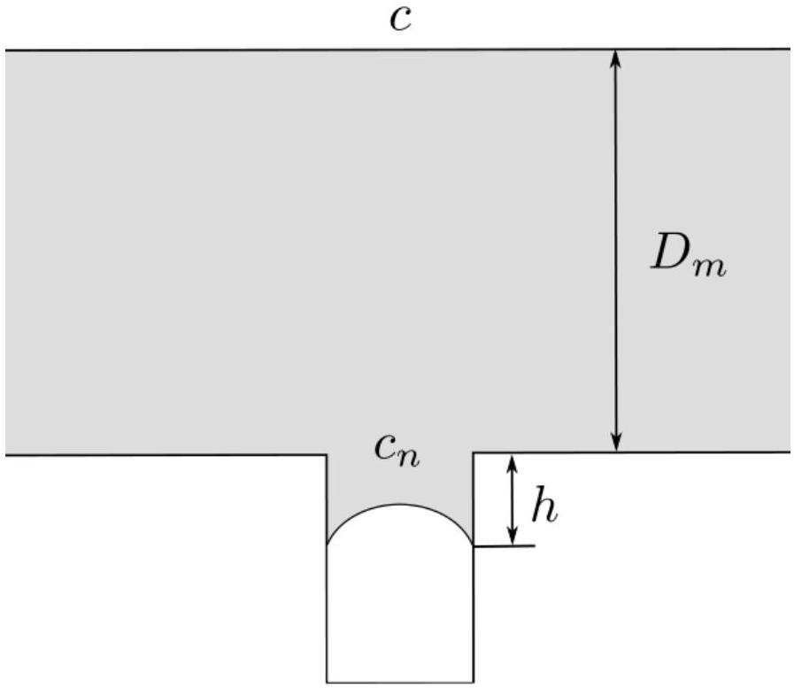

## Road to IPhO

## Пена шампанского

Если бутылка заполнена жидкостью с растворенным внутри газом, после открытия бутылки газ начнет испаряться из раствора и в жидкости будут образовываться пузыри. Мы исследуем их поведение и оценим количество пузырей, которые могут образоваться на поверхности жидкости, налитой в сосуд.

Вам может потребоваться следующая информация:

- плотность жидкости $\rho=1.0 \cdot 10^{3} \frac{\text { кг }}{\mathrm{M}^{3}}$;
- коэффициент поверхностного натяжения жидкости $\gamma=0.05 \mathrm{H} / \mathrm{м}$;
- во всей задаче температуру можно считать постоянной и равной $T=300 \mathrm{~K}$;
- вязкость жидкости $\eta=1.63 \cdot 10^{-3} П а \cdot с$;
- атмосферное давление $P_{0}=10^{5}$ Па;
- универсальная газовая постоянная $R_{G}=8.3 \frac{\text { Дж }}{\text { моль } \cdot \mathrm{K}}$;
- постоянная Больцмана $k_{B}=1.38 \cdot 10^{-23}$ Дж/К.

## Часть А. Равновесие газа в растворе

Молярная концентрация насыщенного раствора газа $c$ и его парциальное давление над жидкостью $P$ связаны законом Генри $c=k_{H} P$. Для углекислого газа в условиях задачи можно считать

$$
k_{H}=3.64 \cdot 10^{-4} \frac{\text { моль }}{\mathrm{m}^{3} \cdot \Pi \mathrm{a}} .
$$

А1 Пусть общее число молей газа углекислого газа в закрытой бутылке $\nu_{0}=0.05$ моль, объем жидкости $V_{L}=250$ мл, объем газа $V_{G}=5$ мл. Найдите давление $P$ углекислого газа в бутылке. Приведите также численное значение.

В дальнейших пунктах считайте, что жидкость находится в открытом сосуде.

А2 Пузырь с углекислым газом сможет образоваться, только если давление углекислого газа в нем сможет уравновесить давление, создаваемое силами поверхностного натяжения. Найдите минимальный радиус пузырька $R^{*}$, который сможет образоваться. Выразите ответ через молярную концентрацию газа в жидкости $c$, атмосферное давление $P_{0}$, а также физические постоянные, характеризующие жидкость. Чему равна концентрация $c$, если критический радиус $R^{*}=1.5 \cdot 10^{-6}$ м?

В дальнейшем в задаче нам потребуется изучать диффузию растворенного в жидкости газа. Явление диффузии состоит в том, что если концентрация $n$ молекул в одной из областей газа выше, чем в соседней, возникнет поток молекул из области с большей концентрацией. Пусть концентрация зависит от одной из координат, например $z$. Тогда поток молекул в направлении оси $z$ (среднее число молекул, проходящих за единицу времени через единицу площади, перпендикулярной оси $z$ ) будет равен

$$
j=-B \frac{\mathrm{~d} n}{\mathrm{~d} z},
$$

где постоянная $B$ - коэффициент диффузии ( $\mathrm{m}^{2} / \mathrm{c}$ ).
Для оценки коэффициента диффузии можно использовать следующую идею. Если на молекулу в веществе действует постоянная сила $F$, то она движется со средней скоростью $v=\beta F$, где коэффициент $\beta$ (подвижность), можно оценить, считая, что на молекулу действует вязкая сила, описывающаяся формулой Стокса $F=6 \pi \eta r v$. Молекулу можно считать шаром радиусом радиуса $r \approx 10^{-10} \mathrm{м}$.

Если молекулы находятся в поле с потенциальной энергией $U=-F z$, ( $z$ - координата) и на каждую из них действует сила $F$ в направлении оси $z$, то из термодинамики известно, что в равновесном состоянии концентрация молекул будет меняться как

$$
n=n_{0} e^{-U / k_{B} T} .
$$

В равновесии поток частиц, возникающий за счет диффузии, должен компенсироваться потоком, создаваемым за счет действия силы $F$.

## Road to IPhO

A3 Используя приведенные соображения, найдите коэффициент диффузии $B$. Выразите ответ через $k_{B}, T$, $\beta$. Определите подвижность молекул $\beta$ через вязкость $\eta$ и размер молекул. Найдите численное значение коэффициента диффузии.

Если вам не удастся решить этот пункт, можете для получения численных ответов в дальнейшем использовать значение $B=5 \cdot 10^{-9} \mathrm{~m}^{2} / \mathrm{c}$.

## Часть В. Рост пузырька

Пусть пузырь формируется на дефекте поверхности стекла, который имеет вид цилиндрического углубления, диаметр которого много меньше глубины. Пока пузырь находится на поверхности, он имеет вид части шара, причем угол между поверхностью шара и стеклом в точке соединения равен $\theta$.

Молярную концентрацию углекислого газа в жидкости обозначим $c$. Кроме этого, есть еще две характерных молярных концентрации: $c_{i}$ - концентрация углекислого газа, при котором раствор находится в равновесии с углекислым газом, давление которого равно атмосферному. $c_{n}$ - концентрация углекислого газа, при которой пузырьки перестают образовываться. Эти концентрации связаны неравенствами $c>c_{n}>c_{i}$.

Радиус пузыря увеличивается за счет диффузии углекислого газа, причем скорость увеличения количества вещества углекислого газа в пузыре имеет вид

$$
\frac{\mathrm{d} \nu}{\mathrm{~d} t}=k S\left(c-c_{i}\right) .
$$

Коэффициент $k=B / \kappa D$, где $B$ - коэффициент диффузии, $D$ - диаметр пузыря, $\kappa \approx 0.25$ - некоторый численный коэффициент. Величина $\kappa D$ - характерная длина, на которой меняется концентрация.

Площадь поверхности участка сферы $S=f_{1}(\theta) D^{2}$, объем $V=f_{2}(\theta) D^{3}$.
В1 Найдите, как диаметр $D$ пузыря зависит от времени. Начальный диаметр считайте приближенно равным нулю, ответ выразите через $f_{1}, f_{2}, c, c_{i}, R, T, P_{0}$. Давление в пузыре и температуру можно считать постоянными, вкладом поверхностного натяжения и давления столба жидкости в давление газа в пузыре можно пренебречь.

B2 Найдите выражения для $f_{1}(\theta)$ и $f_{2}(\theta)$. Постройте (качественно) график отношения $f_{1} / f_{2}$ при $\theta \in(0, \pi / 2)$. 0.7

ВЗ Найдите радиус пузыря $R$, при котором он оторвется от поверхности. Считайте, что он крепится к поверх- ности по окружности радиуса $a_{d} \ll R$, угол между пузырьком и поверхностью равен $\theta$.

## Road to IPhO

В4 После того, как пузырь оторвался от поверхности, вблизи нее остается участок жидкости с пониженной концентрацией растворенного углекислого газа. Из-за этого до того момента, когда в том же месте начнет формироваться следующий пузырь, должно пройти некоторое время $t_{n}$. Считайте, что концентрация углекислого газа понижена в области размера $D_{m}$, а глубина дефекта, которую нужно заполнить углекислым газом равна $h \ll D_{m}$. Зависимость концентрации от расстояния до поверхности линейная. Найдите время $t_{n}$, за которое пузырь, возникший на дне дефекта, вырастет до поверхности стекла. Концентрация вблизи дефекта равна минимальной концентрации $c_{n}$, при которой возможно существование пузырька, зависимость концентрации от расстояния можно считать линейной.

B5 Пусть $t_{g}$ - время, за который пузырь вырастает от края дефекта до своего максимального диаметра $D_{m}$. При изменении концентрации углекислого газа в жидкости это время, как и время формирования пузыря $t_{n}$ могут меняться. В каких координатах зависимость $t_{g}$ от $t_{n}$ будет иметь линейный вид?

## Часть С. Всплывание пузырей

В этой части мы рассмотрим движение всплывающий пузырьков и оценим общее количество пузырьков, которые могут образоваться на поверхности жидкости. Жидкость налита в цилиндрический сосуд, объем жидкости $V_{L}$. Плотность жидкости равна $\rho_{L}$. Везде в этой части можно пренебречь влиянием поверхностного натяжения и столба жидкости на давление внутри пузыря.

С1 Скорость всплывания пузырька определяется действующей на него силой вязкого трения, которую можно рассчитать по формуле Стокса $F=6 \pi \eta a U$, где $a$ - радиус пузырька, $U$ - скорость пузырька, $\eta$ - вязкость жидкости. Найдите скорость всплывания пузырька радиуса $a$.

Когда пузырь всплывает, его радиус растет за счет попадающего из жидкости углекислого газа. После отрыва от поверхности он имеет вид шара. Давление внутри пузыря $P$ и температуру $T$ можно считать постоянными.

Считайте, что количество молей, которые попадают в пузырь в единицу времени, прямо пропорционально площади $S$ поверхности пузыря $\mathrm{d} \nu / \mathrm{d} t=K \Delta c S$.

Здесь $\Delta c$ разность молярных концентраций вдали от пузырька и на его поверхности, причем концентрация на поверхности такова, что растворенный в жидкости газ находится в равновесии с газом в пузыре. Коэффициент $K$ можно выразить через коэффициент диффузии $B$ и параметры пузыря

$$
K=0.63 \frac{B^{2 / 3} U^{1 / 3}}{a^{2 / 3}} .
$$

## Road to IPhO

С2 Найдите скорость изменения радиуса пузырька $\mathrm{d} a / \mathrm{d} t$. Выразите ответ через $a$, разность концентраций $\Delta c$, ..... 0.6 температуру $T$, атмосферное давление $P_{0}, \Delta c$ и физические постоянные.
C3 Пузырек всплывает со дна сосуда, начальный радиус $a_{0}$. Найдите его радиус $a$ и объем $V_{b}$ вблизи поверх- ..... 0.8 ности.
С4 Пузырьки будут образовываться, пока концентрация углекислого газа в жидкости не упадет от начально- ..... 1.5
го значения $c$ до некоторого критического значения $c_{n}$, при котором пузыри перестанут образовываться. Найдите общее число пузырей $N$, которые смогут появиться за все время. Выразите ответ через объем жидкости $V_{L}$, ее глубину $h$, начальную и конечную концентрации углекислого газа и постоянные, характе- ризующие жидкость и газ.
Найдите также численное значение. Используйте данные $c=100$ моль $/ \mathrm{м}^{3}, c_{n}=50$ моль $/ \mathrm{м}^{3}, V_{L}=0.5$ л, диаметр сосуда $\xi=6$ см.
Считайте, что концентрация вблизи поверхности пузырька такая, что газ углекислый газ в пузырьки на- ходится в равновесии с растворенным в жидкости. Все пузыри всплывают со дна сосуда, а их начальный радиус равен нулю. Изменением концентрации за время от образования пузырька до того, как он достиг- нет поверхности, можно пренебречь.
С5 Предположим, что все образовавшиеся в процессе пузырьки не разрушаются, а их размеры равны разме- ..... 0.7
рам пузырьков, достигающих поверхности жидкости при конечной концентрации углекислого газа. Пена какой высоты $H$ образуется на поверхности жидкости?
