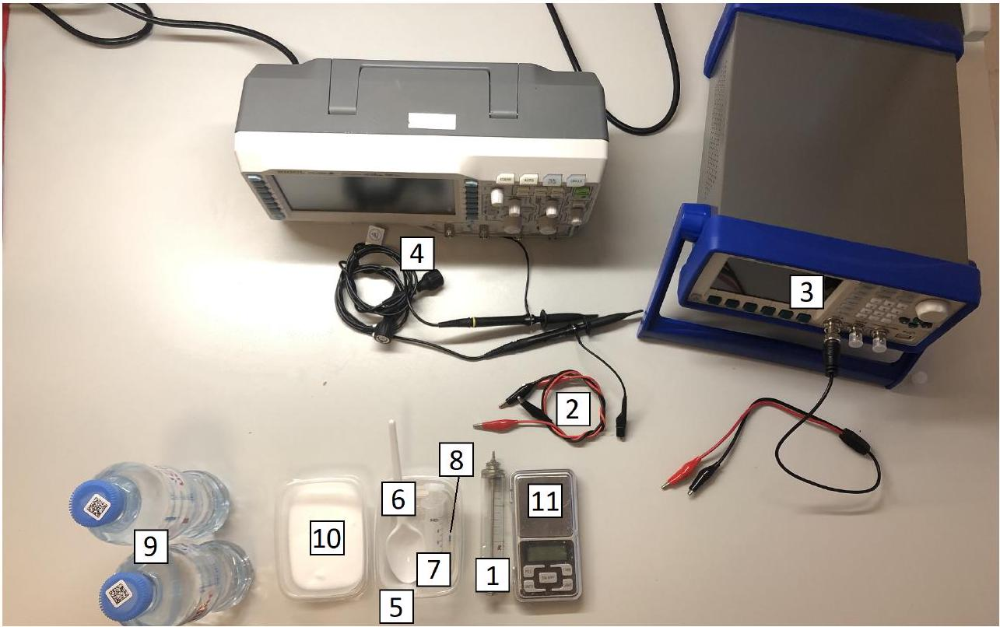
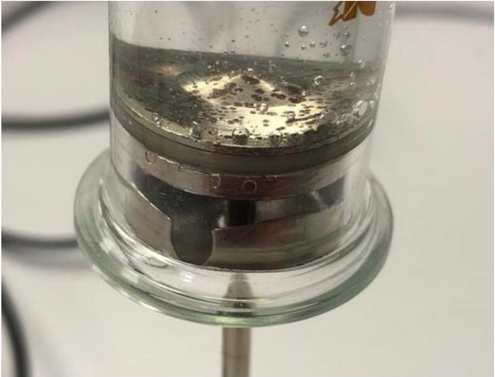
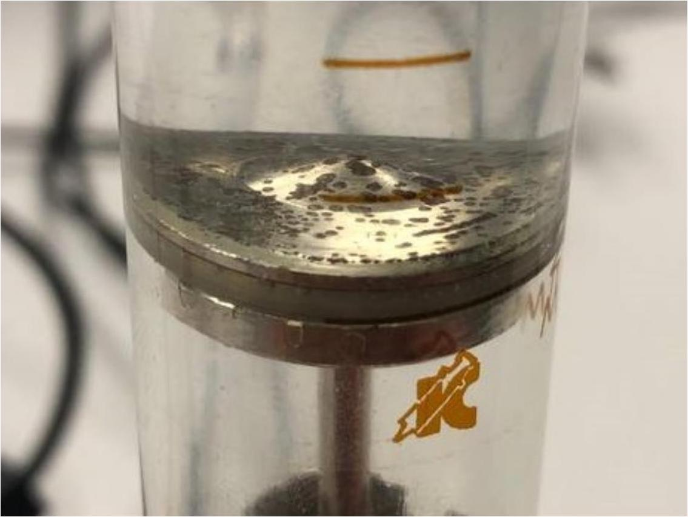
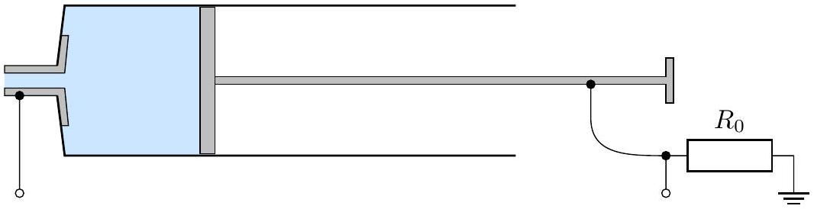
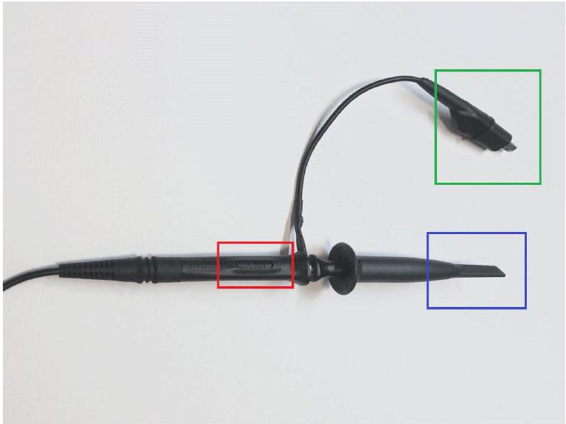
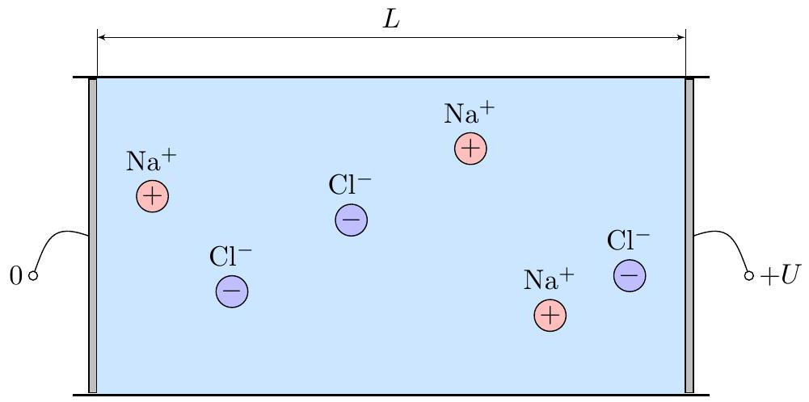
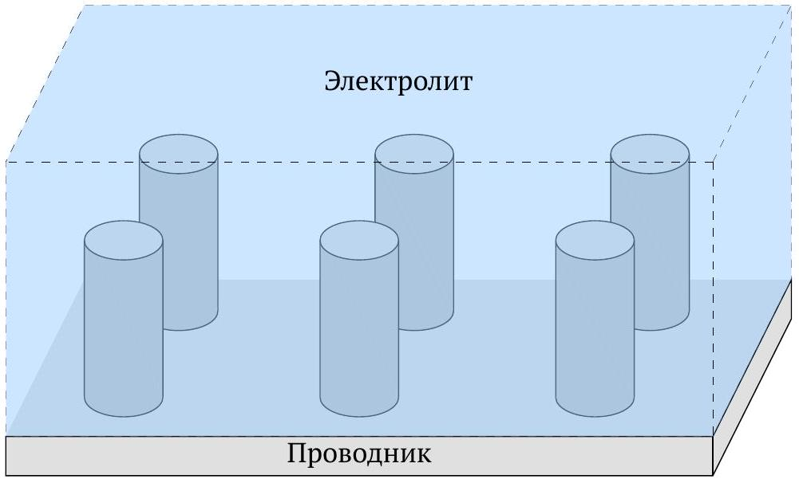
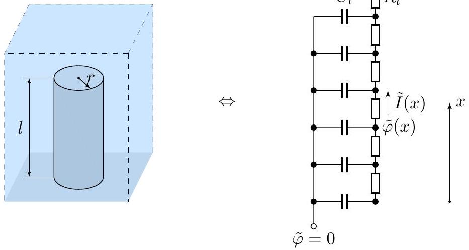

## Road to IPhO   Электрод-электролитный интерфейс

Электролитами называют вещества, которое проводят электрический ток вследствие диссоциации на ионы. Их электропроводность обусловлена подвижностью положительно и отрицательно заряженных ионов. Система, состоящая из ёмкости с электролитом и твердой мембраной, погруженным в него, называется электрод-электролитным интерфейсом. Такая система обладает уникальным электрическими свойствами, которые широко применяются при создании литий-ионных батарей и ионисторов (суперконденсаторов). В данной задаче мы рассмотрим основные свойства электрод-электролитного интерфейса. В качестве электролита будет выступать раствор поваренной соли NaCl в воде. В течение всей задачи будем рассматривать этот раствор, как взвесь ионов $\mathrm{Na}^{+}$и $\mathrm{Cl}^{-}$в жидком диэлектрике. В качестве мембраны в задаче выступает поверхность стального поршня и носика у шприца, сталь в течение всей задачи будем считать идеальным проводником, проводимость которого гораздо больше проводимости электролита. Полезными для решения задачи могу оказаться следующие константы:

| Элементарный заряд | $e=1.602 \cdot 10^{-19}$ Кл |
| :--- | :--- |
| Число Авогадро | $N_{A}=6.02 \cdot 10^{23}$ |
| Молярная масса Na | $\mu_{\mathrm{Na}}=23.0$ г/моль |
| Молярная масса Cl | $\mu_{\mathrm{Cl}}=35.4$ г/моль |
| Молярная масса H | $\mu_{\mathrm{H}}=1.0$ г/моль |
| Молярная масса O | $\mu_{\mathrm{O}}=16.0$ г/моль |

Внимание! В задаче не требуется оценка погрешностей.
Внимание! Пользуйтесь индивидуальной лампой для освещения рабочего места.
Оборудование:

1. Стальной шприц.
2. Два провода крокодил-крокодил.
3. Генератор с проводом для генератора.
4. Осциллограф с двумя осциллографическими проводами.
5. Три пластиковых контейнера.
6. Одноразовая ложка
7. Пластиковый шприц для приготовления растворов
8. Резистор $R_{0}=22.0$ Ом.
9. 1 л воды для приготовления растворов (не питьевая), бутылки отмечены синим крестиком.
10. 150 г соли внутри контейнера
11. Весы.
12. Линейка (из оборудования задачи E2).

# Road to IPhO

Часть А. Подготовительные измерения.

A1 Измерьте внутренний диаметр шприца $D_{0}$ и расстояние $L_{0}$ между отметками 0 мл и 20 мл.
В рамках задачи будем обозначать концентрацию раствора соли в воде безразмерной величиной $c=\frac{m_{\text {соли }}}{m_{\text {воды }}}$, где $m_{\text {воды }}$ - масса изначально взятой чистой воды, $m_{\text {соли }}$ - масса порошка соли, добавленного к чистой воде для получения раствора.

Приготовьте раствор соли с концентрацией $c \approx 0.07$. Наберите этот раствор в шприц, причем, чтобы избежать образования лишних пузырей внутри шприца, двигайте поршень медленно. При измерениях нужно держать шприц в каком-то фиксированном положении (например, стоящим на ножке поршня), чтобы конфигурация пузырей, которые так или иначе образуются, была одинаковой.

Пузыри в растворе внутри шприца, которые образовались из-за того, что поршень двигался слишком быстро.

Растворе внутри шприца без пузырей.

## Road to IPhO

В течение всей задаче мы будем изучать электрические свойства раствора электролита внутри шприца, поэтому следует использовать схему, изображенную на рисунке. Внимание! Осциллографические провода и провода генератора ни в коем случае не должны непосредственно касаться стеклянного шприца, если Вы в него уже набирали воду.

Используйте генератор в режиме $V_{\mathrm{pp}}=1.00 \mathrm{~B}$, где $V_{\mathrm{pp}}$ - разность напряжений между пиками (двойная амплитуда сигнала). Обязательно не забудьте включить сигнал на выходе генератора:

- Генератор АКИП-3408 - кнопка «Output»
- Генератор АКИП-3407 - кнопка «Выход»
- Генератор UTG2025 - кнопка «CH1» или «CH2» в зависимости от того, каким каналом Вы пользуйтесь.
- Генератор UTG9020 - автоматически включен.

Ток в нашей системе может значительно зашумлен (это т.н. электрохимический шум, который симметричен в положительную и в отрицательную область), поэтому любые амплитуды напряжений стоит измерять в режиме Cursor в ручном режиме и не полагаться на модуль Measure. Для измерения напряжения на шприце обязательно получайте его в виде сигнала с помощью модуля Math в режиме вычитания. Для работы с модулем Math:

1. Нажмите кнопку «Math».
2. Второй раз нажмите кнопку «Math» либо нажмите кнопку, соответствующую «РасшОпер».
3. Чтобы канал Math был равен CH1-CH2 должно быть следующее соответствие:
- «Формула» - «А-В»
- «Действие» - «Вкл»
- «Источн.A» - «CH1»
- «Источн.B» - «CH2»

Когда все настроено, и Вы находитесь в другом окне, например Cursor, для изменения масштаба канала Math выполните пункты 1 и 2, а затем регулируйте масштаб той же ручкой, что меняется масштаб обычных каналов (Vertical Scale). Проверьте, что для каналов CH1 и CH2 настройка «Пробник» соответствует режиму пробника, в котором используется щуп. Если не соответствует, то настройте.

Осциллографический щуп (не используйте его для вывода сигнала от генератора). Красным выделен переключатель режима пробника. Зеленый выделен контакт "Земля" Синим выделен контакт "Сигнал"

## Road to IPhO

При частоте $f \approx 50$ кГц разность фаз между током через шприц и напряжением на нем практически равна нулю. Это означает, что при этой частоте раствор электролита внутри шприца ведет себя, как сопротивление $R$. Стоит ожидать, что это сопротивление меняется при изменении длины $L$ электролита внутри шприца.

| A2 | Сделайте измерения сопротивления $R$ соответствующие положениям шприца $V=2,4, \ldots, 20$ мл. | 0.4 |
| :--- | :--- | :--- |
| A3 | Постройте график $R$ от $V$. Проведите сглаживающую прямую $R=R_{1}+\alpha_{1} V$. Рассчитайте значения параметров $R_{1}$ и $\alpha_{1}$. | 0.4 |

## Часть В. Объемные эффекты.

Приготовьте 4 разных раствор соли с концентрациями $0.07 \leq c \leq 0.20$. При смене концентрации раствора внутри шприца обязательно промойте его чистой водой.

| B1 | Для каждого из приготовленных растворов проведите серию из 4-ех измерений $R$ от $V$. |
| :--- | :--- |
| B2 | С помощью МНК для каждого из растворов посчитайте параметры $R_{1}$ и $\alpha_{1}$ по аналогии с пунктом A3. Результаты представьте в виде таблицы. |

Теоретическое описание полученных результатов следует из стандартной задачи проводимости второго рода: рассмотрим действие электрического поля на заряженную частицу в вязкой среде. Пусть масса частицы $m$, а заряд $q$, а если частица движется, то на нее действует сила вязкого трения $F=-k v$.

B3 В среде создается внешнее постоянное поле $E$. Чему равна установившаяся скорость частицы $v_{y}$ ? Ответ запишите через $E, k, q$.

Коэффициент вязкости $k$, с помощью которого мы моделируем движение ионов в растворе связан не только с вязкостью, но и с электрическими свойствами воды и зависит от концентрацией ионов:

$$
k \propto n^{\alpha}
$$

где $\alpha$ - неизвестная степень, одинаковая для ионов $\mathrm{Na}^{+}$и $\mathrm{Cl}^{-}$.
Пусть электронейтральный раствор поваренной соли находится внутри цилиндрического сосуда с проводящими основаниями-электродами и непроводящими стенками. Площадь оснований $S$, расстояние между ними $L$. Будем считать, что ионы $\mathrm{Na}^{+}$и $\mathrm{Cl}^{-}$в любом количестве могут возникать и пропадать в результате химических реакций с электродами. Заряды ионов по модулю совпадают с элементарным зарядом $e=1.602 \cdot 10^{-19}$ Кл.

Обозначим за $n$ концентрацию ионов натрия, за $k_{\mathrm{Na}}+$ и $k_{\mathrm{Cl}}-$ - коэффциенты взякости для ионов натрия и хлора соотвественно.

## Road to IPhO

На практике исследование постоянного тока сопряжено со следующей трудностью: из-за химических реакций постепенно разрушаются/покрываются пленкой основания цилиндра. Поэтому значительно удобнее исследовать проводимость при переменном токе. Проведем теоретический анализ в рамках нашей модели.

B5 Пусть к основаниям подведена разность потенциалов $U(t)=U \cos \omega t$, как будет зависеть ток $I(t)$ от времени? Любыми поверхностными эффектами снова пренебрегите. Ответ запишите через $n, S, L, e, \omega, m_{\mathrm{Na}^{+}}, m_{\mathrm{Cl}^{-}}, k_{\mathrm{Na}^{+}}, k_{\mathrm{Cl}^{-}}, U$ и $t$.

В6 Теперь учтем поверхностные эффекты в виде резистора $R_{п}$, который последовательно подключен к раствору. Запишите формулу для импеданса $\tilde{Z}(\omega)$ системы, состоящей из раствора NaCl и сосуда. Ответ запишите через $n, S, L, e, m_{\mathrm{Na}^{+}}, m_{\mathrm{Cl}^{-}}, \omega, k_{\mathrm{Na}^{+}}, k_{\mathrm{Cl}^{-}}$и $R_{\Pi}$.

B7 Чему равен теоретический импеданс системы $\tilde{Z}$, если разность фаз между напряжением пренебрежимо мала? Ответ выразите через $n, S, L, e, k_{\mathrm{Na}^{+}}, k_{\mathrm{Cl}^{-}}$и $R_{\Pi}$.

Случаю, рассмотренному в В8 очевидно соответствуют измерения, сделанные в рамках пунктов A2 и B1.

B8 Используя линеаризованный график $\alpha_{1}$ от $c$ получите значение $\alpha$. 0.4

B9 Получите теоретическую зависимость $|\tilde{Z}|^{2}(\omega)$ в приближении $\omega m_{\mathrm{Na}^{+}} \gg k_{\mathrm{Na}^{+}}, \omega m_{\mathrm{Cl}^{-}} \gg k_{\mathrm{Cl}^{-}}$. Ответ запишите через $n, S, L, e, m_{\mathrm{Na}},, m_{\mathrm{Cl}^{-}}, \omega, k_{\mathrm{Na}}, k_{\mathrm{Cl}}$ - и $R_{п}$.

B10 Для раствора с концентрацией соли $c \approx 0.20$ проведите измерения модуля импеданса $|Z|$ от частоты $f$. Серия должна состоять из не менее 7-ми разных $f$ в диапазоне 500 кГц $\leq f \leq 10$ МГц.

В11 Постройте линеаризованный график $|Z|$ от $f$. Из графика определите экспериментальное значение 0.5 $\mu_{Э ф ф}=\frac{\mu_{\mathrm{Na}} \cdot \mu_{\mathrm{Cl}}}{\mu_{\mathrm{Na}}+\mu_{\mathrm{Cl}}}$.

Полученное в эксперименте $\mu_{\text {эфф }}$ значительно отличается от теоретического значения. Это отличие можно объяснить тем, что молекулы воды, которые обладают дипольным моментом, притягиваются к ионам (сольватируют их) и двигаются вместе с ними. Обозначим, количество молекул воды, двигающихся вместе с ионом любого вида за $N$.

В таком случае вместо $\mu_{\mathrm{Na}}$ при расчете нужно использовать $\mu_{\mathrm{Na}}+N \mu_{H_{2} O}$ и вместо $\mu_{\mathrm{Cl}}$ нужно использоваться $\mu_{\mathrm{Cl}}+N \mu_{H_{2} O}$

B12 Определите $N$ исходя из ваших экспериментальных данных. 0.15

## Часть С. Поверхностные эффекты.

Шприц с электролитом также обладает ёмкостью, которую невозможно предсказать в рамках теории объемных эффектов. Эта ёмкость начинает сказываться при малых частотах сигнала, подаваемого на концы шприца.

Ёмкость системы поверхность электрода-электролит связана с тем, что ионы(как и любые заряженые частицы) притягиваются к поверхности металла и формируют т.н. двойной электрический слой. Таким образом единица поверхности соприкосновения металла с электролитом обладает ёмкостью $\sigma=\frac{d C}{d S}$, где $C$ - ёмкость поверхности площадью $S$.

Наполните шприц раствором с концентрацией соли $c \approx 0.20$.
С1 В диапазоне частот 5 Гц $\leq f \leq 1$ кГц проведите измерения модуля импеданса шприца | $\tilde{Z} \mid$ и времени $\Delta t$, на которое пик тока опережает пик напряжения. Сделайте не менее 15 измерений.

Для анализа электрической схемы бывает полезна т.н. диаграмма Найквиста - зависимость $\mathfrak{I} \mathfrak{m} \tilde{Z}$ от $\Re e \tilde{Z}$.

В нашем случае можно считать, что объемные эффекты сводятся к резистору сопротивлением $R_{2}$, а поверхностные выражаются из измерений следующим образом: $\tilde{Z}_{п}=\tilde{Z}-R_{2}$.

## Road to IPhO

С2 На основе Ваших данных постройте диаграмму Найквиста $\mathfrak{I m} \tilde{Z}_{\Pi}$ от $\Re \mathfrak{e} \tilde{Z}_{\Pi}$ для поверхностных эффектов. Укажите на диаграмме в виде стрелки направление перехода от точки к точке, соответствующее увеличению $\omega$.

C3 Качественно изобразите диаграмму Найквиста для плоского конденсатора. 0.1

Описанная ранее модель формирования ёмкости $C$ у поверхности соприкосновения электролита и металла в случае, если эта поверхность плоская, должна сводится к тому, что поверхностные эффекты имеют диаграмму Найквиста, как у конденсатора, но эксперимент противоречит этому тезису. При анализе схожей задачи датским химиком Робертом де Леви была предложена модель шероховатой поверхности металла, которая оказалась очень плодотворной для описания электрических свойств электродэлектролитных интерфейсов.

Представим поверхность проводника, как плоскость, на которой стоят цилиндры высоты $l$ и радиуса $r$. Плотность постановки цилиндров можно описать поверхностной плотностью $\xi=\frac{d N}{d S}$, где $N$ - число цилиндров на площади $S$.

В таком случае на один цилиндр приходится $1 / \xi$ площади электролита вокруг него. При этом единица высоты цилиндра обладает некоторой ёмкостью $C_{l}$ и единица высоты электролита, приходящегося на один цилиндр, обладает некоторым сопротивлением $R_{l}$. Для сокращения записей обозначим за $\rho$ удельное сопротивление электролита.

C4 Запишите выражения для $C_{l}$ и $R_{l}$ через $r, \sigma, \rho$ и $\xi$. 0.2

C5 Запишите комплексный ток $\tilde{I}(x)$ через производную комплексного потенциала $\frac{d \tilde{\varphi}(x)}{d x}$ и $R_{l}$. 0.1

## Road to IPhO

| C6 | Свяжите производную комплексного тока $\frac{d \tilde{I}(x)}{d x}$ и комплексный потенциал $\tilde{\varphi}(x)$ через $C_{l}$. | 0.1 |
| :--- | :--- | :--- |
| Примечание 1: для нахождения двух чисел $a$ таких, что $a^{2}=\sqrt{i}$ можно воспользоваться формулой Эйлера. Примечание 2: $\cos x=\cosh i x, i \sin x=\sinh i x, i \tan x=\tanh i x, \tanh (x \pm y)=\frac{\tanh x \pm \tanh y}{1 \pm \tanh x \tanh y}$. |  |  |
| C7 | Покажите, что $\tilde{I}(0)=0$. | 0.2 |
| C8 | Решите полученную в пунктах С5 и С6 систему дифференциальных уравнений и получите импеданс $\tilde{Z}_{ц}(\omega)$ одного цилиндра и электролита, окружающего его. Ёмкостью основания цилиндра и ёмкостью плоской поверхности, на которой стоят цилиндры пренебрегайте. Ответ выразите через $C_{l}, R_{l}, l$ и $\omega$. | 1.25 |
| C9 | Получите импеданс $\tilde{Z}_{\text {ц }}(\omega)$ в приближении $\sqrt{\omega C_{l} R_{l} l^{2}} \gg 1$. Ответ выразите через $C_{l}, R_{l}, l$ и $\omega$. Следующие теоретические пункты также решаются в этом приближении. | 0.2 |
|  | C10 Чему равен импеданс $Z_{п}(\omega)$ одной поверхности цилиндра, соприкасающейся с электролитом. Площадь поверхности $S$. Ответ выразите через $r, \sigma, \rho, \xi, S$ и $\omega$. Нарисуйте качественно диаграмму Найквиста $\tilde{Z}_{п}(\omega)$. Теоретическая и экспериментальная диаграммы Найквиста должны совпадать по форме, но часть их характеристик могут незначительно отличаться. | 0.2 |
| C11 | Постройте линеаризованный график $\left\|\tilde{Z}_{\Pi}\right\|$ от $\omega$. | 0.7 |
|  | Будем считать, что $\xi=40 \frac{1}{\mathrm{~mm}^{2}}, r=0.6$ мкм. Площадь контакта носика шприца с электролитом считайте в 5.5 раз меньше площади внутреннего сечения шприца. |  |
| C12 | Определите $\sigma$. | 0.1 |
