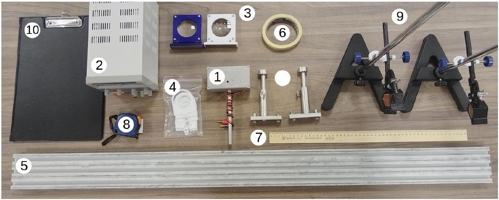
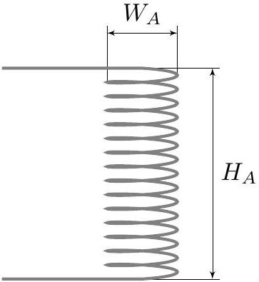
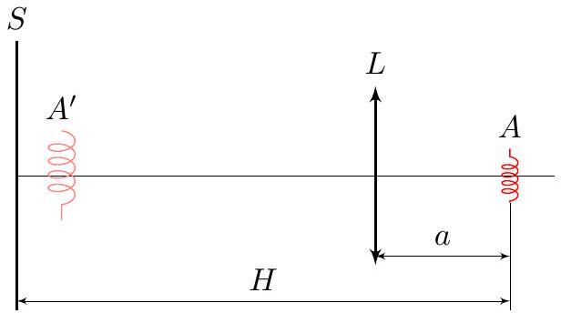
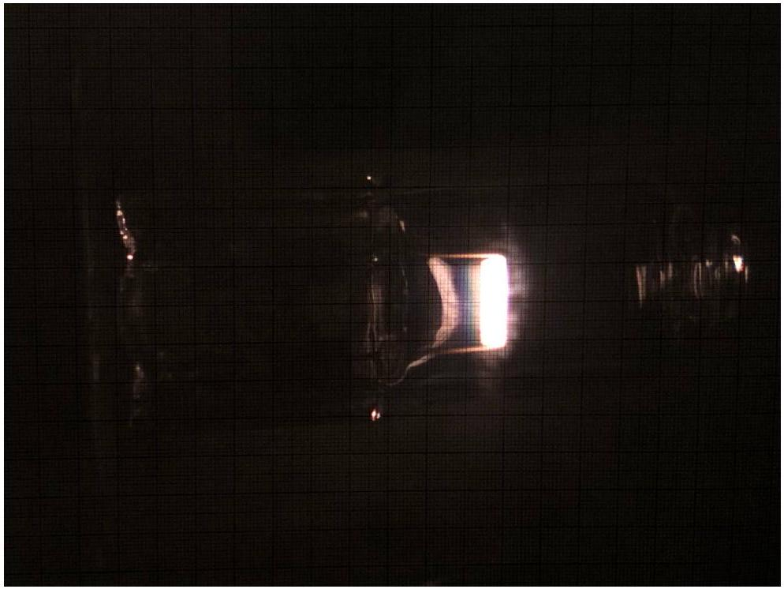
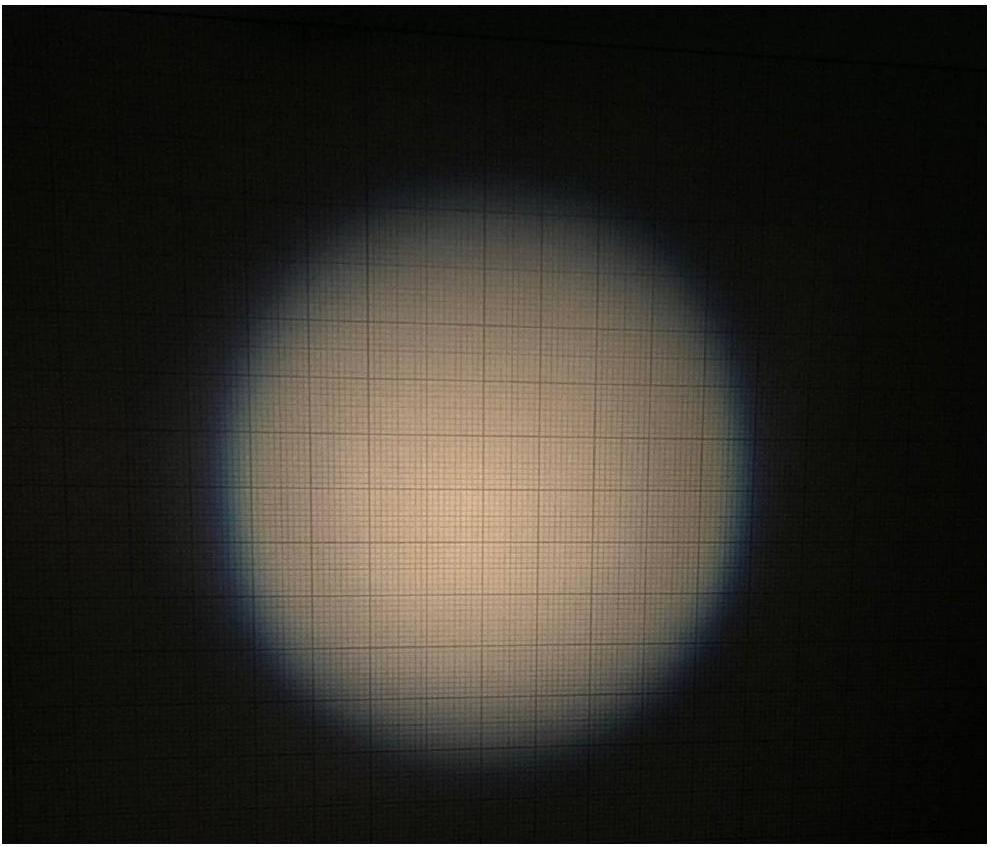
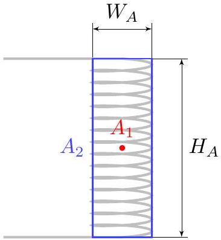
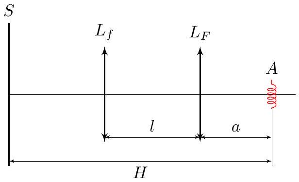
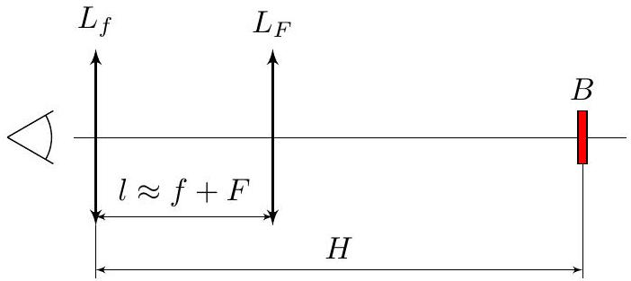

## Road to IPhO

## Чёткая оптика

## Оборудование:

1. Лампа накаливания в корпусе
2. Источник постоянного напряжения
3. Две линзы с подставками для оптической скамьи.
4. Набор из 9-ти диафрагм, диаметры в миллиметрах указаны на них.
5. Оптическая скамья
6. Малярный скотч
7. Деревянная линейка
8. Рулетка
9. Два штатива с лапками
10. Планшет для закрепления бумаги

Исследования человеческого зрения и разработка технологий фотографирования неизбежно связаны с изучением фокусировки изображений с помощью собирающих линз.

В данной работе источником света выступает спираль внутри лампы накаливания. Обозначим ее диаметр за $W_{A}$, высоту за $H_{A}$ а количество витков за $N_{A}$.

Внимание! В задаче не требуется оценка погрешностей. Внимание! Пользуйтесь индивидуальной лампой для освещения рабочего места. Внимание! Самостоятельно не доставайте провода лампы из клемм источника постоянного напряжения. Для питания лампы используйте источник постоянного напряжения $U=9.0$ В. При корректной работе лампы у нее светится только спираль накаливания (при некорректной внутренняя поверхность покрывается светлым осадком, и поэтому лампочка «светится» полностью). Располагайте лампу так, чтобы спираль накаливания была вериткальной.

## Road to IPhO

Часть А. Вводная.
Обозначения, выбранные в этой части, справедливы в течение всей последующей задачи.
Рассмотрим оптическую схему, состоящую из неточечного источника $A$, линзы $L$ и экрана $S$. На рисунке за $A^{\prime}$ обозначено изображение источника $A$.

В простейшем фотоаппарате вместо экрана $S$ используется матрица из фоточувствительных элементов, например, фотодиодов.

За $L_{F}$ обозначим линзу с бо́льшим фокусным расстоянием, а само фокусное расстояние за $F$. Линзу с меньшим фокусным расстоянием соответственно $L_{f}$, ее фокусное расстояние $f$.

A1 Измерьте фокусные расстояния $f$ и $F$ с помощью получения изображения $A^{\prime}$ на экране. Для измерения используйте $H \approx 1.20$ м. В листе ответов крестиком укажите соответствие между цветом линзы и названиями $L_{f}$ и $L_{F}$.

При достаточно больших $H$ на экране получается сфокусировать изображение при двух положениях: ближняя фокусировка - положение при меньшем $a$ и дальняя фокусировка - положение при бо́льших $a$.

Часть В. Неточности ближней фокусировки
Метод определения фокусного расстояния линзы, рассмотренный в пункте A1 в любом случае имеет существенный недостаток: нет формального критерия «сфокусированного изображения». В данной части мы дополним метод и избавим его от этого недостатка, рассмотрев физику неточной фокусировки и понятие резкости.

В данной части используется только линза $L_{F}$. Расстояние $H \approx 1.20$ м.
За $a_{0}$ обозначим расстояние $a$, соответствующее ближней фокусировке. Меняя расстояние $a$ в окрестности $a_{0}$, можно получать на экране изображения разной степени размытости (примеры чёткого и очень нечёткого изображения приведены на фотографиях ниже). Также на размытость изображения влияет форма и диаметр диафрагмы - экрана с отверстием, которым закрывают часть линзы.

B1 Выставьте линзу так, что $a=a_{0}+F / 2$. В дальнейших пунктах мы будем изучать характерный размер таких изображений, поэтому выберите, какой линейный размер - высоту $h$ или ширину $w$ нечеткого изображения вы будете измерять в последующих пунктах. Обоснуйте свой выбор и крестиком обозначьте его в листе ответов. Этот размер будет обозначаться за $p$.

В первую очередь изучим влияние диафрагмы на размытость.
В2 Накройте часть линзы, обращенную к экрану, диафрагмой диаметра $D$. Для всех диафрагм измерьте размер изображения $p$.

B3 Постройте график зависимости $p(D)$.

B4 При том же расположении объектов снимите диафрагму с линзы и измерьте размер $p_{0}$ изображения на экране. Определите диаметр $D_{0}$ открытой части линзы на основе $p_{0}$, сравните результат с непосредственными измерениям.

## Road to IPhO

Четкое изображение

Нечеткое изображение

Теперь посмотрим, как ошибка фокусировки влияет на размытость.
B5 При 11 различных $a$ в диапазоне $\left[a_{0}-F / 3, a_{0}+F / 2\right]$ измерьте размер $p$ изображения на экране. 0.55

B6 Постройте линеаризованный график зависимости $p$ от $a$. Из графика найдите фокусное расстояние $F$ и 1.3 сравните его с полученным ранее. Считайте, что спираль накаливания имеет размеры $0.10 \mathrm{~cm} \times 0.30 \mathrm{~cm}$.

Теперь изучим, как форма даже несфокусированного изображения связана с формой источника.
B7 Расположите линзу так, чтобы $a=a_{0}+2 F / 5$. Зарисуйте границу изображения на миллиметровой бумаге. 0.3 Обозначьте центр изображения, горизонтальную ось $x_{S}$ и вертикальную ось $y_{S}$.

## Road to IPhO

Границу нечеткого изображения лампы невозможно точно описать без рассмотрения распределения интенсивности света по экрану, поэтому для начала рассмотрим две упрощенные модели источника света:

1. В первой модели источник $A_{1}$ является точечным и располагается посередине спирали лампы накаливания. Границу изображения, создаваемого им обозначим $\Gamma_{1}$.
2. Во второй модели источником $A_{2}$ является граница сечения спирали, то есть источник является прямоугольником с размерами $W_{A} \times H_{A}$. Считайте, что данный источник светит одинаково ярко по всему своему периметру. Границу изображения от него обозначим $\Gamma_{2}$.

Наша задача заключается в «совмещении» этих моделей. Пусть «совмещенный» источник создает границу изображения Г. Каждой конкретной точке $\Gamma$ соответствует луч $B^{\prime}$ выходящий из центра изображения, и проходящий через нее. Будем считать, что точка границы $\Gamma$ находится посередине между точками $\Gamma_{1} \cap B^{\prime}$ и $\Gamma_{2} \cap B^{\prime}$.

Источники $A_{1}$ и $A_{2}$.

B8 Рассчитайте положение границы Г изображения относительного его центра в 11 точках, лежащих в области $x_{S}>0, y_{S}>0$. Нанесите эти точки на тот же лист миллиметровой бумаги, где зарисовано изображение.

## Часть С. Хроматическая аберрация.

В данной части используются обе линзы. Расстояние $H \approx 1.20$ м.
Меняя $a$ в окрестности $a_{0}$ в части В вы, вероятно, заметили, что граница изображения имеет различный цвет при $a<a_{0}$ и $a>a_{0}$. Это связано с тем, что разные цвета немного по-разному преломляются в стекле, из которого сделана линза, а описать это можно в терминах разных показателей преломления для света разного цвета: $n_{\mathrm{b}}$ для синего и $n_{\mathrm{r}}$ для красного.

C1 В листах ответов поставьте крестик напротив истинных утверждений. 0.06

| $L_{F}$ | Граница синяя при $a<a_{0}$, красная при $a>a_{0}$ |  |
| :--- | :--- | :--- |
| $L_{F}$ | Граница красная при $a<a_{0}$, синяя при $a>a_{0}$ |  |
| $L_{f}$ | Граница синяя при $a<a_{0}$, красная при $a>a_{0}$ |  |
| $L_{f}$ | Граница красная при $a<a_{0}$, синяя при $a>a_{0}$ |  |

## Road to IPhO

С2 В листах ответов поставьте крестик напротив истинных утверждений о $n_{\mathrm{b}}$ и $n_{\mathrm{r}}$. Обоснуйте свой выбор. 0.5

| $L_{F}$ | $n_{\mathrm{b}}>n_{\mathrm{r}}$ |
| :--- | :--- |
| $L_{F}$ | $n_{\mathrm{r}}>n_{\mathrm{b}}$ |
| $L_{f}$ | $n_{\mathrm{b}}>n_{\mathrm{r}}$ |
| $L_{f}$ | $n_{\mathrm{r}}>n_{\mathrm{b}}$ |

Часть D. Увеличение.
В данной части задачи используется только линза $L_{F}$.

| D1 | При 7-ми различных $H$ измерьте размер изображения $p$ в условиях ближней фокусировки. | 0.7 |
| :--- | :--- | :--- |
| D2 | Линеаризуйте зависимость $p$ от $H$, постройте ее график. Рассчитайте параметры источника $W_{A}$ и $H_{A}$, сделав дополнительные измерения при необходимости. | 0.55 |

D3 Посчитайте количество спиралей $N_{A}$ в спирали источника. 0.1

Часть Е. Телескоп Кеплера.
В данной части используются обе линзы, а $H \approx 1.20$ м. С помощью системы из двух линз получите четкое изображение источника $A$ на экране $S$.

E1 При различных фиксированных значениях $a$ подберите расстояния $l$, соответствующие четкому изображению. Измерьте высоту четкого изображения $h$. Если при нескольких разных значениях $l$ получается несколько четких изображений, то выбирайте изображение, имеющее большее $h$. У зависимости $h$ от $a$ есть характерная точка, опишите ее и промерьте ее окрестность особенно тщательно. Всего сделайте не менее 15-ти измерений.

E2 Получите теоретическую формулу для зависимости $h$ от $a$. Постройте линеаризованный график и покажите, что теоретическая формула справедлива.

## Road to IPhO

В силу того, что любая реальная линза не является тонкой, фокусное расстояние для лучей идущих далеко от оптической оси отличается от фокусного расстояния для параксиальных лучей.

Заметен этот эффект (наряду с хроматической аберрацией) в телескопе Кеплера - системе из двух собирающих линз, отдаленных друг от друга на расстояние, близкое к сумме их фокусных расстояний.

Расположите две линзы на расстоянии $l \approx f+F$ рядом друг с другом у одного из краев стола, чтобы вы могли через них наблюдать за предметами, расположенными с другого края - там закрепите линейку в штативе и расположите источник света так, чтобы он освещал линейку $B$, но не светил в линзы.

Увеличением телескопа называется отношение видимого размера объекта к настоящему размеру объекта.

E3 Настройте телескоп Кеплера так, чтобы расстояние между линзой $L_{f}$ и линейкой было $H \approx 1.20 \mathrm{м}$, и через телескоп Вам было четко видно увеличенное изображение линейки. Сделайте необходимые измерения и рассчитайте экспериментальное значение увеличения $\Gamma_{K}$ телескопа Кеплера в такой системе.

E4 Пронаблюдайте искажение изображения линейки у краев области видимости телескопа. Зарисуйте видимое через телескоп Кеплера изображение линейки. На рисунке отобразите и хроматические, и сферические аберрации.
