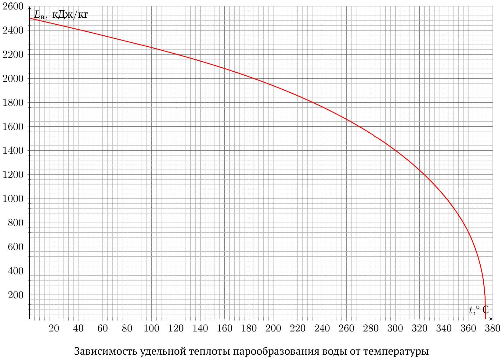
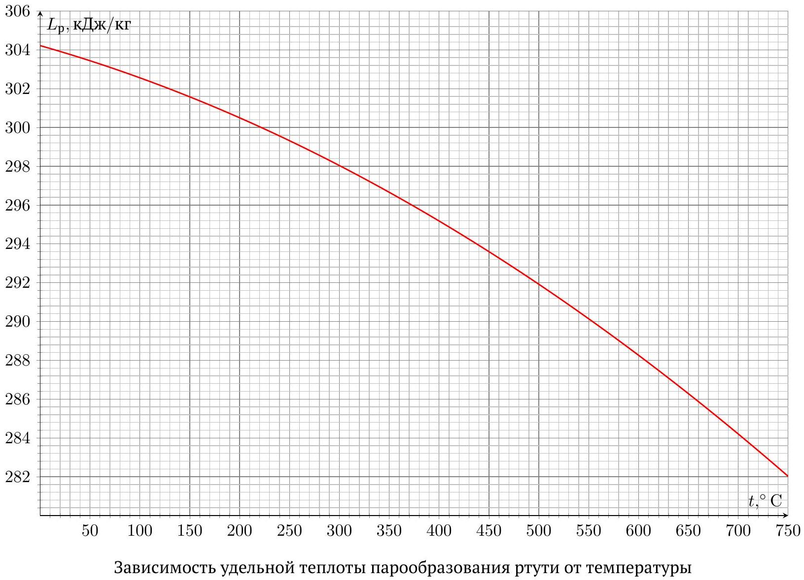
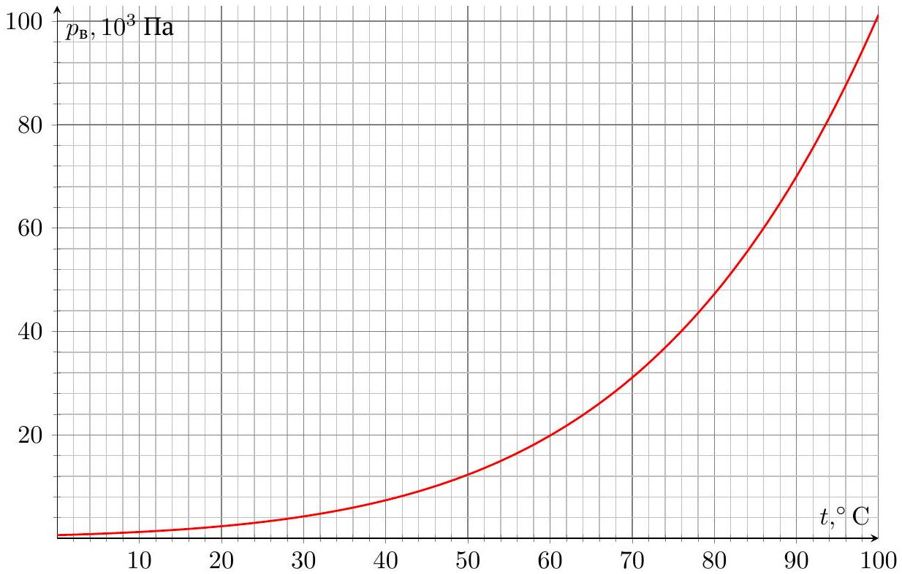
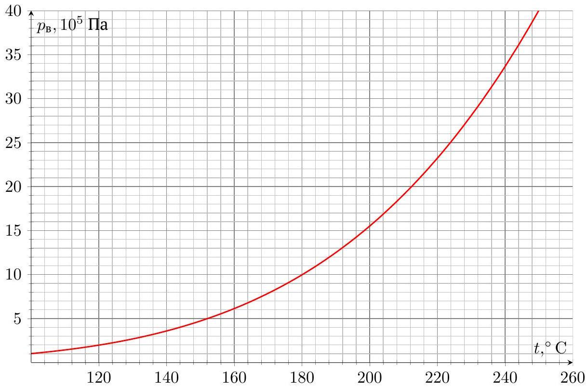
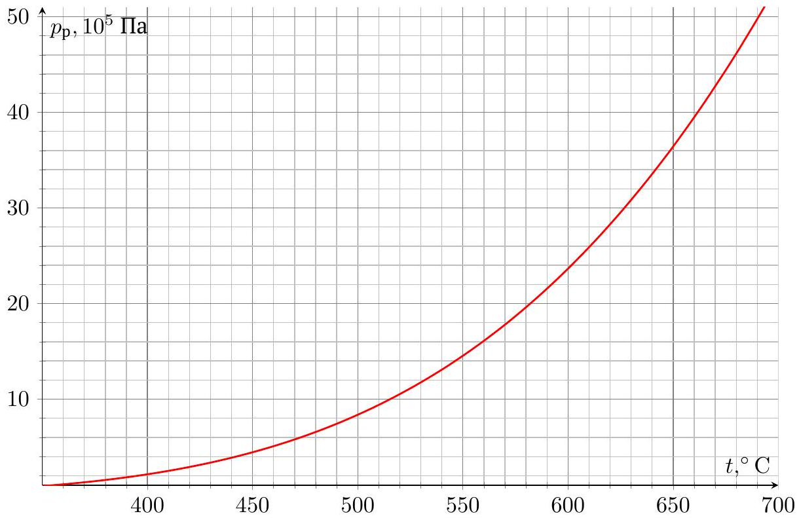
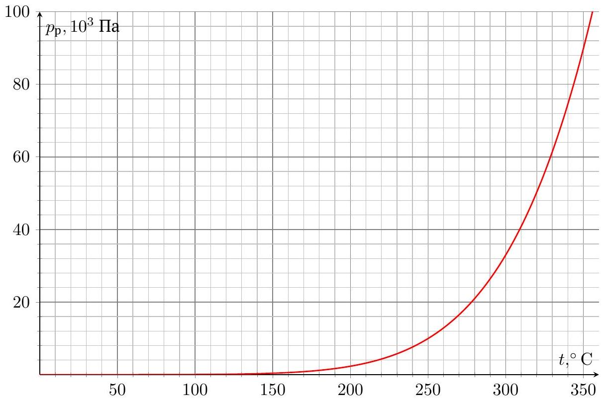

## Road to IPhO

## Бинарные термодинамические циклы

Работа над повышением КПД паросиловых установок является важной частью снижения экономических затрат на поддержание электростанций. Развитие данной отрасли всегда упиралось в сложности технической реализации установок, а также в переход реального газа в жидкую фазу. Инженеры сформулировали следующие требования к веществам, используемым в циклах:

1. Удельная теплоёмкость вещества в жидкой фазе должна быть наименьшей;
2. Критическая точка вещества должна достигаться при высокой температуре и сравнительно невысоком давлении;
3. Давление насыщенного пара при наименьшей температуре не должно быть слишком низким;
4. Вещество должно быть легкодоступным.

Ограничения на теплоёмкость в жидкой фазе и температуру вещества в критической точке понятны из теоретических соображений, а создание камеры, выдерживающей высокое давление, и вакуумного конденсатора, поддерживающего низкое давление, являются сложными с технической точки зрения задачами. В настоящее время неизвестны вещества, удовлетворяющие всем перечисленным требованиям, в связи с чем была предложена идея бинарных циклов - использовать преимущества одного теплоносителя при высоких температурах, а другого - при низких. Бинарные циклы обладают большим КПД, чем циклы с одним из рассматриваемых веществ. Идея бинарных циклов заключается в том, чтобы между двумя веществами, находящихся в разных сосудах, происходил теплообмен. Это позволяет реализовать два цикла одновременно, избегая при этом вынужденного подведения тепла к одному из рабочих тел в процессе теплообмена. Цикл Ренкина 1-2 - 3-4-1 является одним из наиболее используемых в бинарных циклах. Он состоит из следующих процессов:

1. 1-2 - адиабатическое расширение;
2. 2 - 3 - изотермическое охлаждение (отведение теплоты);
3. 3-4 - адиабатическое сжатие;
4. 4-1 - изобарное нагревание.

Далее, если это не оговорено отдельно, для циклов Ренкина придерживайтесь введённых обозначений. В частях А и В анализируются циклы Ренкина с рабочим веществом в виде идеального газа и воды соответственно, а в частях C и D - соответственно бинарный газово-пароводяной цикл (будет описан отдельно) и бинарный цикл Ренкина с рабочими телами в виде воды и ртути в обоих случаях.

## Часть А. Цикл Ренкина с идеальным газом (2.0 балла).

Рассмотрим цикл Ренкина с идеальным многоатомным газом. Абсолютные температуры в точках 1, 2 и 4 обозначим за $T_{1}, T_{2}$ и $T_{4}$ соответственно. Введём величины $\alpha$ и $\beta$, определяющие соотношение между температурами и давлениями в точках 2 и 4 :

$$
\alpha=\frac{T_{4}}{T_{2}} \quad \beta=\frac{p_{4}}{p_{2}}
$$

А1 Выразите отведённое от газа за цикл количество теплоты $Q_{-}$через $T_{1}, T_{2}, T_{4}, R$, количество вещества газа $\nu$ и показатель адиабаты $\gamma$.

## Road to IPhO

Как уже говорилось ранее, реальным газам свойственен переход в жидкую фазу. В соответствии с требованиями инженеров к рабочим веществам бинарных циклов, опытным путём было установлено, что вода и ртуть компенсируют недостатки друг друга. Вода не удовлетворяет условию низкой теплоемкости в жидкой фазе и обладает низкой критической температурой, но удовлетворяет условию не слишком низкого значения давления в конденсаторе. Ртуть же имеет невысокое давление насыщенных паров при высоких температурах и высокую критическую температуру при сравнительно невысоком давлении, но очень низкое давление насыщенных паров в конденсаторе. В процессе теплообмена вода при температурах, близких к критической, обменивается теплом с ртутью при сравнительно невысоких для ртути температурах (порядка $200-300^{\circ} \mathrm{C}$ ). Во всех последующих частях задачи рассматриваются циклы с водой и ртутью. Индексами "(р)" и "(в)" будем характеризовать ртутный и водяной циклы соответственно.

Используйте обозначения, численные данные и приближения, описанные ниже:

1. Универсальная газовая постоянная $R=8,31$ Дж/(моль ⋅ К);
2. Показатель адиабаты $C_{p} / C_{V}=\gamma$;
3. Удельная теплоёмкость воды в жидкой фазе равна $c_{в}=4190$ Дж/(кг • К) и постоянна;
4. Молярная масса воды равна $\mu_{\mathrm{B}}=18,02$ г/моль;
5. Удельная теплоёмкость ртути в жидкой фазе равна $c_{\mathrm{p}}=140$ Дж/(кг • К) и постоянна;
6. Молярная масса ртути равна $\mu_{\mathrm{p}}=200,59$ г/моль;
7. Всегда считайте пар (как насыщенный, так и ненасыщенный) ртути идеальным одноатомным газом.

Ниже приведены зависимости удельной теплоты парообразования ртути и воды от температуры, а также (на двух графиках, в областях сравнительно малых и больших давлений) зависимости давлений насыщенных паров ртути и воды от температуры:

## Road to IPhO

## Часть В. Бинарный газово-пароводяной цикл (2.5 балла).

В данной части задачи рассматривается бинарный цикл, представляющий собой комбинацию газового и пароводяного циклов. Примечание: в данной части задачи и ртуть, и вода всё время целиком находятся в газообразной фазе. Газовый цикл $a_{(\mathrm{p})}-b_{(\mathrm{p})}-c_{(\mathrm{p})}-d_{(\mathrm{p})}-a_{(\mathrm{p})}$ для ртутного пара состоит из следующий процессов:

1. $a_{(\mathrm{p})}-b_{(\mathrm{p})}$ - адиабатическое расширение паров ртути;
2. $b_{(\mathrm{p})}-c_{(\mathrm{p})}-$ изобарное сжатие паров ртути до состояния насыщения;
3. $c_{(\mathrm{p})}-d_{(\mathrm{p})}-$ адиабатическое сжатие паров ртути;
4. $d_{(\mathrm{p})}-a_{(\mathrm{p})}-$ изотермическое расширение паров ртути.

Пароводяной цикл $a_{(\mathrm{B})}-b_{(\mathrm{B})}-c_{(\mathrm{B})}-d_{(\mathrm{B})}-a_{(\mathrm{B})}$ состоит из следующий процессов:

1. $a_{(\mathrm{B})}-b_{(\mathrm{B})}$ - адиабатическое расширение перегретого (до температуры, выше критической) водяного пара;
2. $b_{(\mathrm{B})}-c_{(\mathrm{B})}-$ изотермическое сжатие водяного пара до состояния насыщения;
3. $c_{(\mathrm{B})}-d_{(\mathrm{B})}-$ адиабатическое сжатие водяного пара;
4. $d_{(\mathrm{B})}-a_{(\mathrm{B})}-$ изобарное нагревание водяного пара.

Примечание: в данной части задачи считайте пар воды идеальным многоатомным газом, теплоёмкость которого $C_{V}$ не зависит от температуры. Цикл проводится так, что соответствующие температуры связаны следующим образом:

$$
t_{a(\mathrm{p})}=t_{d(\mathrm{p})}=t_{1} \quad t_{b(\mathrm{~B})}=t_{c(\mathrm{~B})}=t_{2} \quad t_{b(\mathrm{p})}=t_{a(\mathrm{~B})}=t_{3} \quad t_{c(\mathrm{p})}=t_{d(\mathrm{~B})}=t_{4}
$$

Считайте известными следующие данные:

$$
t_{1}=640^{\circ} \mathrm{C} \quad t_{2}=40^{\circ} \mathrm{C} \quad t_{3}=470^{\circ} \mathrm{C} \quad t_{4}=230^{\circ} \mathrm{C}
$$

## Road to IPhO

В изобарных процессах между ртутью и водяным паром происходит теплообмен, так что количество теплоты, отведённое от паров ртути на участке $b_{(\mathrm{p})}-c_{(\mathrm{p})}$ равно количеству теплоты, подведённому к парам воды на участке $d_{(\mathrm{B})}-a_{(\mathrm{B})}$ :

$$
-Q_{b c(\mathrm{p})}=Q_{d a(\mathrm{~B})}
$$

| B1 | Найдите отношение масс ртути и воды $m_{(\mathrm{p})} / m_{(\mathrm{B})}$, участвующих в цикле. | 0.5 |
| :--- | :--- | :--- |
| B2 | Используя графики зависимости давления насыщенных паров ртути и воды от температуры, оцените значения давлений $p_{c(\mathrm{p})}$ и $p_{c(\mathrm{~B})}$. | 0.4 |
| B3 | Найдите КПД ртутного и водяного цикла $\eta_{(\mathrm{p})}$ и $\eta_{(\mathrm{B})}$ соответственно. | 0.8 |
| B4 | Найдите КПД $\eta_{\text {гп }}$ бинарного газово-пароводяного цикла. Сравните его с $\eta_{(\mathrm{p})}$ и $\eta_{(\mathrm{B})}$. | 0.8 |

В действительности, рассмотренный в части В бинарный цикл работает несколько иначе, поскольку теплоёмкость водяного пара зависит от температуры даже при постоянном давлении. Это связано как с тем, что насыщенный пар воды в действительности не является идеальным газом, так и с тем, что при повышении температуры газа вклад колебательного движения молекул в их кинетическую энергию перестаёт быть пренебрежимо малым, поэтому во всех последующих пунктах задачи считать пар воды идеальным газом уже нельзя. В действительности, молярная теплоёмкость пара воды $C_{V}$ зависит как от температуры, так и от давления, однако в рамках задачи при поиске элементарного количества теплоты $\delta Q$ зависимость $C_{V}$ от давления можно считать слабой, а также воспользоваться приближением изменения теплоёмкости скачком:

$$
C_{V}=\left\{\begin{array}{l}
3 R \text { при } t \leq 180^{\circ} C \\
7 R / 2 \text { при } t>180^{\circ} C
\end{array}\right.
$$

Примечание: поскольку теплоёмкость $C_{V}$ непрерывно зависит и от температуры, и от давления, любое интегральное уравнение состояния в координатах $p T$ (к примеру, уравнение Пуассона для адиабатического процесса), применённое при температуре, большей $t_{\text {crit }} \approx 200^{\circ}$, будет давать существенную ошибку и приводить к весьма парадоксальным результатам! При температурах, меньших $t_{\text {crit }}$, можно с хорошей точностью пользоваться уравнениями состояния даже в координатах $p T$.

## Часть С. Цикл Ренкина с промежуточным перегревом пара (2.0 балла).

В данной части задачи рассматривается пароводяной цикл Ренкина 1-2 - 3-4-5-6-1. Полная последовательность процессов в цикле следующая:

1. 1 - 2 - адиабатическое расширение водяного пара;
2. $2-3-$ изотермическое сжатие водяного пара до насыщения и последующая полная конденсация;
3. $3-4$ - адиабатическое сжатие воды (изменением температуры можно пренебречь);
4. $4-5$ - изобарное нагревание воды до температуры кипения;
5. $5-6-$ изобарное испарение воды;
6. $6-1$ - изобарное нагревание водяного пара.

Температура в точке 1 равна $t_{1}=630^{\circ} \mathrm{C}$. В точке 3 давление в системе равно $p_{3}=16$ кПа, а в точке 4 - $p_{4}=2,8$ Мпа. Цикл проводится с массой $m_{в}=17$ кг.

| C1 Найдите температуры системы в точках 2, 3, 4, 5 и 6. | 0.4 |
| :--- | :--- |
| C2 Найдите количество теплоты $Q_{+}$, подведённое к системе за цикл. | 0.6 |
| C3 Найдите количество теплоты $Q_{-}$, отведённое от системы за цикл. | 0.8 |
| C4 Найдите работу газа $A$ за цикл и его КПД $\eta_{2}$. | 0.2 |

## Road to IPhO

Часть D. Бинарный цикл Ренкина (3.5 балла)
В данной части задачи мы рассмотрим бинарный цикл Ренкина для ртути и воды. Процессы ртутного цикла $a_{\mathrm{p}}-b_{\mathrm{p}}-c_{\mathrm{p}}-d_{\mathrm{p}}-e_{\mathrm{p}}-a_{\mathrm{p}}$ :

1. $a_{\mathrm{p}}-b_{\mathrm{p}}$ - адиабатическое расширение ртутного пара;
2. $b_{\mathrm{p}}-c_{\mathrm{p}}$ - изотермическое сжатие ртутного пара с последующей полной конденсацией;
3. $c_{\mathrm{p}}-d_{\mathrm{p}}$ - адиабатическое сжатие жидкой фазы ртути (изменением температуры можно пренебречь);
4. $d_{\mathrm{p}}-e_{\mathrm{p}}-$ изобарное нагревание жидкой фазы ртути;
5. $e_{\mathrm{p}}-a_{\mathrm{p}}-$ полное испарение жидкой фазы ртути.

Процессы водяного цикла $a_{\mathrm{B}}-b_{\mathrm{B}}-c_{\mathrm{B}}-d_{\mathrm{B}}-e_{\mathrm{B}}-f_{\mathrm{B}}-a_{\mathrm{B}}$ :

1. $a_{\mathrm{B}}-b_{\mathrm{B}}$ - адиабатическое расширение водяного пара;
2. $b_{\mathrm{B}}-c_{\mathrm{B}}$ - изотермическое сжатие водяного пара до насыщения и последующая полная конденсация;
3. $c_{\mathrm{B}}-d_{\mathrm{B}}$ - адиабатическое сжатие воды (изменением температуры можно пренебречь);
4. $d_{\mathrm{B}}-e_{\mathrm{B}}-$ изобарное нагревание воды до температуры кипения;
5. $e_{\mathrm{B}}-f_{\mathrm{B}}-$ изобарное испарение воды;
6. $f_{\mathrm{B}}-a_{\mathrm{B}}-$ изобарное нагревание водяного пара.

Циклы проводятся согласованно и таким образом, что количество теплоты, отведённое от ртути на участке $b_{\mathrm{p}}-c_{\mathrm{p}}$ равно количеству теплоты, подведённому к парам воды на участке $e_{\mathrm{B}}-f_{\mathrm{B}}$ :

$$
-Q_{b c(\mathrm{p})}=Q_{e f(\mathrm{~B})}
$$

Процессы $b_{\mathrm{p}}-c_{\mathrm{p}}$ и $e_{\mathrm{B}}-f_{\mathrm{B}}$ проводятся при одинаковой температуре.
Давления в точках $b_{\mathrm{B}}, c_{\mathrm{B}}$ и $e_{\mathrm{B}}$ водяного цикла равны соответственно:

$$
p_{b(\text { в })}=25 \text { кПа } \quad p_{c(\text { в })}=88 \text { кПа } \quad p_{e(\text { в })}=1,2 \text { МПа }
$$

Отношение масс ртути и воды $m_{\mathrm{p}} / m_{\mathrm{в}}=10,3$

| D1 Найдите температуры в точках $b_{\mathrm{B}}, c_{\mathrm{B}}, d_{\mathrm{B}}, e_{\mathrm{B}}, f_{\mathrm{B}}$ водяного цикла. | 0.2 |
| :--- | :--- |
| D2 Найдите температуру в точке $a_{\mathrm{B}}$ водяного цикла. | 1.0 |
| D3 Найдите давление ртути на участке $d_{\mathrm{p}}-e_{\mathrm{p}}-a_{\mathrm{p}}$. | 1.3 |
| D4 Найдите КПД бинарного цикла Ренкина с ртутью и водой $\eta_{3}$. | 1.0 |

## Road to IPhO

Зависимость давления насыщенного пара воды при низких температурах

Зависимость давления насыщенного пара воды при высоких температурах

## Road to IPhO

Зависимость давления насыщенного пара ртути при низких температурах

Зависимость давления насыщенного пара ртути при высоких температурах
