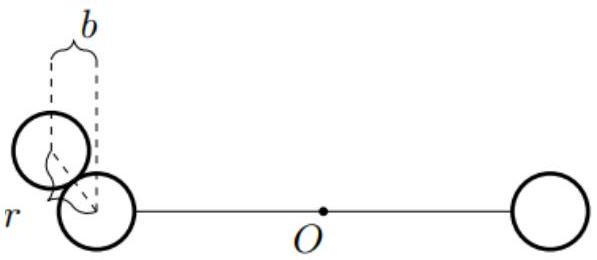

## Road to IPhO

## Какой-то странный спиннер...

Рассмотрим механическую систему, показанную на рисунке. Две небольшие сферы $A$ и $B$ массы $m$ закреплены на концах однородного стержня длиной $2 l$ и массой $4 m$, прикрепленного за середину перпендикулярно к горизонтальной оси. Над точкой начального положения сферы $A$, в котором стержень горизонтален и неподвижен, находится вертикальный туннель, из которого в специально подобранные моменты времени вылетает шарик массой $m$, сталкивающийся со сферами и заставляющий систему вращаться вокруг оси. Скорость вылетающего шарика непосредственно перед столкновением равна $v$. В результате первого столкновения система приобретает некоторую угловую скорость $\omega_{1}$. Когда сфера $B$ попадает в положение, в котором изначально находилась сфера $A, B$ сталкивается с новым шариком, а система приобретает некоторую угловую скорость $\omega_{2}$, и так далее. Во всех частях задачи части все столкновения считайте упругими. Размерами шариков и сфер пренебрегите.

## Часть А. Центральные соударения без диссипаций (2.0 балла)

В этой части задачи все столкновения являются центральными. Диссипаций в системе нет.
А1 Определите момент инерции системы из стержня и сфер относительно оси вращения. Ответ выразите через $m$ и $l$.

А2 Выразите угловую скорость $\omega_{i+1}$ системы после столкновения с $i+1$-ым вылетевшим шариком через $\omega_{i}, v$ и $l$.

A3 Чему равна $\omega_{1}$ ? Ответ выразите через $v$ и $l$. 0.2

Как можно ожидать, угловая скорость такой вращающейся системы стремится при $i \rightarrow \infty$ к постоянному значению $\omega^{*}$.

А4 Выразите $\omega^{*}$ через $v$ и $l$. 0.2

A5 Решив рекуррентное уравнение, полученное в пункте A1, получите явное выражение для $\omega_{i}$. Ответ выразите через $i, v$ и $l$. Подсказка: воспользуйтесь переменной $\omega_{i}^{\prime}=\omega_{i}-v / l$.

Пусть теперь вместо одной пары сфер их у нас будет две пары, размещённые на стержнях, перпендикулярных друг другу и оси.

А6 Каким будет предельное значение $\omega^{*}$ для такой системы? 0.2

## Часть В. Нецентральные соударения без диссипаций (3.0 балла)

Вернёмся обратно к системе с одной парой сфер. В данной части задачи изучаются нецентральные соударения шариков со сферами $A$ и $B$. Диссипаций в системе нет (в том числе трения между вылетающим шариком и сферами).

Будем характеризовать нецентральный удар параметром $k=b / r$, где $b<r-$ прицельный параметр, с которым вылетевший шарик налетает на сферу, а $r \ll l$ - расстояние между центрами шарика и

сферы при их соприкосновении (см. рис).

В1 При каком значении параметра $k_{0}$ скорость первого вылетевшего шарика сразу после столкновения со сферой будет направлена горизонтально?

## Road to IPhO

Далее рассматривается произвольное значение параметра $k$.
B2 Выразите угловую скорость $\omega_{i+1}$ системы после столкновения с $i+1$-ым вылетевшим шариком через $\omega_{i}, v$, $l$ и $k$.

B4 Решив рекуррентное уравнение, полученное в пункте B2, получите явное выражение для $\omega_{i}$. Ответ выразите через $i, v$ и $l$.

## Часть С. По мотивам Коткина-Сербо (4.0 балла)

В данной части задачи изучается движение системы под воздействием трения. Под действием трения этом на систему действует момент $M$, являющийся некоторой функцией угловой скорости $\omega$. В зависимости от геометрии системы, основной вклад даёт:

1. Сухое трение - момент $M=\alpha I=$ const ;
2. Линейное вязкое трение - момент $M=\beta I \omega, \beta=$ const ;
3. Квадратичное вязкое трение - момент $M=\gamma I \omega^{2}, \gamma=$ const.

Здесь $I$ - момент инерции системы. Вместо момента инерции системы и скорости шарика введём параметры $\varepsilon=\frac{m l^{2}}{I}$ и $\omega_{0}=\frac{v}{l}$. Во всех пунктах части $\mathbf{C}$ соударения являются центральными и упругими. Все ответы в пунктах $\mathbf{C 1}-\mathbf{C 3}$ выразите через $\varepsilon$ и $\omega_{0}$.

C1 Найдите, при каких значениях параметра $\alpha$ система в режиме сухого трения будет продолжать движение неограниченно долго после первого столкновения с шариком.

С2 Найдите, при каких значениях параметра $\beta$ система в режиме линейного вязкого трения будет продолжать движение неограниченно долго после первого столкновения с шариком.

C3 Найдите, при каких значениях параметра $\gamma$ система в режиме квадратичного вязкого трения будет продолжать движение неограниченно долго после первого столкновения с шариком.

Приступим теперь непосредственно к точному вычислению установившихся средних угловых скоростей в каждом из трёх режимов. Для этого совместно с уравнением для столкновения с шариком нужно решить уравнение свободного движения системы и найти стационарные точки.

C4 Найдите установившуюся среднюю по периоду угловую скорость системы $\bar{\omega}_{1}$ в режиме сухого трения. Выразите ответ через $\varepsilon, \alpha$ и $\omega_{0}$.

Ответы в пунктах С5 и С6 выразите через $\varepsilon, \beta$ и $\omega_{0}$.
C5 Найдите стационарное значение угловой скорости $\omega_{2}^{\uparrow}$ системы непосредственно после очередного столкновения с шариком в режиме линейного вязкого трения.

C6 Найдите установившуюся среднюю по периоду угловую скорость системы $\bar{\omega}_{2}$ в режиме линейного вязкого трения.

Ответы в пунктах C7 и C8 выразите через $\varepsilon, \gamma$ и $\omega_{0}$.
