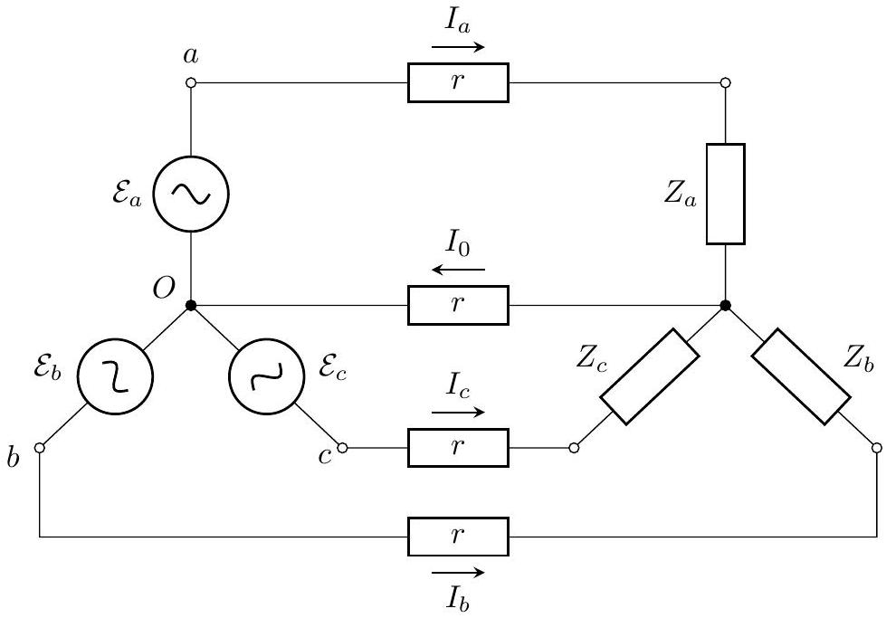
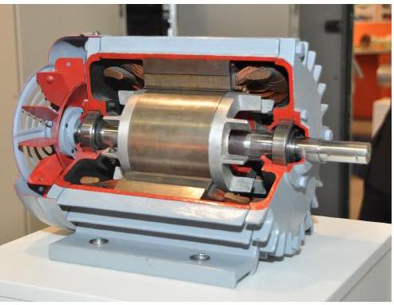
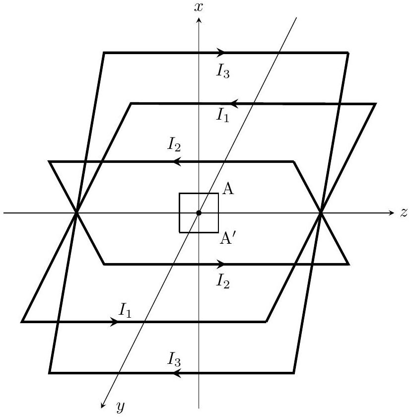
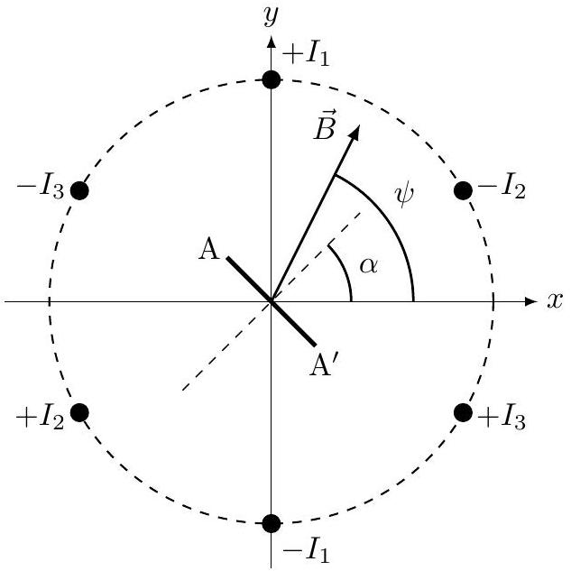

## Road to IPhO

## Трехфазный ток

## Часть А. Цепи трехфазного тока (3 балла)

Наряду с обычным переменным током, представляющим собой одно синусоидальное колебание, в технике часто используется так называемый многофазный (и в частности трехфазный) ток. Такой ток представляет собой суперпозицию нескольких колебаний одинаковой частоты, сдвинутых друг относительно друга по фазе. Использование трехфазного тока позволяет передавать энергию на большие расстояния с меньшими потерями. Кроме этого, трехфазный ток удобнее использовать для питания электрических двигателей. Комбинируя между собой сдвинутые по фазе колебания, можно добиться постоянной по времени мощности на нагрузке (например на двигателе или нагревательном приборе).

Генератор трехфазного тока можно моделировать как три генератора переменного тока одной частоты, напряжения которых сдвинуты друг относительно друга по фазе на треть периода. Провода, соединенные с выводами генераторов $(a, b, c)$ называются линейными, а провод, подсоединенный к центру звезды $(O)$ - нулевым (или нейтральным). Напряжение между двумя выводами генераторов, к которым подключены линейные провода, называется линейным. Напряжения между центром звезды и тремя выводами называются фазными напряжениями, они равны

$$
\mathcal{E}_{a}=\mathcal{E}_{0} \cos \omega t, \mathcal{E}_{b}=\mathcal{E}_{0} \cos \left(\omega t-\frac{2 \pi}{3}\right), \mathcal{E}_{c}=\mathcal{E}_{0} \cos \left(\omega t-\frac{4 \pi}{3}\right) .
$$

В качестве нагрузки для генератора будем использовать 3 элемента $Z_{a}, Z_{b}, Z_{c}$, соединенных в виде звезды. Они соединяются с генератором проводами, сопротивление каждого из которых равно $r$. Внутренние сопротивление генераторов учитывать не нужно.

A1 Линейное напряжение между выводами $a$ и $b$ можно представить в виде $\mathcal{E}_{a b}=\mathcal{E}_{\prime}^{\prime} \cos (\omega t-\Delta \varphi), \mathcal{E}_{\prime}^{\prime}>0 . \mathbf{0 . 6}$ Найдите $\mathcal{E}^{\prime}$ и $\Delta \varphi$. Выразите ответ через $\mathcal{E}_{0}$.

Сопротивление каждого из соединительных проводов, соединяющих генератор и нагрузку, равно $r=5$ кОм, амплитуда напряжения каждого из генераторов $\mathcal{E}_{0}=310 \mathrm{~B}$, частота напряжения $f=50$ Гц.

А2 Пусть каждый из элементов нагрузки $\left(Z_{a}, Z_{b}, Z_{c}\right)$ представляет собой последовательно соединенные ре- зистор $R=9$ кОм и конденсатор $C=2 \cdot 10^{-7}$ Ф. Найдите амплитуды тока через линейный провод $I_{a}$ и нулевой провод $I_{0}$ (формулу и численное значение).

A3 Найдите коэффициент полезного действия схемы из пункта A2 $\eta$ (формулу и численное значение). Коэффициентом полезного действия считайте отношение средней мощности, выделяющейся на нагрузке, к средней мощности, выделяющейся во всей цепи.

## Road to IPhO

А4 Пусть теперь нагрузка несимметричная: элементы $Z_{b}$ и $Z_{c}$ представляют собой резисторы с сопротивлением $R$, а элемент $Z_{a}$ - конденсатор с емкостью $\mathrm{C}_{1}=10^{-9}$ Ф. Найдите численное значение коэффициента полезного действия схемы $\eta_{1}$ в этом случае. Получать аналитическое выражение для $\eta_{1}$ не требуется. Воспользуйтесь численными данными из пункта $A 2$.

## Часть В. Индукционный двигатель (6 баллов)

В этой части мы будем изучать одну из наиболее распространенных конструкций двигателя на переменном токе. Двигатель состоит из двух частей: неподвижного статора и ротора, который может вращаться. Статор расположен вокруг ротора и содержит несколько катушек с током, создающих переменное магнитное поле. Это поле создает в роторе индукционные токи, на которые действует момент сил. Этот момент и заставляет ротор вращаться.

Будем использовать следующую модель двигателя. Статор представляет собой три квадратных рамки со стороной $a$. Рамки повернуты на $120^{\circ}$ друг относительно друга и на них подается трехфазное напряжение, так

что токи в рамках имеют вид:

$$
I_{1}=I_{0} \cos \omega t, I_{2}=I_{0} \cos \left(\omega t-\frac{2 \pi}{3}\right), I_{3}=I_{0} \cos \left(\omega t-\frac{4 \pi}{3}\right) .
$$

В центре квадратов находится маленькая прямоугольная рамка площади $S$ (линейные размеры рамки много меньше стороны квадрата $a$ ), которая может свободно вращаться вокруг горизонтальной оси $z$, проходящей через центры всех рамок.

Взаимное расположение рамок, направления токов в них и направления координатных осей указаны на рисунке. На втором рисунке изображено сечение рамок плоскостью $x y$, как оно выглядит, если смотреть со стороны положительных $z$. Положительным знакам токов (например $+I_{1}$ ), отвечают токи, которые текут к нам.

 нитное поле $B_{0}$ в центре квадрата, создаваемое только этой рамкой.

## Road to IPhO

В2 Будем теперь рассматривать поле, которое создают все три рамки, токи через которые указаны во введе- нии. Докажите, что в этом случае магнитное поле вращается с постоянной угловой скоростью в плоскости $x y$, то есть его модуль постоянен и равен $B_{1}$, а угол с осью $x \psi=\omega t+\psi_{0}$ (тогда $B_{x}=B_{1} \cos \psi, B_{y}=B_{1} \sin \psi$ ). Найдите $B_{1}$ и $\psi_{0}$. Выразите ответ через $B_{0}$.

B3 Маленькая рамка в центре повернута так, что ее нормаль образует угол $\alpha$ с осью $x$. Найдите магнитный $\mathbf{0 . 4}$ поток через нее в момент времени $t$. Выразите ответ через $B_{1}, S, \alpha, \omega$.

В4 Пусть индуктивность рамки $L_{2}$, сопротивление $R_{2}$. Рамка вращается с постоянной угловой скоростью $\omega_{1}$, так что $\alpha=\omega_{1} t\left(0<\omega_{1}<\omega\right)$. В установившемся режиме ток в рамке зависит от времени как

$$
I(t)=A \cos \left(\omega_{2} t-\varphi_{2}\right) .
$$

Найдите $A, \omega_{2}$ и $\varphi_{2}$. Выразите ответ через параметры рамки, $B_{1}, \omega, \omega_{1}$.

В5 Для того, чтобы обеспечить более равномерное вращение ротора, вместо одной рамки будем использовать три рамки, повернутых друг относительно друга на $120^{\circ}$ вокруг оси $z$ (то есть если положение одной рамки задается углом $\alpha$, положения остальных рамок задаются углами $\alpha_{2}=\alpha+2 \pi / 3, \alpha_{3}=\alpha+4 \pi / 3$ ). Рамки изолированы друг от друга, их взаимной индукцией можно пренебречь. Докажите, что проекция на ось $z$ момент сил, действующий на конструкцию из трех рамок, постоянен. Найдите ее величину $M_{z}$. Выразите ответ через параметры рамки, $B_{1}, \omega, \omega_{1}$.

В6 Постройте качественный график зависимости $M_{z}\left(\omega_{1}\right)$ в диапазоне частот $0<\omega_{1}<\omega$. Укажите координаты характерных точек. Считайте, что $R_{2} / L_{2}<\omega$.
