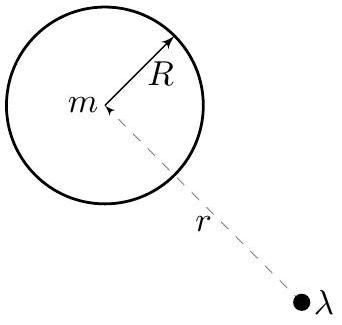
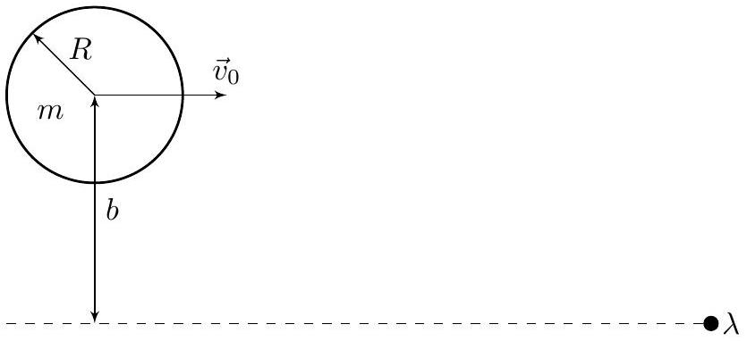
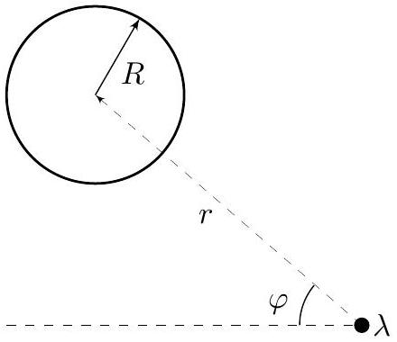
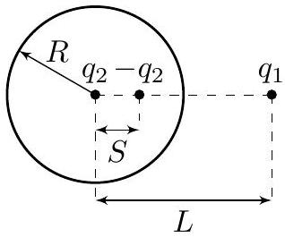
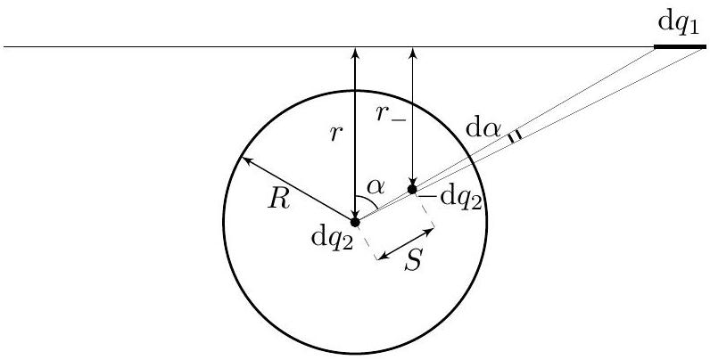
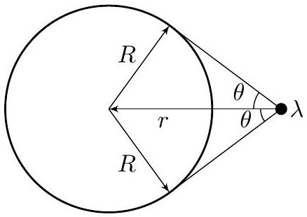

## Road to IPhO

## Движение металлического шара в поле провода (12 баллов)

В рамках данной задачи вам предстоит изучить взаимодействие незаряженного металлического однородного шара с бесконечно длинным тонким неподвижным проводом, заряженным равномерно по длине.

Во всех пунктах задачи радиус $R$ и масса $m$ шара, а также линейная плотность заряда провода $\lambda$ считаются известными.

Части $\mathbf{A}, \mathbf{B}$ и $\mathbf{C}$ посвящены изучению взаимодействия шара и провода на больших по сравнению с $R$ расстояниях $r$ между ними.

Части $\mathbf{D}$ и $\mathbf{E}$ посвящены точному описанию их взаимодействия.

## Часть А. Взаимодействие шара с проводом на больших расстояниях (2.4 балла)

В данной части задачи вам предстоит получить зависимости силы $F$ и потенциальной энергии $W_{p}$ взаимодействия между шаром и проводом.

Примечание: во всех пунктах частей A-C считайте, что расстояние $r$ между центром шара и проводом велико по сравнению с радиусом $R$ шара.

Решим следующие вспомогательные задачи:
А1 Металлический шар радиуса $R$ помещён в однородное электрическое поле $\vec{E}_{0}$.
Найдите приобретаемый шаром дипольный момент $\vec{p}$.
Ответ выразите через $\vec{E}_{0}, R$ и электрическую постоянную $\epsilon_{0}$.

А2 Пусть шар расположен в электрическом поле, направленном вдоль оси $z$, напряжённость которого меняется по закону:

$$
\vec{E} \approx\left(E_{0}+k z\right) \vec{e}_{z}
$$

где $E_{0}$ и $k$ - известные величины, причём $k R \ll E_{0}$.
Найдите силу $F_{z}$, действующую на шар.
Ответ выразите через $E_{0}, k, R$ и электрическую постоянную $\epsilon_{0}$.
Перейдём к взаимодействию шара с проводом.
A3 Найдите величину электрического поля провода $E_{п}$ на расстоянии $r$ от него. Ответ выразите через $\lambda, r$ и электрическую постоянную $\varepsilon_{0}$.

А4 Найдите величину и направление (притяжение или отталкивание) силы $F$, действующей на шар со стороны провода на расстоянии $r$ от него. Ответ выразите через $\lambda, R, r$ и электрическую постоянную $\varepsilon_{0}$.

А5 Покажите, что механическая потенциальная энергия $W_{p}$ шара в поле провода при расстоянии $r$ между проводом и центром шара равна:

$$
W_{p}=-\frac{A}{r^{2}}
$$

Найдите $A$. Ответ выразите через $\lambda, R$ и электрическую постоянную $\varepsilon_{0}$.
В дальнейшем во всех пунктах частей $\mathbf{B}$ и $\mathbf{C}$ используйте выражения для силы и потенциальной энергии взаимодействия шара с проводом, полученные в пунктах A4 и A5 соответственно.

Примечание: Выражение для величины $A$ понадобится вам только в пункте C4.

## Road to IPhO

Часть В. Условие отсутствия контакта (0.8 балла)
Шар летит по направлению «на провод» из бесконечности с начальной скоростью $v_{0}$ и прицельным параметром $b$.

В данной части задачи вам необходимо приближённо получить условия, при которых между шаром и проводом в дальнейшем не будет контакта.

В1 Найдите минимальное расстояние $r_{\min }$ между центром шара и проводом в процессе движения, считая, что столкновения не происходит. Ответ выразите через $A, b, m$ и $v_{0}$.

При начальной скорости $v_{0}$ шара, меньшей критического значения $v_{\text {crit }}$, шар сталкивается с проводом.
B2 Найдите $v_{\text {crit }}$. Ответ выразите через $A, b$ и $m$. 0.2

Часть С. Траектория движения (2.5 балла)
Для описания траектории центра шара введём полярную систему координат $(r, \varphi)$ с началом на оси провода. Угол $\varphi$ будем отсчитывать от направления на бесконечность.

Также воспользуемся подстановкой Бине:

$$
u=\frac{1}{r}
$$

Обозначим $\frac{\mathrm{d} u}{\mathrm{~d} \varphi}$ за $u^{\prime}, \mathrm{a} \frac{\mathrm{d} r}{\mathrm{~d} t}$ и $\frac{\mathrm{d} \varphi}{\mathrm{d} t}$ за $\dot{r}$ и $\dot{\varphi}$ соответственно.

| C1 | Выразите $u^{\prime}$ через $r, \dot{r}$ и $\dot{\varphi}$. Найдите $u^{\prime}(0)$, соответствующую значению $\varphi=0$. | 0.4 |
| :--- | :--- | :--- |
| C2 | Выразите механическую энергию $E$ шара через $m, u, u^{\prime}, v_{0}, b$ и $A$. | 0.3 |
| C3 | Получите зависимость $u(\varphi)$. Ответ выразите через $m, v_{0}, b, A$ и $\varphi$. | 0.7 |
| C4 | В листе ответов качественно постройте траекторию центра шара в координатах $u, \varphi$. Координаты всех характерных точек могут быть выражены через $m, v_{0}, b$ и $A$. | 0.6 |

## Road to IPhO

C5 Используя значение параметра $A$, найденное в пункте A4, найдите начальную скорость шара $v_{1}$, при которой за время взаимодействия между ним и проводом направление скорости шара изменяется на противоположное.

Ответ выразите через $m, b, R, \lambda$ и электрическую постоянную $\epsilon_{0}$.
Уравнения, полученные в первых трёх частях задачи, применимы далеко не всегда, однако данная задача может быть решена и точно. Вопрос о траектории изучаться далее не будет, однако будут точно получены условия отсутствия контакта между шариком и проводом.

Часть D. Нахождение силы взаимодействия шарика с проводом методом изображений (3.5 балла)

Вновь решим вспомогательную задачу.
Рассмотрим точечный заряд $q_{1}$, находящийся на расстоянии $L$ от центра незаряженного металлического шара. Как известно, такая задача решается методом изображений: в центре шара и на некотором расстоянии $S<R$ необходимо расположить заряды $q_{2}$ и $-q_{2}$ соответственно, обеспечивающие постоянство потенциала на поверхности шара.

Примечание: вам может понадобиться следующая первообразная:

$$
\int \frac{d x}{a^{2}+b^{2} x^{2}}=\frac{1}{a b} \operatorname{arctg}\left(\frac{b x}{a}\right)+C
$$

D1 Найдите $S$ и $q_{2}$. Ответы выразите через $R, L$ и $q$.
Перейдём к взаимодействию шарика с проводом. Центр незаряженного металлического шара радиуса $R$ находится на расстоянии $r$ от провода.

Проведём из центра шара две линии, составляющие углы $\alpha$ и $\alpha+\mathrm{d} \alpha$ с направлением «на провод». Заряд элемента провода в области пересечения с линиями обозначим за $\mathrm{d} q_{1}$, заряды-изображения данного элемента - за $\mathrm{d} q_{2}$ и $-\mathrm{d} q_{2}$, а расстояния от заряда $-\mathrm{d} q_{2}$ до центра шара и до провода - за $S$ и $r_{-}$соответственно.

D2 Найдите $\mathrm{d} q_{1}, \mathrm{~d} q_{2}, S$ и $r_{-}$.
Ответы выразите через $\lambda, R, r, \alpha$ и $d \alpha$.

## Road to IPhO

Для описания силы и потенциальной энергии взаимодействия шарика с проводом удобно ввести угол $\theta$, определяемый следующим образом (см. рис):

$$
\theta=\arcsin \left(\frac{R}{r}\right)=\operatorname{arctg}\left(\frac{R}{\sqrt{r^{2}-R^{2}}}\right) .
$$

| D4 | Найдите величину и направление полной силы взаимодействия шара с проводом $F_{\text {полн }}$. Ответ выразите через $\lambda, R, \theta$ и электрическую постоянную $\epsilon_{0}$. | 1.0 |
| :--- | :--- | :--- |
| D5 | Найдите потенциальную энергию $W_{p}$ взаимодействия шарика с проводом. Ответ выразите через $\lambda, R, \theta$ и электрическую постоянную $\varepsilon_{0}$. | 1.0 |
| D6 | Какую скорость $v_{\text {ст }}$ будет иметь незаряженный металлический шар радиусом $R$ и массой $m$ при столкновении с проводом, если его из бесконечности отпустить без начальной скорости? Ответ выразите через $\lambda, R, m$ и электрическую постоянную $\varepsilon_{0}$. | 0.3 |

## Часть Е. Точные условия отсутствия контакта (2.8 балла)

Незаряженный металлический шар радиусом $R$ и массой $m$ налетает из бесконечности на провод со скоростью $v_{0}$ и прицельным параметром $b>R$.

В данной части задачи для разных соотношений $b / R$ мы получим ограничения на скорость $v_{0}$, при которых шар движется, не контактируя с проводом.

Минимально возможную скорость, при который движение шара происходит без контакта с проводом, обозначим за $v_{\text {crit }}$.

Параметр $\theta$ в момент максимального сближения шара с проводом обозначим за $\theta_{\max }$.

| E1 | Для заданного значения $v_{0}$ получите зависимость квадрата радиальной компоненты скорости $\dot{r}^{2}$ от параметра $\theta$.   Ответ выразите через $m, v_{0}, \lambda, R, b$, электрическую постоянную $\varepsilon_{0}$ и $\theta$. | 0.4 |
| :--- | :--- | :--- |
| E2 | Постройте качественные графики зависимости $\dot{r}^{2}(\theta)$ при разных значениях $v_{0}$. | 0.6 |
| E3 | Считая все величины, кроме $v_{0}$, постоянными, получите систему уравнений, позволяющую определить величину $v_{\text {crit }}$.   В систему уравнений могут войти $m, R, b, \lambda$, электрическая постоянная $\varepsilon_{0}, \theta_{\text {max }}$ и $v_{\text {crit }}$. | 0.6 |
| E4 | Найдите $v_{\text {crit } 1}, v_{\text {crit } 2}$ и $v_{\text {crit } 3}$, соответствующие следующим значениям $b$ : $b_{1}=20 R, \quad b_{2}=3 R, \quad b_{3}=1.1 R$   Ответы выразите через $m, R, \lambda$ и электрическую постоянную $\varepsilon_{0}$. | 1.2 |
