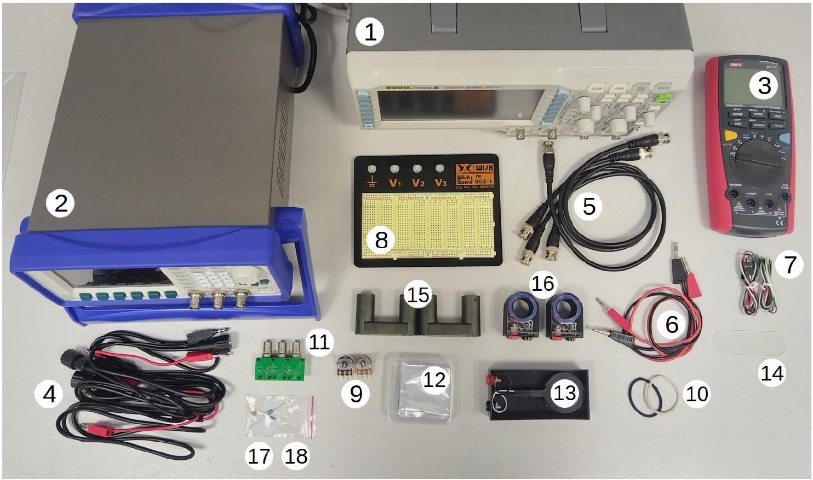
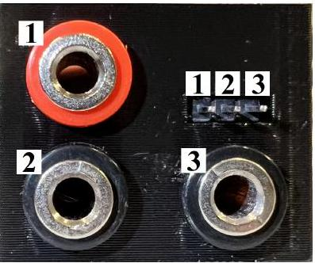
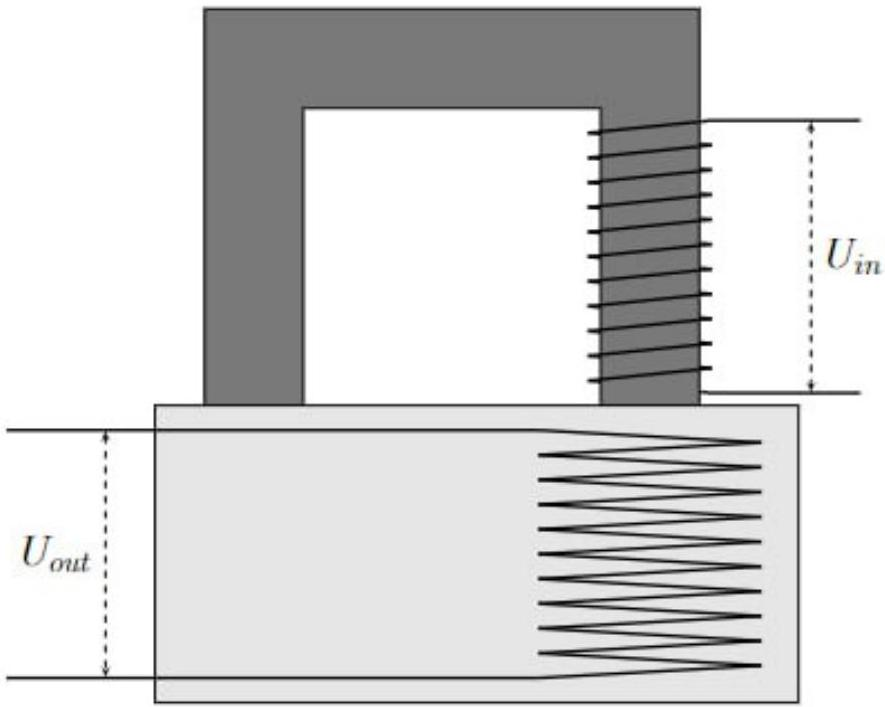
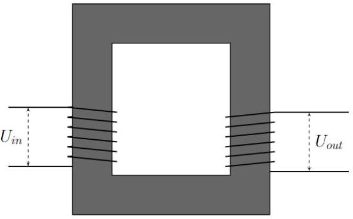
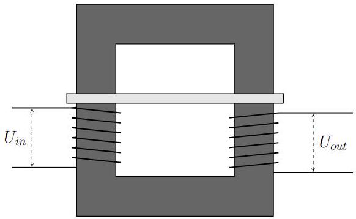
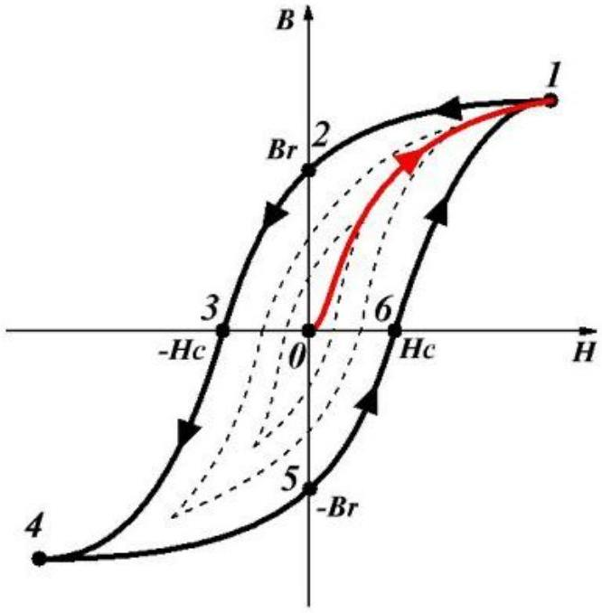
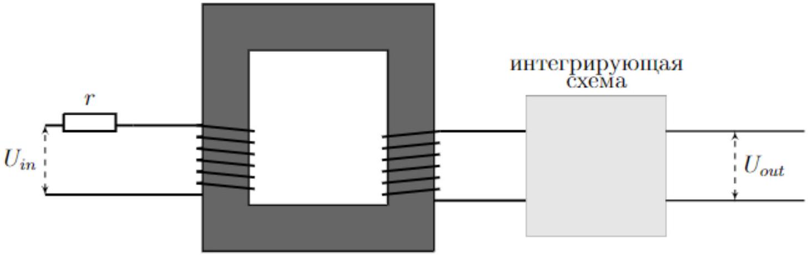

## Road to IPhO

Ферритовый сердечник и трансформатор

Оборудование

1. Осциллограф
2. Генератор переменного сигнала
3. Цифровой мультиметр
4. Провода BNC-банан
5. Провода BNC-BNC
6. Провода банан-банан
7. Провод DuPont папа-мама тройной
8. Макетная плата
9. Потенциометры (1 кОм и 10 кОм)
10. Две резинки
11. Тройной переходник BNC-плата
12. Кусочки фольги толщины 50 мкм, 100 мкм, 200 мкм, 300 мкм
13. Блок с встроенной катушкой датчика
14. Пластиковая прокладка
15. Два ферритовых сердечника
16. Катушки А с количеством витков $N_{A}=300 \pm 1$ и B с $N_{B}=200 \pm 1$
17. Конденсатор номиналом ( $1.0 \pm 0.1$ ) мк $\Phi$
18. Резисторы номиналом $(10.0 \pm 0.1) \mathrm{Oм},(100 \pm 1) \mathrm{Oм},(51 \pm 1)$ кОм

Указание 1. Во всей работе сигнал генератора синусоидальный с удвоенной амплитудой $2 U_{0}=12 \mathrm{~B}$ (учтите, что генератор показывает именно удвоенную амплитуду) и частотой $f_{0}=10$ кГц, если не сказано иное.

Указание 2. Потенциометры используйте только в пунктах В2-В4.

## Road to IPhO

Ферриты - это соединения оксида железа $\mathrm{Fe}_{2} \mathrm{O}_{3}$ с более оснОвными оксидами других металлов, являющиеся ферримагнетиками. Ферриты широко применяются в качестве магнитных материалов в радиоэлектронике, радиотехнике и вычислительной технике, поскольку сочетают высокую магнитную восприимчивость $(\chi \gg 1)$ с полупроводниковыми или диэлектрическими свойствами. Феррит при нормальных условиях имеет низкую электропроводность. Поэтому потерями, связанными с наличием вихревых токов в ферритовых сердечниках, можно пренебречь, если не оговорено иное. Осторожно обращайтесь с ферритовыми сердечниками, они хрупкие!

## Часть А. Экранирование магнитных полей вихревыми токами (3.8 балла)

Как известно, переменные магнитные поля вызывают в проводниках вихревые токи. В свою очередь, вихревые токи порождают противодействующие поля. В сверхпроводниках вихревые токи полностью выталкивают магнитное поле наружу. Обычные металлы не обладают подобным свойством из-за конечной проводимости и потому менее эффективны в экранировании магнитных полей.

Для описания экранирования магнитных полей с помощью алюминиевой фольги примите следующую модель

$$
B=B_{0} e^{-\alpha d},
$$

где $B_{0}$ - магнитное поле в отсутствии фольги, $B$ - величина магнитного поля, прошедшего через фольгу, $\alpha$ - постоянная затухания, $d$ - толщина фольги.

Соответствие между выводами типа «банан» и пинами показано на рисунке. Между выводами 1 и 2 находится сама катушка, между выводами 2 и 3 - последовательно соединённый с ней резистор. Вместо него вы также можете использовать резисторы (18).

A0 Измерьте сопротивления катушек $\mathbf{A}$ и $\mathbf{B}$ ( $r_{A}$ и $r_{B}$ соответственно), а также сопротивления последовательно соединённых с ними резисторов. Все значения должны лежать в диапазоне до 15 Ом.

Указание 3. В дальнейших пунктах омическим сопротивлением катушек можно пренебречь, если не указано иное. Наденьте на ферритовый сердечник катушку A (как показано на рисунке) и положите его ножками вниз на блок таким образом, чтобы катушка А находилась непосредственно над встроенной в платформу катушкой датчика. Закрепите сердечник на блоке с помощью резинок.

## Road to IPhO

А2 Определите коэффициент затухания $\alpha$ для нескольких частот в диапазоне $5-25$ кГц. 2.0

A3 Постройте график зависимости $\alpha$ от частоты. 1.2

## Часть В. Исследование трансформатора (4.8 балла)

Трансформатор представляет собой несколько проволочных обмоток, намотанных на общий сердечник (магнитопровод), сделанный из материала с магнитной проницаемостью $\mu \gg 1$, где $\mu$ определяется выражением

$$
\vec{B}=\mu \mu_{0} \vec{H},
$$

где $\vec{B}$ - вектор индукции магнитного поля, $\vec{H}$ - вектор напряжённости магнитного поля. Обмотку, подключаемую к источнику тока, называют первичной, а другую, подключаемую к нагрузке, - вторичной. В этой части считайте катушку А первичной обмоткой, а катушку В - вторичной. Ток в первичной обмотке создает поток, который в силу свойств сердечника практически не рассеивается вдоль магнитопровода. Этот поток индуцирует ток во вторичной обмотке. Трансформаторы обычно используют, чтобы увеличить или уменьшить амплитуду напряжения и гальванически разделить электрические цепи входа и выхода (т.е. передать сигнал с одного контура на другой без утечки тока).

Расположите два U-образных ферритовых сердечника с двумя катушками (как показано на рисунке) и скрепите их резинками. Подайте с помощью генератора синусоидальный сигнал $U_{g}(t)=U_{0} \sin 2 \pi f_{0} t$ с частотой $f_{0}$ на первичную катушку.

Одной из характеристик трансформатора является коэффициент трансформации $m=\frac{U_{\text {out }, 0}}{U_{\text {in }, 0}}$, где $U_{i n, 0}$ и $U_{\text {out }, 0}$ - амплитуды напряжений на первичной и вторичной катушках соответственно.

В1 Экспериментально определите $m$. Нарисуйте схемы измерений, необходимых для получения численного значения этой величины.

Теперь замкнём вторичную катушку на реостат. Сопротивление реостата обозначим $R$. Введём $P_{\text {пол }}$ - усреднённую полезную мощность, выделяющуюся на реостате, и $P_{0}$ - усреднённую по времени мощность генератора. Работайте на частоте генератора $f_{1}=200$ Гц.

B2 Снимите зависимость $P_{\text {пол }}$ и $P_{0}$ от амплитуды тока во вторичной катушке $I_{B, 0}$. 1.3

КПД трансформатора $\eta$ определяется как $\eta=\frac{P_{\text {пол }}}{P_{0}}$.
B3 Постройте график зависимости $\eta\left(I_{B, 0}\right)$. Укажите максимальное КПД $\eta_{\text {max }}$ и при каком $I_{B, 0}^{\text {max }}$ оно достигается.

В пункте В4 следует учесть омическое сопротивление катушек. Проанализируем различные источники потерь. Отдаваемая в трансформатор мощность $P_{0}$ «раскладывается» на полезную мощность $P_{\text {пол }}$, иные джоулевые потери в катушках и резисторах $P_{\text {дж }}$ и потери в сердечнике $P_{\text {серд }}$.

$$
P_{0}=P_{\text {пол }}+P_{\text {Дж }}+P_{\text {серд }}
$$

В4 Получите зависимости относительного вклада каждого источника потерь $\frac{P_{\text {Дж }}}{P_{0}}$ и $\frac{P_{\text {серд }}}{P_{0}}$ от амплитуды тока 2.0 во вторичной катушке $I_{B, 0}$. Постройте их графики.

## Road to IPhO

Часть С. Катушки на сердечнике (6.4 балла)
Одна катушка Для начала рассмотрим сердечник с одной катушкой, через которую течёт ток $I$. Магнитный поток $\Phi$, который ток создаёт в ферритовом сердечнике внутри катушки, пропорционален току $I$ и числу витков $N$. Кроме того, поток зависит от геометрического фактора $g$, который определяется размером и формой сердечника, и магнитной проницаемости $\mu$, которая описывает магнитные свойства материала сердечника. Таким образом, магнитный поток $\Phi$ задаётся формулой

$$
\Phi=\mu \mu_{0} g N I .
$$

Считайте, что на катушку подаётся сигнал с угловой частотой $\omega$. Считайте, что $g$ для катушек $\mathbf{A}$ и $\mathbf{B}$ одинаков.

С1 Получите уравнение, связывающее между собой амплитуды тока и напряжения в катушке.
Две катушки Теперь рассмотрим сердечник с двумя катушками. Ферритовый сердечник можно использовать для связи катушек A и B между собой. В идеальном сердечнике магнитный поток будет одинаковым для всех поперечных сечений, но из-за рассеяния потока в реальных сердечниках поток поля, создаваемого катушкой A, через катушку A и поток этого поля через катушку B связаны следующим образом:

$$
\Phi_{B}=k \Phi_{A},
$$

где $k<1$ - так называемый коэффициент связи. Аналогично ток в катушке $\mathbf{B}$, создаст поток $\Phi_{B}^{\prime}$ через катушку B и

$$
\Phi_{A}^{\prime}=k \Phi_{B}^{\prime}
$$

через катушку А. Экспериментально проверено, что коэффициент $k$ не зависит от того, какая катушка взята в качестве первичной. Пусть катушка А является первичной катушкой, т.е. подключенной к генератору с синусоидальным напряжением $U_{g}(t)=U_{0} \sin 2 \pi f_{0} t$ (напомним, $N_{A}=300 \pm 1$ ). Рассмотрим ситуацию, когда ток через катушку В не протекает. Во всех пунктах этой части (кроме С13) схема расположения катушек на сердечнике такая же, как в части В.

C2 В этом случае получите выражения для ЭДС индукции $\mathcal{E}_{A}(t)$ и $\mathcal{E}_{B}(t)$ в катушках А и В соответственно. От- вет выразите через $N_{A}, N_{B}, k, U_{g}(t)$. Ток в первичной катушке считайте положительным, если он течет от «плюса» источника к «минусу».

Пусть теперь через катушку В протекает ток $I_{B}(t)$.
C3 Получите выражение для производной тока в катушке A $\frac{d I_{A}(t)}{d t}$. Ответ выразите через $\mu, \mu_{0}, g, N_{A}, N_{B}, k$, $U_{g}(t), I_{B}(t)$. Считайте токи $I_{A}$ и $I_{B}$ одного знака, если создаваемые ими потоки складываются.

Общепринятым способом описания зависимости между током и ЭДС индукции в катушке является определение собственной индуктивности катушки $L$ следующим образом:

$$
\mathcal{E}(t)=-L \frac{d I(t)}{d t}
$$

C4 Получите теоретические выражения для собственных индуктивностей $L_{A}$ и $L_{B}$. Ответ выразите через $\mu$, $\mu_{0}, g, N_{A}, N_{B}$.

C5 Экспериментально определите $L_{A}, L_{B}, k$. Нарисуйте схемы измерений, необходимых для получения чис- ленных значений этих величин.

C6 Покажите, что пренебрежение внутренним сопротивлением катушки оправдано.
При коротком замыкании вторичной катушки ток в первичной изменится. Обозначим его $I_{P}(t)$.

## Road to IPhO

C7 Получите в явном виде выражение для $I_{P}(t)$ через $f_{0}, L_{A}, k, U_{g}(t)$ и найдите численное значение его амплитуды $I_{P, 0}$.

C8 Экспериментально определите $I_{P, 0}$.
Катушки A и B могут быть включены в цепь последовательно двумя различными способами: два создаваемых потока либо суммируются, либо вычитаются друг из друга.

С9 Выразите собственную индуктивность последовательно соединенных катушек $L_{A+B}$ в случае, когда потоки от разных катушек суммируются. Ответ выразите через $L_{A}, L_{B}, k$.

Соедините катушки А и В последовательно так, чтобы создаваемые ими потоки суммировались.
C10 Экспериментально определите $L_{A+B}$.

C11 Используя экспериментальные значения $L_{A}, L_{B}, L_{A+B}$, найдите коэффициент связи $k$. Сравните полученное значение с полученным в пункте C5.

С12 Проведите измерение амплитуды ЭДС индукции на катушках $\mathcal{E}_{A, 0}$ и $\mathcal{E}_{B, 0}$, когда направления создаваемых потоков противоположны и найдите отношение $\frac{\mathcal{E}_{A, 0}}{\mathcal{E}_{B, 0}}$. Получите теоретическое выражение для $\frac{\mathcal{E}_{A, 0}}{\mathcal{E}_{B, 0}}$. Ответ выразите через $k, N_{A}, N_{B}$.

Тонкая пластиковая прокладка, вставленная между двумя сердечниками, значительно снижает индуктивность катушки. Предположим, что $\mu_{\text {пл }}=1$ для пластиковой прокладки. Толщина прокладки составляет ( $1.20 \pm 0.02$ ) мм. Считайте, что наличие пластиковой прокладки слабо влияет на картину магнитных линий, а их характерная длина внутри замкнутых друг на друга ферритовых сердечников равна $(24 \pm 1)$ см.

С13 Определите относительную магнитную проницаемость $\mu$ ферритового материала. Нарисуйте схемы измерений, обозначив на них линии индукции магнитного поля.

## Часть D. Исследование гистерезиса (5.0 балла)

Внимание! В этой части вам понадобится режим X-Y на осциллографе. Для перехода в этот режим нажмите кнопку MENU, выберите Time Base и режим X-Y (см. рисунок справа).

Гистерезис - свойство систем, отклик которых на приложенное к ним воздействие зависит не только от их текущего состояния, но и от их «предыстории». Например, если растянуть резиновый шнур, а затем снова вернуть его в нерастянутое состояние, его длина до и после растяжения будет различной. Это называется упругим гистерезисом. Подобное явление наблюдается и в случае с полем в веществе и называется магнитным гистерезисом. Оказывается, если периодически изменять величину напряжённости поля $H$, график зависимости $B(H)$ не будет проходить через точку $(0,0)$. На рисунке жирным выделена зависимость $B(H)$ для некоторой фиксированной амплитуды $H$. Когда $H$ увеличивается, $B$ изменяется по траектории $4-5-6-1$, когда

## Road to IPhO

уменьшается - по траектории $1-2-3-4$. Такой цикл называется петлёй гистерезиса. Пунктирными линиями показаны петли гистерезиса для различных амплитуд $H$. Если соединить крайние точки для всех петель, получится некоторая кривая (кривая 0-1 на рисунке), называемая кривой намагничивания, она описывает связь между $B$ и $H$ для размагниченного образца, впервые помещаемого во внешнее поле (линия $0-1$ ). В данной части задачи нам потребуется получить кривую намагничивая феррита и с помощью неё исследовать другие магнитные свойства этого материала.

В этой части используйте две катушки на ферримагнитном сердечнике (подавайте сигнал на катушку А и снимайте сигнал с катушки В). Используйте максимально возможное значение амплитуды $U_{i n}$, если не оговорено иное. Частоту подаваемого синусоидального сигнала можно менять, но она должна лежать в диапазоне [40;10000] Гц. Чтобы получить на экране осциллографа петлю гистерезиса, сигналы на двух каналах осциллографа $U_{1}(t)$ и $U_{2}(t)$ должны быть пропорциональны $H$ и $B$ соответственно. По теореме о циркуляции

$$
H \sim I
$$

где $I$ - ток через первичную катушку. Его можно измерить с помощью последовательно подключенного к первичной катушке резистора. Напряжение на вторичной катушке $U$ по закону Фарадея

$$
U \sim \frac{d B}{d t}
$$

Чтобы получить $B(t)$, нужно подать напряжение со вторичной катушки $U$ на интегрирующую схему, напряжение на выходе которой

$$
U_{2} \sim \int U d t \sim B
$$

Считайте сечение сердечника круглым с диаметром $d=(20.1 \pm 0.1)$ мм. Во время измерений не допускайте сильных вибраций сердечников (для этого используйте резинки и дополнительно придерживайте их рукой). Примечание: если сердечники начинают сильно вибрировать, заново поставьте их друг на друга и прижмите сверху.

D1 Соберите интегрирующую схему для рисунка выше, сигнал на выходе которой пропорционален $B(t)$. Подберите её параметры так, чтобы током через вторичную катушку можно было пренебречь. Зарисуйте собранную схему в листах ответов и укажите подобранные параметры.

## Road to IPhO

Обозначим частоту, при которой гистерезис виден наилучшим образом, $f_{b}$. В следующем пункте вы можете регулировать напряжение $U_{i n}$.

D3 Запишите $f_{b}$ в лист ответов. При частоте $f_{b}$ получите кривую намагничивания $B(H)$, регулируя напряжение 2.0 $U_{i n}$, и постройте её.

Введем понятие нормальной относительной магнитной проницаемости $\mu_{n}=\frac{1}{\mu_{0}} \frac{B}{H}$.
D4 Постройте график $\mu_{n}(H)$ для зависимости из прошлого пункта. Укажите характерные точки, если они есть. 1.5
