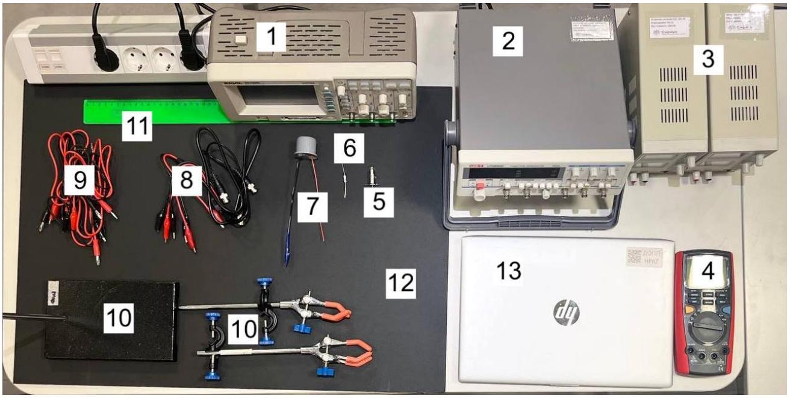
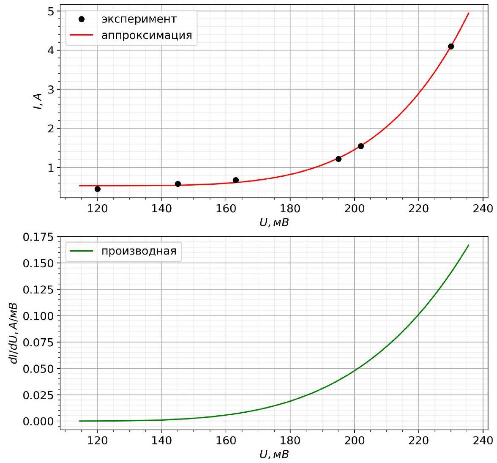
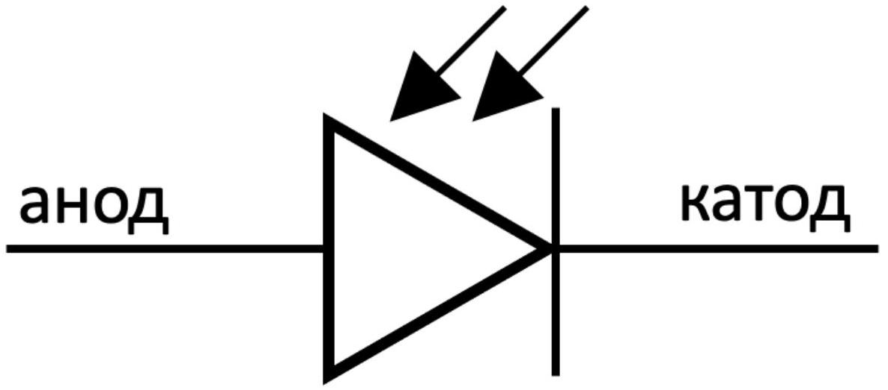
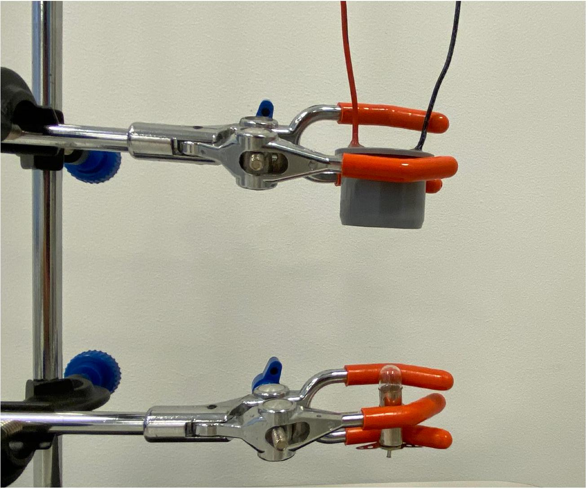
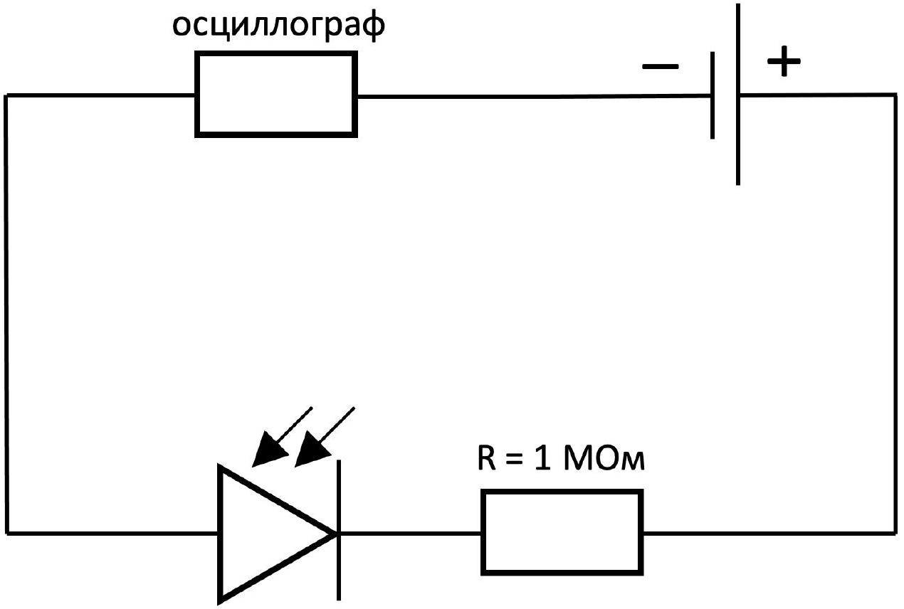

Оборудование:

1. Осциллограф
2. Генератор переменного тока
3. Источник постоянного тока (2 шт.)
4. Мультиметр
5. Лампа накаливания в держателе
6. Резистор 1 Ом
7. Фотодиод в корпусе, последовательно соединенный с резистором 1 МОм
8. Провода BNC-крокодил (3 шт.)
9. Провода банан-крокодил (6 шт.)
10. Штатив с двумя лапками
11. Линейка 50 см
12. Черная картонная подложка
13. Ноутбук

Внимание!

1. Вам выдан фотодиод, последовательно соединённый с резистором 1 МОм, резистор обёрнут изолентой. Категорически запрещено снимать изоленту и включать фотодиод в цепь иначе, кроме как последовательно с этим резистором. В случае невыполнения этого требования тур будет аннулирован.
2. Запрещается открывать и использовать что-либо, что находится на компьютере вне папки с вашей фамилией. В случае невыполнения этого требования тур будет аннулирован.
3. Действующее (среднеквадратичное) напряжение на лампе не должно превышать 11 В, иначе лампа может перегореть. Сгоревшие лампы не заменяются.
4. Мультиметр разрешается использовать только в режимах вольтметра и омметра.

Рис. 1. Оборудование

Инструкция по работе с программой
Программа используется для аппроксимации экспериментальных данных сглаживающей функцией. Используйте программу только тогда, когда в тексте задания это указано.

Экспериментальные данные записываются в файлы «V(T)_синус.txt» либо в «V(T)_ступени.txt». О том, в какой файл записывать данные, будет указано в тексте условия.

В первой строке вводятся исследуемые величины и их размерности в формате «X, [X] Y, [Y]», где X, Y - величины, [X], [Y] - их размерности. После запятой обязательно должен быть пробел!

Далее в каждой строке вводятся пары значений X, Y (X и Y разделяются произвольным числом пробелов). Разделитель разрядов - точка.

| U, MB | I, A |
| :--- | :--- |
| 120 | 0.45 |
| 145 | 0.59 |
| 163 | 0.68 |
| 195 | 1.22 |
| 202 | 1.55 |
| 230 | 4.10 |

Рис. 2. Пример ввода данных

Спустя несколько секунд после запуска программа предлагает выбрать файл для импорта данных. Для выбора файла введите в консоль цифру 1 или 2. После этого программа выводит два рисунка (см. рис. 3): на первом изображены исходные точки и график аппроксимирующей их функции, на втором изображён график производной аппроксимирующей функции.

Примечание 1. После запуска программы может потребоваться время ( $\sim 1$ мин) для обработки данных.
При наведении курсора на график в правом нижнем углу окна указываются координаты курсора. Кнопки в левом нижнем углу окна отвечают за следующие действия:

1. Возврат графиков к исходному виду.
2. Переход на шаг назад.

3. Переход на шаг вперед.
4. Режим перемещения графика. После нажатия на кнопку можно перемещать график по экрану, зажав его левой кнопкой мыши.
5. Режим приближения графика. После нажатия на кнопку можно приблизить выбранный участок графика. Зажав левую кнопку мыши и перемещая курсор, можно выбрать нужный участок.
6. Настройки отображения. Двигая ползунки, можно настраивать размеры графиков и расстояния между ними и границами окна.
7. Сохранение графиков. После нажатия позволяет сохранить в формате изображения .png окно с графиками. Сохранённое изображение не интерактивно, поэтому перед сохранением приведите графики к виду, в котором вы хотите, чтобы их видели проверяющие.

Примечание 2. Иногда кнопки не реагируют на нажатия. В этом случае попробуйте понажимать другие кнопки, либо закрыть окно и перезапустить программу.

1234567

Рис. 3. Пример вывода данных

Учтите, что функция аппроксимации подобрана для конкретной физической зависимости, описанной в условии, поэтому для точек, не соответствующих этой зависимости, аппроксимация оказывается неприемлемой.

Теоретическая справка
Электромагнитное излучение (далее - излучение) - совокупность электромагнитных волн, имеющих разную длину.

Энергетической светимостью $w$ тела называется количество полной мощности, излучаемой телом с единицы площади поверхности.

Серое тело - модель, в рамках которой энергетическая светимость и температура тела связаны формулой:

$$
w=\varepsilon \sigma T^{4},
$$

где $\sigma$ - постоянная Стефана-Больцмана, $\varepsilon$ - так называемая поглощательная способность тела ( $\varepsilon<1$ ). Численное значение постоянной Стефана-Больцмана:

$$
\sigma=5.67 \cdot 10^{-8} \mathrm{BT} /\left(\mathrm{M}^{2} \cdot \mathrm{~K}^{4}\right) .
$$

Лампа накаливания - искусственный источник света, в котором свет испускает тело накала, нагреваемое электрическим током до высокой температуры. В выданной вам лампе в качестве тела накала используется вольфрамовая нить. Чтобы исключить окисление тела накала при контакте с воздухом, его помещают в вакуумированную колбу.

Сопротивление вольфрама зависит от температуры, в рамках данной задачи эту зависимость можно считать линейной:

$$
R=R_{0}\left(1+\alpha\left(T-T_{0}\right)\right),
$$

где $R_{0}$ - сопротивление нити лампы при комнатной температуре $T_{0}$. Для вольфрама $\alpha$ считайте известной величиной:

$$
\alpha=4.8 \cdot 10^{-3} K^{-1} .
$$

При измерении сопротивления лампы омметром можно пренебречь её нагревом относительно комнатной температуры. Комнатную температуру считайте постоянной и равной $T_{0}=295 К$.

Данная задача посвящена исследованию электрических свойств лампы и фотодиода, а также излучательных и тепловых свойств лампы.
Часть А. Электрические и излучательные свойства лампы (4.3 балла)
А1 ${ }^{2.00}$ Снимите ВАХ лампы в диапазоне напряжений на ней $[0 ; 10]$ В (не менее 25 точек). Не менее 15 точек снимите в диапазоне $[0 ; 5]$ В Постройте график полученной зависимости.

Мощность, выделяемая на нити лампы при подаче на неё постоянного напряжения, отводится от неё двумя способами:

1. Электромагнитное излучение
2. Теплообмен с окружающей средой

Так как колба, в которой находится нить, вакуумирована, можно предположить, что мощность теплообмена с окружающей средой мала по сравнению с мощностью излучения. Также можно предположить, что нить лампы является серым телом, и для её энергетической светимости $w$, как указано в теоретической справке, выполняется формула

$$
w=\varepsilon \sigma T^{4} .
$$

А2 ${ }^{1.00}$ В рамках предположений, сделанных в начале данной части, постройте линеаризованный график зависимости мощности, выделяемой на лампе, от её температуры. Сделайте выводы о корректности сделанных предположений.

А3 ${ }^{0.50}$ По графику определите поглощательную способность вольфрама $\varepsilon$, из которого изготовлена нить лампы. Вы можете считать, что нить лампы имеет круговое сечение, длина её светящейся части $L=(15.5 \pm 0.5)$ мМ, диаметр $d=(130 \pm 5)$ мкм.

A4 ${ }^{0,80}$ Постройте график зависимости температуры нити лампы от напряжения на ней. Этот график будет использован в части C.
Часть В. Исследование фотодиода (5.7 баллов)
Фотодиод - это полупроводниковый элемент, обладающий светочувствительностью. Это значит, что его электрические свойства зависят от мощности излучения, попадающего на него.

У фотодиода два вывода: анод и катод. У выданного вам фотодиода красный провод соответствует аноду, чёрный - катоду.
Будем считать напряжение на фотодиоде положительным, если потенциал анода больше потенциала катода. Силу тока будем считать положительной, если ток протекает через фотодиод от анода к катоду. Если сила тока положительна, будем говорить, что ток протекает в прямом направлении, если отрицательна - в обратном.

В данной части задачи мы исследуем, как влияет освещённость фотодиода на его поведение в электрической цепи.

Внимание! «Минус» источника постоянного тока заземлен, поэтому он должен быть соединён с «землей» осциллографа.

Рис. 4. Выводы фотодиода

Поставьте штатив на черную картонную подложку. Её использование позволяет уменьшить фоновую засветку фотодиода. В дальнейшем пренебрегайте её влиянием на измерения.
Зафиксируйте в одной лапке штатива фотодиод, а в другой лапке закрепите лампу накаливания под фотодиодом (ориентация фотодиода и лампы представлена на рис. 5). Расстояние между нитью лампы и фотодиодом должно составлять приблизительно 10 см.

Рис. 5. Ориентация фотодиода и лампы

В1 ${ }^{3.60}$ Снимите BAX фотодиода для трёх различных значений мощности излучения, попадающего на фотодиод, соответствующих в вашей конфигурации напряжениям на лампе 0 В, 5 В, 7 В (не менее 20 точек для каждого значения).

Сила тока через фотодиод в прямом направлении не должна превышать 1 мкА. В этом пункте не исследуйте напряжения на фотодиоде, меньшие -0.4 В.

Зарисуйте используемую схему измерений. Считайте известным сопротивление осциллографа $R_{\text {osc }}=1 \mathrm{MOm}$.

Примечание. Под напряжением на фотодиоде подразумевается напряжение только на нем, а не суммарное напряжение на нем и резисторе, соединенном с ним.

В2 ${ }^{1.90}$ Постройте графики полученных зависимостей на одном листе миллиметровки.
Вз ${ }^{0.20}$ Сделайте вывод: при каких напряжениях на фотодиоде ( $U<0$ либо $U>0$ ) его можно применять для измерения мощности излучения, попадающего на него, почти независимо от поданного на него напряжения?

Часть С. Тепловые свойства лампы (10.0 баллов)
Основная цель этой части задачи - получить зависимость теплоёмкости нити накала лампы от её температуры в максимально широком температурном диапазоне.

Согласно теоретической справке суммарная мощность излучения серого тела (каковым мы считаем нить накаливания лампы) зависит только от его температуры и размеров, поэтому мощность излучения лампы полностью определяет её температуру.

Соедините фотодиод, осциллограф и источник питания так, как показано на рис. 6. Выставьте напряжение на источнике 16 В и не изменяйте его в дальнейшем. При таком подключении сила тока через фотодиод и, следовательно, напряжение на осциллографе будут некоторым образом зависеть от мощности попадающего на фотодиод света. Мы исследуем зависимость напряжения на осциллографе от температуры лампы экспериментально (пункты С8, C10), а затем аппроксимируем её некоторой функцией, которую будем использовать для расчётов в дальнейшем.

Далее напряжение на канале осциллографа, включенном в схему рисунка 6, будет обозначаться буквой $V$, напряжение на лампе $-U$ (учтите, что оно может отличаться от показаний генератора), время $-t$, температура нити лампы $-T$.

Ориентируйте лампу и фотодиод также, как в части B.

Рис. 6. Схема подключения

Подключите лампу к генератору переменного тока и подайте на неё синусоидальное напряжение максимально возможной амплитуды и частоты $f_{1} \approx 20$ Гц. Убедитесь, что зависимость $V(t)$ имеет вид синусоиды с частотой $2 f_{1}$ и постоянным сдвигом относительно нуля.

Примечание. В выходном сигнале генератора по умолчанию может присутствовать небольшой постоянный сдвиг, который значительно меняет наблюдаемый сигнал на осциллографе. Уберите этот сдвиг, используя настройку DC LEVEL генератора.

Теперь подайте на схему ступенчатое напряжение с некоторым постоянным сдвигом и частоты $f_{2}=40$ Гц. Убедитесь, что зависимость $V(t)$ имеет пилообразную форму с частотой $f_{2}$ и постоянным сдвигом.

С1 ${ }^{0.20}$ Качественно объясните, почему полученные сигналы $V(t)$ имеют частоту $2 f_{1}$ и $f_{2}$ соответственно.
Опишем теоретически выходной сигнал осциллографа для произвольного периодического сигнала на лампе $U(t)$ с частотой $f$. Будем считать, что режим установился, поэтому изменение температуры тоже является периодическим. Пункты С2-С6 позволяют найти зависимость $V(t)$ в общем виде.

Если у вас возникают трудности при выводе теории, вы можете обратиться к пункту С7 и использовать указанные в нём выражения.

Пусть $P(T), R(T)$ - мощность излучения лампы и сопротивление нити лампы соответственно при температуре нити $T$. Обозначим теплоёмкость нити при этой же температуре $C(T)$. Также будем предполагать, что в любой момент времени температуры всех точек нити одинаковы.

С2 ${ }^{0.30}$ Запишите уравнение, определяющее малое изменение температуры нити лампы $d T$ за малое время $d t$ в момент времени $t$, когда температура лампы равна $T$. В уравнении могут присутствовать $C(T), R(T), P(T), U(t)$.

В последующих пунктах будем предполагать, что относительное отклонение температуры нити лампы от средней мало. Пусть при подаче сигнала $U(t)$ на лампу температура нити совершает малые колебания вблизи некоторого значения $T_{1}$. С учётом сделанного приближения в любой момент времени можно считать следующие функции константами: $P(T) \approx P\left(T_{1}\right)=P_{1}, R(T) \approx R\left(T_{1}\right)=R_{1}, C(T) \approx C\left(T_{1}\right)=C_{1}$.

с3 ${ }^{0.30}$ Выразите $P_{1}$ через $\left\langle U^{2}(t)\right\rangle$ и $R_{1}$, проинтегрировав уравнение пункта С2 по времени в пределах одного периода. Здесь за $\left\langle U^{2}(t)\right\rangle$ обозначено среднее за период значение функции $U^{2}(t)$ :

$$
\left\langle U^{2}(t)\right\rangle=f \int_{0}^{1 / f} U^{2}(t) d t
$$

Пусть в момент времени $t=0$ температура нити лампы была равна $T_{1}$. Обозначим $\Delta T=T-T_{1}$.
C4 ${ }^{0.30}$ Получите зависимость $\Delta T(t)$. Ответ выразите через $U(t),\left\langle U^{2}(t)\right\rangle, R_{1}, C_{1}$. Ответ может содержать определённые интегралы.
В силу малости колебаний температуры, напряжение на осциллографе $V$ также совершает малые колебания вблизи некоторого установившегося значения $V_{1}$. Обозначим $\Delta V=V-V_{1}$.

Пусть известна зависимость напряжения на осциллографе от температуры нити $V(T)$ и, соответственно, зависимость производной от температуры $(d V / d T)(T)$ (в будущем эти зависимости будут получены экспериментально).

С5 ${ }^{0.10}$ Выразите $\Delta V$ в произвольный момент времени через $\Delta T$ и $(d V / d T)\left(T_{1}\right)$.
С6 ${ }^{0.20}$ Получите явное выражение для $V(t)$. Считайте, что $V(0)=V_{1}$. Ответ выразите через $U(t),\left\langle U^{2}(t)\right\rangle, R_{1}, C_{1},(d V / d T)\left(T_{1}\right)$. Ответ может содержать определённые интегралы.

Теперь, получив зависимость в общем виде, рассмотрим два частных случая вида сигнала на лампе $U(t)$.
С7 ${ }^{1.00}$ Получите зависимость $V(t)$ в следующих случаях:

1. Синусоидальный сигнал: $U(t)=U_{0} \sin (2 \pi f t)$
2. Ступенчатый сигнал:
$$
U(t)= \begin{cases}U_{1}, & t \in\left[\frac{N}{f} ; \frac{N}{f}+\frac{1}{2 f}\right], \\ U_{2}, & t \in\left[\frac{N}{f}+\frac{1}{2 f} ; \frac{N+1}{f}\right],\end{cases}
$$
где $N$ - целое число. Для определенности считайте $\left|U_{1}\right|>\left|U_{2}\right|$.

Представьте ответ в виде графика $V(t)$, указав все его характерные параметры. Используйте $(d V / d T)\left(T_{1}\right), R_{1}, C_{1}, f, U_{0}, U_{1}, U_{2}$.
Для каждого из случаев выразите теплоёмкость нити лампы $C_{1}$ через разность максимального и минимального напряжения на осциллографе $\Delta V=V_{\text {max }}-V_{\text {min },}(d V / d T)\left(T_{1}\right), R_{1}, f, U_{0}, U_{1}, U_{2}$.

Если вам не удалось получить ответы в этом пункте, далее вы можете использовать выражения:

1. $C_{1}=\frac{U_{0}^{2}}{\pi f R_{1}} \cdot \frac{(d V / d T)\left(T_{1}\right)}{\Delta V}$
2. $C_{1}=\frac{U_{1}^{2}-U_{2}^{2}}{f R_{1}} \cdot \frac{(d V / d T)\left(T_{1}\right)}{\Delta V}$

Если вы используете эти формулы, укажите это явно в вашем решении.
Теперь для дальнейших расчётов необходимо получить экспериментальную зависимость $V(T)$, аппроксимировать её некоторой функцией и с помощью компьютерной программы получить графики самой функции и её производной.

Из теории следует, что при подключении фотодиода согласно схеме рис. 6 при увеличении мощности излучения, попадающего на фотодиод, напряжение $V$ увеличивается, однако максимально возможное напряжение $V$ ограничивается значением $\approx 8 \mathrm{~B}$. Если продолжать увеличивать мощность излучения после достижения этого значения, напряжение $V$ будет изменяться очень слабо (вы можете убедиться в этом самостоятельно), поэтому для измерений следует использовать напряжения $V<8 \mathrm{~B}$.

Чтобы использовать впоследствии график $V(T)$ максимально эффективно, необходимо, чтобы напряжение $V$ было близко к границе 8 В (мы будем использовать «с запасом» значение 7 B) при максимально возможной мощности излучения лампы в каждом конкретном режиме работы.

Подключите лампу к генератору, подав на неё синусоидальный сигнал максимальной амплитуды и частоты $f_{0}=1$ кГц. Такое подключение соответствует максимально возможной мощности излучения лампы при подаче на неё синусоидального сигнала с имеющегося у вас генератора. Расположите лампу и фотодиод друг относительно друга так, чтобы на осциллографе, включенном в схему с фотодиодом, установившееся напряжение составляло $V_{c} \approx 7 \mathrm{~B}$. в процессе выполнения пунктов С8, С9 не меняйте относительное расположение лампы и фотодиода!

Отключите лампу от источника переменного тока и подключите к источнику постоянного. Подайте на неё такое напряжение $U_{c}$, чтобы напряжение на осциллографе вновь оказалось равным $V_{c} \approx 7 \mathrm{~B}$.

с8 ${ }^{0.90}$ Снимите зависимость напряжения $V$ на осциллографе, соединенном с фотодиодом, от напряжения на лампе $U$ в диапазоне $\left[0 ; U_{c}\right]$ (не менее 15 точек). Используя график пункта A4, пересчитайте $U$ в температуру нити лампы $T$. Точки полученной зависимости $V(T)$ занесите в файл «V(T)_cинус.txt» согласно инструкции по работе с программой. Температура $T$ должна быть в первом столбце, напряжение $V$ - во втором. После окончания тура в файле «V(T)_синус.txt» должны остаться данные, по которым вы строили график. Эти точки также должны присутствовать в листе ответов.

Запустите программу «lamp.exe» и выберите ввод данных из файла «V(T)_cинус.txt». Программа выведет график аппроксимированной зависимости $V(T)$, а также график её производной.

Подайте на лампу синусоидальное напряжение максимально возможной амплитуды и частоты $f_{1}=20$ Гц. При необходимости вы можете незначительно изменять частоту.

C9 ${ }^{1.70}$ Изменяя амплитуду напряжения на лампе, для каждого значения амплитуды запишите значения среднего напряжения осциллографа $V_{1}$ и разности $\Delta V=V_{\text {max }}-V_{\text {min }}$. По зависимости $V(T)$ пересчитайте $V_{1}$ в температуру лампы. Получите зависимость теплоёмкости лампы от температуры в максимально возможном диапазоне температур (не менее 10 точек).

Сейчас необходимо снова получить зависимость $V(T)$, так как максимальные действующие напряжения на лампе при подаче синусоидального сигнала и ступенчатого могут заметно отличаться.

Подключите лампу к генератору, подав на неё ступенчатый сигнал максимальной амплитуды и частоты $f_{0}=1$ кГц. Исключите постоянный сдвиг напряжения. Такое подключение соответствует максимально возможной мощности излучения лампы при подаче на неё ступенчатого сигнала с имеющегося у вас генератора. Расположите лампу и фотодиод друг относительно так, чтобы на осциллографе, включенном в схему с фотодиодом, установившееся напряжение составляло $V_{c} \approx 7 \mathrm{~B}$. В процессе выполнения пунктов С10, С11 не меняйте относительное расположение лампы и фотодиода!

Отключите лампу от источника переменного тока и подключите к источнику постоянного. Подайте на неё такое напряжение $U_{c}$, чтобы напряжение на осциллографе вновь оказалось равным $V_{c} \approx 7 \mathrm{~B}$.

С10 ${ }^{0.90}$ Снимите зависимость напряжения $V$ на осциллографе, соединенном с фотодиодом, от напряжения на лампе $U$ в диапазоне $\left[0 ; U_{c}\right]$ (не менее 15 точек). Используя график пункта A4, пересчитайте $U$ в температуру нити лампы $T$. Точки полученной зависимости $V(T)$ занесите в файл «V(T)_cTyneни.txt» согласно инструкции по работе с программой. Температура $T$ должна быть в первом столбце, напряжение $V$ - во втором. После окончания тура в файле «V(T)_ступени.txt» должны остаться данные, по которым вы строили график. Эти точки также должны присутствовать в листе ответов.

Запустите программу «lamp.exe» и выберите ввод данных из файла «V(T)_ступени.txt». Программа выведет график аппроксимированной зависимости $V(T)$, а также график её производной.

Подайте на лампу ступенчатое напряжение максимально возможной амплитуды и частоты $f_{2}=40$ Гц. При необходимости вы можете изменять частоту.
С11 ${ }^{1.70}$ Изменяя амплитуду напряжения на лампе, для каждой пары амплитуды и сдвига запишите значения $V_{1}$ и $\Delta V=V_{\max }-V_{\min }$. По зависимости $V(T)$ пересчитайте $V_{1}$ в температуру лампы. Получите зависимость теплоёмкости лампы от температуры в максимально возможном диапазоне температур (не менее 10 точек).

С12 ${ }^{2,40}$ Постройте графики зависимостей $C(T)$, полученных в С9, С11. Рассчитайте $d C / d T$ по обоим графикам, аппроксимировав зависимость прямой.

- Website in English

2020 - Мы те, кого должны превзойти.
