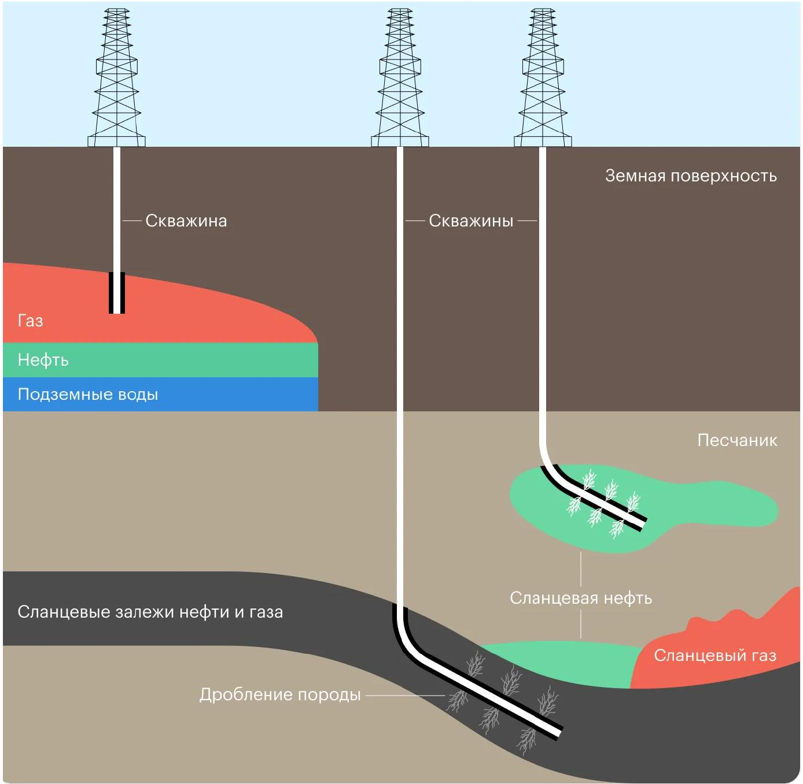
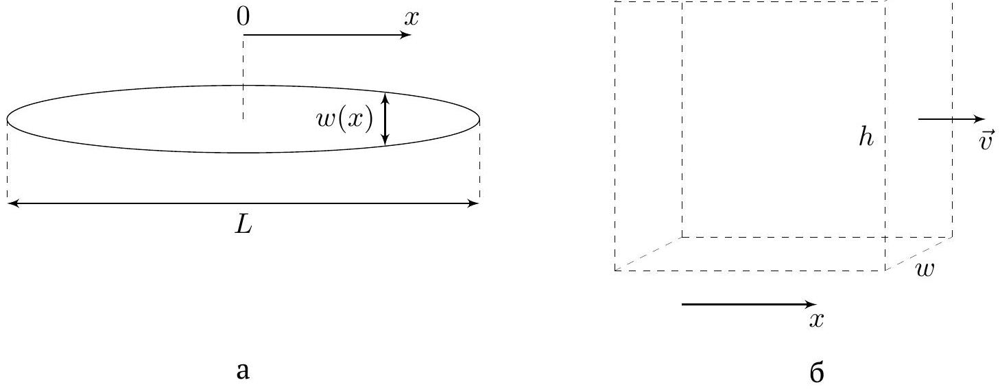
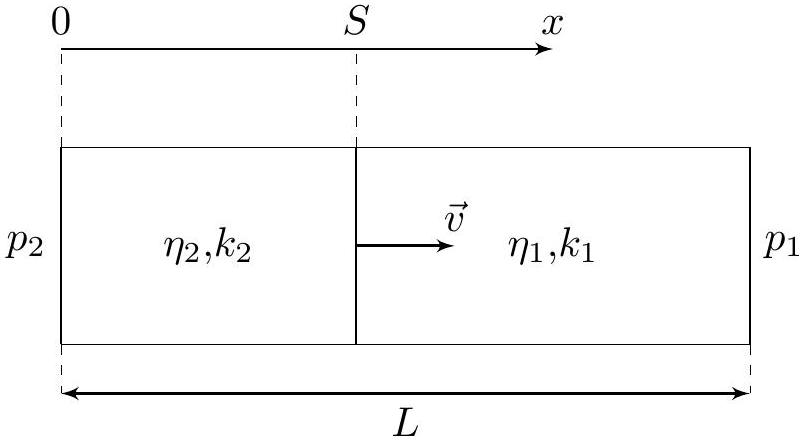
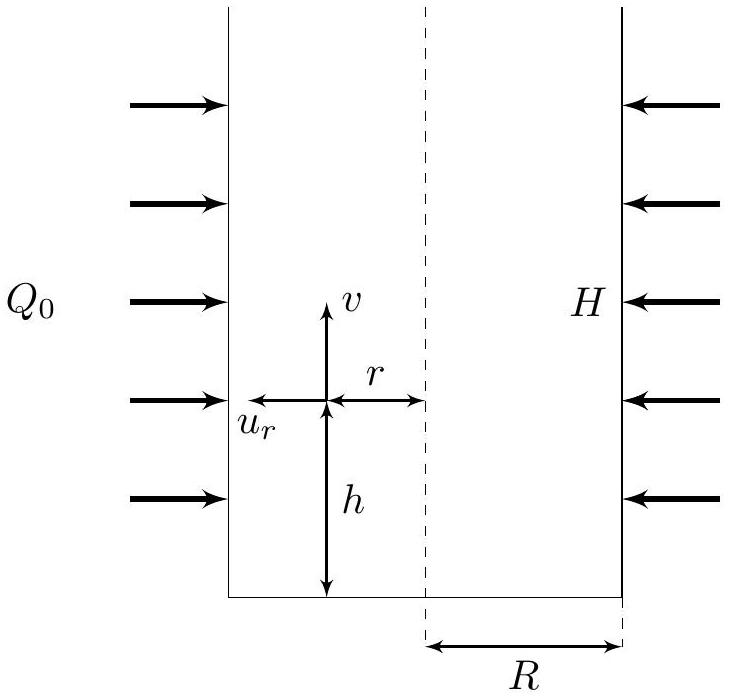

## Road to IPhO

## Добыча нефти

Месторождения нефти представляют собой пласт пористой проводящей жидкость среды, которую сверху перекрывает покрышка плохо проводящей жидкость горной породы. Под проводящей пористой средой должна находиться нефтематеринская порода. В течение длительного (порядка миллионов лет) времени, под действием высоких температур и давлений в практически бескислородной среды, органическое вещество нефтематеринской породы (кероген) распадается на углеводороды. Поры среды заполняются смесью этих углеводородов и воды, которой в среднем всегда больше. Эта смесь называется флюидом. Из-за увеличения удельного объема, а также из-за уплотнения горной породы с течением времени под силой тяжести, в поровой жидкости, флюиде, начинает увеличиваться давление. Это приводит к движению флюида. Непроводящая глинистая покрышка является естественной преградой для флюида. За миллионы лет он накапливается у поверхности раздела в «ловушках» - неровностях горной породы (см. рис.).

Схематичное изображение месторождения нефти

Считайте известными следующие численные данные:

- Плотность нефти $\rho=800 \mathrm{кг} / \mathrm{м}^{3}$;
- Атмосферное давление $p_{0}=1$ атм $=10^{5} П а$;
- Ускорение свободного падения $g=10 \mathrm{~m} / \mathrm{c}^{2}$. Во всех частях задачи, кроме А, полностью им пренебрегайте.

## Road to IPhO

Часть А. Оценка запасов нефти (1.5 балла)
Как было указано в предисловии, весь нефтяной флюид расположен в порах среды. Важной характеристикой среды является пористость - величина

$$
\varphi=\frac{V_{\text {пор }}}{V_{\mathrm{cp}}},
$$

где $V_{\text {пор }}$ - объём, занимаемый порами в выделенном объёме среды $V_{\text {ср }}$.
А1 Пусть залежь нефти представляет собой участок древних речных отложений песчаника в форме параллелепипеда высотой $h=10$ м, шириной $b=100$ м и длинной $L=2000$ м. Пористость породы $\varphi=0.1$. Оцените запасы нефти $m_{\mathrm{H}}$ в данном месторождении. Выразите ответ через $L, b, h, \rho$ и $\varphi$, а также приведите его численное значение в тоннах. Считайте, что нефтяной флюид целиком заполняет объём пор.

Одной из наиболее важных величин в отрасли, связанной с нефтью, является пластовое давление. Пластовым давлением $p_{\text {пл }}$ называют величину давления жидкостей в порах в том случае, когда поры соединены между собой. Данный случай чаще всего и реализуется в реальности.

Пластовое давление обусловлено тем, что флюид в порах сжат относительно нормальных условий. Сжатие флюида характеризуется сжимаемостью вещества $\beta$, которая определяется соотношением:

$$
\beta=-\frac{1}{V} \frac{\mathrm{~d} V}{\mathrm{~d} p},
$$

где $p$ и $V$ - давление и объём вещества, а производная $\mathrm{d} V / \mathrm{d} p$ берётся при постоянном его количестве.
Далее во всех пунктах данной части задачи считайте, что все поры соединены между собой, поэтому распределение давления в них определяется по законам гидростатики.

А2 Пусть пластовое давление нефти на дне залежей составляет $p_{\text {пл }}=250$ атм. Найдите, при какой максимальной глубине залегания $H_{\text {max }}$ месторождение будет фонтанирующим, т.е. нефть будет вытекать на поверхность под действием собственного давления. Выразите ответ через $\rho, g$ и $p_{\text {пл }}$, а также приведите его численное значение. Сжимаемостью нефти можно пренебречь.

Из месторождения можно добыть далеко не всю нефть, а только её часть. Доля извлеченной нефти от общих запасов называется коэффициентом извлечения нефти (КИН) $\alpha$. Как правило он невысок и почти никогда не достигает половины.

A3 Оцените максимально возможный КИН $\alpha_{\max }$ в режиме фонтанирования при пластовом давлении $p_{\text {пл }}=250$ атм, если сжимаемость нефти $\beta=5 \cdot 10^{-10}$ Па. Выразите ответ через $\beta$ и $p_{\text {пл, }}$ а также приведите его численное значение. Считайте, что отложения русла рек изолированы непроницаемыми глинами с малой пористостью. Глубина залежей $H$ может быть выбрана произвольным образом.

A4 При тех же самых данных оцените максимально возможный КИН $\alpha_{\max }$ в режиме фонтанирования, если снизу в пластовых отложениях находится вода объемом $k V_{0}(k=9)$ при начальных запасах нефти $V_{0}$. Сжимаемость воды считайте равной сжимаемости нефти. Выразите ответ через $\beta$ и $p_{п л}$, а также приведите его численное значение. Считайте что забор жидкости происходит сверху, т.е. забирается только нефть. Глубина залежей $H$ может быть выбрана произвольным образом.

## Часть В. Гидроразрыв пласта (3.2 балла)

Распространенный метод повышения отдачи нефти на месторождении заключается в том, что перед добычей в скважину под большим давлением закачивается специальная жидкость - расклинивающий агент. Это приводит к образованию трещины плоской формы порядка 100 м в длину и не более 1 см в ширину. Созданная в нефтесодержащих слоях трещина заметно упрощает приток нефти в скважину при том же давлении, что существенно ускоряет добычу и уменьшает затраты. Этот метод называется гидроразрывом пласта.

При описании трещины воспользуемся следующей моделью:

- Трещина состоит из двух одинаковых симметричных половин, лежащих в одной вертикальной плоскости (рис. а);
- Скорость жидкости, текущей в трещине, считайте направленной горизонтально вдоль трещины (рис. б);

## Road to IPhO

- Скорость элементов жидкости, лежащих на одной вертикали, совпадают;
- Поток $Q=6 \mathrm{~m}^{3} /$ мин расклинивающей жидкости делится поровну между половинами рассматриваемой трещины, поступает в них при $x=0$ и остаётся постоянным во всех сечениях $w h$ (рис. б);
- Высота $h=10$ м рассматриваемой трещины одинакова в любой её точке;
- Ширина трещины $w$ (рис. а) зависит от избыточного по сравнению с горным давления $p^{\prime}=p-\sigma_{0}$, где $\sigma_{0}=$ const, по закону
$$
w=\frac{p^{\prime} h}{E},
$$
где $E=10^{10}$ Па - модуль плоской деформации;
- Вязкость расклинивающей жидкости равна $\eta=1.00$ Па ⋅ с .

На (рис. а) показан вид сверху на трещину, а на (рис. б) приведено поперечное сечение трещины $w h$, лежащее в вертикальной плоскости и перпендикулярное оси $x$. через которое течёт жидкость.

В пунктах В1 и В2 рассматривается половина трещины, соответствующая $x>0$, в которой скорость расклинивающей жидкости направлена вдоль оси $x$.

В1 Рассмотрим горизонтальное течение жидкости вдоль оси $x$ между двумя параллельными плоскостями высотой $h$. Расстояние между плоскостями $w \ll h$. Определите объёмный расход (далее во всех пунктах задачи - поток) жидкости $Q$ через поперечное сечение $w h$. Ответ выразите через $\eta, w, h$ и градиент давления $\mathrm{d} p(x) / \mathrm{d} x$.

Поскольку расстояние между плоскостями уменьшается медленно по длине трещины, всегда считайте применимым результат, полученный в пункте В1.

В2 В центре щели создается избыточное давление $\Delta p$. Найдите зависимость избыточного давления $p^{\prime}$ в щели от координаты $x$. Ответ выразите через $\Delta p, Q, E, h, \eta$ и $x$.

B3 Трещина заканчивается в положении, соответствующем равному нулю избыточному давлению. Опреде- 0.2 лите длину трещины $L$. Ответ выразите через $\Delta p, E, h, \eta$ и $Q$.

B4 Определите объем трещины $V$. Ответ выразите через $\Delta p, h, \eta, Q$ и $E$. 0.7

Критическое избыточное давление, выдерживаемое барьерами, составляет $\Delta p=100$ атм.
B5 Рассчитайте максимально возможные значения длины трещины $L_{\max }$ и её объёма $V_{\max }$. 0.3

## Road to IPhO

## Часть С. Время добычи нефти (3.2 балла)

Пусть по краям нефтяного месторождения пробурено по скважине, каждая из которых создает трещину. Трещины параллельны боковым граням месторождения и полностью их перекрывают. Нагнетающая скважина создает повышенное давление, а добывающая - пониженное давление.

Распространение жидкости в пласте описывается законом Дарси

$$
\vec{v}=-\frac{k \nabla p}{\eta},
$$

где $\vec{v}$ - скорость течения жидкости, $\eta$ - вязкость жидкости, а $k$ - величина, называющаяся проницаемостью пласта для данной жидкости. В рамках данной задачи движение является одномерным, поэтому величину $\nabla p$ можно записать следующим образом:

$$
\nabla p=\vec{e}_{x} \frac{\mathrm{~d} p}{\mathrm{~d} x} .
$$

Рассмотрим следующую модель течения жидкости:

- Жидкости можно считать несжимаемыми;
- Жидкости текут по трубе постоянного сечения не перемешиваясь друг с другом;
- При течении жидкостей область их контакта (далее - фронт) всегда сохраняет плоскую форму, перпендикулярную направлению скорости жидкостей;
- Нагнетающая жидкость с проницаемостью $k_{2}$ и вязкостью $\eta_{2}=1 \cdot 10^{-3} П а \cdot c$ поступает в трубку при давлении $p_{2}=350$ атм, а вытекающая жидкость с проницаемостью $k_{1}$ и вязкостью $\eta_{1}=5 \cdot 10^{-2} П а \cdot c$ вытекает из трубки при давлении $p_{1}=100$ атм;
- Длина трубки равна $L=2$ км, а величина $S$ обозначает координату $x$ фронта;
- В начальный момент времени жидкость 1 полностью заполняет трубку, так что $S(0)=0$;
- Считайте, что в каждой из жидкостей давление меняется вдоль пласта линейно.

C1 Определите скорость $v$ движения границы жидкостей при перемещении фронта на величину $S$. Ответ выразите через $p_{1}, p_{2}, L, \eta_{1}, \eta_{2}, k_{1}$ и $k_{2}$.

В пунктах С2 и C3 считайте, что $k_{1}=k_{2}=k=5 \cdot 10^{-12} \mathrm{м}^{2}$.
C2 Определите зависимость перемещения $S$ фронта от времени $t$. Ответ выразите через $p_{1}, p_{2}, L, \eta_{1}, \eta_{2}, k$ и $t$ 0.9

C3 Определите полное время $\tau$ вытеснения нефти из месторождения. Выразите ответ через $p_{1}, p_{2}, L, \eta_{1}, \eta_{2}$ и $k$ и рассчитайте его.

С4 При каком условии на параметры системы движение границы будет устойчивым, то есть при малом отклонении формы границы от плоской это отклонение не будет возрастать? Запишите условие устойчивости через $\eta_{1}, \eta_{2}, k_{1}$ и $k_{2}$.
Устойчиво ли течение жидкости, рассмотренное в пунктах С2 и С3?

## Road to IPhO

Часть D. Течение нефти в забое скважины (2.1 балла)
Забой скважины - цилиндрический участок скважины с проницаемыми стенками, через который может проникать нефть. В рамках данной части задачи вам предлагается изучить распределение поля скоростей жидкости внутри данного цилиндра.

Для начала рассмотрим классическое течение жидкости с вязкостью $\eta$ в трубе длиной $L$ радиусом $R$, к концам которой приложена разность давлений $\Delta p$. В пунктах D1 и D2 боковая поверхность цилиндра непроницаема, т.е жидкость через стенки не выходит, а движение каждого её элемента является одномерным.

D1 Найдите зависимость скорости течения жидкости в такой трубе от расстояния до оси трубы $v(r)$, макси- мальное значение скорости $v_{\max }$ и полный поток $Q$ жидкости через сечение цилиндра. Ответы выразите через $\Delta p, \eta, L, R$ и $r$.

D2 Выразите распределение скорости течения жидкости $v(r)$ через полный поток $Q, R$ и $r$.

Далее перейдём непосредственно к анализу течения жидкости в забое скважины. Он представляет собой цилиндр радиусом $R$ и высотой $H$, через стенки которого поступает полный поток нефти $Q_{0}$.

При решении задачи используйте следующие модель и обозначения:

- Величина $h$ является расстоянием, отсчитываемым от нижнего края забоя;
- Жидкость поступает в забой равномерно по всей площади боковой поверхности цилиндра, а её поток через нижний края забоя равен нулю;
- Величина $u_{r}$ обозначает радиальную компоненту скорости течения жидкости, направленную от оси цилиндра;
- Несмотря на наличие радиальной компоненты скорости течения жидкости, она является малой, поэтому при нахождении распределения осевой компоненты скорости $v$ течения жидкости используйте результаты, полученные в пунктах D1 и D2.

D3 Найдите поток $Q$ в сечении забоя на расстоянии $h$ от его нижнего края и соответствующее выражение для вертикальной скорости $v(r, h)$ в зависимости от расстояния до оси $r$ и высоты $h$. Ответы выразите через $Q_{0}, H, R, r$ и $h$.

D4 Рассмотрим кольцо высотой $\mathrm{d} h$ с внутренним и внешним радиусами $r$ и $r+\mathrm{d} r$ соответственно. Используя тот факт, что жидкость несжимаема, покажите, что из условия постоянства объёма жидкости внутри выделенного кольца следует соотношение:

$$
\frac{\partial v}{\partial h}=-\frac{1}{r} \frac{\partial\left(u_{r} r\right)}{\partial r} .
$$

Вы можете использовать это соотношение, даже если не смогли его доказать.

D5 Найдите радиальную скорость течения жидкости $u_{r}(r, h)$ в зависимости от расстояния до оси $r$ и высоты $h$, а также максимальную величину её модуля $u_{r(\text { max })}$. Ответы выразите через $Q_{0}, R, H, h$ и $r$.

D6 Чему равно отношение $u_{r(\max )} / v_{\max }$ ? Ответ выразите через $R$ и $H$. 0.1
