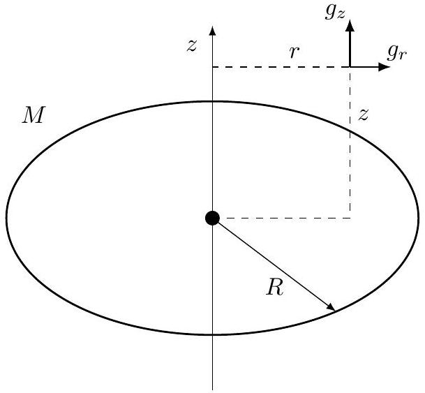

## Road to IPhO

## Прецессия орбиты Меркурия

Задача о движении планеты в гравитационном поле Солнца - одна из старейших и наиболее известных в механике. В первом приближении можно считать планеты точечными и не учитывать взаимодействие между ними. В таком случае движение описывается законами Кеплера, которые выполняются с хорошей точностью. Однако на самом деле планеты взаимодействуют друг с другом. За большой промежуток времени эффекты взаимодействия накапливаются, что приводит к изменению параметров орбиты. Эти изменения действительно наблюдаются при точных астрономических измерениях и с хорошей точностью описываются классической механикой. В этой задаче исследуется изменение орбиты Меркурия под действием других планет.

Меркурий движется по эллиптической орбите с большой полуосью $a$ и эксцентриситетом $e$. Эксцентриситет достаточно мал, поэтому орбита близка к круговой радиуса $a$. Изменения параметров орбиты происходит крайне медленно, поэтому при учете влияния другой планеты можно произвести усреднение по ее положению в пространстве. Также, если не оговорено обратного, будем рассматривать воздействие только одной планеты. Считая орбиту планеты круговой радиуса $R$, заменим планету на неподвижное кольцо радиуса $R$, по которому равномерно распределена масса планеты $M$. Таким образом, нужно решить задачу о движении Меркурия в гравитационном поле Солнца и кольца радиуса $R$.

Используйте следующие предположения и определения:

- Радиус орбиты планеты много больше радиуса орбиты Меркурия $R \gg a$.
- Движение Меркурия и всех остальных планет происходит в одной и той же плоскости. Ось $z$ направлена перпендикулярно плоскости движения.
- Масса Солнца много больше масс всех планет, поэтому его можно считать неподвижным и поместить в начало координат.
- Гравитационное поле в заданной точке пространства характеризуется ускорением свободного падения $\vec{g}$ - ускорением бесконечно малого тела, помещенного в данную точку.
- Перигелий орбиты Меркурия - точка орбиты, расположенная ближе всего к Солнцу.

При решении задачи используйте следующие обозначения и численные значения:

- $G=6.67 \cdot 10^{-11} \mathrm{~m}^{3} \cdot \mathrm{~K}^{-1} \cdot \mathrm{c}^{-2}$ - гравитационная постоянная;
- $a=5.79 \cdot 10^{10}$ м - большая полуось орбиты Меркурия;
- $e=0.206$ - эксцентриситет орбиты Меркурия;
- $m$ - масса Меркурия;
- $M_{S}=2.00 \cdot 10^{30}$ кг - масса Солнца;
- $M$ - масса другой планеты;
- $R$ - радиус орбиты другой планеты;
- $\vec{r}$ - радиус-вектор, проведенный от Солнца к Меркурию, $r$ - расстояние от Солнца до Меркурия в данный момент времени;
- $\vec{e}_{r}=\vec{r} / r$ - единичный вектор направления от Солнца к Меркурию.

## Часть А. Параметры модели (1.4 балла)

А1 В этом пункте рассмотрим движение Меркурия без учета других планет. Орбиту считайте круговой. Найдите период его обращения вокруг Солнца $T$ (формулу и численное значение в годах) и величину момента импульса $L$ (только формулу). Выразите ответ через $G, a, M_{S}, m$.

А2 Найдите проекцию ускорения падения $g_{z}$, создаваемого кольцом на его оси симметрии на расстоянии $z \ll R$ от центра. Выразите ответ через $G, M, R, z$.

А3 Найдите радиальную проекцию ускорения свободного падения $g_{r}$, создаваемого кольцом в точке в плоскости кольца на расстоянии $r \ll R$ от его центра. Используйте теорему Гаусса для гравитационного поля. Запишите ответ с точностью до слагаемых порядка $r$. Выразите ответ через $G, M, R, r$. Положительным считается направление от оси кольца.

## Road to IPhO

Кольцо, моделирующее планету

А4 Найдите потенциальную энергию $V(r)$ Меркурия, если он находится на расстоянии $r$ от Солнца. Вырази- те ответ через $r, R, G, M_{S}, M, m$. Потенциальная энергия взаимодействия с кольцом равна нулю, когда Меркурий находится в его центре, а потенциальная энергия взаимодействия с Солнцем - когда Меркурий находится на бесконечности.

## Часть В. Уравнения движения (1.4 балла)

Для определения формы орбиты удобно использовать переменную $u=1 / r$ и исследовать ее зависимость от полярного угла $\theta$. Пусть радиальная сила, действующая на Меркурий со стороны Солнца и кольца равна $F_{r}$ и ей отвечает потенциальная энергия $V(r)$.

B1 Пусть момент импульса Меркурия равен $L$. Выразите производную расстояния до Солнца по времени $\dot{r}=\mathrm{d} r / \mathrm{d} t$ через производную $u$ по углу $u^{\prime}=\mathrm{d} u / \mathrm{d} \theta$, а также через $L, u, m$.

B2 Запишите выражение для полной механической энергии Меркурия. Выразите ответ через $u, u^{\prime}, m, L, V(r)$. 0.4

B3 Продифференцировав закон сохранения (например по углу), получите выражение для $u^{\prime \prime}(\theta)$. Выразите ответ через $u, G, m, M_{S}, M, R, L$.

## Часть С. Прецессия орбиты, близкой к круговой (3.4 балла)

Будем считать, что орбита близка к круговой, $u=u_{0}+\delta u$, где $\delta u \ll u_{0}$, а $u_{0}=1 / a$ ( $a$ - радиус круговой орбиты). Считайте, что момент импульса равен моменту импульса тела на круговой орбите радиуса $a$.

C1 Используя уравнение из $B 3$, получите уравнение, из которого можно найти радиус круговой орбиты $a$ (ре- шать его не нужно). В уравнение могут входить $m, M_{s}, M, R, G, L, a$.

С2 Получите линеаризованное уравнение движения для отклонения $\delta u$ формы орбиты от круговой, то есть выражение для $\delta u^{\prime \prime}$ в первом порядке по $\delta u$. В ответ могут входить величины, использованные в С1.

C3 Пренебрежем слагаемыми, описывающими поле кольца. Запишите в таком приближении решение для $\delta u(\theta)$. Считайте, что $\theta=0$ отвечает максимальному значению $u$. Выразите ответ через радиус круговой орбиты $a$ и эксцентриситет $e \ll 1$. Покажите, что решение описывает замкнутую орбиту.

C4 Найдите решение уравнения для $\delta u(\theta)$ из C2 с теми же начальными условиями, что и в C3. Теперь учиты- вайте вклад кольца. Выразите ответ через радиус орбиты $a$, ее эксцентриситет $e \ll 1$ и $M, M_{S}, R$. Значение момента импульса равно найденному в A1.

## Road to IPhO

С5 Из найденного решения следует, что за один оборот орбиты положение перигелия Меркурия меняется на некоторую величину $\delta \theta$. Получите точное выражение для $\delta \theta$, следующее из решения в C4, а также приближенное выражение для $\delta \theta$ в первом порядке по $M$. Укажите направление смещения перигелия (по направлению вращения Меркурия или против). Выразите ответ через $M, M_{S}, R, a$.
C6 В таблице указаны радиусы орбит (считаем их приближенно равным большим полуосям) и массы для планет Солнечной системы. Для каждой из них вычислите сдвиг перигелия Меркурия за один оборот вокруг Солнца. Во всех случаях можете считать, что радиус орбиты планеты много больше радиуса орбиты Меркурия. Выразите ответ в угловых секундах. Укажите две планеты, дающие наибольший вклад в прецессию.
Примечание: Угловая секунда - единица измерения углов, которая составляет 1/3600 градуса.

| Планета | $M, 10^{24}$ кг | $R, 10^{11}{ }_{\mathrm{M}}$ |
| :--- | :--- | :--- |
| Венера | 4.9 | 1.08 |
| Земля | 6.0 | 1.50 |
| Mapc | 0.64 | 2.28 |
| Юпитер | 1900 | 7.78 |
| Сатурн | 568 | 14.3 |
| Уран | 87 | 28.7 |
| Нептун | 102 | 45.0 |

C7 Найдите угол, на который перигелий Меркурия смещается за одно столетие, с учетом вкладов всех планет, приведенных в таблице. Выразите ответ в угловых секундах.

## Часть D. Прецессия произвольной орбиты (3.8 балла)

В этой части не будем считать эксцентриситет орбиты Меркурия малым. Изучим прецессию орбиты под действием одной планеты, которую как и раньше заменим на кольцо массы $M$ и радиуса $R$. Решить уравнение на зависимость $u(\theta)$ аналитически не получится. Однако можно все еще найти изменение положения перигелия, рассмотрев вектор Лапласа-Рунге-Ленца (далее - вектор Лапласа)

$$
\vec{A}=\vec{v} \cdot \vec{L}-G m M_{S} \vec{e}_{r} .
$$

Здесь $\vec{v}$ - скорость Меркурия, $\vec{L}$ - его момент импульса. Этот вектор замечателен тем, что в случае движения в поле Солнца (без учета других планет), он остается постоянным. Модуль вектора Лапласа равен

$$
A=G m M_{S} e,
$$

где $e$ - эксцентриситет орбиты, вектор направлен от Солнца к перигелию Меркурия.
Если учесть влияние поля кольца, вектор Лапласа будет меняться, но скорость изменения будет мала. Найдя изменение вектора Лапласа за период, можно найти соответствующее изменение направления на перигелий. При вычислениях в координатах направьте ось $x$ от Солнца к перигелию Меркурия, ось $y$ перпендикулярно ей в плоскости орбиты Меркурия.

Производная по времени единичного вектора $\vec{e}_{r}$ при движении частицы с угловой скоростью $\vec{\omega}$ равна:

$$
\frac{\mathrm{d}}{\mathrm{~d} t} \vec{e}_{r}=\vec{\omega} \cdot \vec{e}_{r}
$$

## Road to IPhO

D1 Пусть Меркурий движется в центральном поле, действующая на него сила равна $\vec{F}=F_{r} \vec{e}_{r}$. Покажите, что производная равна
$$
\frac{\mathrm{d}}{\mathrm{~d} t}(\vec{v} \cdot \vec{L})=B \frac{\mathrm{~d}}{\mathrm{~d} t} \vec{e}_{r}
$$
Найдите коэффициент $B$, выразите его через $r, m, F_{r}$.
D2 Найдите производную по времени вектора Лапласа для Меркурия, который движется в поле Солнца и кольца. Выразите ответ через $m, M, R, r, G, \frac{\mathrm{~d} \vec{e}_{r}}{\mathrm{~d} t}$.
D3 Пусть $\theta$ - полярный угол между радиус-вектором Меркурия $\vec{r}$ и направлением оси $x$. Угол $\theta$ возрастает при движении Меркурия. Вычислите производные компонент вектора Лапласа по $\theta, A_{x}^{\prime}$ и $A_{y}^{\prime}$. Выразите ответ через $m, M, R, r, G, \theta$.

Вам может потребоваться один из следующих интегралов:

$$
\begin{array}{r}
\int_{0}^{2 \pi} \frac{\cos \theta}{1+e \cos \theta} \mathrm{~d} \theta=-\frac{2 \pi}{e}\left(\frac{1}{\sqrt{1-e^{2}}}-1\right) ; \quad \int_{0}^{2 \pi} \frac{\cos \theta}{(1+e \cos \theta)^{2}} \mathrm{~d} \theta=-\frac{2 \pi e}{\left(1-e^{2}\right)^{3 / 2}} \\
\int_{0}^{2 \pi} \frac{\cos \theta}{(1+e \cos \theta)^{3}} \mathrm{~d} \theta=-\frac{3 \pi e}{\left(1-e^{2}\right)^{5 / 2}} ; \quad \int_{0}^{2 \pi} \frac{\cos \theta}{(1+e \cos \theta)^{4}} \mathrm{~d} \theta=-\frac{\pi e\left(4+e^{2}\right)}{\left(1-e^{2}\right)^{7 / 2}}
\end{array}
$$

D4 Найдите изменение вектора Лапласа $\Delta \vec{A}$ за период. Укажите проекции этого изменения на оси, указанные в предыдущем пункте. При вычислении считайте, что Меркурий движется по эллиптической орбите. Выразите ответ через большую полуось орбиты $a$, эксцентриситет $e, G, m, M, M_{S}$.
D5 Найдите поворот направления на перигелий Меркурия за период $\Delta \theta$. Выразите ответ через $G, M_{S}, M, R$, $a$, $e$. На сколько процентов изменится результат пункта C7 для смещения перигелия за счет учета эксцентриситета орбиты Меркурия?
