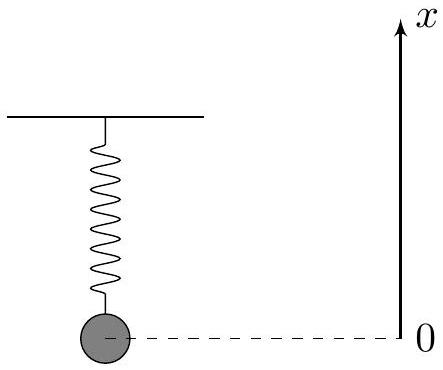
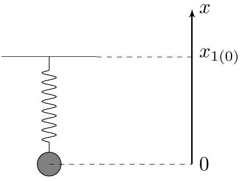
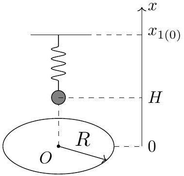
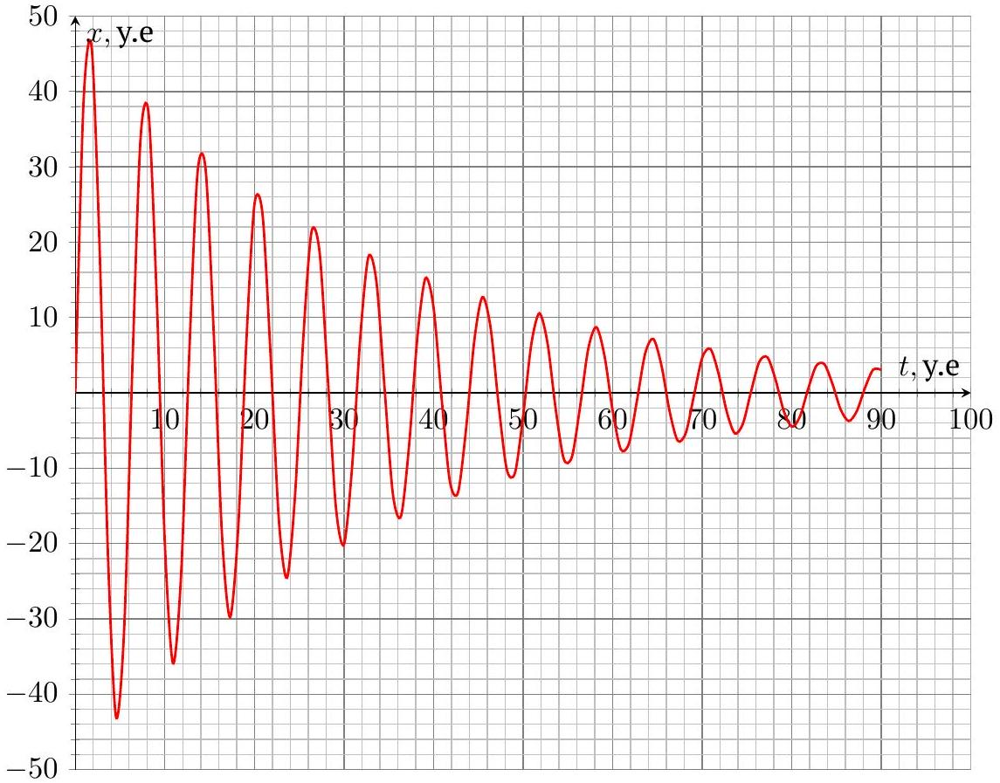
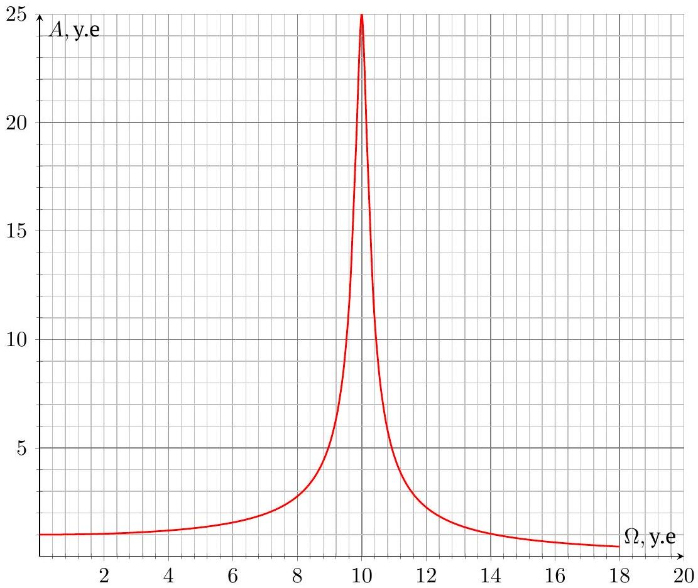
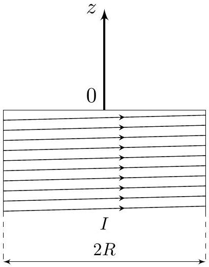

## Road to IPhO

## Проводники в магнитном поле

Если проводник находится в переменном магнитном поле, либо движется в неоднородном магнитном поле - в нём возникает электрический ток. Возникновение электрического тока в проводниках является следствием явления электромагнитной индукции и достаточно хорошо изучено. В частности, эффект возникновения электрического тока в проводниках приводит к эффекту так называемого «магнитного торможения», который многим из вас наверняка приходилось наблюдать вживую. В данной задаче изучаются колебания проводящих тел с учётом влияния магнитного поля. Мы изучим два предельных перехода, соответствующие проводящим телам:

1. Удельное сопротивление $\rho$ проводника настолько велико, что явлением самоиндукции можно пренебречь при определении токов Фуко, возникающих в проводнике. Данному предельному переходу посвящены части $A, B$ и $C$ данной задачи.
2. Удельное сопротивление $\rho$ проводника настолько мало, что его можно принять равным нулю, а силовые линии индукции магнитного поля можно считать «вмороженными» в проводящее тело. Данному предельному переходу посвящена часть $D$ данной задачи, в описании которой эффект вмороженности силовых линий индукции магнитного поля в проводник будет описан детально.

## Часть А. Свободные колебания с затуханием (1.2 балла)

Рассмотрим вертикальный пружинный маятник, состоящий из невесомой пружины с коэффициентом жёсткости $k$, один конец которой закреплён, а к другому концу прикреплён груз массой $m$. При движении со скоростью $\vec{v}$ на него действует сила сопротивления $\vec{F}_{\mathrm{c}}=-\beta \vec{v}$, где $\beta$ - известная постоянная величина.

Введём ось $x$, направленную вдоль пружины так, что при увеличении координаты $x$ груза длина пружины уменьшается, а в положении равновесия координата груза $x_{0}=0$. Во всех пунктах частей A-C шар перемещается только по вертикали.

Также введём обозначения:

$$
\gamma=\frac{\beta}{2 m} \quad \omega_{0}=\sqrt{\frac{k}{m}} \quad \gamma<\omega_{0} .
$$

А1 Пусть момент времени $t_{0}=0$ груз находится в начале координат, а проекция его скорости на ось $x$ равна $v_{0}$. Определите зависимости координаты $x(t)$ и скорости $v_{x}(t)$ груза от времени $t$. Ответ выразите через $v_{0}$, $\gamma, \omega_{0}$ и $t$.

Пусть $E_{0}$ - кинетическая энергия груза при прохождении начала координат, а $E_{1}$ - кинетическая энергия груза при последующем прохождении начала координат с тем же направлением скорости. Определим добротность $Q$ колебательной системы следующим образом:

$$
Q=\frac{2 \pi E_{0}}{E_{0}-E_{1}} .
$$

А2 Получите точное выражение для $Q$.
Ответ выразите через $\omega_{0}$ и $\gamma$.

## Road to IPhO

Часть В. Вынужденные колебания (1.2 балла)
Рассмотрим пружинный маятник из части А задачи. Координата $x_{1}$ второго конца пружины (к которому не прикреплён груза) изменяется по следующему закону:

$$
x_{1}(t)=x_{1(0)}+A_{0} \sin \Omega t,
$$

где $A_{0}>0$, а $x_{1(0)}$ соответствует состоянию покоя груза.
Далее рассматривайте только установившийся режим движения под

действием вынуждающей силы. Используйте введённые ранее величины $\omega_{0}$ и $\gamma$.

B1 Отклонение $x$ груза от положения зависит от времени $t$ следующим образом:

$$
x(t)=A \sin \left(\Omega t+\varphi_{0}\right) .
$$

Найдите $A$ и $\varphi_{0}$. Ответы выразите через $A_{0}, \Omega, \omega_{0}$ и $\gamma$.
Будем называть резонансной такую циклическую частоту колебаний $\Omega_{\text {рез }}$, при которой амплитуда колебаний системы максимальна и обозначается как $A_{\text {рез }}$.

B2 Получите точные выражения для резонансной циклической частоты $\Omega_{\text {рез }}$ и соответствующей ей амплитуды колебаний $A_{\text {рез }}$. Ответы выразите через $\omega_{0}, \gamma$ и $A_{0}$. Считайте, что $\gamma \sqrt{2}<\omega_{0}$.

Шириной резонансной кривой $\Delta \omega$ называется разность максимальной и минимальной циклических частот $\Omega_{\max }$ и $\Omega_{\min }$ соответственно, при которых амплитуда колебаний меньше резонансной в $\sqrt{2}$ раз.

B3 Получите приближённые выражения для $\Omega_{\text {рез }}, A_{\text {рез }}$ и $\Delta \omega$ при слабом затухании $\left(\gamma \ll \omega_{0}\right)$. Ответы выразите через $A_{0}, \omega_{0}$ и $\gamma$.

## Часть С. Влияние поля кольца на движение шара (4.2 балла)

Сплошной однородный шар массой $m$ и радиусом $R_{0}$ изготовлен из материала с большим удельным сопротивлением $\rho$. Его центр может перемещаться вдоль оси вращения кольца радиусом $R$, плоскость которого горизонтальна.

Силу тока в кольце медленно увеличивают до $I$ и далее поддерживают постоянной. Для определения положения центра шара введём ось $x$ с началом в центре кольца, направленную вверх. Считайте, что диэлектрическая и магнитная проницаемости шара $\varepsilon$ и $\mu$ соответственно равны единице, а радиус шара $R_{0}$ удовлетворяет условиям:

$$
R_{0} \ll R, x .
$$

Из общефизических соображений ясно, что при движении шара со скоростью $\vec{v}$ вдоль оси вращения кольца действующая на него со стороны кольца сила имеет вид:

$$
\vec{F}=-\beta(x) \vec{v},
$$

где $\beta(x)$ - коэффициент пропорциональности, зависящий от координаты $x$ центра шара.
Начнём с изучения магнитного поля кольца.
C1 Найдите индукцию $B_{x}$ магнитного поля кольца на его оси в точке с координатой $x$. Ответ выразите через $x, R, I$ и магнитную постоянную $\mu_{0}$.

Рассмотрим исходный шар радиусом $R_{0}$ с удельным сопротивлением $\rho$, находящийся в однородном магнитном поле $\vec{B}=\vec{e}_{x} B$. Не изменяя направления, величину магнитного поля изменяют со скоростью $\mathrm{d} B / \mathrm{d} t=\dot{B}$.

Выделим в шаре диск радиусом $r_{0}$ и толщиной $h \ll r_{0}$, основания которого перпендикулярны оси $x$.
С2 Определите магнитный момент $\vec{m}$ диска. Ответ выразите через $\vec{e}_{x}, r_{0}, h, \rho$ и $\dot{B}$.

C3 Определите магнитный момент $\vec{m}$ шара. Ответ выразите через $\vec{e}_{x}, R_{0}, \rho$ и $\dot{B}$.

## Road to IPhO

Теперь рассмотрим движение шара вдоль оси кольца со скоростью $v_{x}$.
C4 Получите производную по времени индукции магнитного поля кольца в центре шара $\mathrm{d} B_{x} / \mathrm{d} t$, эквивалентную величине $\dot{B}$. Ответ выразите через $v, I, R, x$ и магнитную постоянную $\mu_{0}$.

С5 Найдите коэффициент пропорциональности $\beta(x)$. Ответ выразите через $I, R, x, R_{0}, \rho$ и магнитную постоянную $\mu_{0}$.

Воспользуемся полученным результатом для $\beta(x)$ при определении удельного сопротивления шара по свободным колебаниям, а также по амплитудно-частотной характеристике вынужденных колебаний.

Шар закрепили на одном из концов невесомой непроводящей пружины с коэффициентом жёсткости $k$. Другой конец пружины закреплён в точке с координатой $x_{1(0)}$.

В положении равновесия центр шара расположен на высоте $H \gg R_{0}$ над центром кольца.
Отклонение центра шара $\Delta x$ от положения равновесия всегда удовлетворяет условию:

$$
\Delta x \ll R, H .
$$

На первом графике представлена зависимость отклонения шара от положения равновесия при собственных колебаниях в некоторых условных единицах. Второй конец пружины при этом неподвижен.

На втором графике представлена зависимость амплитуды вынужденных колебаний $A$ от частоты $\Omega$ в некоторых условных единицах. Координата второго конца пружины начинает изменяется по закону:

$$
x_{1}(t)=x_{1(0)}+A_{0} \sin \Omega t .
$$

C6 Определите удельное сопротивление $\rho$ шара, используемого в первом эксперименте. Ответ выразите через $m, k, R_{0}, R, H, I$ и магнитную постоянную $\mu_{0}$.

## Road to IPhO

## Часть D. «Вмороженность» магнитного поля (3.4 балла)

Данная часть задачи посвящена изучению магнитного поля, возникающего в результате перемещения очень хороших проводников в них.

Рассмотрим следующую конструкцию: Соосно полубесконечному круговому соленоиду радиусом $R$ с плотностью намотки витков $n$ и силой тока $I$ в них расположен очень длинный хорошо проводящий цилиндр массой $m$ радиусом $r \ll R$, концы которого расположены по разные стороны от основания соленоида и удалены от него на расстояния, во много раз превышающие его радиус. В изначальном положении цилиндра токи в нём отсутствуют.

Из-за высокой проводимости вещества силовые линии индукции магнитного поля оказываются в него вморожены. Это означает, что при перемещении вещества силовые линии индукции магнитного поля будут перемещаться вместе с ним. В данном случае, соответствующем твёрдому телу, это приводит к тому, что индукция магнитного поля в каждой точке цилиндра будет сохраняться при его перемещении, что обусловлено возникновением в стержне круговых токов Фуко.

Решайте задачу в следующих приближениях:

- Возникающие в цилиндре токи текут только по его поверхности;
- Вне цилиндра индукция магнитного поля равна индукции магнитного поля соленоида;
- Цилиндр отклоняется от изначального положения на величину $x \ll R$;
- Взаимодействием цилиндра с подводящими проводами можно пренебречь;
- За времена, рассматриваемые в данной задаче, затуханием токов в цилиндре можно пренебречь.

Индукцию магнитного поля соленоида будем характеризовать осью $z$, направленную наружу соленоида вдоль его оси. Начало оси $z$ совпадает с центром основания соленоида.

D1 Определите индукцию $B_{z}$ магнитного поля соленоида, а также её производную $\mathrm{d} B_{z} / \mathrm{d} z$ в точке с координатой $z$. Ответ выразите через $\mu_{0}, n, I, R$ и $z$.

Пусть цилиндр отклоняют на величину $x \ll R$ вдоль оси $z$ от изначального положения.
D2 Определите линейную плотность тока $i$ на поверхности цилиндра в точке с координатой $z$. Ответ выразите через $\mu_{0}, x$ и $\mathrm{d} B_{z}(z) / \mathrm{d} z$.

## Road to IPhO

D3 Определите силу $F_{x}$, действующую на цилиндр со стороны магнитного поля соленоида. Ответ выразите 1.5 через $\mu_{0}, r, R, n, I$ и $x$.

Пусть в изначальном положении цилиндру сообщили скорость $v_{0}$, направленную вдоль оси $z$.

| D4 | Получите зависимость перемещения стержня $x$ от времени $t$. Ответ выразите через $\mu_{0}, r, R, n, I$ и $m$. | 0.3 |
| :--- | :--- | :--- |
