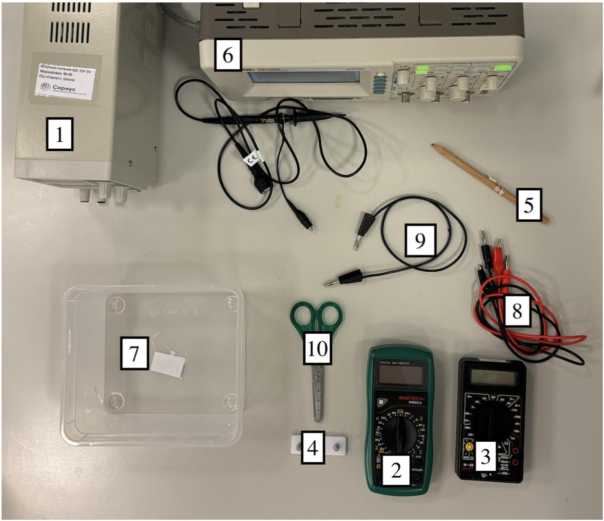
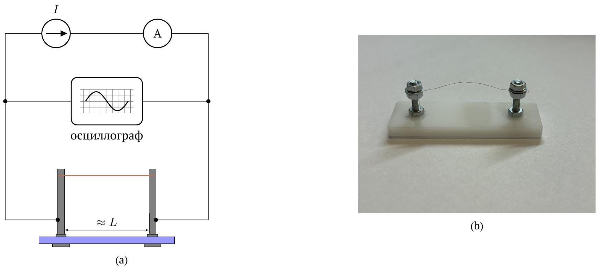
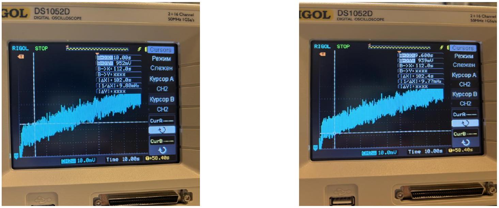
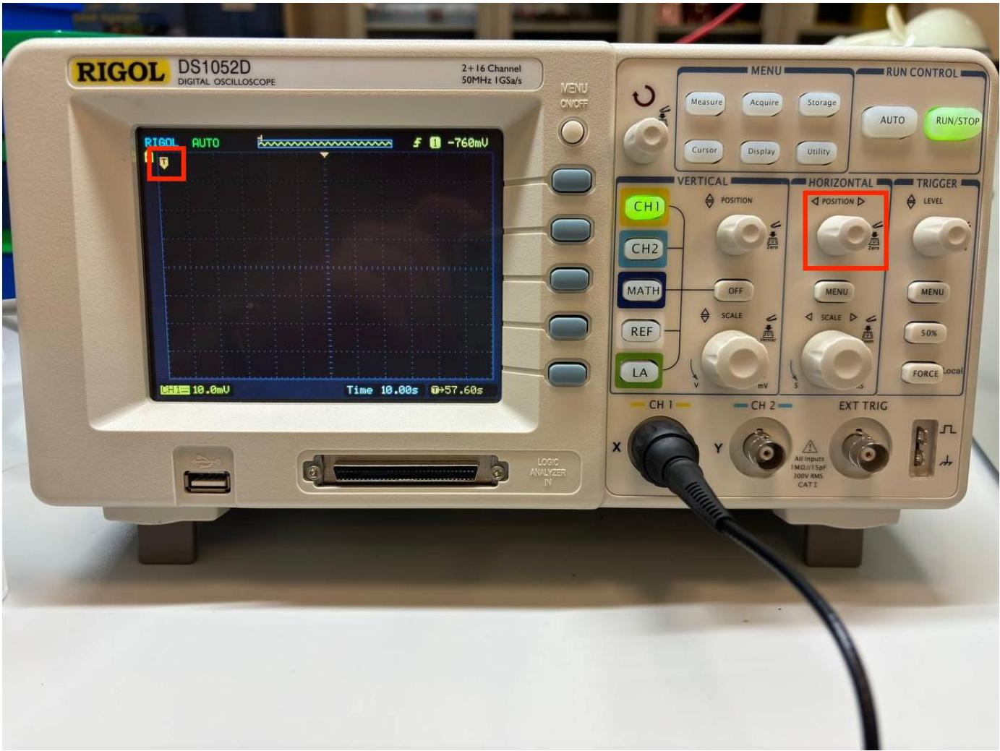
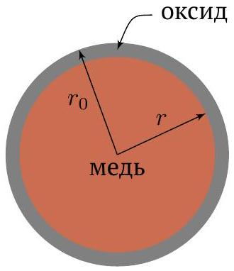

## Road to IPhO   Термическая деградация проволоки

## Введение

Термическое оксидирование - это процесс образования оксидной плёнки на металле при повышенных температурах в присутствии кислорода. В данной задаче будет исследоваться оксидирование на поверхности меди.
Физические постоянные:

- Универсальная газовая постоянная $R=8.31 \frac{\text { Дж }}{\text { моль ⋅ К. }}$.
- Температурный коэффициент сопротивления меди $\alpha=5.80 \cdot 10^{-11} \frac{\mathrm{Om} \cdot \mathrm{m}}{\mathrm{K}}$.
- Молярная масса меди $\mu=63.5 \frac{\Gamma}{\text { моль }}$.

Используемые обозначения в задаче:

- $T$ - температура проволоки в Кельвинах.
- $T_{0}=295 \mathrm{~K}$ - температура окружающей среды.
- Удельное сопротивление меди: $\rho(T)=\alpha T$.
- Мощность теплопотерь в окружающую среду: $P_{\text {out }}=\beta S\left(T-T_{0}\right)$, где $S$ - площадь поверхности проволоки, $T$ - её температура, $\beta$ - коэффициент теплоотдачи.
- $r_{0}=0.05$ мм - радиус выданной проволоки.
- $L$ - длина проволоки.
- $I$ - сила тока через источник.
- $U_{0}$ - напряжение на проволоке при $t=0$.
- $U_{m}$ - установившееся напряжение на проволоке (в части $\mathbf{A}$, когда оксидирование вносит незначительный вклад).
- $\rho_{\mathrm{M}}=8920 \frac{\text { Кг }}{\mathrm{M}^{3}}$ - плотность меди.
- $c_{\mathrm{m}}$ - удельная теплоемкость меди.
- $r$ - радиус проводящей части проволоки.

Примечание. Все температуры в данной задаче выражаются в Кельвинах.
Примечание. Образцы проволоки, которые вы используете для измерений, будут иметь разную длину $L$.
Оборудование:

1. Источник постоянного тока
2. Мультиметр в режиме вольтметра
3. Мультиметр в режиме амперметра*
4. Измерительный стенд
5. Отрезок медной проволоки
6. Осциллограф с осциллографическим проводом
7. Контейнер
8. Четыре провода банан-крокодил
9. Провод банан-банан
10. Ножницы

*Если через амперметр пропустить ток больше, чем предполагает выбранный на нем режим, амперметр может прийти в негодность. НОВЫЕ АМПЕРМЕТРЫ ВЫДАВАТЬСЯ НЕ БУДУТ.

Примечание. Показания на экране источника тока не валидные, то есть их нельзя использовать в качестве экспериментальных данных. Для измерения тока через источник используйте амперметр.

## Road to IPhO

Для измерения зависимости напряжения от времени используйте схему как на рисунке 1а. Проволоку предлагается закреплять как показано на фото 1b.

Рис. 1

Может быть такое, что на осциллографе вы получите зашумленный сигнал. В таком случае в рамках этой задачи везде, где просят снять зависимость напряжения от времени с осциллографа делайте так: снимите два крайних значения в окрестности некоторой точки $U_{+}$и $U_{-}$, и за $U$ примите их среднее значение $U_{\text {avg }}=\left(U_{+}+U_{-}\right) / 2$. Например, на рисунке 2 должна быть получена точка $U=(952+939) / 2=945.5$ мВ при $t=9.8$ c.

## Road to IPhO

Рис. 2

Указание. Поставьте горизонтальный триггер (стрелочка с буквой Т обведенная в красную рамку на фото ниже) в самое левое положение, так сигнал будет быстрее появляться на экране.

ВАЖНО! Если через проволоку течет ток $I>1.5 \mathrm{~A}$, то на её поверхности медь замещается на непроводящий оксид (как в части В). Поэтому если вы значительное время (> 10 с) пропускали через проволоку ток $I>1.5 \mathrm{~A}$, то она уже НЕ БУДЕТ по свойствам эквивалентна новой. Далее, в рамках этой задачи, всюду, где предлагается измерить что-либо с проволокой, подразумевается, что измерения надо проводить на новой проволоке. Разумно рассчитывайте используемые количества проволоки в ваших измерениях, новые отрезки медной проволоки выдаваться НЕ БУДУТ.

## Часть А. Остывание в воздухе (5 баллов)

В данной части задачи исследуется процесс нагрева проволоки на небольших токах (до 1.5 A ), при которых в силу небольшой температуры проволоки оксидирование будет вносить малый вклад. Поэтому в рамках этой части считайте, что у проволоки не меняются геометрические размеры, и можно не менять её между измерениями.

## Road to IPhO

| A1 | Установите ток через источник 1.4 А. Подуйте на проволоку и выберите в листах ответов верный вариант. Объясните почему так произошло. | 0.2 |
| :--- | :--- | :--- |
|  | Далее при всех измерениях накрывайте проволоку контейнером, так чтобы потоки воздуха не повлияли на ваши измерения. Причем проволоку нужно расположить посередине контейнера, чтобы максимально отдалить от щелей под контейнером. |  |
| A2 | Снимите зависимость напряжения на проволоке от времени в диапазоне 0-5 с после подключения к источнику при силе тока через него $I=1.0 \mathrm{~A}$. Укажите характерное время, за которое напряжение на проволоке устанавливается. | 1.0 |
| A3 | Снимите зависимость установившегося напряжения $U_{m}$ через проволоку от силы тока $I<1.5 \mathrm{~A}$ через проволоку. Сделайте не менее 15 измерений. | 0.6 |
| A4 | Теоретически получите зависимость $T(U)$. Ответ выразите через $\alpha, I, L, r_{0}, T, U$. | 0.2 |
| A5 | Запишите уравнение теплового баланса для проволоки. Ответ выразите через $U, I, c_{\mathrm{M}}, L, r_{0}, \rho_{\mathrm{M}}, \beta, T, T_{0}, \frac{\mathrm{~d}}{\mathrm{~d} t}$. | 0.3 |
| A6 | Теоретически свяжите установившееся напряжение $U_{m}$ и силу тока $I$ через проволоку. Ответ запишите через $\alpha, T_{0}, d_{0}, L, \beta, U_{m}, I$. | 0.3 |
| A7 | Постройте график зависимости $U_{m}$ и $I$ в таких осях, в которых он будет линейным. Из графика получите значение коэффициента теплоотдачи $\beta$. | 1.2 |
| A8 | Используя результаты пунктов A4 и A5, получите теоретическую зависимость напряжения на проволоке $U$ от времени $t$. Ответ выразите через $U_{0}, \alpha, \beta, I, r_{0}, L, T_{0}, \rho_{\mathrm{M}}, c_{\mathrm{M}}, U, t$. | 0.6 |
| A9 | Постройте линеаризованный график зависимости $U$ от $t$, измеренной в пункте А2. Из графика определите удельную теплоемкость меди $c_{\mathrm{M}}$. | 0.5 |

А10 Современная теория теплоемкости твердых тел утверждает, что молярная теплоемкость твёрдых тел при- 0.1 мерно равна $3 R$. Оцените удельную теплоемкость $c_{\mathrm{M}}^{\text {th }}$ исходя из этой теории.

Примечание. Если выполнить пункт А7 не удалось, далее используйте значение $\beta=350 \frac{\mathrm{Bт}}{\mathrm{~m}^{2} \cdot \mathrm{~K}}$ и явно укажите это в решении.

Часть В. Термическое оксидирование (7 баллов)
В этой части задачи будет исследоваться оксидирование меди. При нагреве медь замещается на непроводящий оксид, из-за чего сопротивление проволоки увеличивается. Однако тепловые свойства оксида точно такие же как и у меди, а значит эффективная площадь, с которой тепло передаётся возхдуху, не изменяется.

## Road to IPhO

Измерения в части В проводите по следующему алгоритму:

1. Вставьте новую проволоку в измерительный стенд.
2. Выберите и укажите силу тока $I_{n}$ в диапазоне $[2.0 ; 2.6]$ A, при которой будете проводить измерение. $n$ - номер измеряемого образца проволоки.
3. Соберите схему как на рисунке 1. Настройте источник на выбранный в пункте 2 ток $I_{n}$ и настройте осциллограф так, чтобы сигнал, который вы будете измерять в пункте 7, занимал значительную часть дисплея.
4. Снимите проволоку и больше её для измерений не используйте.
5. Вставьте новую проволоку в измерительный стенд.
6. Измерьте сопротивление проволоки при комнатной температуре $R_{n}$, используя токи меньше 100 мА (чтобы проволока не нагревалась).
7. Снимите зависимость напряжения на проволоке от времени в диапазоне 0-300 с или до перегорания проволоки, при силе тока через проволоку $I_{n} \in[2.0 ; 2.6]$ A.
8. Постройте график измеренной зависимости и проведите прямую $U(t)=U_{0}+\gamma\left(I_{n}\right) t$ по начальному линейному участку графика. Рассчитайте численное значение $\gamma\left(I_{n}\right)$.
9. Снимите проволоку и больше её для измерений не используйте.

В1 Проведите измерения, согласно алгоритму выше, для 5 -ти различных значений $I$ из указанного диапазона. 4.0
Характерное время, полученное в пункте А2, мало, поэтому считайте, что проволока в каждый момент времени находится в термодинамическом равновесии, то есть процесс квазистатический.

B2 Выразите длину $L_{n}$ образца проволоки с номером $n$ через $\alpha, T_{0}, r_{0}, R_{n}$. По полученным ранее данным пе- $\mathbf{0 . 1}$ ресчитайте $L_{n}$.

| B3 | Выразите температуру проволоки $T$ через $I, \beta, L, U, r_{0}, T_{0}$. | 0.1 |
| :--- | :--- | :--- |
| B4 | Выразите напряжение на проволоке $U$ через $I, \alpha, L, T(U)$ и радиус проводящей части проволоки $r(t)$. | 0.1 |
| B5 | Используя результаты пунктов B3 и B4, получите теоретическую зависимость $r(t)$. Ответ выразите через $I, L, \alpha, \beta, T_{0}, r_{0}, t, \gamma(I), U_{0}$. | 0.7 |

B6 Разложите полученное $r(t)$ в ряд Тейлора по степеням $t$ до линейного члена: $r(t)=r_{0}-\delta t$. Выразите $\delta$ через $\mathbf{0 . 5}$ $r_{0}, \gamma(I), \alpha, T_{0}, L, I, U_{0}$.

Модель Дила-Гроува - это математическая модель, описывающая рост оксидных слоёв на поверхности нагретого металла. Согласно этой модели:

$$
\frac{\mathrm{d} X_{o}}{\mathrm{~d} t}=B e^{-E_{A} / R T}
$$

где $X_{o}(t)=r_{0}-r(t)$ - толщина оксидного слоя в момент времени $t ; B$ - некая константа; $E_{A}$ - молярная энергии активации (минимальное количество энергии на 1 моль вещества, которое должно быть доступно реагентам для возникновения химической реакции); $T$ - температура проволоки.

Указанное уравнение выполняется до тех пор, пока слой оксида очень тонкий, с толщиной порядка толщины оксидной плёнки на медной проволоке, хранящейся при комнатной температуре.

| B8 Укажите размерность $E_{A}$. | 0.2 |
| :--- | :--- |
| B9 Найдите $E_{A}$. | 1.3 |
