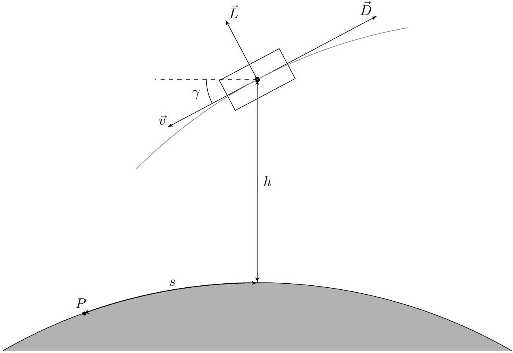

## Road to IPhO Космический корабль в атмосфере

Обычно при исследовании динамики тела в поля тяжести считается, что силы трения отсутствуют и можно пользоваться законом сохранения энергии. Из этого предположения можно получить законы Кеплера, которые с хорошей точностью описывают как поведение планет, так и движение искусственных спутников. Однако на начальном и конечном этапе движения космического корабля он взаимодействует с атмосферой планеты (если она есть), поэтому силы сопротивление воздуха существенно влияют на его траекторию. В этой задаче мы исследуем несколько простых моделей, позволяющих оценить результаты такого влияния. Далее для определенности считаем, что космический корабль движется вблизи Земли.

На космический корабль, движущийся в атмосфере, действует гравитационная сила, направленная к центру Земли, сила сопротивления воздуха $D$, направленная против скорости, и подъемная сила $L$, перпендикулярная скорости. Эти силы задаются выражениями

$$
D=\frac{1}{2} \rho v^{2} S C_{D}, \quad L=\frac{1}{2} \rho v^{2} S C_{L},
$$

где $\rho$ - плотность окружающего воздуха, $S$ - характерная площадь поперечного сечения космического корабля, $v$ - его скорость относительно воздуха, $C_{D} C_{L}$ - безразмерные коэффициенты. Вообще говоря эти коэффициенты сами могут зависеть от скорости космического корабля, но в рамках этой задачи мы будем считать их постоянными. В рамках задачи считайте, что движение корабля происходит в одной фиксированной плоскости, проходящей через центр Земли. Все силы лежат в этой плоскости.

Будем использовать модель атмосферы, в которой зависимость плотности от высоты задается формулой

$$
\rho=\rho_{0} e^{-\beta h},
$$

где $h$ - высота от поверхности Земли, $\rho_{0}$ - плотность воздуха у поверхности Земли, $\beta$ - некоторая постоянная. Воздух атмосферы можно считать неподвижным, влияние ветра учитывать не нужно.

Во всей задаче можно использовать следующие численные данные

- $\rho_{0}=1.225 \mathrm{кг} / \mathrm{M}^{3}$
- $\beta=0.1378 \mathrm{KM}^{-1}$
- Радиус Земли $r_{0}=6354 \mathrm{км}$
- Ускорение свободного падения на поверхности Земли $g_{0}=9.81 \mathrm{~m} / \mathrm{c}^{2}$

В заданный момент времени движение космического корабля характеризуется величиной его скорости $v$, углом $\gamma$, который скорость образует с горизонтальным направлением в точке, где находится космический корабль (он считается положительным, если скорость направлена к поверхности Земли), а также высотой $h$ над поверхностью Земли. Пусть точка $P$ - проекция положения корабля на поверхность Земли в какой-то последующий момент времени. Тогда определим горизонтальное перемещение космического корабля $s$ как расстояние между его начальной и конечной проекцией, измеренные вдоль поверхности Земли (по дуге окружности). Также можно использовать расстояние $r$ от корабля до центра Земли.

## Road to IPhO

Часть А. Уравнения движения (1.2 балла)

А1 Сначала получим точные уравнения, которые описывают динамику космического корабля. Выразите производные по времени от высоты $h$ и дальности $s$ через $v, \gamma, r_{0}, r$.

А2 Найдите производные модуля скорости $v$ и угла $\gamma$. Также в ответ могут входить подъемная сила $L$, сила сопротивления воздуха $D$, ускорение свободного падения на данной высоте $g$, масса космического корабля $m, v, \gamma, r$.

## Часть В. Баллистическое вхождение (2.8 балла)

Полученные уравнения в общем случае нельзя решить аналитически. Для того, чтобы получить качественное представление о параметрах полета, в этой части рассмотрим следующую упрощенную модель. Будем считать, что подъемной силы нет $(L=0)$, а угол $\gamma$ остается постоянным. Тогда нам нужно исследовать только зависимость модуля скорости от высоты. При этом можно считать, что сила сопротивления воздуха много больше составляющей силы тяжести вдоль скорости, поэтому силу тяжести также можно не учитывать.

B1 Получите выражение для производной $d v / d h$. Представьте ответ в виде 0.4

$$
\frac{d v}{d h}=A f(v, h),
$$

где $A$ - постоянная, которая может зависеть от всех постоянных, характеризующих космический корабль и атмосферу $\left(m, S, C_{D}, C_{L}, \rho_{0}, \beta, \gamma\right)$, а $f$ - некоторая функция высоты и скорости. В дальнейшем используйте постоянную $A$ для записи ответов.

В2 Найдите зависимость скорости космического корабля от высоты. На начальной высоте $h_{0}$ скорость была равна $v_{0}$. Выразите ответ через $A, \beta, h, v_{0}, h_{0}$. Также получите приближенный ответ, считая, что на высоте $h_{0}$ плотность атмосферы пренебрежимо мала (в этом случае в ответ не должна входить $h_{0}$ ). Далее везде используйте приближенное выражение.

ВЗ Найдите зависимость ускорения $a$ (то есть производной модуля скорости) космического корабля от высоты. Выразите ответ через $v_{0}, A, \beta, h, \gamma$.

B4 Найдите высоту $h_{c}$, на которой модуль ускорения максимален. Получите формулу для максимального значения модуля ускорения $a_{\text {max }}$ и скорости $v_{\mathrm{c}}$ на высоте $h_{\mathrm{c}}$. Выразите ответы через $A, \beta, \gamma, v_{0}$.

Космический корабль Восток использовался для первого пилотируемого полета в космос. Параметры возвращаемой части этого корабля и его орбиты

- Масса $m=2460$ кг
- Эффективный диаметр $d=2.3$ м
- $C_{D}=2.0$
- $\gamma=3.2^{\circ}$
- $v_{0}=7.74 \mathrm{KM} / \mathrm{c}$
- $h_{0}=122 \mathrm{~km}$

В5 Для приведенных численных данных найдите скорость (в км/с) и ускорение (в единицах $g_{0}$ ) на высотах $h_{1}=80 \mathrm{~km}, h_{2}=60 \mathrm{~km}, h_{3}=40 \mathrm{км}$.

В6 Найдите максимальное ускорение (в единицах $g_{0}$ ) и критическую высоту $h_{c}$, при которой оно достигается. 0.2

## Road to IPhO

## Часть С. Скользящее вхождение (2.2 балла)

В предыдущей части мы получили достаточно большие значение максимального ускорения, которые могут привести к разрушению космического корабля. Это ускорение можно существенно уменьшить, используя корабль с существенной подъемной силой. Для того, чтобы описать поведение такого корабля, можно использовать следующие приближения:

- Угол $\gamma$ мал, $\sin \gamma \approx \gamma, \cos \gamma \approx 1$
- Угол $\gamma$ в процессе движения меняется очень медленно, так что вкладом слагаемых с $\dot{\gamma}$ в уравнениях движения можно пренебречь
- Ускорение свободного падения постоянно и равно ускорению на поверхности Земли $g_{0}$
- Расстояние до центра Земли можно считать равным радиусу Земли $r \approx r_{0}$

C1 Найдите первую космическую скорость $v_{s}$ - скорость движения космического корабля по круговой орбите, 0.1 радиус которой равен радиусу Земли. Выразите ответ через $r_{0}, g_{0}$.

C2 Определите скорость, с которой космический корабль должен двигаться на высоте $h$ при описанном во 0.4 введении к этой части движении. Выразите ответ через $v_{s}, \rho_{0}, \beta, C_{L}, S, m, r_{0}, h$.

C3 Определите ускорение $a$ (производную модуля скорости), создаваемое силой сопротивления воздуха при 0.4 таком движении. Выразите ответ через $v, C_{L}, C_{D}, r_{0}, g_{0}$.

С4 Пусть начальная скорость космического корабля $v_{1}<v_{s}$, конечная скорость $v_{2}<v_{1}$. Найдите горизонтальное перемещение корабля $s$ за время движения. Считайте, что все изменение модуля скорости происходит за счет силы сопротивления воздуха. Выразите ответ через $r_{0}, C_{L}, C_{D}, v_{s}, v_{1}, v_{2}$.

С5 Пусть для космического корабля заданы следующие параметры: 0.6

- $m=84 \cdot 10^{3}$ кг
- $S=250 \mathrm{~m}^{2}$
- $C_{D}=0.8$
- $C_{L}=0.9$

Найдите значения скорости (в км/с) и ускорения за счет сопротивления воздуха (в единицах $g_{0}$ ) на высотах $h_{1}=80 \mathrm{~km}, h_{1}=60 \mathrm{~km}, h_{1}=40 \mathrm{км}$.

C6 В условиях предыдущего пункта рассчитайте дальность горизонтального перемещения космического корабля при опускании с высоты $h_{0}=90$ км до высоты $h_{f}=30$ км.

## Часть D. Торможение в верхних слоях атмосферы (3.8 балла)

Рассмотрим процесс снижения орбиты корабля при движении в верхних слоях атмосферы.
На корабль действует сила сопротивления со стороны разреженного газа $\vec{F}=-\alpha \vec{v}$. При рассматриваемом движении в верхних слоях атмосферы параметр $\alpha$ можно считать примерно постоянным. Сила очень мала, поэтому можно считать, что в процессе одного оборота энергия и момент импульса корабля меняются очень незначительно.

Пусть в момент времени $t$ корабль массы $m$ движется по эллипсу с большой полуосью $a$ и эксцентриситетом $e$. Масса Земли $M$.

D1 Запишите выражения для энергии $E$ и момента импульса $L$. Выразите ответ через $G, m, a, e, M$. 0.4

Примечание: Может быть удобным записать ЗСЭ в точке апоцентра или перицентра.

## Road to IPhO

Приступим к рассмотрению влияния трения на орбиту корабля.
D2 Запишите уравнение моментов и выражение для мощности силы трения $P$. Выразите ответ через $\vec{r}, \vec{v}, \alpha$. 0.2

D3 Получите выражение для зависимости $\vec{L}$ от $t$, если в момент времени $t=0 \quad \vec{L}=\vec{L}_{0}$. Выразите ответ через $\alpha, m, \vec{L}_{0}$.

Для нахождения зависимости энергии корабля $E$ от времени $t$, нужно усреднить мощность силы трения $P$ по периоду обращения корабля. Так как энергия и момент импульса очень слабо меняются за время одного оборота, проведем усреднение квадрата скорости для движения по орбите без учета силы трения. Для этого воспользуемся вектором Лапласа-Рунге-Ленца.

D4 Покажите что:

$$
[\vec{a}, \vec{L}]=\beta \frac{d}{d t} \vec{e}_{i}
$$

Где $\vec{a}$ - ускорение ракеты, $\vec{e}_{i}$ - некоторый единичный вектор полярных координат с началом в центре Земли. Найдите $\vec{e}_{i}$ и $\beta$.
Примечание: Может быть удобным использовать выражение $\vec{L}=m r^{2} \vec{\omega}$.
Проинтегрировав это выражение по времени, можно получить:

$$
[\vec{v}, \vec{L}]=\beta \vec{e}_{i}+\vec{A}
$$

Где $\vec{A}$ - вектор Лапласа-Рунге-Ленца, который остается постоянным для орбит в гравитационном поле. Модуль $\vec{A}$ связан с эксцентриситетом орбиты как $|\vec{A}|=\beta e$.

D5 Домножая выражение (1) на $\vec{r}$ скалярно и используя результаты пункта D4, получите зависимость модуля радиус-вектора $\vec{r}$ от $\varphi$ - угла между векторами $\vec{A}$ и $\vec{e}_{r}$. Выразите ответ через $L, m, G, e, \varphi, M$.

D6 Используя выражение (1) и результаты пункта D4, получите зависимость квадрата скорости $v^{2}$ от $\varphi$. Выразите ответ через $L, G, m, e, \varphi, M$.

D7 Получите выражение для среднего по времени квадрата скорости $\left\langle v^{2}\right\rangle$ в виде интеграла по углу $\varphi$. Выразите ответ через $L, m, e, M, G, a, \varphi$ и $\tau$ - период обращения ракеты.

Примечание: Может быть удобным выразить квадрат средней скорости из усредненного ЗСЭ $(\langle T+U\rangle=\langle E\rangle$, где $T$ - кинетическая энергия, $U$ - потенциальная).

D8 Получите выражение для $\langle\dot{E}\rangle$. Выразите ответ через $G, m, a, e, M$. 1.0

D9 Используя результаты пунктов D1, D3, D8, получите зависимости $a$ и $e$ от $t$, если в момент времени $t=0$ $a=a_{0}, e=e_{0}$.

Рассмотрим движение МКС в верхних слоях атмосферы, которое начиналось на круговой орбите высоты $h_{0}$.

D10 Найдите время снижения орбиты $T$ с высоты $h_{0}=408$ км до высоты $h=400$ км, если параметр $\mathbf{0 . 1}$ $\alpha=7.17 \cdot 10^{-5}$ кг/с, масса $m=420$ т, $r_{0}=6378$ км. Выразите ответ в сутках.
