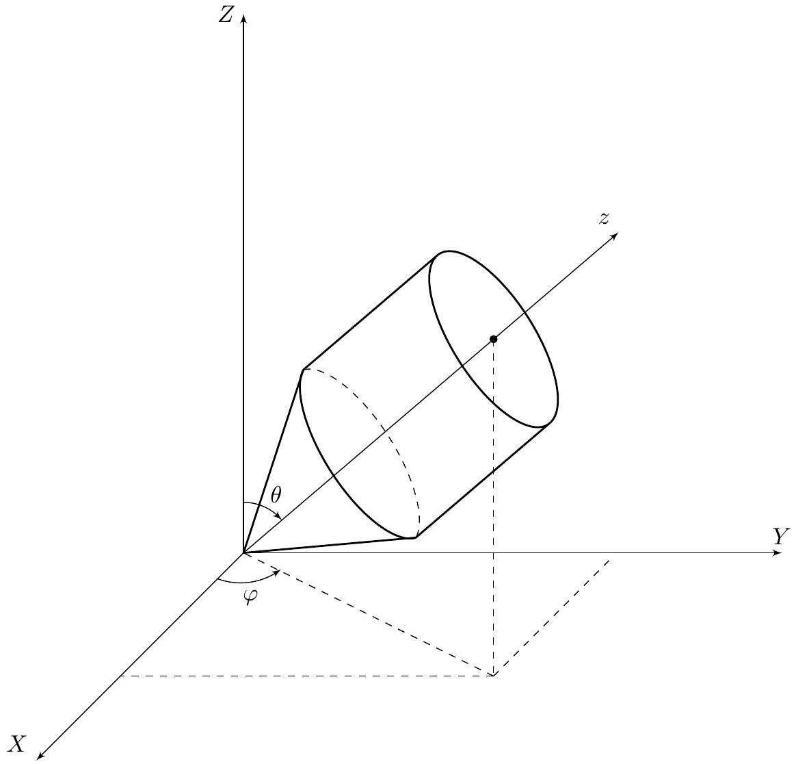

## Road to IPhO

## Не ложися на краю (12 баллов)

Данная задача посвящена исследованию движений симметричных волчков - твёрдых тел, имеющих ось симметрии. В части А будут получены общие уравнения движения твёрдого тела, в последующих частях будут рассмотрены волчки Эйлера (на который не действуют внешние силы) и Лагранжа (движущийся в постоянном гравитационном поле).

Пусть нижняя точка волчка $O$, лежащая на оси симметрии, неподвижна, и волчок может свободно вращаться вокруг точки $O$ во всех направлениях. Масса волчка равна $m$, расстояние от $O$ до центра масс волчка равно $l$. Для описания движения введём неподвижную систему координат $O X Y Z$.

## Часть А. Уравнения Эйлера (2.2 балла)

Из механики известно, что движение произвольного твёрдого тела с неподвижной точкой полностью определяется единственным вектором - угловой скоростью, а значит, момент импульса и кинетическая энергия твёрдого тела однозначно выражаются через его угловую скорость и его геометрические характеристики.

Рассмотрим малый фрагмент твёрдого тела, имеющий массу $d m$ и радиус-вектор $\vec{r}=(X, Y, Z)$ относительно точки $O$ в системе координат $O X Y Z$. Пусть в рассматриваемый момент тело вращается с угловой скоростью $\vec{\Omega}=\left(\Omega_{x}, \Omega_{y}, \Omega_{z}\right)$.

A1 Запишите в векторном виде выражение для мгновенной скорости $\vec{v}$ фрагмента $d m$ в рассматриваемый момент. Ответ выразите через $\vec{\Omega}, \vec{r}$.
А2 Запишите в векторном виде выражение для момента импульса $d \vec{L}$ фрагмента $d m$ в рассматриваемый момент. Ответ выразите через $\vec{\Omega}, \vec{r}, d m$.
A3 Получите выражения для компонент вектора $d \vec{L}=\left(d L_{x}, d L_{y}, d L_{z}\right)$ в системе координат $O X Y Z$. Ответ выразите через $X, Y, Z, \Omega_{x}, \Omega_{y}, \Omega_{z}, d m$.

А4 Для произвольного движения твердого тела можно записать момент импульса в виде 0.5

$$
\begin{aligned}
& L_{x}=I_{x x} \Omega_{x}+I_{x y} \Omega_{y}+I_{x z} \Omega_{z} ; \\
& L_{y}=I_{y x} \Omega_{x}+I_{y y} \Omega_{y}+I_{y z} \Omega_{z} ; \\
& L_{z}=I_{z x} \Omega_{x}+I_{z y} \Omega_{y}+I_{z z} \Omega_{z} .
\end{aligned}
$$

Получите выражения для коэффициентов $I_{x x}, I_{x y}, I_{x z}, I_{y x}, I_{y y}, I_{y z}, I_{z x}, I_{z y}, I_{z z}$ в виде интегралов по $d m$. Интеграл по $d m$ представляет собой сумму по бесконечно малым участкам твердого тела массы $d m$. Например, координаты центра масс можно записать как

$$
X_{c}=\frac{1}{m} \int X d m ; \quad Y_{c}=\frac{1}{m} \int Y d m, \quad Z_{c}=\frac{1}{m} \int Z d m .
$$

В дальнейших пунктах полученные здесь формулы не используются.
Можно показать, что кинетическая энергия твердого тела имеет вид

$$
T=\frac{1}{2} \vec{L} \cdot \vec{\Omega} .
$$

Используем следующий математический факт. Оказывается, для любого твёрдого тела поворотом осей можно добиться того, что $I_{x y}=I_{y z}=I_{z x}=0$. В этом случае выражения для $\vec{L}$ и $T$ сильно упрощаются, а $I_{x x}, I_{y y}, I_{z z}$ называются главными моментами инерции. Для краткости обозначим

$$
I_{x x}=I_{x}, \quad I_{y y}=I_{y}, \quad I_{z z}=I_{z} .
$$

Однако в этом случае возникает другая сложность: оси оказываются связаны с самим телом, и поэтому являются подвижными. Направим ось $O z$ вдоль оси симметрии волчка. Выберем оси $O x, O y$ так, чтобы они вместе с осью $O z$ образовывали правую тройку. Из соображений симметрии очевидно, что в этом случае оси $O x y z$ являются главными для волчка.

## Road to IPhO

Пусть $\vec{e}_{x}, \vec{e}_{y}, \vec{e}_{z}$ - единичные векторы осей $O x y z$. Пусть в некоторый момент волчок вращается с угловой скоростью $\vec{\omega}$, причём в системе координат $O x y z$, связанной с волчком, $\vec{\omega}=\omega_{x} \vec{e}_{x}+\omega_{y} \vec{e}_{y}+\omega_{z} \vec{e}_{z}$.

А5 Получите выражения для $\vec{L}$ и $T$ в главных осях. Ответ выразите через $I_{x}, I_{y}, I_{z}, \omega_{x}, \omega_{y}, \omega_{z}, \vec{e}_{x}, \vec{e}_{y}, \vec{e}_{z}$. 0.5

Для изучения вращений используется основное уравнение вращательного движения:

$$
\dot{\vec{L}}=\vec{M},
$$

где $\vec{L}$ - момент импульса системы относительно выбранной неподвижной точки, $\vec{M}$ - суммарный момент внешних сил относительно этой точки.

Поскольку оси системы координат $O x y z$ вращаются с угловой скоростью $\vec{\omega}$, производные единичных векторов подвижной системы координат имеют вид

$$
\dot{\vec{e}}_{x}=\vec{\omega} \times \vec{e}_{x}, \quad \dot{\vec{e}}_{y}=\vec{\omega} \times \vec{e}_{y}, \quad \dot{\vec{e}}_{z}=\vec{\omega} \times \vec{e}_{z} .
$$

А6 Получите выражения для компонент вектора $\dot{\vec{L}}$ в подвижной системы координат $(\dot{\vec{L}})_{x},(\dot{\vec{L}})_{y},(\dot{\vec{L}})_{z}$. Ответ 0.5 выразите через $I_{x}, I_{y}, I_{z}, \omega_{x}, \omega_{y}, \omega_{z}, \dot{\omega}_{x}, \dot{\omega}_{y}, \dot{\omega}_{z}$.

Из пункта А6 следует, что основное уравнение динамики в подвижных осях $O x y z$ имеет вид

$$
\left\{\begin{array}{l}
I_{x} \dot{\omega}_{x}+\left(I_{z}-I_{y}\right) \omega_{y} \omega_{z}=M_{x} \\
I_{y} \dot{\omega}_{y}+\left(I_{x}-I_{z}\right) \omega_{z} \omega_{x}=M_{y} \\
I_{z} \dot{\omega}_{z}+\left(I_{y}-I_{x}\right) \omega_{x} \omega_{y}=M_{z}
\end{array}\right.
$$

Здесь $M_{x}, M_{y}, M_{z}$ - компоненты внешнего момента $\vec{M}$ в системе координат $O x y z$. Эти уравнения называются динамическими уравнениями Эйлера и являются очень удобным инструментом изучения вращения твёрдого тела.

## Часть В. Уравнения динамики симметричного волчка (2.1 балла)

В дальнейшем нас будет интересовать движение центра масс волчка. Положение волчка в пространстве можно задать двумя углами, аналогичными углам в сферической системе координат. Угол между осью $O Z$ и осью симметрии волчка $O z$ обозначим $\theta$, угол поворота оси симметрии волчка вокруг $O Z-\varphi$. Кроме этого, волчок может поворачиваться вокруг собственной оси симметрии, что не влияет на положение его центра масс. Таким образом, общее движение волчка представляет собой суперпозицию трех вращений:

1. Вращение относительно оси симметрии с некоторой угловой скоростью $\vec{\omega}_{s}$.
2. Вращение, при котором изменяется угол $\theta$, соответствующая угловая скорость $\vec{\omega}_{\theta}$ перпендикулярна осям $O Z$ и $O z$.
3. Вращение, при котором изменяется угол $\varphi$, соответствующая угловая скорость $\vec{\omega}_{\varphi}$ направлена вдоль $O Z$.

Тогда полная угловая скорость волчка - сумма этих трех угловых скоростей

$$
\vec{\omega}=\vec{\omega}_{s}+\vec{\omega}_{\theta}+\vec{\omega}_{\varphi} .
$$

Заметим, что в силу симметрии волчка мы можем выбрать оси $O x$ и $O y$ в плоскости, перпендикулярной оси симметрии волчка произвольным образом. Воспользуемся этим и направим ось $O x$ в заданный момент времени в плоскости $O Z z$, так, чтобы угол $x O Z$ был острым.

B1 Найдите проекции угловой скорости $\omega_{x}, \omega_{y}, \omega_{z}$. Выразите ответ через $\omega_{s}, \dot{\theta}, \dot{\varphi}, \theta$. 0.4

Рассмотрим уравнения динамики волчка в случае, когда он движется под действием силы тяжести. Пусть ускорение свободного падения равно $g$ и направлено против оси $O Z$.

В силу симметрии для рассматриваемого волчка $I_{x}=I_{y}$. Обозначим $I_{x}=I_{y}=A, I_{z}=C$ и везде далее будем использовать эти обозначения.

## Road to IPhO

В2 Покажите, что проекция $L_{1}$ момента импульса $\vec{L}$ на неподвижную вертикальную ось $O Z$ постоянна. Покажите, что проекция $L_{2}$ момента импульса $\vec{L}$ на подвижную ось $O z$ постоянна.

Если у вас не получилось доказать постоянство $L_{1}, L_{2}$, дальше вы можете использовать этот факт без доказательства.

| B3 | Используя результаты пункта A5, выразите значения проекций $L_{1}$ и $L_{2}$ через $\omega_{s}, \dot{\theta}, \dot{\varphi}, \theta, A, C$. | 0.6 |
| :--- | :--- | :--- |
| B4 | В этом пункте будем считать, что $l=0$, и момент силы тяжести можно не учитывать. Пусть момент импульса волчка равен $L_{0}$ и направлен вдоль оси $O Z$. В момент времени $t=0$ значения углов $\theta=\theta_{0}, \varphi=\varphi_{0}$. Найдите зависимость углов $\theta, \varphi$ от времени. Такое движение называется регулярной прецессией. | 0.7 |

## Часть С. Эффективный потенциал волчка Лагранжа (1.5 балла)

В этой части будем исследовать движение волчка с учетом момента силы тяжести.

| C1 | Для произвольного положения волчка выразите полную энергию $E$ движения волчка (сумму кинетической и потенциальной) через $\omega_{s}, \dot{\theta}, \dot{\varphi}, A, C, m, g, l, \theta$. | 0.6 |
| :--- | :--- | :--- |
| C2 | Выразите $\omega_{s}$ и $\dot{\varphi}$ через $L_{1}, L_{2}, A, C, \theta$, используя результаты пункта B3. | 0.3 |
| C3 | Используя постоянство $L_{1}, L_{2}$, приведите выражение для полной энергии $E$ к виду $E=\frac{\mu}{2} \dot{\theta}^{2}+U(\theta) .$   Получите выражения для $\mu, U(\theta)$ через $A, C, L_{1}, L_{2}, m, g, l$.   Примечание. Как известно, полная энергия определена с точностью до константы, которую для удобства можно положить равной нулю. | 0.6 |

## Road to IPhO

Из вышесказанного следует, что исследование зависимости $\theta$ от времени сводится к исследованию одномерной задачи с энергией $E$, причём $\frac{\mu}{2} \dot{\theta}^{2}$ можно рассматривать как кинетическую энергию, а $U(\theta)$ как потенциальную. Поэтому в данном случае $U(\theta)$ называется эффективным потенциалом.

## Часть D. Различные движения волчка Лагранжа (6.2 баллов)

В этой части мы рассмотрим несколько основных возможных режимов движения волчка Лагранжа.
Физический маятник
Пусть в начальный момент $\theta=\theta_{0}>0$, а волчок неподвижен. Волчок отпускают без начальной скорости.
D1 Найдите период колебаний волчка. Ответ получите в виде определённого интеграла, содержащего $A, C, l, \mathbf{0 . 8}$ $\theta_{0}, g$. Получите также упрощённое выражение для случая $\pi-\theta_{0} \ll 1$.
«Спящий» волчок
Ещё одним очевидным движением волчка является ситуация, когда $\theta=0$ в процессе всего движения. Такой волчок называют «спящим» из-за отсутствия движения его центра масс.

Пусть «спящий» волчок вращается с угловой скоростью $\omega_{0}$ вокруг своей оси.
D2 Выразите $L_{1}$ и $L_{2}$ через $A, C, \omega_{0}$. 0.2

Пусть теперь «спящий» волчок слегка отклоняют от вертикального положения, при этом параметры вращения подбираются так, что $L_{1}$ и $L_{2}$ остаются равными найденным в предыдущем пункте.

D3 Найдите условие, связывающее $A, C, m, g, l, \omega_{0}$, при котором положение $\theta=0$ является устойчивым для отклонений, описанных выше. Это условие называется условием Маиевского.
Оказывается, что при выполнении найденного условия положение равновесия является устойчивым даже при отказе от условия сохранения $L_{1}$ и $L_{2}$.

Регулярная прецессия
Можно показать, что для потенциала $U(\theta)$ при любых $L_{1}, L_{2}$ существует единственный угол $\theta_{1}$, являющийся положением равновесия для эквивалентной одномерной системы.

D4 Получите уравнение на $\theta$, которому удовлетворяет угол $\theta_{1}$. Уравнение может содержать $A, C, L_{1}, L_{2}, m, g, l$. Подсказка. $U(\theta)$ можно представить в виде функции от новой переменной $s=\cos \theta$, что значительно упрощает решение.

Из пункта С2 следует, что при $\theta=\theta_{1}=$ const движение является регулярной прецессией: $\dot{\varphi}=\omega_{p}=$ const - угловая скорость прецессии, $\omega_{s}=$ const - угловая скорость собственного вращения.

D5 Найдите возможные скорости прецессии волчка $\omega_{p}$ при $\theta=\theta_{1}$. Ответ выразите через $A, C, m, g, l, \omega_{s}$, $\theta_{1}$. Одним из способов решения может быть подстановка в уравнение из D4 выражений для $L_{1}$, $L_{2}$ через угловые скорости $\omega_{s}, \omega_{p}$.

D6 Получите приближенные выражения для частот в случае $m g l \ll C \omega_{s}^{2}$. Считайте, что $A$ и $C$ - величины одного порядка.

Нутация и нерегулярная прецессия
В общем случае угол $\theta$ не остаётся постоянным. Можно показать, что для потенциала $U(\theta)$ при любых $L_{1}$, $L_{2}$ в течении движения $\theta$ периодически меняется от некоторого $\theta_{\min }$ до некоторого $\theta_{\max }$. Такое изменение угла $\theta$ называется нутацией. При этом угол $\varphi$ меняется может меняться неравномерно, поэтому прецессия называется нерегулярной.

Рассмотрим следующую ситуацию: в начальный момент времени ось волчка горизонтальна ( $\theta=\pi / 2$ ), центр масс волчка неподвижен, волчок закручен вокруг оси симметрии с угловой скоростью $\omega_{0}$. Волчок освобождается без толчка.

D7 Определите угол $\alpha_{\max }$ максимального отклонения оси волчка от горизонтали в процессе последующего движения. Ответ выразите через $A, C, m, g, l, \omega_{0}$.

## Road to IPhO

Пусть теперь волчок быстро закручен, т.е. $C \omega_{0}^{2} \gg m g l$. Считайте, что $A$ и $C$ - величины одного порядка.
D8 Найдите зависимость угла отклонения оси волчка от горизонтали от времени $\alpha(t)$. Ответ выразите через 0.7 $A, C, m, g, l, \omega_{0}$.

D9 Найдите зависимость угла прецессии от времени $\varphi(t)$. В начальный момент $\varphi(0)=\varphi_{0}$. Ответ выразите 0.5 через $A, C, m, g, l, \omega_{0}, \varphi_{0}$.

D10 Изобразите характерный график зависимости $\alpha(\varphi)$. Определите угол $\Delta \varphi$, на который поворачивается ось волчка между двумя последовательными возвращениями оси волчка в горизонтальное положение. Ответ выразите через $A, C, m, g, l, \omega_{0}$.

Пусть волчок представляет собой тонкий стержень массы $m$, длины $R$, к концу которого прикреплён тонкий однородный диск массы $2 m$ и радиуса $R$. Точка крепления совпадает с центром диска, стержень перпендикулярен плоскости диска. Как и ранее, волчок отпускают из горизонтального положения без толчка, закрутив вокруг оси до угловой скорости $\omega_{0}=\sqrt{100 \frac{g}{R}}$.

D11 Рассчитайте для описанной системы $\Delta \varphi$. 0.5
