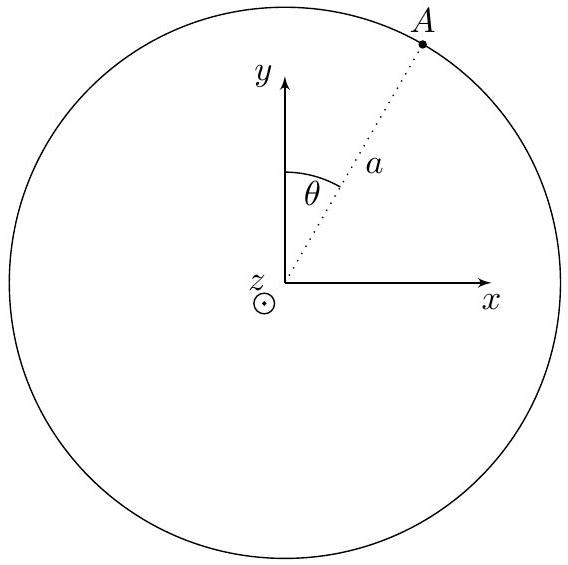
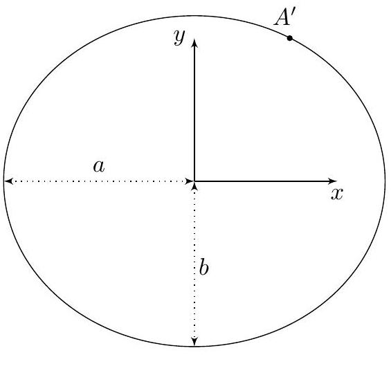
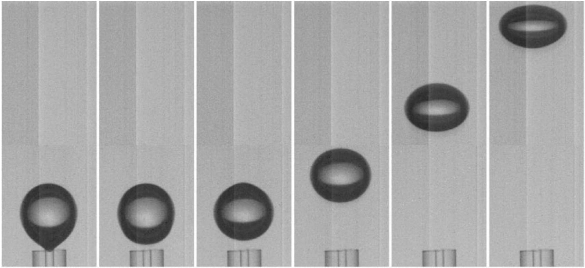
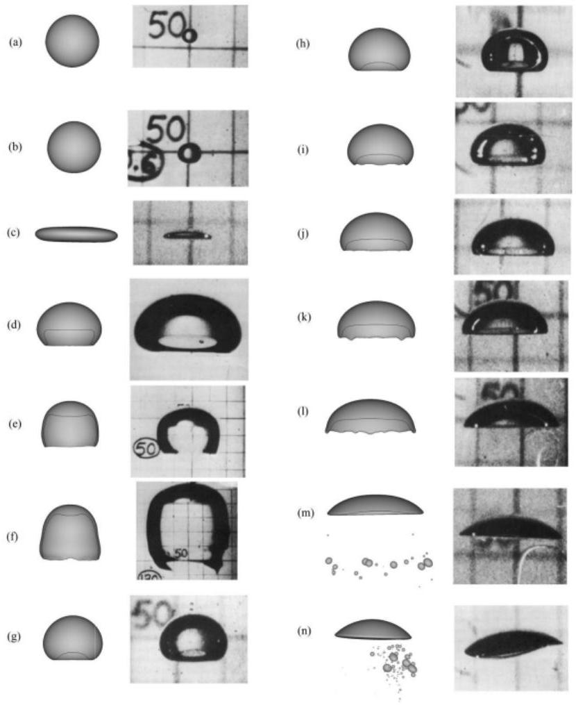
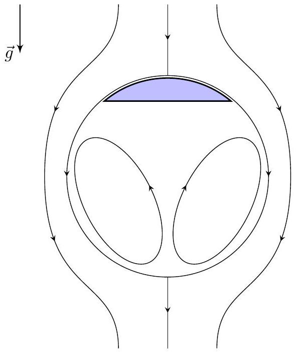
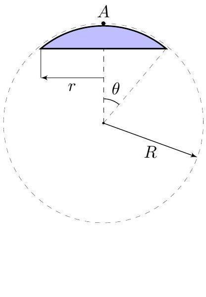
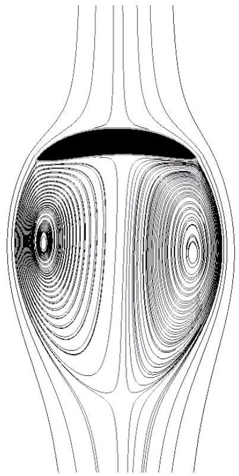

## Road to IPhO

## Всплывающие пузыри

При наблюдении за воздушными пузырьками, всплывающими в жидкости, можно заметить, что их форма очень сильно зависит от объёма воздуха внутри пузырьков и может быть как близкой к сферической, так и напоминать тонкий диск. Данная задача посвящена изучению форм воздушных пузырьков, всплывающих в жидкости. При решении задачи примем следующую модель явления:

- если не указано обратного, все движущиеся тела имеют форму, слабо отличающуюся от сферической;
- сжимаемостью и вязкостью жидкости можно пренебречь;
- гравитационным полем в частях $\mathbf{A}$ и $\mathbf{B}$ можно пренебречь.

## Часть А. Хорошо забытое старое(5.0 балла)

Рассмотрим шар радиусом $R$, движущийся со скорость $\vec{v}_{0}$ в бесконечном объёме несжимаемой жидкости плотностью $\rho$ с нулевой вязкостью. Шар приводит жидкость в движение. Напомним, что гравитационным полем можно пренебречь. Движение жидкости характеризуется величиной $\mu$, называемой присоединённой массой. С присоединённой массой связаны следующие характеристики движущейся жидкости:

1. Если шар движется в жидкости со скоростью $\vec{v}_{0}$, то кинетическая энергия $E_{k}$ жидкости, окружающей шар, определяется выражением:
$$
E_{k}=\frac{\mu v_{0}^{2}}{2} .
$$
2. Если шар движется в жидкости со скоростью $\vec{v}_{0}$, то импульс $\vec{p}$ жидкости, окружающей шар, определяется выражением
$$
\vec{p}=\mu \overrightarrow{v_{0}} .
$$

Пусть $\vec{r}$ - радиус-вектор, проведенный из центра шара в произвольную точку пространства, а $\vec{v}(\vec{r})$ - скорость соответствующего кусочка жидкости в лабораторной системе отсчёта. При решении задачи вам понадобится теорема Томсона, утверждающая, что если изначально неподвижную несжимаемую жидкость с нулевой вязкостью привести в движение, то циркуляция вектора скорости жидкости по любому замкнутому контуру, не пересекающему поверхности движущихся в жидкости тел, обращается в ноль, что можно записать следующим образом:

$$
\oint_{l} \vec{v} d \vec{l}=0 .
$$

В пунктах А1 - А9 будем решать задачу в в системе отсчёта, связанной с шаром. Скорость жидкости в этой системе отсчёта будем обозначать как $\vec{v}_{\text {отн }}$.

А1 Чему равен поток вектора относительной скорости жидкости через произвольную замкнутую поверхность, не пересекающую поверхность шара? Ответ обоснуйте.
Примечание: потоком вектора относительной скорости жидкости через замкнутую поверхность называется величина $\Phi$, определяемая выражением:
$$
\Phi=\oint_{S} \vec{v}_{\mathrm{OTH}}(\vec{r}) d \vec{S} .
$$
А2 Чему равна нормальная компонента скорости жидкости $v_{\text {отн }, n}$ в системе отсчёта, связанной с шаром?
A3 Чему равна относительная скорость жидкости $\vec{v}_{\infty}$ на бесконечном удалении от шара?
A4 Рассмотрим сверхпроводящее тело, помещенное в однородное магнитное поле с индукцией $\vec{B}_{0}$. Напиши-

## Road to IPhO

| A5 | Поместим сверхпроводящий шар радиусом $R$ в однородное магнитное поле с индукцией $\overrightarrow{B_{0}}$. Найдите индукцию магнитного поля $\vec{B}(\vec{r})$ во всем пространстве вне шара. Ответ выразите через $\overrightarrow{B_{0}}, \vec{r}$ и $R$. | 0.8 |
| :--- | :--- | :--- |
| A6 | Пользуясь результатами предыдущих пунктов, найдите зависимость $\vec{v}_{\text {отн }}(\vec{r})$. | 0.2 |

Поскольку шар движется в жидкости с постоянной скоростью, в системе отсчёта шара движение жидкости является стационарным. Это позволяет получить распределение давления на поверхности шара.

A7 Рассмотрим стационарное движение несжимаемой жидкости с нулевой вязкостью по тонкой трубке. Пусть $p$ - давление в жидкости, $\varphi$ - потенциальная энергия единицы массы жидкости, а $v$ - скорость течения в трубе.
Используя законы сохранения энергии и массы, покажите, что для всех точек трубки выполняется соотношение (уравнение Бернулли):

$$
\varphi+\frac{p}{\rho}+\frac{v_{\text {OTH }}^{2}}{2}=\text { const }
$$

Пусть $\theta$ - угол между радиус-вектором $\vec{r}$ и скоростью $\overrightarrow{v_{0}}$.
A8 Считая, что давление на бесконечном удалении от шара равно $p_{0}$, найдите зависимость $p(\theta)$ на поверхности 0.6 шара. Выразите ответ через $p_{0}, \rho, v_{0}, \theta$.

А9 Вычислите равнодействующую сил давления, действующих на поверхность шара. Выразите ответ через 0.4 $\overrightarrow{v_{0}}, R, \rho$.

Вернёмся в лабораторную систему отсчёта. В лабораторной системе отсчёта скорость жидкости в точке с радиус-вектором $\vec{r}$ равна $\vec{v}(\vec{r})$

А10 Найдите распределение скорости жидкости $\vec{v}(\vec{r})$ в лабораторной системе отсчёта. 0.1

А11 Чему равна кинетическая энергия жидкости $E_{k}$ в лабораторной системе отсчёта? Выразите ответ через $\rho$, $R, v_{0}$.

А12 Найдите присоединённую массу $\mu$. Выразите ответ через $\rho, R$. 0.2

Если вы не смогли решить предыдущий пункт, в дальнейшем можете считать $\mu=\frac{4}{3} \pi R^{3} \rho$.
A13 Рассмотрим шар, движущийся со скоростью $\vec{v}_{0}$ и ускорением $\vec{a}_{0}$. Используя выражение для импульса $\vec{p}$ жидкости, получите выражение для силы $\vec{F}$, действующей на шар со стороны жидкости. Ответ выразите через $\rho, R$ и $\vec{a}_{0}$.

Поскольку пузырь не является твёрдым телом, в результате движения он будет деформироваться. В дальнейшем считайте его деформацию малой.

Рассмотрим движение пузыря с коэффициентом поверхностного натяжения $\sigma$ со скоростью $v_{0}$. Считайте применимыми все выражения, полученные в предыдущих пунктах. Давление внутри пузыря всюду одинаково и равно $p_{i n}$.

A14 Получите зависимость кривизны $K$ поверхности пузыря от угла $\theta$. Используйте $p_{i n}, p_{0}, \rho, \theta$ и $v_{0}$. Примечание: кривизной $K$ поверхности называется сумма обратных главных радиусов кривизны:

$$
K=\frac{1}{R_{1}}+\frac{1}{R_{2}}
$$

Она связана с Лапласовым давлением как:

$$
\Delta p=\sigma K
$$

## Road to IPhO

## Часть В. Влияние скорости на деформацию пузыря(2.5 балла)

Рассмотрим эллипсоид, получаемый из эллипса с большой полуосью $a$ и малой полуосью $b$ вращением относительно малой оси. Ось вращения обозначим за $y$.

Эту фигуру можно получить сжатием сферы радиусом $a$ вдоль оси $y$ с коэффициентом $k$, где $k=b / a$. Найдём кривизну поверхности полученной фигуры в произвольной точке $A^{\prime}$, которой до сжатия соответствовала точка $A$ и угол $\theta$, отсчитываемый от оси $y$.

Можно показать, что в плоскости $(x, y)$ радиус кривизны эллипсоида равен:

$$
R_{1}(\theta)=\frac{a}{k} \cdot\left(\cos ^{2} \theta+k^{2} \sin ^{2} \theta\right)^{\frac{3}{2}},
$$

а в плоскости, содержащей нормаль к эллипсоиду в точке $A^{\prime}$ и перпендикулярной плоскости ( $x, y$ ), радиус кривизны эллипсоида равен:

$$
R_{2}(\theta)=\frac{a}{k} \sqrt{\cos ^{2} \theta+k^{2} \sin ^{2} \theta} .
$$

Так как $K(\theta)$ в части А было выведено в предположении, что капля является сферой, то отклонения от сферы должны быть маленькими. Это означает, что $k=1-\varepsilon$, где $\varepsilon \ll 1$. Также считайте, что $a \approx R$, где $R$ - радиус пузыря, который мы использовали в части A.

B1 С учётом малости $\varepsilon$ величины $R_{1}$ и $R_{2}$ можно представить в виде: 0.6

$$
R_{1}(\theta) \approx R\left(1+A_{1} \varepsilon-B_{1} \varepsilon \sin ^{2} \theta\right) \quad R_{2} \approx R\left(1+A_{2} \varepsilon-B_{2} \varepsilon \sin ^{2} \theta\right) .
$$

Найдите $B_{1}$ и $B_{2}$. Далее слагаемыми $A_{1} \varepsilon$ и $A_{2} \varepsilon$ можно пренебречь. Если вы не смогли решить данный пункт, то далее можно считать, что $B_{1}=B_{2}=1$. К потере последующих баллов это не приводит.

В2 Найдите зависимость кривизны эллипсоида $K(\theta)$ в первом порядке по $\varepsilon$. Выразите ответ через $R, \theta$. 0.2

B3 Чему равна величина $\varepsilon$ для пузыря, рассмотренного в пункте A15? Ответ выразите через скорость пузыря $v_{0}$, радиус пузыря $R$, коэффициент поверхностного натяжения $\sigma$ и плотность жидкости $\rho$.

B4 Чему равен эксцентриситет $e$ пузыря, рассмотренного в пункте A15? Ответ выразите через скорость пузыря $v_{0}$, радиус пузыря $R$, коэффициент поверхностного натяжения $\sigma$ и плотность жидкости $\rho$.

B5 Сферический пузырь с начальным диаметром $d=2$ мм поднимается в воде плотностью $\rho=10^{3}$ кг/с и поверхностным натяжением $\sigma=72 \cdot 10^{-3} \mathrm{H} / \mathrm{м}$. Проведя необходимые измерения, вычислите скорость пузыря на последних трёх фотографиях. Также вычислите ускорение пузыря $a$.

## Road to IPhO

## Часть С. Динамика движения пузыря(1.5 балла)

В реальной жизни ускорение свободного падения $g$ создаст в сосуде вертикальный градиент давления, в следствие которого появится сила Архимеда $F_{A}$, разгоняющаяя пузырь вверх. Изначально пузырь является сферическим, но в процессе разгона, согласно теории из предыдущего пункта, он начинает сплющиваться.

Второй закон Ньютона для почти сферического пузыря будет выглядеть следующим образом:

$$
m \vec{a}=m \vec{g}+\vec{F}_{A}+\vec{F}_{\mu}+\vec{F}_{\mathrm{Tp}},
$$

где $m$ - масса пузыря, которой можно пренебречь, $\vec{F}_{A}$ - сила Архимеда, $\vec{F}_{\mu}$ - сила, действующая со стороны воды на пузырь, связанная с присоединённой массой воды, $\overrightarrow{F_{\mathrm{Tp}}}$ - сила трения, возникающая из-за эффектов турбулентности. В нашей модели $\overrightarrow{F_{\mathrm{Tp}}}$ хорошо описывается формулой $\overrightarrow{F_{\mathrm{Tp}}}=-\pi R^{2} \rho v \vec{v}$, где $\vec{v}$-скорость пузыря.

Скорость пузыря изначально равна нулю.

## Road to IPhO

## Часть D. Крутой медузоподобный пузырь(2.0 балла)

В больших по объёму пузырях сила поверхностного натяжения слабее, чем в маленьких, поэтому их форма при достижении постоянной скорости далека от сферической.

В общем случае форма пузерей, приведенных на рисунке выше, моделируется при помощи компьютера. Однако в предыдущих частях мы смогли изучить форму, близкую к сферической: это пузыри $a$ и $b$. В этой части мы изучим модель, применимую к пузырям $m$ и $n$.

Опишем пузырь как сегмент сферы с радиусом основания $r$. Радиус кривизны пузыря, то есть радиус сферы, постоянен и равен $R$. На фотографиях $m$ и $n$ видно, что пузыри почти плоские, а значит можно считать, что $r \ll R$. Точку на поверхности пузыря будем характеризовать малым углом $\theta$, отсчитываемым от центра кривизны. Давление воздуха внутри пузыря равно $p_{i n}$.

## Road to IPhO

D1 Докажите, что давление воды в точках на поверхности пузыря постоянно. 0.2

Линии тока воды схематично обозначены на рисунке. Будем считать, что распределение скоростей жидкости $\vec{v}_{\text {отн }}(\vec{r})$ над пузырём точно такое же, как и в случае движения твёрдого шара радиусом $R$ со скоростью $v_{0}$. Ускорение свободного падения $g$.

Пусть пузырь всплывает в глубоком водоёме. Давление на поверхности водоёма равно атмосферному $p_{0}$. Расстояние от поверхности водоёма до точки $A$ равно $h \gg R$.

D2 Найдите зависимость давления над поверхностью пузыря $p(\theta)$, используя $\rho, v_{0}, g, R, \theta$ и $h$. 1.0

D3 Получите выражение для установившейся скорости пузыря $v_{0}$. Рассчитайте значение для $R=30 с м$ и 0.8 $g=10 \mathrm{~m} / \mathrm{c}^{2}$.
