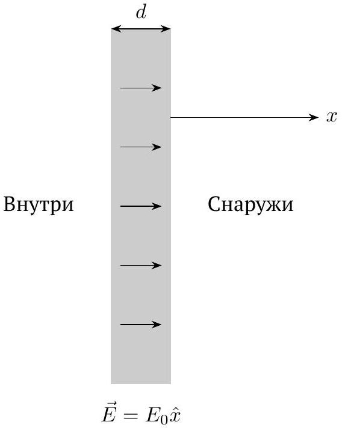
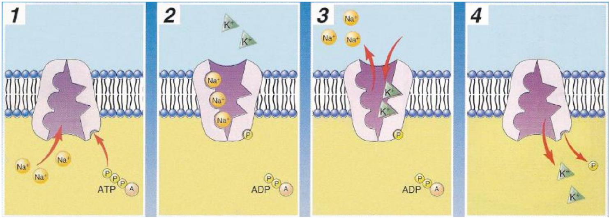
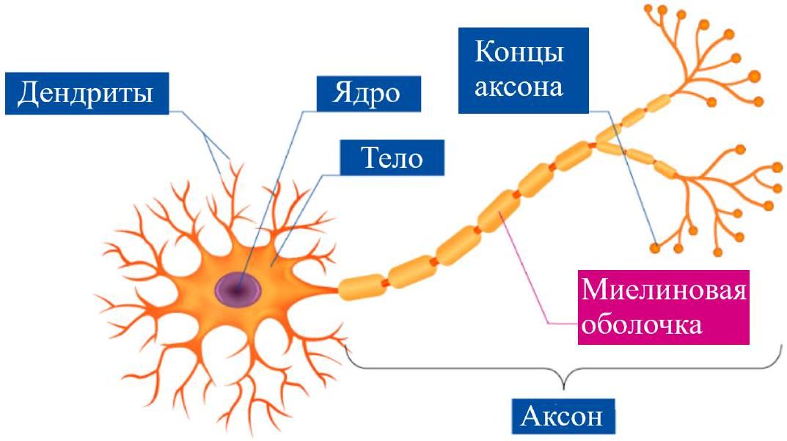
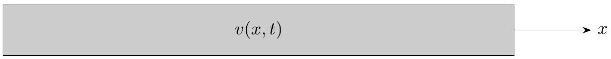
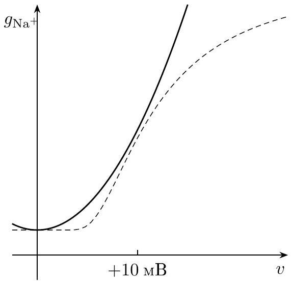
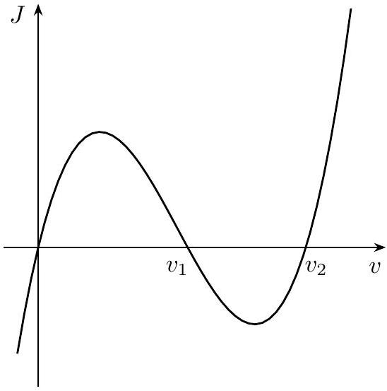

## Road to IPhO

## Динамика мембранного потенциала (8 баллов)

Клетка - это живой объект, ограниченный клеточной мембраной, которая представляет собой двойной слой фосфолипидов. В клетках человеческого тела между внешней и внутренней поверхностью мембраны существует напряжение, которое называется мембранным потенциалом. В стационарном состоянии потенциал внутри клетки примерно на $60-80 \mathrm{mB}$ ниже, это называется потенциалом покоя. Мембранный потенциал играет важную роль в процессе коммуникации нервных клеток. В этой задаче изучаются причины возникновения мембранного потенциала и транспорт сигналов в нервных клетках. Вам могут понадобиться следующие значения физических постоянных:

- Заряд электрона $e=1.602 \cdot 10^{-19}$ Кл
- Постоянная Больцмана $k_{B}=1.381 \cdot 10^{-23}$ Дж/К
- Постоянная Авогадро $N_{A}=6.022 \cdot 10^{23}$ моль ${ }^{-1}$
- Диэлектрическая проницаемость вакуума $\varepsilon_{0}=8.85 \cdot 10^{-12} \Phi / м$

Концентрация, обозначенная буквой $n$, измеряется в $\mathrm{m}^{-3}$, а концентрация, обозначенная буквой $c$ - в ммоль/л.

## Часть А. Дебаевская длина экранирования (1.7 балла)

Некоторые вещества при растворении в воде имеют свойство диссоциировать, то есть распадаться на положительные и отрицательные ионы (например, NaCl распадается на $\mathrm{Na}^{+}$и $\mathrm{Cl}^{-}$). Такой раствор называется ионизированным. Прежде чем рассматривать мембранный потенциал, изучим электростатические свойства ионизированного раствора. В таком растворе сила взаимодействия двух зарядов не подчиняется закону Кулона, поскольку ионы под действием зарядов перераспределяются, вызывая эффект экранирования. Сила взаимодействия зарядов при этом спадает экспоненциально с расстоянием.

Рассмотрим небольшой участок клеточной мембраны как непроводящую пластину толщиной $d$ (рис. 1). Введём ось $x$ перпендикулярно мембране так, чтобы она начиналась на внешней поверхности и была направлена от клетки. Система находится в равновесии при температуре $T$. Электрическое поле внутри мембраны равно $\vec{E}=E_{0} \hat{x}$.

Рис. 1

Не умаляя общности, рассмотрим раствор снаружи клетки. Раствор содержит несколько видов ионов, которые нумеруются индексом $i$ от 1 до $I$. Пусть вдалеке от клетки концентрация ионов типа $i$ равна $n_{i 0}$, а заряд $-q_{i}$. На большом расстоянии от клетки раствор электронейтрален, то есть $\sum_{i} n_{i 0} q_{i}=0$ ). Пусть также модуль разности потенциалов между точкой $x=0$ и раствором вдали от клетки $|V| \ll k_{B} T /\left|q_{i}\right|\left(k_{B}-\right.$ постоянная Больцмана). Относительная диэлектрическая проницаемость раствора равна $\varepsilon$.

## Road to IPhO

А1 Покажите, что напряжённость электрического поля может быть записана как:

$$
\vec{E}(x)=E_{0} \hat{x} e^{-x / \lambda} .
$$

Величина $\lambda$ называется длиной экранирования Дебая. Выразите $\lambda$ через $n_{i}, q_{i}, \varepsilon, \varepsilon_{0}$ и $k_{B} T$.
Подсказка: согласно распределению Больцмана, при термодинамическом равновесии концентрация каждого из типов ионов $n_{i}$ зависит от их потенциальной энергии этих ионов $U_{i}$ по закону:

$$
n_{i}=n_{i 0} \exp \left[-\frac{V q_{i}}{k_{B} T}\right] .
$$

А2 Предположим, что внеклеточный раствор представляет собой NaCl с концентрацией 440 ммоль/л. Относительная диэлектрическая проницаемость воды $\varepsilon=81, T=310 \mathrm{~K}$. Вычислите $\lambda$ в нм и сравните свой ответ с толщиной клеточной мембраны $d \approx 5$ нм.

А3 Найдите заряд ионов раствора, приходящихся на единицу площади клеточной мембраны.
Если вы всё сделали правильно, у вас должно было получиться, что длина экранирования Дебая много меньше толщины клеточной мембраны. Это позволяет рассмотреть мембрану как плоский конденсатор, считая раствор при этом электронейтральным. Мембранный потенциал $V$ при этом равен напряжению на конденсаторе.

## Часть В. Мембранный потенциал покоя (2.6 балла)

На самом деле клеточная мембрана не полностью изолирует внутреннюю и внешнюю части клетки, а имеет множество ионных каналов, каждый из которых может пропускать только определённые типы ионов. К примеру, ионы натрия свободно проходят через натриевые каналы. Это называется пассивным транспортом.

Мембранный потенциал, при котором достигается равновесие для конкретного типа ионов $i$, называется потенциалом Нернста $V_{i}^{\text {Nernst }}$.

B1 Пусть в равновесии концентрация ионов натрия внутри клетки равна $c_{\mathrm{Na}^{+}}$, а снаружи - $c_{\mathrm{Na}^{+}}^{0}$.
Используя распределение Больцмана, найдите потенциал Нернста $V_{\mathrm{Na}^{+}}^{\text {Nernst }}$. В этом пункте считайте $|e V|$ величиной одного порядка с $k_{B} T$.

Если для какого-то типа ионов мембранный потенциал не равен потенциалу Нернста, но при этом существуют каналы пассивного транспорта, через мембрану возникнет поток этих ионов. Мембранный потенциал покоя возникает, когда не все ионы могут пройти через мембрану (например, заряженные молекулы белка).

Пусть молекулы белка распределены в клетке равномерно с объёмной плотностью заряда $\rho_{\text {macro }}$, а в мембране имеются каналы для транспорта ионов калия, натрия и хлора. Концентрации этих ионов вне клетки равны соответственно $c_{\mathrm{K}^{+}}^{0}=20$ ммоль/л, $c_{\mathrm{Na}^{+}}^{0}=440$ ммоль/л и $c_{\mathrm{Cl}^{-}}^{0}=560$ ммоль/л; $\rho_{\text {macro }} / N_{A} e=-400$ ммоль/л. Раствор внутри клетки электрически нейтрален (то есть суммарная плотность заряда молекул белка и ионов равна нулю), система находится в термодинамическом равновесии при температуре $T=310 \mathrm{~K}$.

B2 Вычислите мембранный потенциал покоя $V$ в мВ и концентрации ионов внутри клетки $c_{\mathrm{K}^{+}}, c_{\mathrm{Na}^{+}}$и $c_{\mathrm{Cl}^{-}}$.
Помимо пассивных транспортных каналов, в клеточной мембране существуют также активные транспортные каналы, например, натрий-калиевые насосы. Пример работы натрий-калиевого насоса представлен на рис. 2. В одном цикле этот насос выводит из клетки три иона натрия и вводит в клетку два иона калия.

Натрий-калиевые насосы обеспечивают ток $J_{\text {pump }}=0.5$ мкА/см ${ }^{2}$ на единицу площади мембраны. Ток на единицу площади через каналы пассивного транспорта задаётся выражением:

$$
J_{i}=g_{i}\left(V-V_{i}^{\mathrm{Nernst}}\right),
$$

где «проводимости» $g_{\mathrm{K}^{+}} \approx 25 g_{\mathrm{Na}^{+}} \approx 2 g_{\mathrm{Cl}^{-}} \approx 4 \mathrm{O}_{\mathrm{M}^{-1}} \cdot \mathrm{м}^{-2}$. Положительное направление тока - наружу из клетки.

## Road to IPhO

Рис. 2

B3 Вычислите мембранный потенциал покоя $V$ в мВ и концентрации ионов внутри клетки $c_{\mathrm{K}^{+}}, c_{\mathrm{Na}^{+}}$и $c_{\mathrm{Cl}^{-}}$с учётом работы натрий-калиевых насосов.

В4 Работа активных транспортных каналов требует от клетки затрат энергии. Стандартный механизм гидролиза молекулы АТФ (аденозинтрифосфорной кислоты) позволяет получить около $19 k_{B} T$. Сколько молекул АТФ нужно для выполнения цикла на рис. 2?

## Часть С. Динамический потенциал мембраны (3.7 баллов)

Предположение о равновесии клетки не выполняется при передаче сигналов в нейронах. На рис. 3 показана схема нервной клетки. Нервная клетка состоит из трёх частей - дендриты, ядро и аксон. Дендриты используются для получения сигналов от других клеток, аксон - для передачи сигналов нейронам или мышцам. В этой части исследуется процесс передачи сигнала по дендритам и аксонам.

Рис. 3

Для простоты будем рассматривать дендриты и аксон как длинный прямой тонкий однородных проводник радиусом $a$ и проводимостью $\sigma$. Направим ось $x$ вдоль проводника в направлении распространения сигналов (см. рис. 4). Можно считать, что ток внутри проводника течёт равномерно по сечению. Толщина клеточной мембраны нейрона $\ll a$, а её ёмкость на единицу длины равна $C$. Разность между мембранным потенциалом в точке $x$ в момент времени $t$ и мембранным потенциалом покоя обозначим как $v(x, t)$ (в дальнейшем будем называть эту величину динамическим мембранным потенциалом).

## Road to IPhO

Рис. 4

Суммарная «проводимость» каналов пассивного транспорта равна $g_{\text {tot }}$, а скорость работы активных транспортных каналов не зависит от мембранного потенциала.

C1 Пусть в точке $x=0$ в клетку подаётся ток $I_{0}$. Найдите равновесное распределение динамического мембранного потенциала $v(x)$.

C2 В неравновесном случае зависимость $v(x, t)$ удовлетворяет уравнению:

$$
\frac{\partial v}{\partial t}=\alpha \frac{\partial^{2} v}{\partial x^{2}}-\beta v .
$$

Запишите выражения для коэффициентов $\alpha$ и $\beta$.

C3 Пусть в результате возбуждения нейрона распределение динамического мембранного потенциала оказалось равно

$$
v(x, 0)=v_{0} \exp \left[-\frac{x^{2}}{b^{2}}\right] .
$$

Найдите выражение для $v(x, t)$ при $t>0$.
Примечание: решение удобно искать в виде

$$
v(x, t)=\frac{v_{0} b}{\sqrt{f(t)}} \exp \left[-\frac{x^{2}}{f(t)}\right] \exp \left[-\frac{t}{\tau}\right],
$$

где $f(t)$ - линейная по $t$ функция, $\tau$ - некоторая константа.

C4 Для рассматриваемого нейрона $a=20 \mathrm{mkM}, g_{\mathrm{tot}}=5 \mathrm{OM}^{-1} \cdot \mathrm{~m}^{-2}$, толщина и диэлектрическая проницаемость клеточной мембраны $d=5$ нм и $\varepsilon=7$, проводимость $\sigma=3 \mathrm{O}^{-1} \cdot \mathrm{~m}^{-1}$. Оцените масштабы расстояния и времени, на которых распространяется нейронный сигнал.

Как видно, в рамках простейшей модели нейронный сигнал быстро затухает и распространяется не очень далеко. В реальности при распространении нейронного сигнала происходят более сложные процессы. Экспериментально было обнаружено, что проводимость натриевого канала на самом деле зависит от мембранного потенциала; эта зависимость $g_{\mathrm{Na}}(v)$ показана пунктиром на рис. 5а. Для удобства вычислений аппроксимируем эту зависимость в виде:

$$
g_{\mathrm{Na}^{+}}(v)=g_{\mathrm{Na}^{+}}^{0}+B v^{2},
$$

где $B>0$ - известная константа. Поскольку проводимость при нулевом потенциале $g_{\mathrm{Na}^{+}}^{0}$ уже включена в $g_{\mathrm{tot}}$, необходимо рассмотреть только влияние $B v^{2}$. Пусть разность между потенциалом Нернста ионов натрия $V_{\mathrm{Na}^{+}}^{\text {Nernst }}$ и мембранным потенциалом покоя $V_{0}$ равна $H>0$ и практически не меняется со временем.

## Road to IPhO

a

b

Рис. 5

C5 График зависимости плотности тока через клеточную мембрану от мембранного потенциала, $J(v)$, пока- 0.6 зана на рис. 5б. Этот график пересекает ось абсцисс в трёх точках: $0, v_{1}$ и $v_{2}$. Найдите $v_{1}$ и $v_{2}$.

C6 Если увеличить динамический мембранный потенциал до некоторого порогового значения $v_{\mathrm{c}}$, то клеточ- 0.3 ная мембрана в этой области больше не вернётся к мембранному потенциалу покоя. Найдите $v_{\mathrm{c}}$.
