## Road to IPhO

## Горизонты физики

В этой задаче вам предлагается изучить прицип работы фотоаппарата на примере камеры-обскуры. Она представляет собой ящик с параллельными стенками, в одной из которых проделано малое отверстие. Свет, проходящий через это отверстие, формирует изображение на противоположной стенке - экране. Изображение любой точки пространства будет находится в месте пересечения луча, идущего из этой точки через отверстие, и экрана.
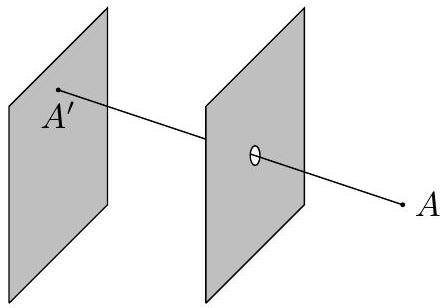

На экране получается перевёрнутое изображение объектов перед камерой, поэтому фотография получается путём переворота получаемой картины. Удобно ввести систему координат для камеры как показано на рисунке. Координаты $x, y$ и $z$ определяют положения объектов в пространстве, а $X$ и $Y$ - координаты изображения.
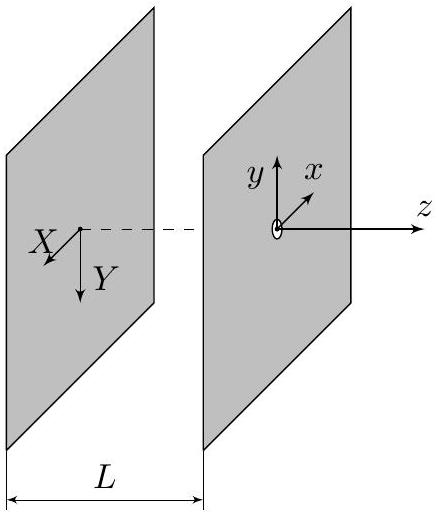

## Часть А. Древняя физика (1.2 балла)

Первые камеры-обскуры представляли собой затемнённые помещения с отверстием в одной из стен. Упоминания о камере-обскуре встречаются ещё в V-IV веке до н.э. - последователи китайского философа Мо-цзы описали возникновение перевёрнутого изображения на стене затемнённой комнаты. Возможно, упоминание о камере-обскуре встречаются у Аристотеля, который задавался вопросом, каким образом может возникать круглое изображение Солнца, когда оно светит через квадратное отверстие. Изучим подробнее этот эффект.

Пусть Солнце на закате снимают с помощью камеры-обскуры, являющейся комнатой длиной $L=10$ м, с квадратным отверстием. Камера направлена на Солнце, угловой размер Солнца (отношение диаметра Солнца к расстоянию до него от Земли) равен $\alpha=0.5^{\circ}$, поэтому все лучи можно считать параксиальными.
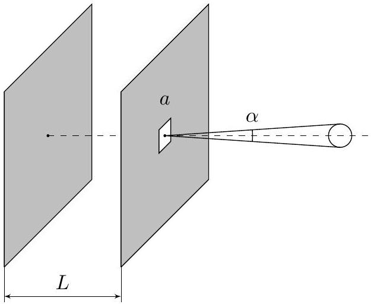

## Road to IPhO

А1 Пусть сторона квадратного отверстия равна $a=1$ м. Найдите характерный угловой размер $\beta$ отверстия при ..... 0.2 взгляде с экрана. Сравните его с угловым размером Солнца.
А2 Пусть теперь сторона квадратного отверстия равна $a=5$ мм. Найдите характерный угловой размер $\beta$ от- ..... 0.2
верстия при взгляде с экрана. Сравните его с угловым размером Солнца.
А3 В листах ответов качественно приведите изображение Солнца при $a=1$ м. Укажите размеры, характери- ..... 0.3
зующие это изображение.
А4 В листах ответов качественно приведите изображение Солнца при $a=5$ мм. Укажите размеры, характери- ..... 0.5
зующие это изображение.
Далее во всех частях задачи отверстие будем считать точечным, то есть его угловой размер при взгляде с экрана будет много меньше характерных угловых размеров снимаемых объектов.
Часть В. Фотография человека (1.0 балл)
Рассмотрим фотографирование человека камерой-обскурой. Для качественного описания будем рассмат- ривать человека как стержень длиной $h$. Пусть камера длиной $L$ направлена горизонтально и всегда ори- ентирована на середину человека. Человек удаляется от камеры со скоростью $v$. В момент времени $t=0$ расстояние между камерой и человеком $l_{0}$. Считайте, что изображение человека целиком расположено на экране.
B1 Найдите зависимость размера $a$ изображения человека от времени $t$. ..... 0.3
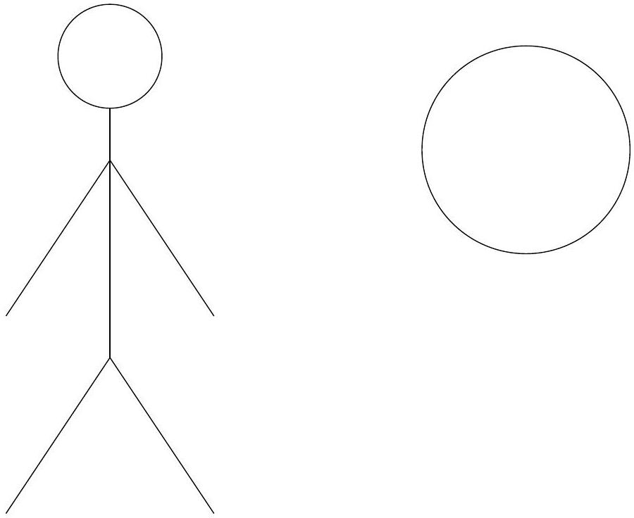

В2 На рисунке показаны изображения взрослого человека и Солнца (угловой размер Солнца $\alpha=0.5^{\circ}$ ) в неизвестном масштабе. Оцените, на каком расстоянии был взрослый человек в момент фотографирования.

## Часть С. Флаг на воздушном шаре (3.3 балла)

Пусть квадратный флаг со стороной $a$ подвешен за одну из своих вершин к воздушному шару, поднимающемуся вертикально вверх со скоростью $v$. Камера-обскура длиной $L$ снимает флаг и всегда направлена на его центр. Считайте, что камеру поворачивают так, что её отверстие неподвижно. Изначально центр флага и камера находятся на одной высоте на расстоянии $l_{0}$ друг от друга, а плоскость флага в этот момент перпендикулярна направлению камеры. Диагональ $A C$ в любой момент вертикальна, а флаг не вращается.

## Road to IPhO

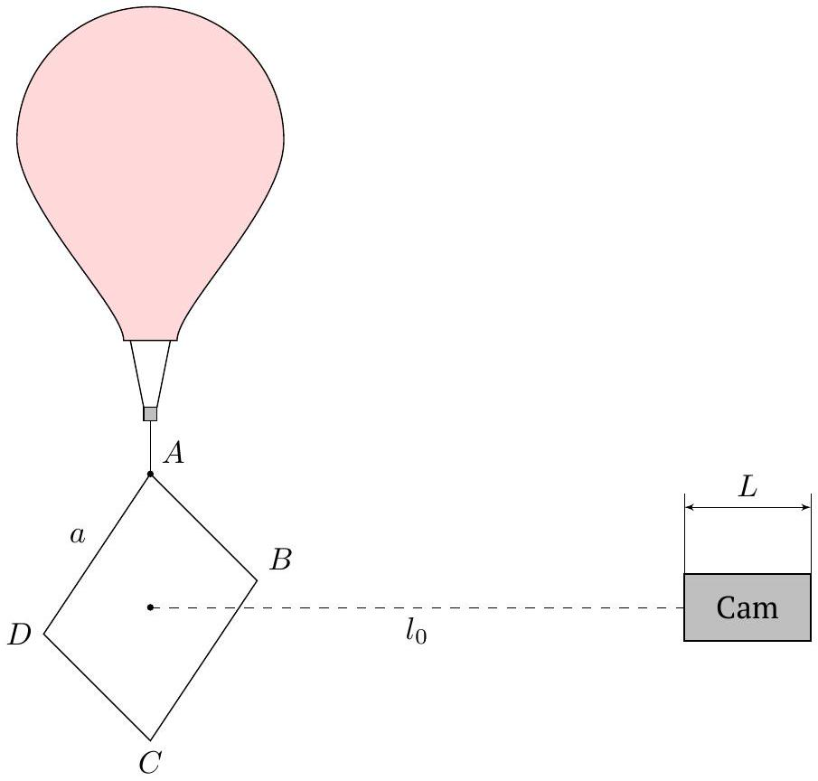

С2 При каком соотношении между $l_{0}$ и $a$ на экране в любой момент времени будут изображены все точки флага, если пренебречь конечностью размеров экрана? Во всех последующих пунктах данной части задачи считайте полученное условие выполненным.
C3 Найдите координаты $(X, Y)$ вершин флага на фотографии в зависимости от времени.

Далее известно, что $l_{0}=3 \mathrm{~m}, v=1 \mathrm{~m} / \mathrm{c}$.
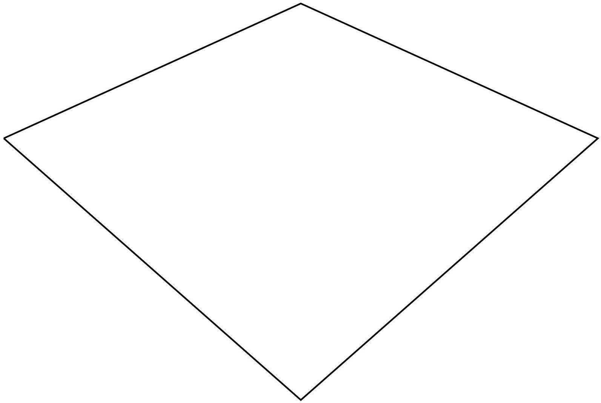

## Road to IPhO

C4 На рисунке изображена фотография флага в неизвестном масштабе. Определите, в какой момент времени 1.2 $\tau$ была сделана фотография.

## Часть D. Фотография горизонта (3.5 балла)

В данной части задачи мы изучим фотографию горизонта, полученную с помощью горизонтальной камеры-обскуры. Радиус Земли $R=6378$ км, неровностями поверхности можно пренебречь.
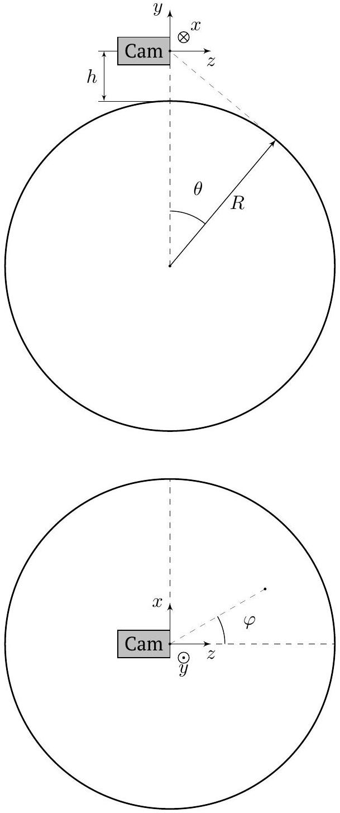

Будем характеризовать положение точки горизонта углами $\varphi$ и $\theta$ (см. рис.). Для начала перенебрежём влиянием атмосферы.

| D1 | Чему равен угол $\theta$ ? Ответ выразите через $R$ и $h$. | 0.1 |
| :--- | :--- | :--- |
| D2 | Определите координаты $x, y$ и $z$ точки горизонта, соответствующей углу $\varphi$. Ответ выразите через $\theta, R, \varphi$. | 0.4 |
| D3 | Докажите, что координаты $X, Y$ связаны с координатами $x, y$ и $z$ соотношениями: $\frac{X}{x}=\frac{Y}{y}=\frac{L}{z} .$ | 0.2 |

## Road to IPhO

D4 Покажите, что изображение горизонта на экране описывается следующим уравнением:

$$
\frac{Y^{2}}{A^{2}}-\frac{X^{2}}{B^{2}}=1,
$$

где $A, B>0$. Выразите $A$ и $B$ через $L$ и $\theta$.
Примечание: следующее выражение может оказаться полезным:

$$
\frac{1}{\cos ^{2} \varphi}=1+\tan ^{2} \varphi .
$$

На рисунке приведена часть фотографии горизонта в неизветсном, но одинаковым по осям масштабе.
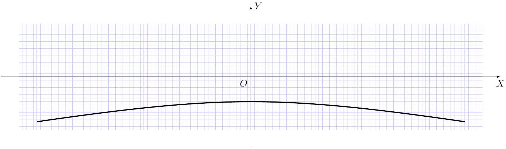

D5 Определите, с какой высоты $h$ была сделана фотография.

В действительности лучи, попадающие в камеру, распространяются не по прямой. Ход лучей, характеризующих горизонт на фотографии, приведён на рисунке.
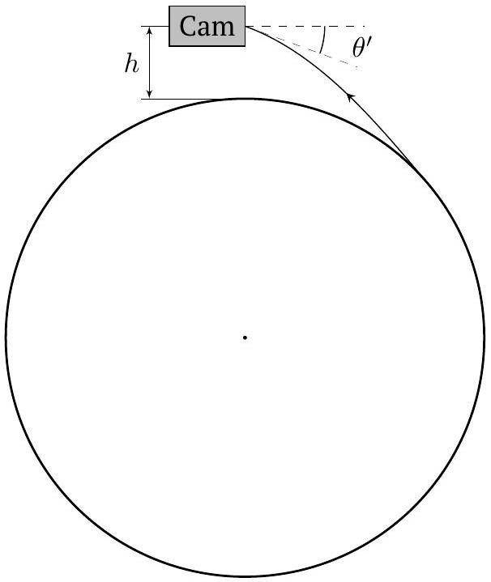

Коэффициент преломления воздуха линейно зависит от плотности: $n=1+\alpha \rho_{\text {air }}$. Отличие показатель преломления воздуха у поверхности Земли от единицы составляет $n_{0}-1=2.74 \cdot 10^{-4}$. Отличием показателя преломления от единицы на высоте фотографирования можно пренебречь.

D6 Опредлите угол $\theta^{\prime}$. Ответ выразите через $R, n_{0}$ и $h$.

D7 С учётом малости $n_{0}-1$ определите, на какую величину $\Delta h$ отличается реальная высота фотографирования от полученной вами в пункте $\mathbf{D 5}$. Выразите ответ через $n_{0}-1, R$ и $h$, рассчитайте его численное значение

В дальнейшем влияением атмосферы будем пренебрегать.

## Road to IPhO

## Часть Е. Фокусировка на горизонт (2.0 балла)

Для анализа границ изображения какого-либо объекта могут понадобиться знания о конических сечениях.
Конус - поверхность, образованная в пространстве множеством лучей (образующих конуса), соединяющих все точки некоторой плоской кривой (направляющей конуса) с данной точкой пространства (вершиной конуса).

Частным случаем конуса является прямой круговой конус, его направляющая кривая - окружность, а вершина лежит на оси симметрии этой окружности. Заметим, что границы изображения предмета в камере-обскуре, образуются касательными к нему лучами проходящими через отверстие камеры. Эти лучи образуют конус. Изображение границ предмета - сечение этого конуса плоскостью экрана.

Особый интерес может представлять случай кругового конуса. В этом случае сечение плоскостью будет кривой второго порядка: эллипс при $90^{\circ}-\psi>\alpha$, парабола при $90^{\circ}-\psi=\alpha$, гипербола $90^{\circ}-\psi<\alpha$.
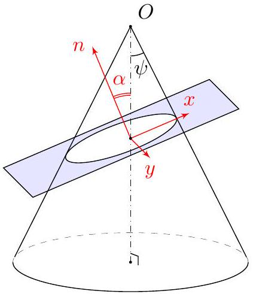

Теперь рассмотрим фотографирование горизонта с помощью камеры, наведённой на одну из его точек.
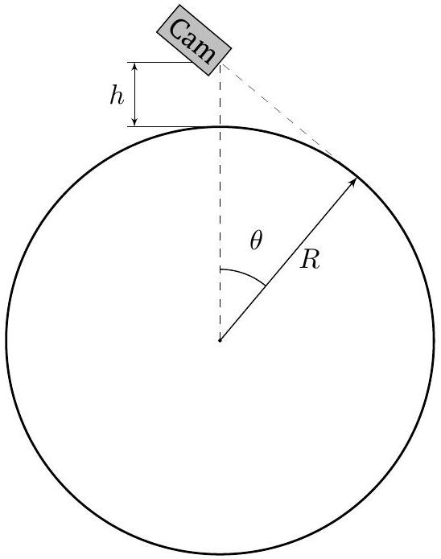

При малых высотах камера может снять только некоторую часть горизонта, а при больших его видно полностью.

E1 Определите $h_{c r}$, начиная с которого при подъёме горизонт видно полностью. 0.3

Видимая доля горизонта определяется отношением длины дуги горизонта, состоящей из точек, попадающих на фотографию, к длине всей окружности горизонта.

E2 Определите зависимость видимой части горизонта $\eta$ от величины $h / R$. Постройте график этой зависимости.
Примечание: при промежуточных вычислениях может быть полезен угол $\theta$, показанный на рисунке.

E3 Нарисуйте качественные изображения горизонта при $h<h_{c r}, h=h_{c r}$ и $h>h_{c r}$. Определите типы кривых, 0.6 получающихся при фотографировании с разных высот.
