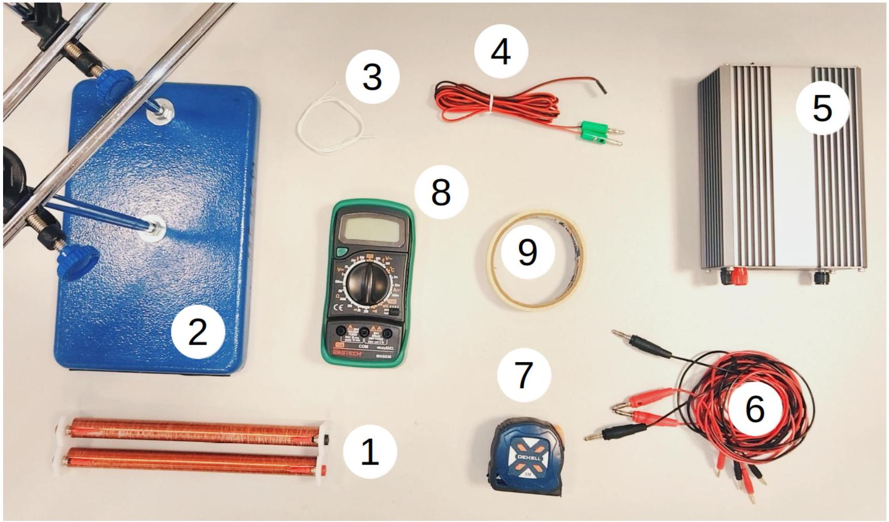
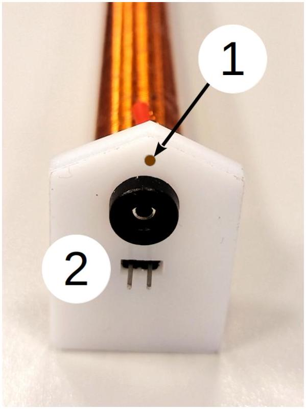
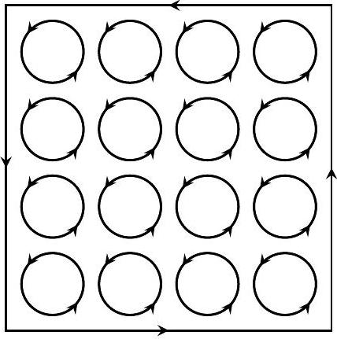
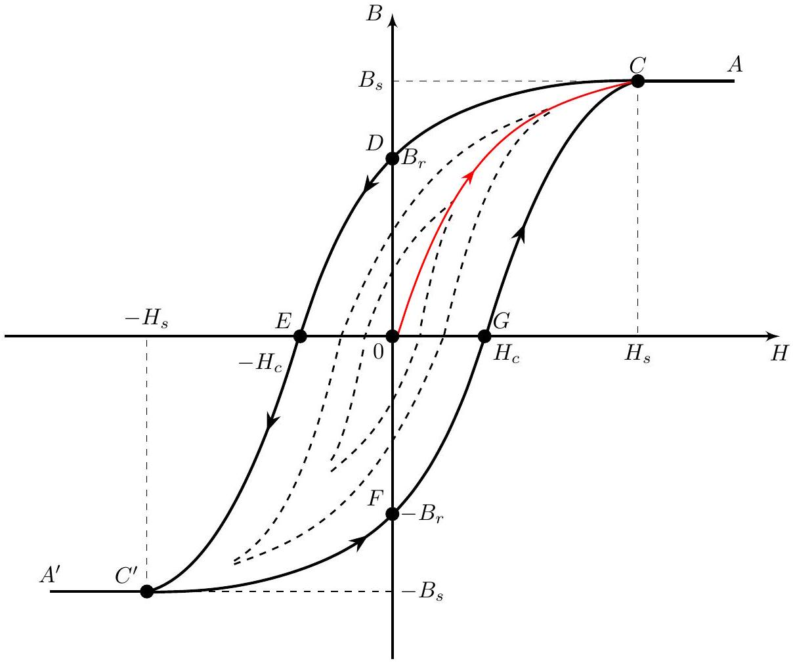
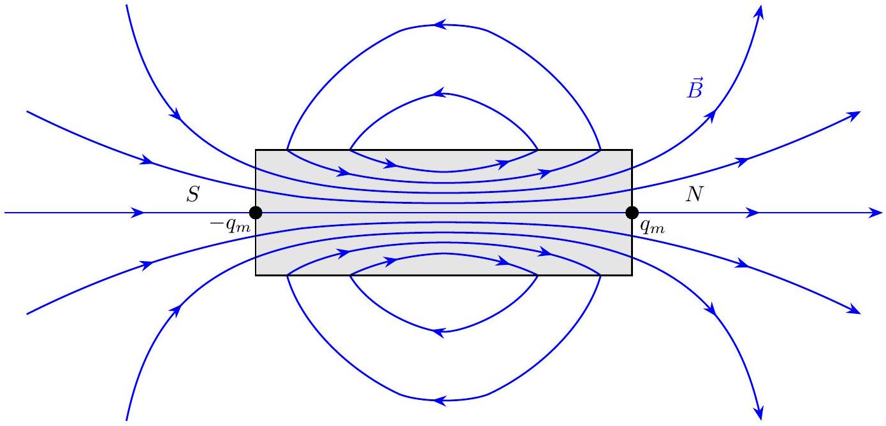
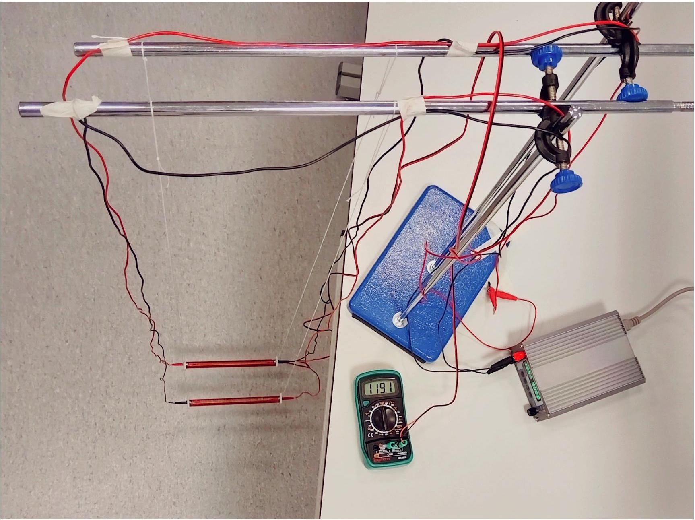
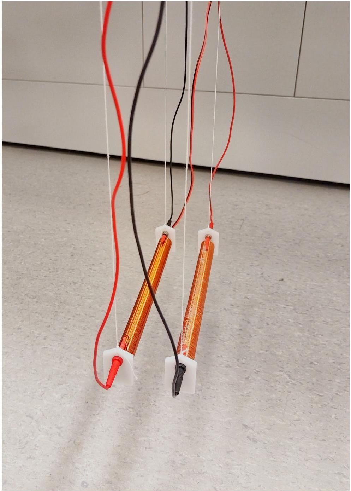
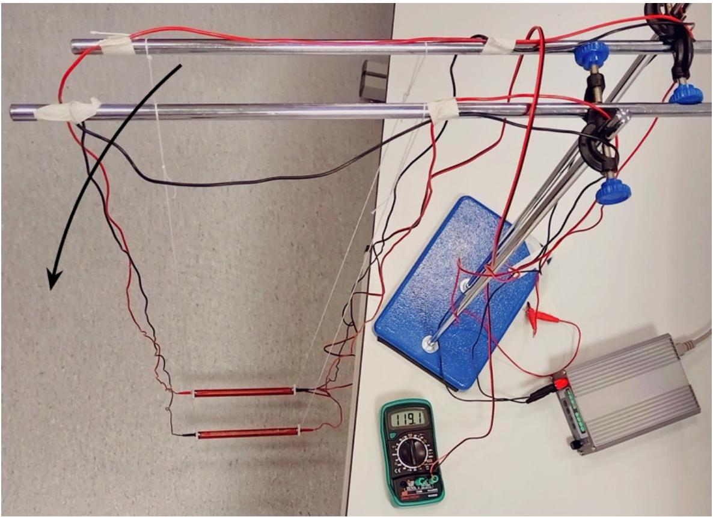
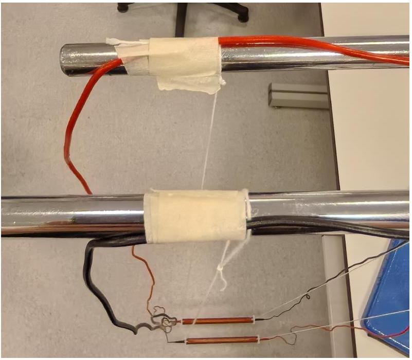
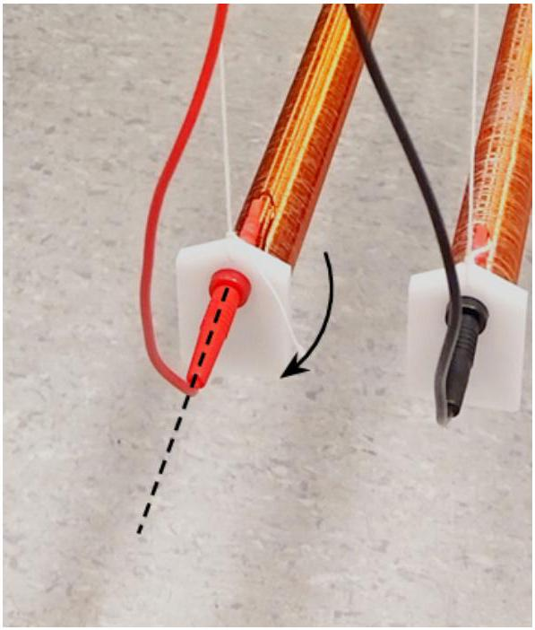

## Road to IPhO

## Закон Кулона 2.0

Оборудование

Рис. 1. Фотография оборудования

1. Два длинных одинаковых соленоида каждый массой $m=(170 \pm 2)$ г с однослойной намоткой и ферромагнитным сердечником длиной $l=(19.6 \pm 0.1)$ см и площадью сечения $S=(1.08 \pm 0.02) \mathrm{cm}^{2}$. В одном из соленоидов находится терморезистор для измерения температуры сердечника.
2. Штатив с двумя стержнями и двумя перекладинами. Штатив необходимо закрепить струбциной, точки контакта струбцины со столом необходимо проложить выданными кусочками картона, чтобы избежать повреждения стола.
3. Нить (можно запросить дополнительно без ограничений у дежурного по аудитории) с ножницами.
4. Провод для терморезистора (с зелёными наконечниками). Их можно подключать только к мультиметру в режиме омметра. Случайное подключение к источнику питания может привести к выходу терморезистора из строя.
5. Источник питания с индикатором тока и напряжения.
6. Соединительные провода.
7. Рулетка и линейка длиной 50 см.
8. Мультиметр в режиме омметра.
9. Малярный скотч.

## Road to IPhO

## Примечания

Рис. 2. Торец соленоида

1. На рис. 2 обозначены:
    - Отверстие для закрепления соленоида на нити
    - Выводы терморезистора. При подключении провода запрещено давить на выводы!
2. Сопротивление терморезистора линейно зависит от температуры:
$$
R=R_{0}(1+\alpha t),
$$
где $R_{0}=101 \mathrm{Oм}, \alpha=0.00377^{\circ} \mathrm{C}^{-1}$, а $t$ - температура терморезистора в градусах Цельсия °C.
3. Будьте аккуратный при обращении с соленоидом: не трясите его, не переворачивайте, не роняйте и не давите сильно на его элементы! Корпус и сердечник соленоида очень хрупкие, в случае поломки замена соленоида не предусмотрена, а дальнейшие измерения НЕВОЗМОЖНЫ!
4. Не трогайте обмотку соленоида, если он нагрет до большой температуры! Прикасайтесь только к его торцам.
5. В конце эксперимента для сдачи работы необходимо смотать провода обратно в стяжки! Провода можно доставать из разъёмов, только держась за штекер, а не за сам провод, иначе это чревато отрывом штекера.

Магнитная постоянная $\mu_{0}=4 \pi \cdot 10^{-7}$ Гн/м.

## Road to IPhO

## Теоретическое введение

## Магнетики

Некоторые вещества в магнитном поле намагничиваются, т.е. сами становятся источниками магнитного поля. Такие вещества называются магнетиками.

При намагничивании магнетика расположение молекулярных токов становится частично или полностью упорядоченным. Поэтому намагниченный магнетик можно представить как систему мельчайших ориентированных токов (см. рис. 3). Эти токи образуют некоторый поверхностный ток, который и придает магнетику его магнитные свойства.

Рис. 3. Молекулярные токи в магнетике

Напомним, что магнитная проницаемость $\mu$ - коэффициент, характеризующий связь между магнитной индукцией $\vec{B}$ и напряжённостью магнитного поля $\vec{H}$ в веществе:

$$
\vec{B}=\mu \mu_{0} \vec{H} .
$$

Вещества, способные сильно намагничиваться, называются ферромагнетиками. Магнитная проницаемость ферромагнетиков $\mu \gg 1$.

## Гистерезис

Рис. 4. Петля ферромагнитного гистерезиса

Размагниченный ферромагнетик в поле изменяет индукцию $B$ по кривой $O C A$. При $H=H_{s}$ достигается насыщение $B_{s}$, после чего рост $H$ почти не влияет на $B$.

При уменьшении $H$ от точки $A$ индукция идёт по кривой $A C D$ и при $H=0$ сохраняется остаточная индукция $B_{r}$. Она возникает потому, что при размагничивании молекулярные токи не возвращаются полностью в исходное состояние, в котором они взаимно компенсируют друг друга. В результате в образце остаётся некоторая намагниченность, направленная так же, как и при насыщении. Для её устранения необходимо приложить внешнее магнитное поле противоположного направления с напряжённостью $H_{c}$, которое называется коэрцитивной силой.

## Road to IPhO

При $H=-H_{s}$ в точке $C^{\prime}$ наступает насыщение $-B_{s}$. Величина $H_{s}$ называется напряжённостью насыщения.

При изменении напряженности поля $H$ на участке $C D E C^{\prime} F G C$ кривая перемагничивания описывает петлю, называемую петлей магнитного гистерезиса. Петля гистерезиса, рассмотренная нами, является предельной, то есть при перемагничивании образца достигается индукция насыщения $B_{s}$. Любая петля, возникающая при изменении поля в пределах от $-H_{0}$ до $H_{0}$, где $H_{0}<H_{s}$, не является предельной (все внутренние петли на рис. 4).

## Магнитные заряды

Рис. 5. Простейший пример магнитного диполя

Аналогично электрическому, магнитный диполь можно представить как два магнитных заряда $+q_{m}$ и $-q_{m}$, расположенные на некотором расстоянии. Магнитные заряды экспериментально не обнаружены, и их используют лишь как удобную модель для расчётов. Примером магнитного диполя является соленоид, где «магнитные заряды» сосредоточены на торцах (см. рис. 5). Если соленоид достаточно длинный, то вне соленоида поле практически эквивалентно полю от двух точечных магнитных зарядов на его концах. Поток через сердечник соленоида равен потоку, создаваемому каждым из магнитных зарядов:

$$
\mu_{0} q_{m}=\oint_{\Pi_{\text {сердеч }}}(\vec{B} \cdot \mathrm{~d} \vec{S}) .
$$

Одиночный магнитный заряд $q_{m}$ создает на расстоянии $r$ поле равное:

$$
B(r)=\frac{\mu_{0} q_{m}}{4 \pi r^{2}} .
$$

Сила взаимодействия двух магнитных зарядов $q_{m 1}, q_{m 2}$, расположенных на расстоянии $r$ друг от друга, равна:

$$
F=\frac{\mu_{0} q_{m 1} q_{m 2}}{4 \pi r^{2}} .
$$

## Эксперимент

Соберите установку, показанную на рис. 6. Используйте максимальную длину подвеса (соленоиды должны висеть на небольшом расстоянии над полом). Расстояние между осями соленоидов должно быть равным ( $5.0 \pm 0.1$ ) см. Явно проконтролируйте, что:

1. Перекладины расположены параллельно друг другу и находятся на одной высоте.
2. Соленоиды расположены параллельно друг другу, находятся на одной высоте и не смещены относительно друг друга, а расстояние между ними совпадает с расстоянием между перекладинами.
3. Расстояние между точками подвеса к перекладине совпадает с расстоянием между точками подвеса к торцам соленоида.

Покажите на рисунке в листе ответов для A0, как вы это делаете.

## Road to IPhO

Советы

1. Проводите финальную юстировку только после подключения проводов, так как они могут влиять на положение соленоидов.
2. Подключайте провода только после того, как подвесите соленоиды, чтобы избежать перекручивания проводов и нитей.
3. Расстояние между перекладинами можно изменить, повернув их одновременно относительно штатива (см. рис. 7а).
4. ВАЖНО! Провода обладают упругостью на изгиб, из-за чего создают дополнительный момент сил на соленоиды. Это нормально, что после юстировки подвеса к перекладинам соленоиды не будут параллельны друг другу. Чтобы их отъюстировать:
    - Выведите провода вдоль перекладин рядом с точками подвеса, закрепив их горизонтально несколькими слоями малярного скотча (см. рис. 7b).
    - Проконтролируйте, что при этом провода не закручиваются вокруг нити, не перекручиваются друг с другом, и не контактируют с другими предметами (к примеру, столом).
    - Вы можете аккуратно вращать наконечники проводов, вставленные в соленоид, вокруг своей оси, чтобы поменять паразитный момент со стороны проводов (см. рис. 7с).

Рис. 6а

## Road to IPhO

Рис. 6b

Рис. 7а

## Road to IPhO

Рис. 7b

Рис. 7c

Погрешности необходимо оценивать только в части А данной задачи. Обратите внимание, что измерения в части C занимают много времени!

00 Внимание! В состав выданных соленоидов входит легкоплавкое оргстекло (температура плавления $\left.140^{\circ} \mathrm{C}\right)$. Сопротивление терморезистора в процессе проведения эксперимента НЕ ДОЛЖНО превышать 145 Ом.
Поломка оборудования в случае действий вопреки инструкциям условия приведёт к вашей дисквалификации с тура!

## Часть А. Отталкивание (10 баллов)

А0 Запишите расстояние $x_{0}$ между осями соленоидов при отсутствии тока через них. После сборки установки пригласите дежурного по аудитории сфотографировать вашу установку. На фотографии должны быть видны:

1. Соленоиды, закрепленные на нитях как можно большей длины. Соленоиды должны быть расположены параллельно и горизонтально!
2. Провода, выведенные через верх рядом с точками подвеса соленоидов (иначе провода будут создавать дополнительный отклоняющий момент сил).

Вся установка должна быть закреплена и не может поддерживаться руками! Внимание! В случае нарушения порядка сборки установки и признания установки непригодной для измерений или отсутствия фотографии, все пункты, связанные с измерениями и обработкой данных, БУДУТ ОЦЕНЕНЫ В 0 БАЛЛОВ!

А1 Получите формулу, связывающую силу отталкивания $F$ соленоидов друг от друга с расстоянием $x$ между ними. Выразите эту силу через магнитные заряды $q_{m}$ на концах соленоидов, длину соленоидов $l, x$ и $\mu_{0}$.

А2 Выразите индукцию магнитного поля $B$ в центре сердечников соленоидов через расстояние $x$ между ними, массу соленоидов $m$, длину подвеса $L$, а также другие необходимые величины.

## Road to IPhO

А3 Измерьте зависимость расстояния $x$ между осями соленоидов от силы тока $I$, протекающего через каждый ..... 5.0 из соленоидов, изменяя ток в диапазоне от -5 A до +5 A с шагом 0.2 A , а при токах меньше 0.6 A по модулю - с шагом 0.15 A.
Поскольку магнитная проницаемость сердечника соленоида зависит от температуры, старайтесь, чтобы в рамках ваших измерений температура соленоидов отклонялась от комнатной температуры не более чем на $10^{\circ} \mathrm{C}$.
A4 Из полученной в A3 зависимости рассчитайте значения индукции магнитного поля $B$ внутри соленоида ..... 1.2 и напряженности магнитного поля $H=n I$ внутри соленоида, где $n$ - это число витков на единицу длины соленоида, $I$ - ток через соленоид. Постройте график зависимости $B(H)$ для токов $I$ от -5 А до +5 А, пренебрегая гистерезисом.
Гистерезис достаточно мал, однако его вклад можно оценить.
А5 Оцените по экспериментальным данным остаточную намагниченность $B_{r}$ для петли гистерезиса из A4. ..... 0.3
А6 Оцените по экспериментальным данным коэрцитивную силу $H_{c}$ для петли гистерезиса из A4. ..... 0.3
А7 При каком максимальном по модулю токе, текущем через соленоиды, зависимость $B(H)$ в пренебрежении ..... 0.2 гистерезисом все ещё описывается прямой пропорциональностью?
A8 Вычислите магнитную проницаемость $\mu=\frac{1}{\mu_{0}} \frac{\mathrm{~d} B}{\mathrm{~d} H}$ сердечника соленоида на линейном участке. ..... 1.5 ..... 1.5
Для повышения точности измерений используйте линеаризацию, не требующую знания величины $x_{0}$.
Часть В. Притяжение (3.5 балла)
Внимание! В этой части установка куда более чувствительна к параллельности и горизонтальности подвешенных соленоидов. Пожалуйста, будьте внимательны при юстировке.
Если изменить направление течения тока в одном из соленоидов, они начнут притягиваться. Расстоя- ние между осями соленоидов должно быть равным от 4 см до 6 см.
В этой части задачи вы можете пренебречь взаимодействием одноименных магнитных зарядов и учитывать только притяжение двух пар зарядов.
Решим теоретическую задачу:
В1 Получите теоретическое выражение, связывающее расстояние $x$ между соленоидами и ток $I$ через каждый ..... 0.3
соленоид. В ответ может входить функция $B(H)$ и любые необходимые величины.
B2 При каком минимальном токе $I_{\text {high }}$ происходит резкое «слипание» соленоидов при плавном увеличении ..... 1.0
тока? В ответ может входить функция $H(B)$ и любые необходимые величины.
B3 При каком токе $I_{\text {low }}$ соленоиды разлипаются обратно? В ответ может входить функция $H(B)$ и любые необ- ..... 0.3 ..... 0.3
ходимые величины.
B4 Измерьте зависимость $I_{\text {low, high }}\left(x_{0}\right)$ для трех разных значений $x_{0}$. Постройте эти зависимости на одном гра- ..... 1.9 ..... 1.9
фике с теоретическими зависимостями, рассчитанными по кривой, полученной в предыдущей части. Рас- ходятся ли какие-то из этих зависимостей с теоретическими? Если да, объясните причину.

## Road to IPhO

## Часть С. Нагревание и размагничивание (6.5 балла)

В этой части задачи исследуется зависимость магнитной проницаемости выданных сердечников от температуры.

Если магнетик нагреть до достаточно большой температуры, называемой температурой Кюри, его магнитная проницаемость падает, и он теряет свои магнитные свойства. Зависимость намагниченности ферромагнетиков от температуры ниже температуры Кюри описывается законом Блоха:

$$
\mu(T)=\mu(0)\left(1-\left(T / T_{c}\right)^{3 / 2}\right),
$$

где $\mu(0)$ - максимальное значение магнитной проницаемости ферромагнетика при $T=0 \mathrm{~K}, T_{c}$ - температура Кюри данного ферромагнетика.

C1 Получите не менее четырех различных значений $\mu(T)$. Для измерения используйте отталкивание, как в части А. Если вы собираете установку заново, вы не можете использовать значение, полученное в части А при комнатной температуре. Это связано с тем, что отличия в значениях $\mu$, возникающие из-за неидеальности сборки установки, могут быть сравнимы с измеряемым эффектом. При обработке экспериментальных данных используйте линеаризацию из A8.
Внимание! Выданные сердечники обладают малой теплопроводностью. Вы можете считать температуру сердечника равной температуре термопары при поддержании соответствующей постоянной температуры термопары не менее 10 минут.
