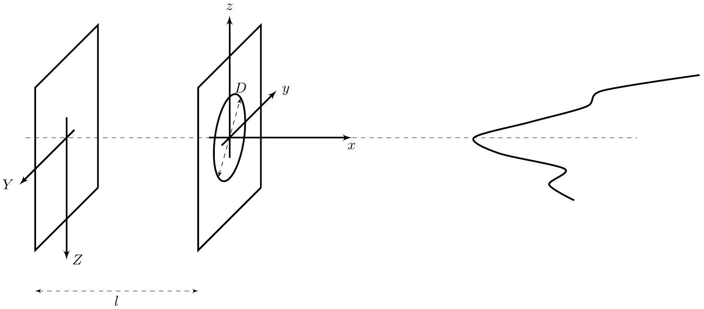
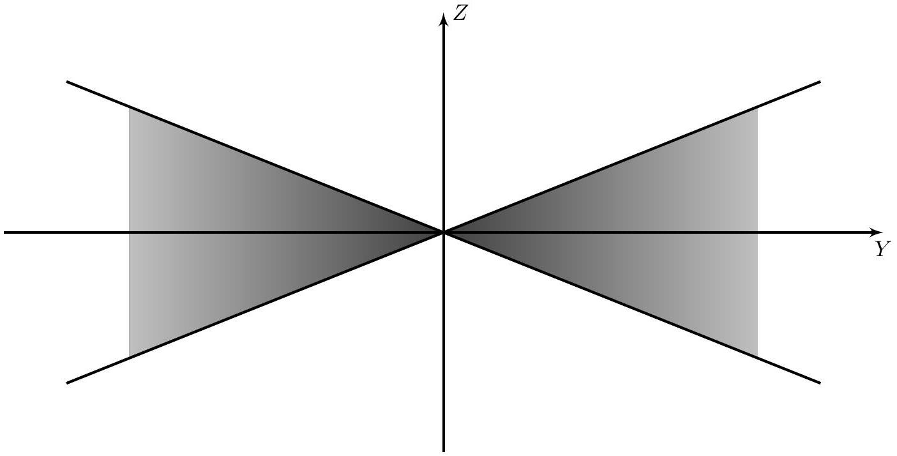
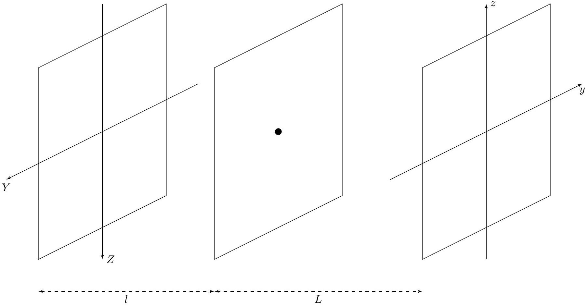
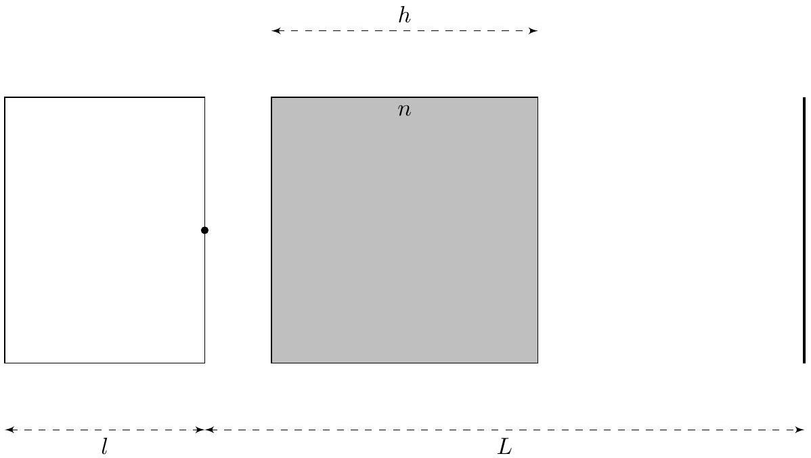

## Road to IPhO

## Проблемы фотографирования (8 баллов)

Эта задача состоит из трёх независимых частей, объединённых общей темой: каждая из них посвящена конкретной проблеме, с которой можно столкнуться при фотографировании. Постарайтесь понять физику, стоящую за этими эффектами, и ответить на поставленные вопросы.

## Часть А. Расфокусировка (2.0 балла)

На рисунке изображена камера, фотографирующая тонкую проволоку. Она состоит из двух плоскостей: передняя плоскость содержит в себе идеальную тонкую собирающую круглую линзу с фокусным расстоянием $f$ и диаметром $D$, задняя плоскость является экраном. Расстояние между плоскостями $l$. Фотография - перевёрнутое изображение, полученное на экране, поэтому введём системы координат как указано на рисунке: $x y z$ описывает положение объекта в пространстве, а $Y Z$ - положение изображения на фотографии.

Изображение тонкой проволоки, полученное этой камерой, ограничено сверху и снизу прямыми $Z= \pm k Y$, где $k>0$ и не ограничено в обе стороны вдоль оси $Y$.

## Road to IPhO

Часть В. Роллинг-шаттер (3.0 балла)
При фотографировании быстродвижущихся объектов может возникать искажение изображения, связанное с неодновременностью считывания разных участков фотографии. Этот эффект получил название временной параллакс или роллинг-шаттер. Обычно считывание происходит построчно. Будем считать, что в нашей камере снимок регистрируется начиная с верхней части, все строки снимаются за одинаковое и крайне малое время, поэтому искажения отдельных строк учитывать не нужно. Известно, что полное время, уходящее на фотографирование, равно 10 мс. С помощью направленной вертикально вниз камеры сфотографировали шайбу диаметром 7.62 см, скользящую по гладкой горизонтальной поверхности.

В1 Используя циркуль и линейку без делений, постройте в листах ответов прямую, параллельную направле- нию скорости шайбы. Для удобства вам предоставлено два дополнительных идентичных листа с фотографией. В случае порчи или затупления циркуля новый выдаваться не будет!

В2 Используя дополнительно линейку с делениями, найдите модуль скорости шайбы.

Часть С. Дисторсия (3.0 балла)
Рассмотрим фотографирование плоского экрана. Введём координаты на экране и на фотографии $(y, z)$ и $(Y, Z)$ соответственно. Для реалистичной передачи изображений на экране нужно, чтобы коэффициент линейного увеличения был постоянен на всей фотографии, то есть:

$$
\vec{R}=\alpha \vec{r}, \quad \text { где: } \quad \vec{r}=(y, z) ; \quad \vec{R}=(Y, Z) .
$$

Рассмотрим простейшую камеру-обскуру. Она представляет собой два параллельных экрана, в одном из которых проделано малое отверстие. Свет, проходящий через это отверстие, формирует изображение на втором экране. Изображение любой точки пространства будет находится в месте пересечения луча, идущего из этой точки через отверстие, и экрана.

Расстояние между плоскостью фотографии и отверстием обозначим $l$, а расстояние между камерой и фотографируемым экраном $L$.

## Road to IPhO

В большинстве случаев свойство линейности нарушается и наблюдается эффект дисторсии, то есть увеличение разное в разных точках фотографии. Рассмотрим дисторсию третьего порядка параксиальных лучей:

$$
\vec{R}=f(r) \vec{r} \approx \alpha \vec{r}+\beta r^{2} \vec{r} .
$$

С2 Нарисуйте качественный вид фотографии части тетрадного листа, изображённой на рисунке ниже, в случаях $\beta>0$ (положительная дисторсия) и $\beta<0$ (отрицательная дисторсия). Считайте, что $\alpha>0$.

|  |  |  |  |
| :--- | :--- | :--- | :--- |
|  |  |  |  |
|  |  |  |  |
|  |  |  |  |

Опять рассмотрим камеру-обскуру. Пусть в этот раз между камерой и экраном находится плоский аквариум толщины $h$, заполненный жидкостью с показателем преломления $n$. Остальное пространство заполнено воздухом с показателем преломления $n_{0}=1$.

C3 Определите коэффициенты $\alpha$ и $\beta$ в этом случае. Какая дисторсия наблюдается в такой системе: положительная ( $\alpha$ и $\beta$ одного знака) или отрицательная ( $\alpha$ и $\beta$ разных знаков)?
