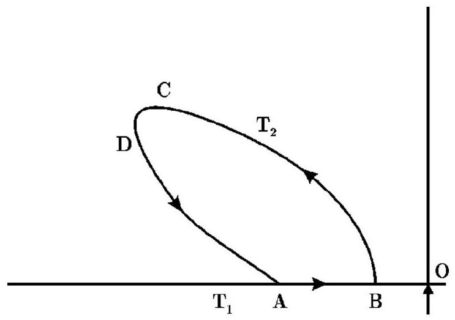
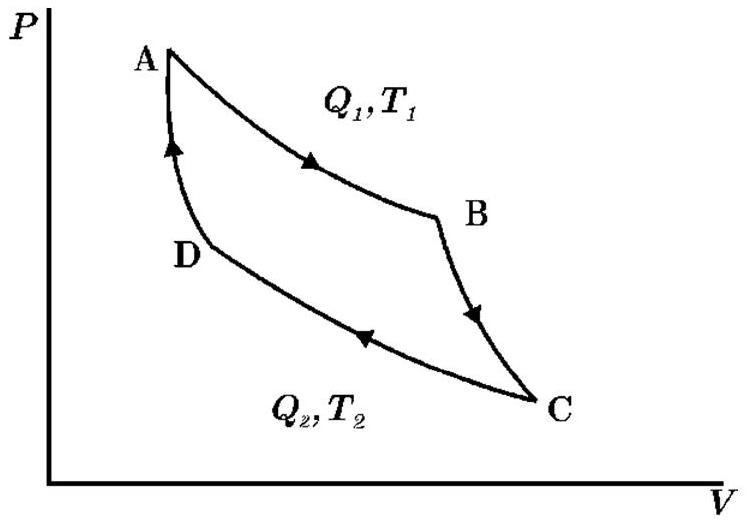

В данной задаче рассматривается упрощенная модель тропического циклона. В этой модели циклон рассматривается как гигантская тепловая машина, работающая по циклу Карно.

Рис. 1. Схема потоков воздушных масс

Рис. 2. Цикл Карно

Масса сухого воздуха $\Delta m$ перетекает вдоль поверхности океана из области высокого давления $(A)$ в область низкого давления $(B)$, близкую к центру шторма $O$ (рис. 1), захватывая по пути влагу (пары воды). Вместе с парами у океана отбирается теплота $Q_{1}$. Воздушные массы, насыщенные водяными парами, поднимаются в тропосферу (участок $B C$ ). В тропосфере (участок $C D$ ) они разряжаются тропическим ливнем, отдавая при этом энергию $Q_{2}$.

А1 Используя первый закон термодинамики, найдите выражение для $Q_{1}$ (см. рис. 2) через

- $L$ - удельная теплота испарения,
- $\Delta q$ - масса влаги захваченной воздушной массы $\Delta m$ на пути от $A$ к $B$
- $P_{A}$ и $P_{B}$ - давление в т. $A$ и т. $B$ соответственно.

Используйте универсальную газовую постоянную $R$, температуру $T_{1}$ поверхности моря, молярную массу $M$ воздуха.

А2 Найдите полную работу, произведенную за один цикл Карно тепловой машиной над массой воздуха $\Delta m$.

А3 Предполагая, что работа, произведенная тепловой машиной, полностью идет на увеличение кинетической энергии воздушной массы, получите выражение для скорости $v_{B}$ воздуха в центральной части циклона («глаз» циклона).

А4 Полагая $v_{A}=0$, найдите численное значение $v_{B}$, используя следующие данные: $T_{1}=273 К, T_{2}=213 К, R=8.31$ Дж/(моль • К), относительная влажность воздуха в т. $В \varphi=75 \%$, при $T=T_{1}$ давление насыщенных паров $P_{\mathrm{H}}=42$ мбар, $P_{A}=1000$ мбар, $P_{B}=950$ мбар, средняя молярная масса воздуха $M=29 \cdot 10^{-3}$ кг ⋅ моль $^{-1}$, молярная масса воды $M_{\mathrm{в}}=18 \cdot 10^{-3}$ кг ⋅ моль ${ }^{-1}$, удельная теплота испарения воды $L=2.26 \cdot 10^{6}$ Дж ⋅ кг ${ }^{-1}$, плотность сухого воздуха $\rho=1.3$ кг/м ${ }^{3}$ (1 бар $=10^{5}$ Па).

A5 Полагая, что азимутальная скорость $v$ и радиальное расстояние $r$ от центра циклона связаны соотношением $v \sqrt{r}=$ const, и что скорость $v_{A}$ на внешнем крае циклона равна 10 м/с, вычислите эффективный радиус циклона (примите $r_{B}=10$ км).
