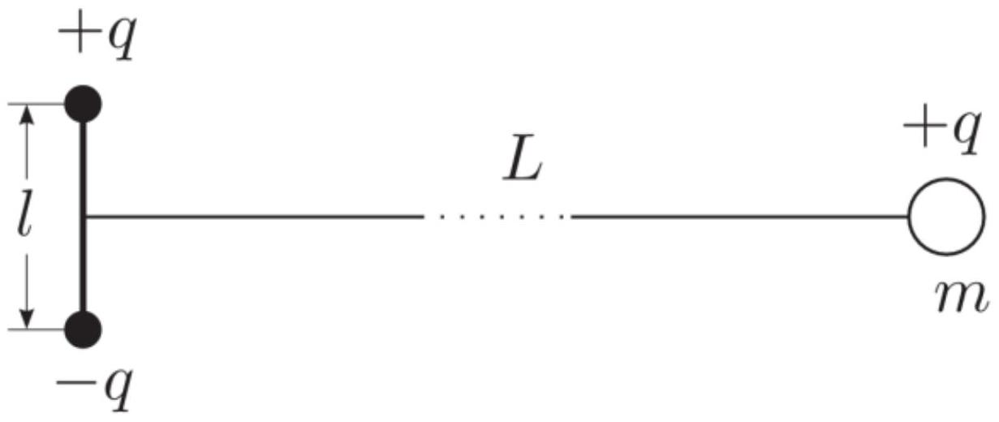

Имеется жестко закреплённый электрический диполь (два разноимённый, но одинаковых по модулю точечных заряда $+q$ и $-q$, находящихся на расстоянии $l=2$ см друг от друга). На расстоянии $L=2$ см от диполя на линии, перпендикулярной его оси (рис. 3), находится на одинаковых расстояниях от зарядов диполя шарик массой $m$, заряженный зарядом $+q$. Шарик без толчка освобождают ( $v_{0}=0$ ), и он начинает двигаться в электрическом поле диполя.

А1 Покажите, что кривая, по которой будет двигаться шарик, является дугой окружности.
А2 Укажите точки, в которых шарик будет иметь максимальную и минимальную скорости.
АЗ Найдите максимальную скорость шарика, приняв величину $\frac{q^{2}}{4 \pi \varepsilon_{0} m}=\frac{В}{\text { М } \cdot \text { к }}$
