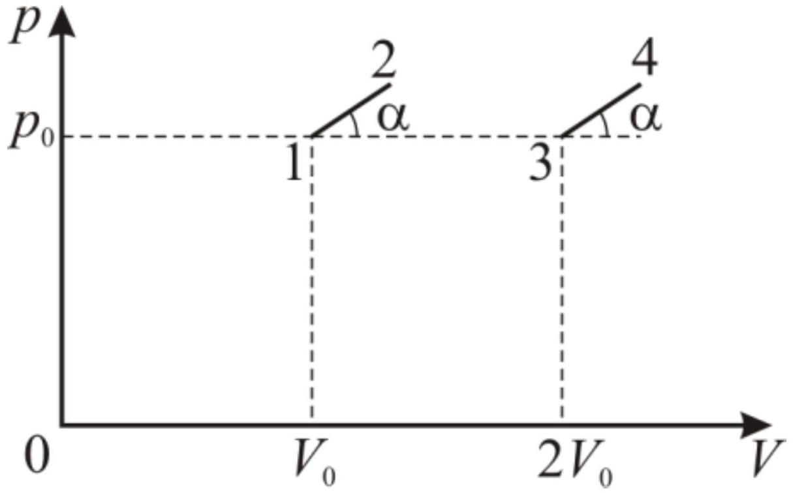

С идеальным одноатомным газом совершают процессы 1-2 и 3-4 (рис. 1). Пусть при данном масштабе точка с координатами $\left(p_{0}, V_{0}\right)$ видна из начала координат под углом $\alpha_{0}$.

Рис. 1

А1 Для каких углов $\alpha$ теплоёмкость в точке 1 первого процесса равна теплоёмкости в точке 3 второго?
А2 Для каких углов $\alpha$ теплоёмкость в точке 1 первого процесса больше чем теплоёмкость в точке 3 второго?
