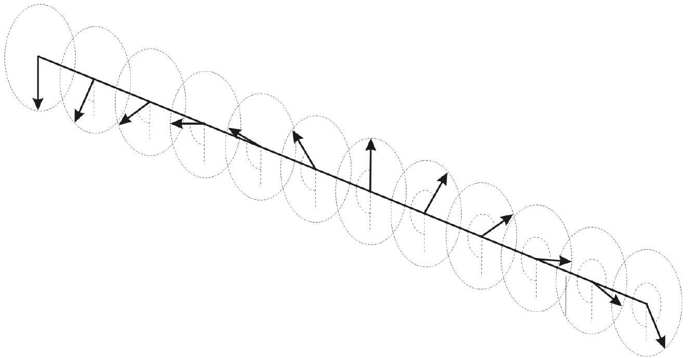

Солитон - структурно устойчивая уединённая волна, распространяющаяся в нелинейной среде. В данной задаче мы получим некоторые характерные свойства этих объектов.

Часть А. Математический маятник
Решение уравнения математического маятника (груза на невесомом стержне в однородном поле) не выражается в элементарных функциях в общем случае. Поэтому обычно рассматривают малые колебания вблизи положения равновесия. Однако имеется частный случай, а именно когда в нижней точке груз имеет скорость $v=\sqrt{4 g L}$ при длине стержня $L$. В этом случае решение можно представить в виде:

$$
\varphi(t)=a \arctan e^{b t},
$$

где $\varphi$ - угол между вертикальной осью и стержнем (в нижней точке $\varphi=\pi$, а моменту $t=0$ соответствует прохождение нижней точки).
А1 ${ }^{1.00}$ Выразите константы $a$ и $b$ через $g$ и $l$.
Часть В. Динамика солитона
Рассмотрим длинную жесткую горизонтальную струну, к которой через равные промежутки $b$ припаяны одинаковые спицы расположенные вертикально. Масса спицы $m$, расстояние от центра масс спицы до струны $d$, момент инерции относительно оси проходящей через струну $I$. При отклонении одной спицы от соседней на угол $\Delta \varphi$ струна создает крутящий момент $K \Delta \varphi$. Если спицы на одной половине струны перевернуть на полный оборот, то на границе раздела образуется солитон (рис. 1). Можно считать, что характерный размер солитона $\lambda \gg b$. Так что считайте, что угловая координата в точке $x$ задается непрерывной функцией $\varphi(x, t)$ (удаленные спицы на одной половине струны имеют координату $\varphi(-\infty, t)=2 \pi$, а на другой $\varphi(+\infty, t)=0$ ).

Рис. 1. Солитон.

В $1^{1.00}$ Напишите уравнение движения для $\varphi(x, t)$.
Солитон может распространяться с постоянной скоростью $v$. В этом случае $\varphi(x, t)=f(x \pm v t)$ в зависимости от направления распространения.
В2 ${ }^{0.50}$ Постройте качественный график зависимости $\varphi(x)$ для покоящегося солитона.
В3 ${ }^{2.00}$ Найдите максимальную скорость $v_{c r}$ с которой может распространяться такой солитон.
В дальнейшем можете использовать $v_{c r}$ в ваших ответах.
В4 ${ }^{2.00}$ Пусть при нулевой скорости характерный размер солитона равен $\lambda_{0}$. Найдите размер $\lambda$ солитона движущегося со скоростью $v$.
В5 ${ }^{2.00}$ Пусть энергия покоящегося солитона равна $E_{0}$. Найдите энергию солитона, движущегося со скоростью $v$.
Примечание: За ноль потенциальной энергии в гравитационном поле примите уровень прямой, проходящей через центры масс спиц, расположенных достаточно далеко от солитона.

Часть С. Взаимодействие солитонов
Результаты, полученные в предыдущей части, показывают, что солитон очень похож на частицу. Более того, мы можем рассмотреть антисолитон, у которого спицы закручены в другую сторону. Мы будем говорить, что такой солитон имеет противоположный заряд.

С1 ${ }^{0.50}$ Укажите притягиваются или отталкиваются покоящиеся солитоны с противоположными зарядами.
С2 ${ }^{1.00}$ Рассмотрим неподвижные солитоны с противоположными зарядами, находящиеся на расстоянии $R \gg \lambda$ друг от друга. Оцените характер силы взаимодействия между солитонами.
