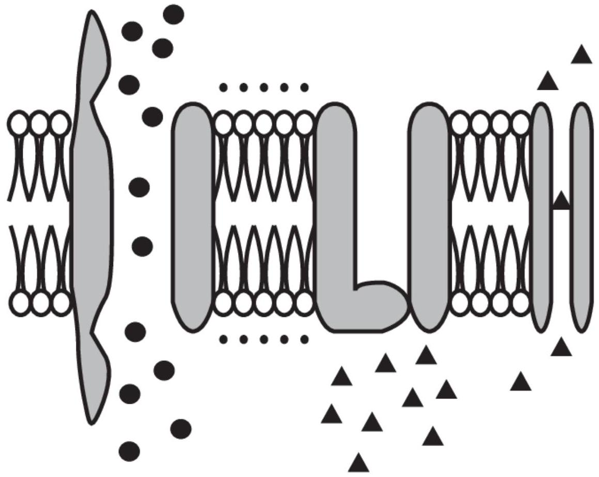
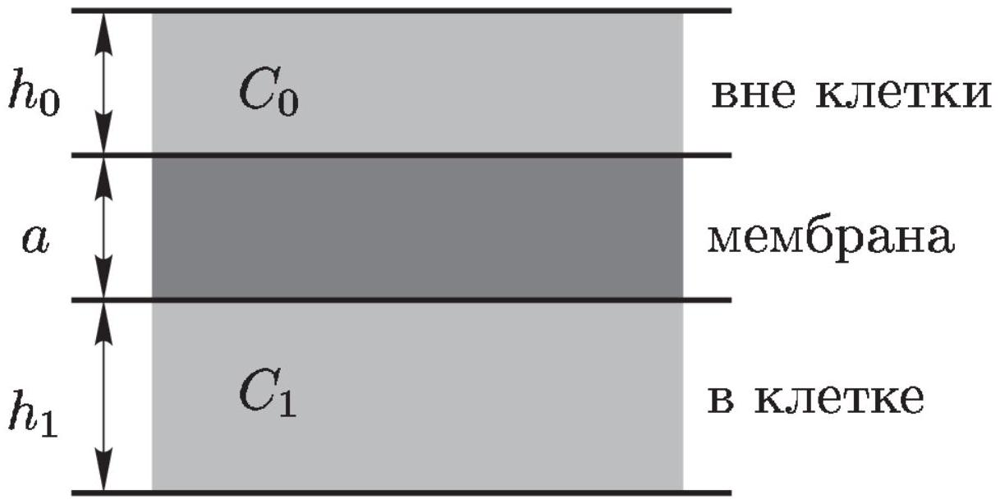
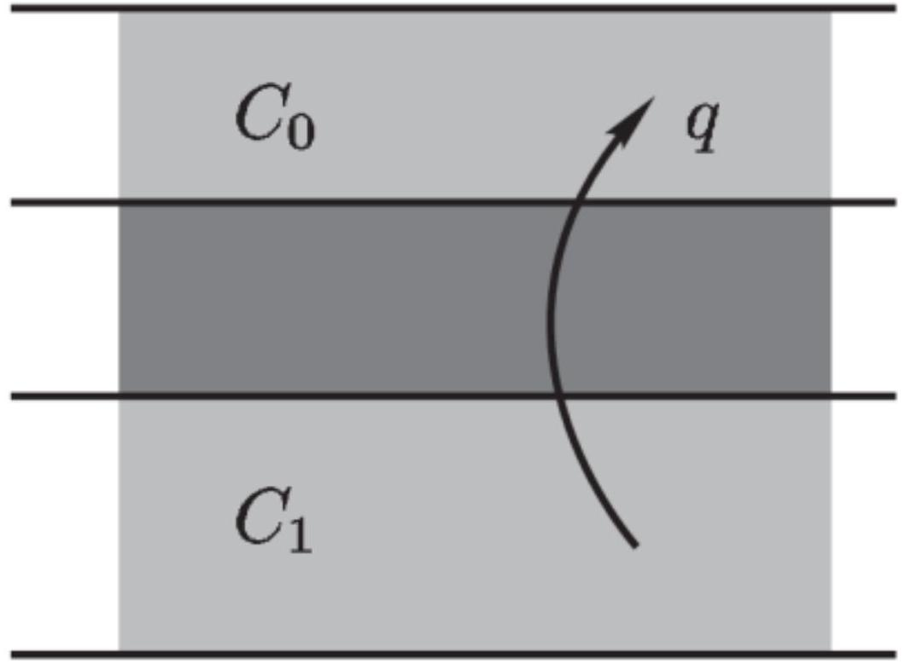
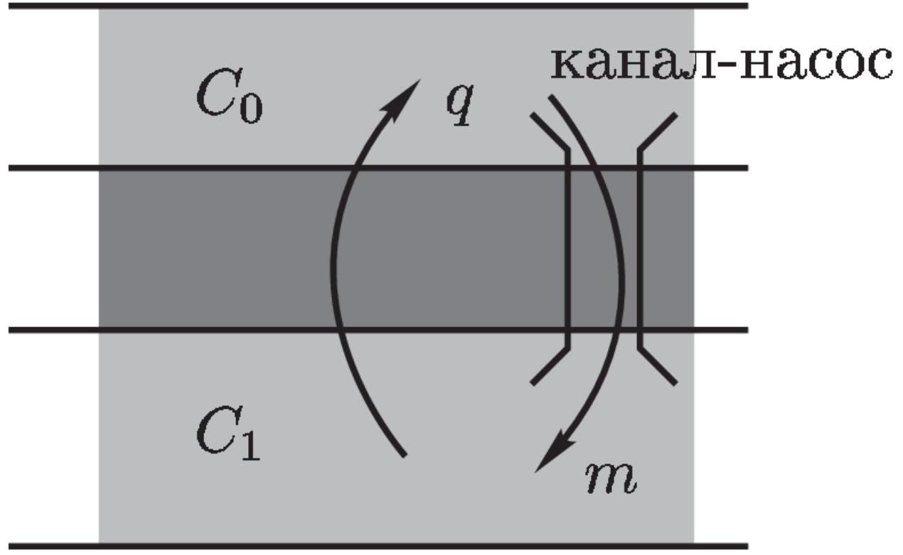
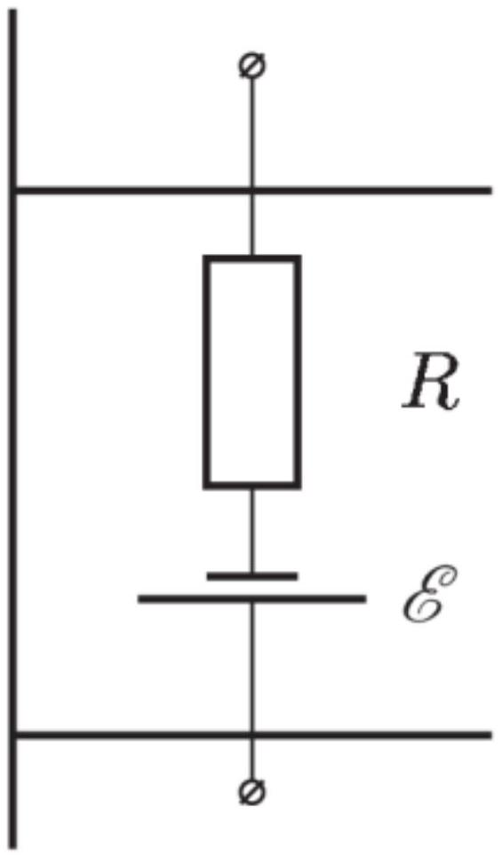

А. Ходжкин и Э. Хаксли получили Нобелевскую премию по физиологии и медицине в 1963 г. «за открытия, касающиеся ионных механизмов, участвующих в возбуждении и торможении в периферическом и центральном участках мембраны нервной клетки».

Основой жизнедеятельности живых организмов во многом являются процессы, протекающие в мембранах клеток. В данной задаче Вам необходимо рассмотреть некоторые подходы к описанию процесса возбуждения нервных клеток в рамках примитивной модели.

Основная идея теории возбуждения клетки заключается в описании процессов переноса ионов через мембрану (рис. 1). Проницаемость мембраны различна для различных ионов, кроме того, в мембрану встроены большие белковые молекулы, играющие роль насосов, способных пере-носить ионы определённого типа с одной стороны мембраны на другую (затрачивая на это энергию). Благодаря наличию этих каналов-насосов концентрации ионов различны с разных сторон от мембраны, и как следствие появляется разность электрических потенциалов между противоположными стенками мембраны.

Рис. 1

Ещё более упростим модель. Будем считать, что мембрана является плоскопараллельной пластинкой толщиной $a$ (рис. 2). Снаружи клетки находится слой жидкости (воды) толщиной $h_{0}$, а внутриклеточное пространство моделируется слоем жидкости толщиной $h_{1}$. Диэлектрические проницаемости всех сред будем считать равными единице. Концентрации частиц вне клетки будем обозначать $C_{0}$, а внутри - $C_{1}$ (при необходимости будем добавлять индексы, указывающие тип частиц).

Рис. 2

## Диффузия

Рассмотрим движение незаряженных молекул через мембрану без «насосов» (считаем, что электрических зарядов в природе не существует) (рис. 3). Плотность диффузионного потока частиц $q$ (число частиц, пересекающих единицу площади мембраны в единицу времени) пропорционально разности концентраций этих частиц с противоположных сторон мембраны:

$$
q=g \Delta C,
$$

где $g$ - коэффициент пропорциональности, который назовём проницаемостью мембраны для данных частиц.

Пусть в начальный момент времени концентрации рассматриваемых частиц с разных сторон мембраны различны.

Рис. 3

А1 Оцените время, в течении которого концентрации частиц выровняются.

## Вынужденный перенос и диффузия

Рассмотрим теперь мембрану, в которую встроены каналы-насосы, принудительно переносящие рассматриваемые молекулы внутри клетки. Пусть эти каналы равномерно распределены по поверхности мембраны, причём на единицу площади приходится $n$ каналов, каждый из которых переносит в единицу времени $m$ молекул из внеклеточного пространства внутрь клетки (рис. 4).

Рис. 4

А2 Определите установившуюся разность концентраций $\Delta \bar{C}=C_{0}-C_{1}$ между разными сторонами мембраны.

## Электрическое поле

Далее будем считать, что рассматриваемые частицы являются ионами калия $\mathrm{K}^{+}$. Пусть концентрация ионов вне клетки равна $C_{0}$, а внутри неё $C_{1}$.
АЗ Найдите разность потенциалов между стенками мембраны $\Delta \varphi$, пренебрегая наличием ионов внутри мембраны.

## Перенос ионов

При наличии электрического поля помимо потока ионов через мембрану, обусловленного разностью концентрации, появляется поток ионов, обусловленный наличием электрического поля. В этом случае суммарная плотность потока ионов через мембрану определяется формулой

$$
q=g \Delta C+b C_{i} \Delta \varphi,
$$

где $\Delta \varphi$ - разность потенциалов между стенками мембраны, $C_{i}$ - концентрация ионов с той стороны мембраны, от которой начинается движение ионов через мембрану под действием электрического поля (для положительных ионов со стороны большего потенциала).

Рис. 5

А4 Найдите установившуюся разность потенциалов между стенками мембраны. Используйте все характеристики мембраны, введённые в предыдущих пунктах. При равенстве концентраций с разных сторон от мембраны эти концентрации равны $C_{e}$.

Как показали А. Ходжин и Э. Хаксли, для объяснения возникновения нервных импульсов необходимо принимать во внимание как минимум два типа ионов. Вторым основным типом ионов являются ионы $\mathrm{Na}^{+}$. В мембране также присутствуют натриевые канал-насосы, принудительно переносящие ионы натрия из клетки наружу.
Будем считать, что для обоих типов ионов известны параметры эквивалентных схем $R_{\mathrm{K}}, \mathcal{E}_{\mathrm{K}}$, и $R_{\mathrm{Na}}, \mathcal{E}_{\mathrm{Na}},\left(\mathcal{E}_{\mathrm{Na}}>\mathcal{E}_{\mathrm{K}}\right)$. Пусть изначально все натриевые каналы закрыты, а затем в некоторый момент времени открываются на небольшой промежуток времени $\tau$.

A5 Опишите, как будет изменяться разность потенциалов между стенками мембраны с течением времени. Постройте примерный график этой зависимости.

Если вы решили правильно, то полученный график и будет моделировать временной ход нервного импульса!
