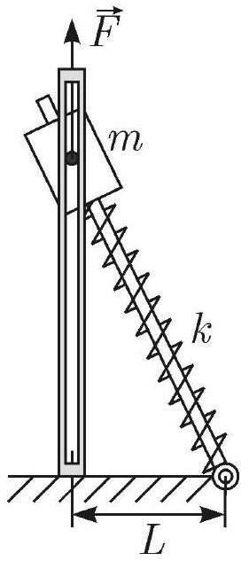
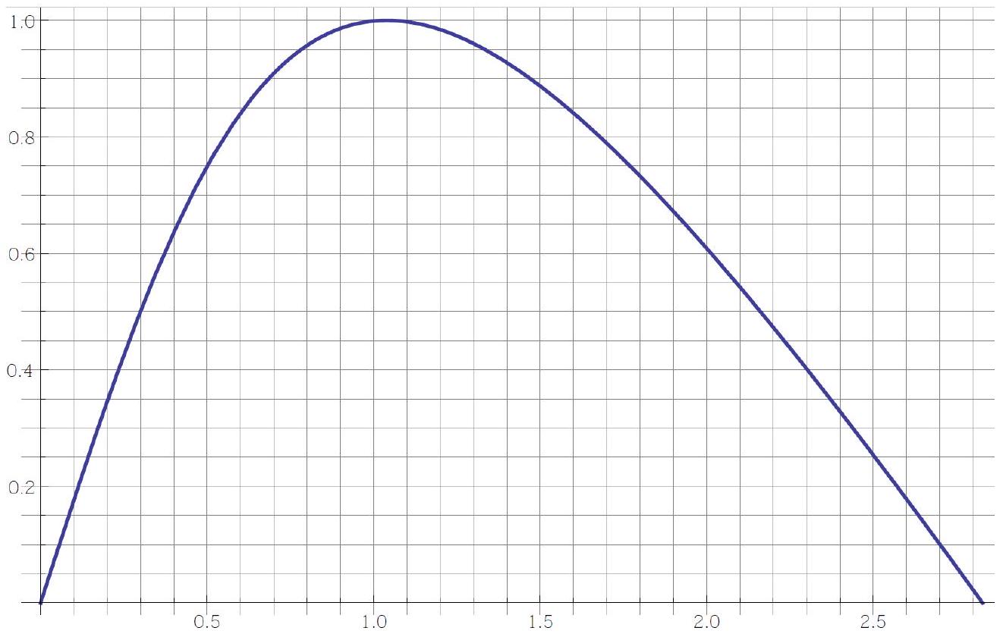

Деталь массой $m$ может перемещаться без трения вдоль вертикальных направляющих и свободно вращаться вокруг горизонтальной оси, перпендикулярной направляющим и плоскости чертежа. В детали имеется сквозное отверстие, в которое вставлена гладкая лёгкая штанга, один конец которой шарнирно закреплен на горизонтальной плоскости на расстоянии $L$ от основания вертикальных направляющих (рис. 1). Между деталью и шарниром на штангу надета прикрепленная к ним пружина с коэффициентом жесткости $k$. Длина свободной пружины $3 L$. К детали привязана легкая нить, которая в исходном состоянии натянута направленной вертикально вверх силой $F=m g$.

А1 Какой должна быть минимальная масса $m_{\min }$ детали, чтобы при медленном (квазистатическом) уменьшении силы $F$, деталь смогла под действием силы тяжести перевести штангу в горизонтальное положение. Трение не учитывать.

Если уменьшить силу $F$ до нуля мгновенно, то деталь может перевести штангу в горизонтальное положение при меньшей массе $m_{1}$. На графике отображена зависимость проекции силы упругости на вертикальную ось, в относительных единицах, от расстояния от груза до горизонтальной плоскости.

А2 Определите массу $m_{1}$, используя предоставленный график.
АЗ Силу $F$ устранили (обрезали нить), а груз массы $m_{1}$ перевели в устойчивое положение равновесия. Определить период малых колебаний вблизи этого положения.
