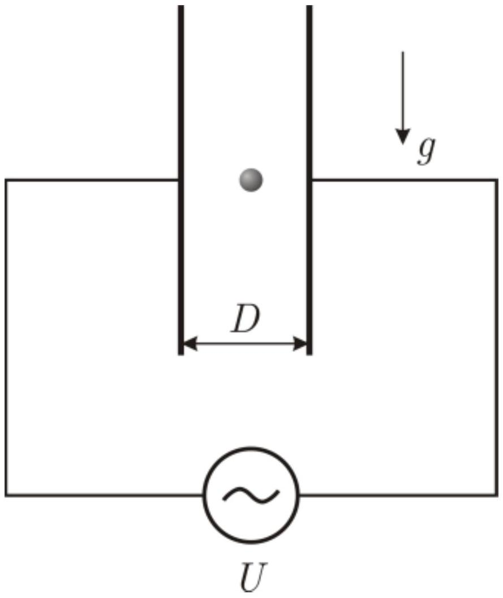

Часть А. Быстрые колебания
Свободная молекула соляной кислоты ( HCl ) представляет собой электрический диполь длиной $L=0.0215$ нм и с зарядами атомов $+q$ и $-q$ ( $q=1.6 \cdot 10^{-19}$ Кл). Молекулу поместили в однородное электрическое поле напряженностью $E=30$ кВ/см. Массы атомов водорода и хлора, соответственно равны $m_{1}=1.67 \cdot 10^{-27}$ г и $m_{2}=59.2 \cdot 10^{-27}$ г.

A1 ${ }^{2,00}$ Найдите период $T_{0}$ малых колебаний диполя.
А2 ${ }^{2.00}$ Оцените (с точностью не хуже $5 \%$ ) минимальное время $\tau$, за которое диполь повернётся из положения, в котором его ось перпендикулярна силовым линиям электрического поля, в положение, в котором эта ось параллельна линиям поля.

Примечание. При отклонении диполя на большой угол $\varphi_{\max }$, период его колебаний будет зависеть от угла $\varphi_{\max }$ по закону:

$$
T=T_{0}\left[1+\sum_{k=1}^{\infty}\left(\frac{(2 k-1)!!}{(2 k)!!}\right)^{2} \sin ^{2 k}\left(\frac{\varphi_{\max }}{2}\right)\right]
$$

Двойной факториал определяется так: $k!!=k \cdot(k-2) \cdots \cdots a$, где $a=2$ для чётных $k$ и $a=1$ для нечётных $k$.
Часть В. Медленные колебания
В камере, откачанной до глубокого вакуума, расположен плоский конденсатор, пластины которого вертикальны. Расстояние между пластинами $D$. В центре конденсатора находится маленький шарик (его удельный заряд $q_{1}$ ). К обкладкам конденсатора приложено переменное напряжение $U=U_{0} \sin \omega t$. В момент, когда напряжение обратилось в ноль, шарик отпустили. Через некоторое время $\tau$ шарик столкнулся с пластиной конденсатора. Опыт повторили, но на этот раз к конденсатору приложили напряжение $U=U_{0} \sin ^{2} \omega t$. В момент, когда напряжение обратилось в ноль, шарик вновь отпустили и он опять попал в то же место пластины конденсатора.

В $1^{10.00}$ Определите частоту $\omega$ источника переменного напряжения, если известно, что $T \gg \tau$. Здесь $T$ - период колебаний напряжения на генераторе.
