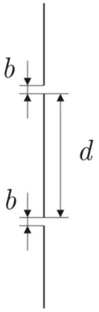

Для оценки степени монохроматичности источника, излучающего в окрестности линии волны $\lambda=500$ нМ, использовали интерференционную схему Юнга (расстояние между щелями в непрозрачном экране $d=1 \mathrm{~cm}$ ). Плоскость наблюдения была удалена в зону Фраунгофера. Визуально наблюдались лишь полосы, интенсивность которых составляла не менее $4 \%$ интенсивности нулевой полосы. Оказалось, что при изменении ширины щелей от значения $b_{1}=0.5 \mathrm{~mm}$ до $b_{2}=0.1 \mathrm{~m}$ число наблюдаемых полос возрастает от $N_{1}=40$ до $N_{2}=80$.

Экран
$N$ полос

А1 ${ }^{3.00}$ Оцените ширину спектра излучения $\Delta \lambda / \lambda$.
