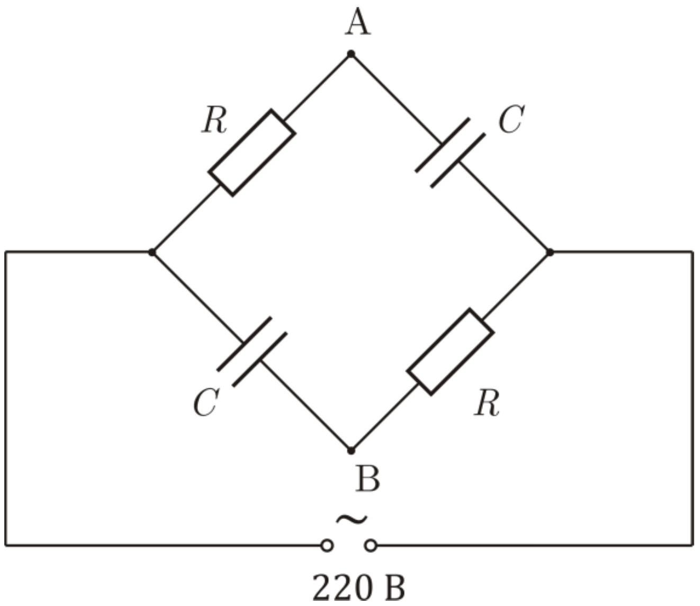

Электрическая цепь, состоящая из двух одинаковых конденсаторов по 10 мкФ и двух резисторов по 1 кОм, подключена к источнику переменного напряжения 220В, 50Гц.

А1 Что покажет идеальный вольтметр, подключенный между клеммами $A$ и $B$ ?
А2 Какую силу тока покажет идеальный амперметр, подключенный к клеммам $A$ и $B$ вместо вольтметра?
АЗ Какие показания будут у ваттметра, высокоомную обмотку (обмотку напряжения) которого подключить непосредственно к сети 220 В, а низкоомную (токовую) - между клеммами $A$ и $B$ ?

Ваттметр - прибор, который в каждый момент времени измеряет значения напряжения на одной из своих обмоток и тока через другую, после чего перемножает их и усредняет полученную мощность по большому временному интервалу.
