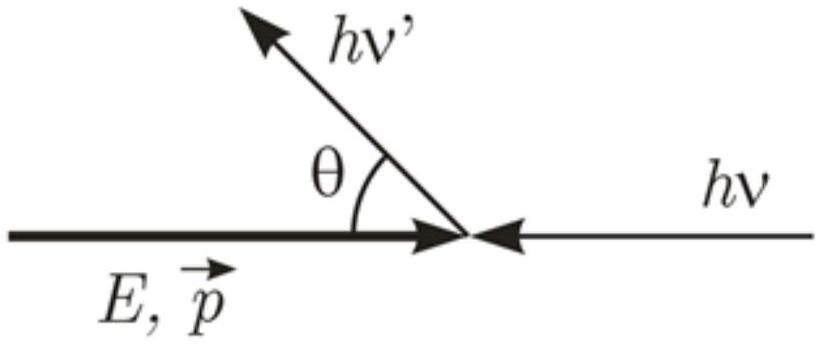

При столкновении с быстрым электроном фотон может получить от него энергию. Этот процесс называется обратным Комптоновский рассеянием. Этот феномен имеет большое значение в астрофизике, к примеру, он предоставляет механизм появления рентгеновского излучения и гамма-излучения в космосе.

Электрон с полной энергией $E$ (его кинетическая энергия больше чем энергия покоя) и низкоэнергетичный фотон (его энергия меньше энергии покоя электрона) с частотой $\nu$ движутся в противоположных направлениях и сталкиваются друг с другом. Фотон рассеивается под углом $\theta$ к начальному направлению.

В1 ${ }^{4.80}$ Выразите энергию рассеянного фотона через $E, \nu, \theta$ и энергию покоя электрона $E_{0}$. Найдите значение $\theta$, при котором энергия рассеянного фотона максимальна и значение этой энергии.

В2 ${ }^{2.40}$ Предположим, что энергия электрона $E$ до столкновения много больше его энергии покоя $E_{0}$, т.е. $E=\gamma E_{0}, \gamma \gg 1$, и начальная энергия фотона много меньше чем $\frac{E_{0}}{\gamma}$, найдите приближенное выражение для максимальной энергии рассеянного фотона. Приняв, что $\gamma=200$ и начальная длинна волны фотона видимого света $\lambda=500$ нМ, найдите максимальную энергию и соответствующую длину волны рассеянного фотона. Энергия покоя электрона $E_{0}=0.511\,\mathrm{MeV}$, постоянная планка $h=6.63 \cdot 10^{-34}$ Дж • с, скорость света в вакууме $c=3 \cdot 10^{8}\,\mathrm{м} / \mathrm{c}$.

Вз ${ }^{1.40}$ Электрон с энергией $E$ и фотон двигаются в противоположных направлениях и сталкиваются друг с другом. Найдите начальную энергию фотона, при которой он получит максимум энергии от столкновения с электроном. Найдите энергию рассеянного фотона в этом случае.

В4 ${ }^{1.40}$ Электрон с энергией $E$ и фотон сталкиваются, двигаясь в перпендикулярном друг к другу направлении. Найдите в этом случае начальную энергию фотона, при которой он получит максимум энергии при столкновении с электроном. Найдите энергию рассеянного фотона в этом случае.
