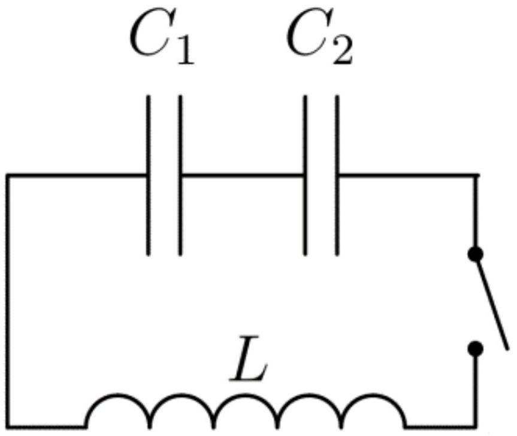

Цепь, состоящая из двух конденсаторов ёмкостью $C_{1}, C_{2}$ и катушки с индуктивностью $L$, первоначально разомкнута. Конденсатор $C_{1}$ заряжают до разности потенциалов $V$, а конденсатор $C_{2}$ остаётся незаряженным.

A1 ${ }^{3.00}$ Определить максимальную величину силы тока в цепи и максимальное напряжение на конденсаторе $C_{2}$ после замыкания ключа.
