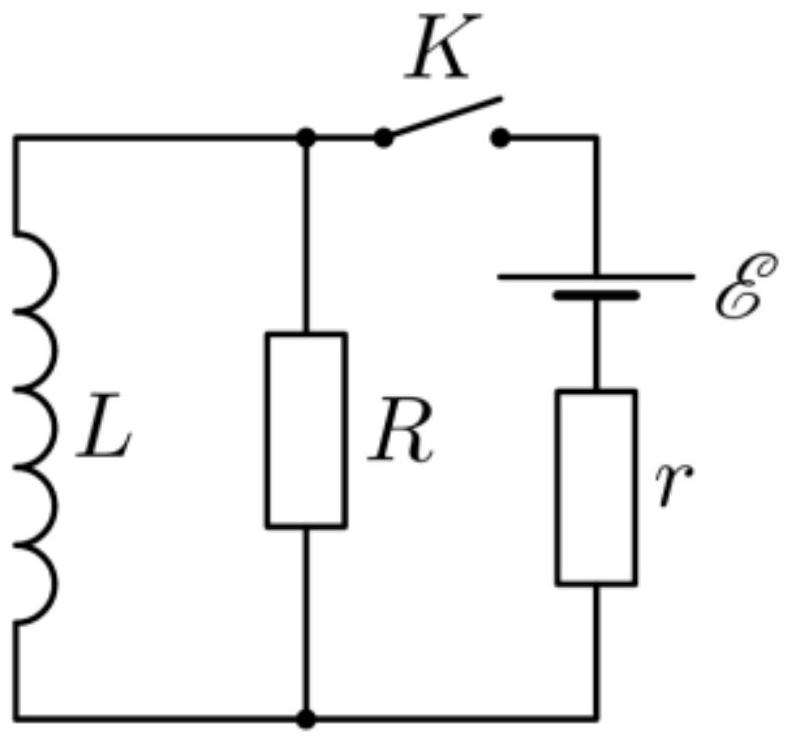

В цепи, показанной на рисунке, до замыкания ключа ток отсутствовал. Параметры элементов даны.

А1 ${ }^{2.00}$ Какой заряд протечёт через резистор $R$ после замыкания ключа?
А2 ${ }^{2.00}$ Сколько тепла выделится в резисторе $R$ после замыкания ключа?
