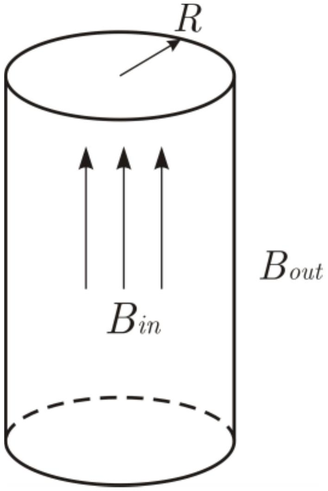

Внутри длинного соленоида радиуса $R$ напряженность магнитного поля взрастает со временем по линейному закону $B_{\text {in }}=\alpha \cdot t$. Снаружи в плоскости перпендикулярной оси соленоида и проходящей через его середину можно считать, что поле $B_{\text {out }}=0$.

А1 ${ }^{4.00}$ Определите внутри и вне соленоида напряженность электрического поля $E$ как функцию $r$ - расстояния от оси соленоида. Постройте график $E(r)$.
T
Электромагнетизм
2014
Сборы XY
Y
Электромагнитная индукция
Катушка
