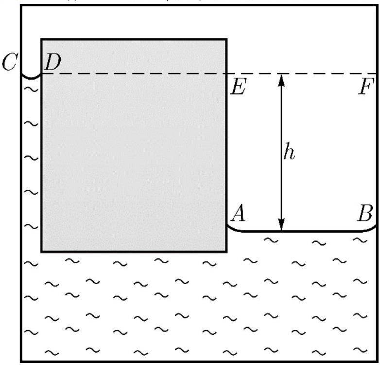
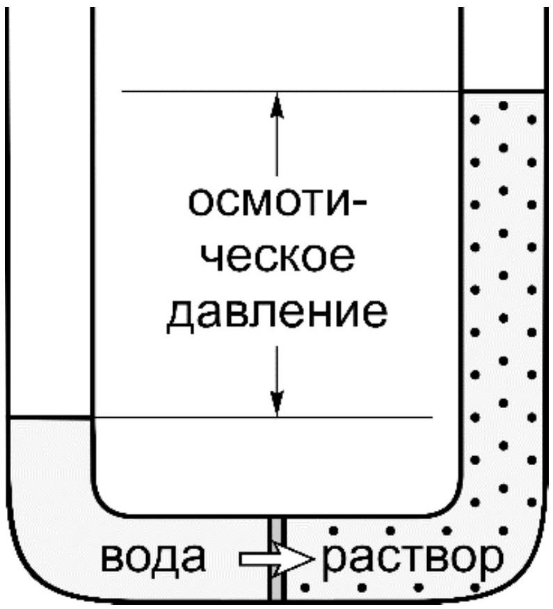
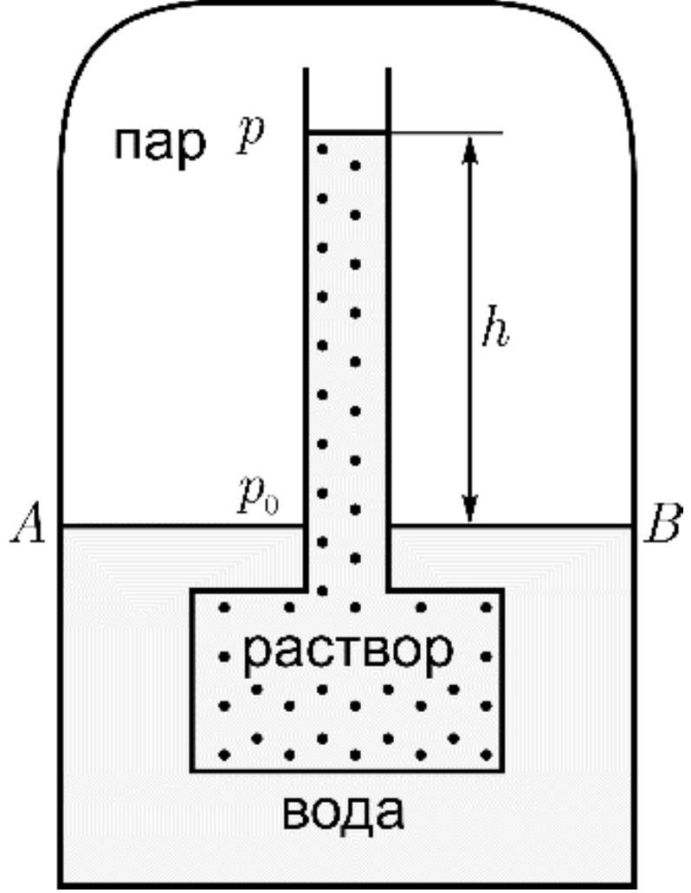

Жидкости могут переходить в твердое и газообразное состояние - фазовые переходы первого рода (то есть переходы связанные с поглощением или выделением тепла). Эти переходы происходят при постоянных температурах. В таблицах эти температуры обычно предоставляются для нормальных условиях. Но их значение зависит от множества факторов. В этой задаче предлагается рассмотреть некоторые из них (рассматриваются только фазовые переходы первого рода).

Кривая фазового перехода вещества из состояния 1 в состояние 2 описывается уравнением Клапейрона - Клаузиуса

$$
\frac{d p}{d T}=\frac{q_{12}}{T\left(v_{2}-v_{1}\right)}
$$

где $p$ - давление, $T$ - температура, $q_{12}$ - удельная теплота фазового перехода $1 \rightarrow 2, v_{1}, v_{2}$ - удельные объемы.
А1 ${ }^{0.20}$ При какой температуре кипит вода в Швейцарии на пике Дюфур на высоте 4634 м, если давление там 430 мм.рт.ст. Нормальное давление 760 мм.рт.ст. В нормальных условиях вода кипит при $100^{\circ} \mathrm{C}$.

Оказывается, явление поверхностного натяжения $\sigma$ жидкости может влиять на давление насыщенных паров вещества над искривленной поверхностью ( $K$ - кривизна поверхности, величина обратная радиусу кривизны).

А2 ${ }^{0.10}$ Найдите давление Лапласа в случае цилиндрической поверхности - разница давлений по разные стороны от искривленной поверхности жидкости. Выразите ответ через $\sigma, K, p_{a}$ (атмосферное давление) и физические константы.

А3 ${ }^{0.10}$ Найдите давление Лапласа в случае сферической поверхности. Выразите ответ через $\sigma, K, p_{a}$ (атмосферное давление) и физические константы.
А4 ${ }^{0.10}$ Рассмотрим пузырек в жидкости. Где давление больше: внутри (IN) пузырька или снаружи (OUT)?

В следующей части задачи рассмотрите, как кривизна поверхности жидкости влияет на давление насыщенных паров. Для решения рассмотрите сообщающиеся цилиндрические сосуды, помещенные в термостат, поддерживающий температуру $T$, (Рис. 1 - изображен случай, когда жидкость смачивает стенки сосудов) такие, что ширина одного из сосудов позволяет наблюдать капиллярный эффект. Давление паров над плоской поверхностью $A B-p_{1}$, над $C D-p_{2}, K$ - кривизна поверхности $C D$. Удельный объем жидкости $v_{L}$, пара $v_{G}$ (считайте, что плотность пара меняется слабо при изменении высоты на $h$ ).

Рис. 1. Давление насыщенного пара над искривленной поверхностью

A5 ${ }^{0.20}$ Выразите $h$ через $\sigma, K, v_{L}, v_{G}, T, \mu$ и физические константы ( $\mu$ - молярная масса).

А6 ${ }^{0.40}$ Пусть жидкость смачивает стенки сосуда. Выразите разницу давлений $p_{2}-p_{1}$ через $\sigma, K, v_{L}, v_{G}, T, \mu$ и физические константы.

A7 ${ }^{0.10}$ Каким будет ответ, если жидкость не будет смачивать стенок сосуда? Выразите ответ через $\sigma, K, v_{L}, v_{G}, T, \mu$ и физические константы.

А8 ${ }^{0.40}$ При большой кривизне ( $\left.\sigma \mathrm{K} \gg\left|\mathrm{P} \_2-\mathrm{P} \_1\right|\right) \sigma K \gg\left|p_{2}-p_{1}\right|$ поверхности уже нельзя считать плотность пара постоянной. Какой будет разность давлений $p_{2}-p_{1}$ в этом случае? Выразите ответ через $\sigma, K, v_{L}, v_{G}, T, \mu$ и физические константы.

В следующей части задачи предлагается рассмотреть, как изменятся условия фазовых переходов если растворить в жидкости какое-либо вещество. Первое, что следует рассмотреть это осмос - процесс односторонней диффузии через полупроницаемую мембрану. Эта мембрана пропускает только молекулы растворителя. Молекулы растворителя диффундируют туда, где концентрация растворенного вещества больше. Концентрация молекул растворителя $n$, растворенного вещества $n_{s}$. Вследствие этого явления возникает осмотическое давление $p_{o s}$ - избыточное давление в растворе, при котором прекращается диффузия молекул растворителя. На Рис. 2 изображен осмометр, прибор для измерения осмотического давления.

Рис. 2. Осмометр

В1 ${ }^{0.50}$ Выразите осмотическое давление $p_{o s}$ для слабого раствора (раствора с малой концентрацией растворенного вещества). Выразите ответ через $p_{a}, n$, $n_{s}, T$ и физические константы.

Рассмотрите как меняется давление насыщенных паров, если растворить в жидкости малое количество какого-либо вещества. На Рис. 3 раствор и вода разделены полупроницаемой мембраной, $p_{0}$ - давление насыщенных паров над водой, $p$ - над раствором.

В2 ${ }^{0.50}$ Выразите разницу $p-p_{0}$ через $v_{L}, v_{G}, p_{o s}$ и физические константы.

В3 ${ }^{0.30}$ Выразите разницу $p-p_{0}$ через $p_{0}, n, n_{s}$ и физические константы.

В следующей части задачи рассмотрите три фазы вещества ( 1 — жидкость, 2 — пар, 3 — твердое тело, $q_{21}, q_{23}, q_{13}$ — удельные теплоты выделяющиеся при переходах $2 \rightarrow 1,2 \rightarrow 3$ и $1 \rightarrow 3$ соответственно, $q_{21}>0, q_{23}>0, q_{13}>0$ ). Рассмотрите точку трехфазного равновесия (тройная точка).

С1 ${ }^{2.00}$ Считая разницу между $p$ и $p_{0}$ малой, найдите изменение температуры кипения жидкости при растворении в ней какого-либо вещества. Выразите ответ через $\mu, T, q_{12}, n_{s}, n$ и физические константы.

C2 ${ }^{0.30}$ Каков знак изменения температуры кипения жидкости при растворении в ней чего-либо?

С3 ${ }^{1.50}$ Выразите $q_{23}$ через $q_{13}$ и $q_{21}$ в тройной точке.

C4 ${ }^{1.00}$ В координатах $(p, T)$ изобразите качественно кривые равновесия между всеми тремя фазами вблизи тройной точки. Считайте, что $v_{G} \gg v_{L}$ и $v_{G} \gg v_{s}$ (удельный объем твердого вещества).

С5 ${ }^{2.00}$ Найдите изменение температуры замерзания жидкости при растворении в ней какого-либо вещества. Выразите ответ через $\mu, T, q_{13}, n_{s}, n$ и физические константы.

C6 ${ }^{0.30}$ Каков знак изменения температуры замерзания жидкости при растворении в ней чего-либо?
