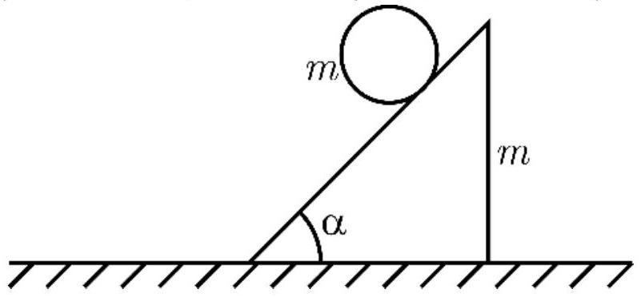

На горизонтальной поверхности находится клин массы $m$ с углом $\alpha=45^{\circ}$ при основании, на клине - обруч такой же массы $m$, радиуса $R$ (Рис. 1). Систему отпускают без начальной скорости.
Во всех пунктах задачи можно считать, что обруч не проскальзывает, и клин не опрокидывается. Ускорение свободного падения равно $g$.

А1 ${ }^{1.00}$ Найдите ускорение $a_{C}$ центра обруча при достаточно большом коэффициента трения между клином и горизонтальной поверхностью.
A2 ${ }^{2.00}$ При каком минимальном коэффициенте трения $\mu_{\text {min }}$ между клином и горизонтальной поверхностью клин останется неподвижным?
А3 ${ }^{2.00}$ С каким ускорением $a_{p 0}$ будет двигаться клин, если горизонтальная поверхность гладкая?
А4 ${ }^{3,00}$ Как изменится ответ в предыдущем пункте, если к клину приложить горизонтальную силу $F$, направленную влево? Т.е. найдите ускорение $a_{p F}$ клина в этом случае.

А5 ${ }^{2.00}$ Найдите ускорение клина $a_{p}$ при произвольном коэффициенте трения $\mu$ между клином и горизонтальной поверхностью (при отсутствии силы $F$ ).
