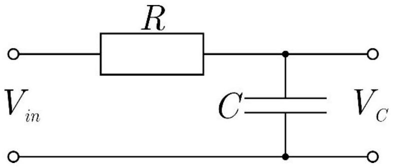
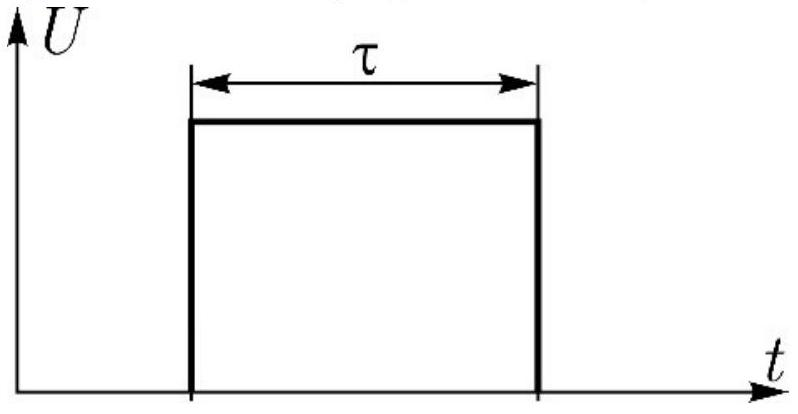
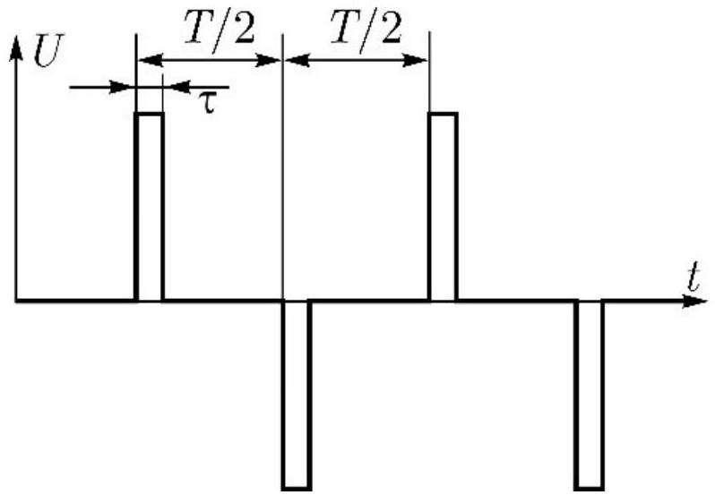
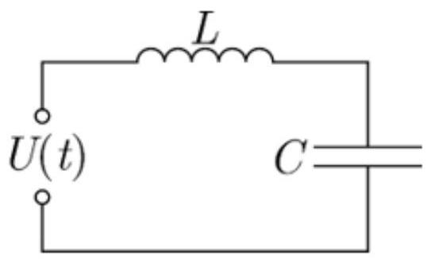
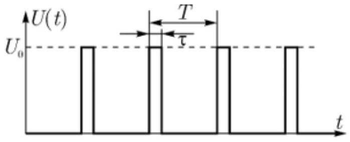

Электрический ток характеризуется силой тока и его частотой. Иногда на практике при подаче на вход определенного периодического напряжения хочется отсеять некоторые частоты. Схемы, которые позволяют добиться такого результата называются фильтрами. В этой задаче рассмотрите простейший фильтр нижних частот: $R C$-цепь (см.рис).

Часть А. Гармонический сигнал (0.8 балла)
А1 ${ }^{0.30}$ На вход подаётся сигнал с амплитудой напряжения $V_{\text {in }}$ с циклической частотой $\omega$.
Определите амплитуду напряжения выходного сигнала $V_{C}$. Выразите ответ через $V_{\text {in }}, \omega, R, C$.
А2 ${ }^{0.20}$ Изобразите на графике амплитудно-частотную характеристику выходного сигнала.
А3 ${ }^{0.30}$ Пусть на вход подан сигнал вида $\sum_{i} V_{i n} \sin \omega_{i} t$ (для любого $i$ выполняется условие: $\omega_{i}<\omega_{i+1}$ ). Тогда выходной сигнал будет иметь вид $\sum_{i} V_{i} \sin \left(\omega_{i} t+\phi_{i}\right)$. Какая величина больше: $V_{i}$ или $V_{i+1}$ ?

Часть В. Одиночный прямоугольный импульс (1.0 балла)

Однако входной сигнал не всегда имеет синусоидальную форму (или форму конечной суммы синусов). В следующей части задачи рассмотрите одиночный прямоугольный импульс (см. рис.2) амплитудой $U$ и продолжительностью $\tau$, поданный на $R C$-цепь.

В $1^{0.80}$ Рассмотрите короткий «баллистический» импульс $(\tau \ll R C)$.
Каково будет максимальное выходное напряжение $U_{C M}$ в таком процессе? Выразите ответ через $U, \tau, R, C$.
В2 ${ }^{0.20}$ Как изменится максимальное выходное напряжение $U_{C M}$, если амплитуду импульса увеличить вдвое, а продолжительность уменьшить вдвое? Т.е. найдите отношение $U_{C M 2} / U_{C M 1}$.

Часть С. Периодические прямоугольные импульсы (6.2 балла)

Рассмотрите входной периодический сигнал, состоящий из последовательных коротких прямоугольных импульсов направленных в разные стороны. Период сигнала $T$, амплитуда сигнала $U$, продолжительность импульса $\tau$. Скважностью называется величина $S=2 \tau / T$. Введем также безразмерную величину $A=T / R C$.

С1 ${ }^{1.00}$ Изобразите качественно график зависимости выходного сигнала от времени в установившемся режиме.
С2 ${ }^{1.50}$ Определите отношение амплитуды выходного сигнала к амплитуде входного сигнала $U_{M} / U$. Выразите ответ через $A$ и $S$.
с3 ${ }^{0.70}$ Считая $S \ll 1$ и $A \gg 1$ найдите в первом приближении такое $A$, при котором $U_{M} / U=1 / 2$. Выразите ответ через $S$.
С4 ${ }^{1.00}$ Методом последовательных итераций найдите $A$, при котором $U_{M} / U=1 / 2$, с точностью до четвертой значащей цифры для $S_{1}=1 ; S_{2}=0.3$; $S_{3}=0.1 ; S_{4}=0.01 ; S_{5}=0.001$.

С5 ${ }^{1.00}$ Изобразите качественно графики зависимости $U_{M} / U$ от $A$ в логарифмическом масштабе по $A$ при $S_{1}=1 ; S_{2}=0.3 ; S_{3}=0.1 ; S_{4}=0.01 ; S_{5}=0.001$

с6 ${ }^{1.00}$ Изобразите качественно графики нормированной зависимости $U_{M} /(U S)$ от $A$ в логарифмическом масштабе по обеим координатам при $S_{3}=0.1$; $S_{4}=0.01$.

Часть D. Прямоугольные импульсы в LC контуре (2.0 балла)
Рассмотрим теперь идеальный $L C$ контур.

D1 ${ }^{2.00}$ В момент $t=0$ контур с собственной частотой $f=100$ Гц возбуждается периодической последовательностью прямоугольных импульсов длительностью $\tau=0.02$ с (Рис. 4). Амплитуда импульсов $U_{0}=5$ В. Найдите период следования импульсов $T$ при котором среднее значение напряжения на конденсаторе $U_{\mathrm{cp}}=2$ В. Постройте график зависимости $U_{C}(t)$. Приведите на графике все характерные значения.
T
Цепи
Конденсатор
RC-цепи
Колебательный контур
2016
Сборы XY
Y
Переменный ток
Вынужденные колебания

- Website in English

2020 - Мы те, кого должны превзойти.
