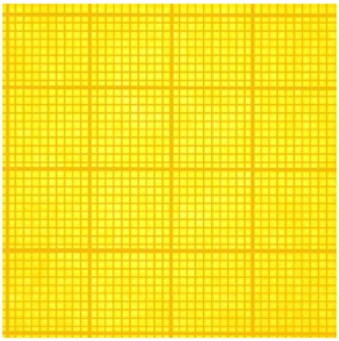
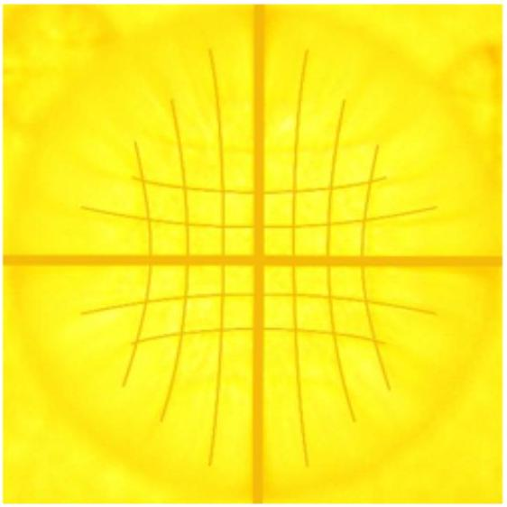

Стеклянный шар положили на лист миллиметровой бумаги.

Используя приведенные ниже фотографии, вычислите показатель преломления стекла. Приведите расчетные формулы.

Примечание 1: Вы можете пользоваться линейкой.
Примечание 2: Поскольку на второй фотографии фотоаппарат сфокусирован на шар, миллиметровая бумага, выступающая за шар, кажется размытой.

Без шарика

С шариком
