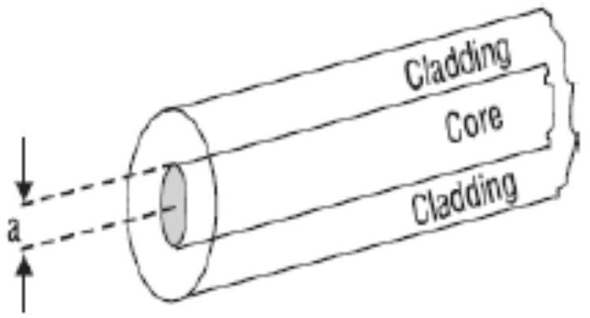
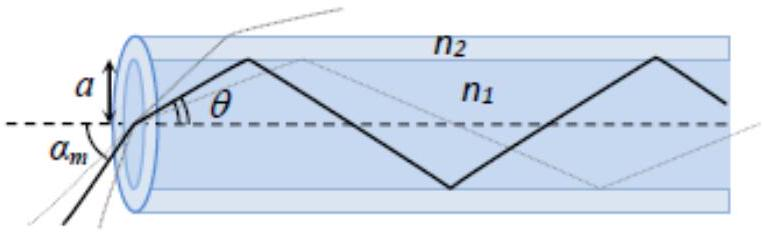

Оптическое волокно представляет собой два стеклянных соосных цилиндра, один внутри другого, радиус внутреннего цилиндра $a$ (рис.1). Показатель преломления внешнего цилиндра (cladding) ${ }_{2}$ немного меньше показателя преломления внутреннего цилиндра (core) $n_{1}$. Таким образом, свет может распространяться внутри волокна за счет полного внутреннего отражения на границе слоев.

Определим параметр $\Delta=\frac{n_{1}^{2}-n_{2}^{2}}{2 n_{1}^{2}}$. Обычно $\Delta \ll 1$, поэтому можно считать, что $\Delta=\frac{\left(n_{1}+n_{2}\right)\left(n_{1}-n_{2}\right)}{2 n_{1}^{2}} \approx \frac{n_{1}-n_{2}}{n_{1}}$. В рамках данной задачи примем следующие значения для описанных выше параметров: $a=25$ мкм, $n_{1}=1,45, \Delta=0,01$.

Рассмотрим луч света, падающий с торца волокна под углом $\alpha$ к оси волокна. Будем считать, что волокно находится в вакууме. Существует критическое значение этого угла $\alpha_{m}$, при котором падающий луч внутри волокна еще испытает полное внутренне отражение. Синус этого угла называется числовой апертурой волокна и обозначается как $N A$ (numerical aperture).

А1 ${ }^{1.50}$ Выразите числовую апертуру $N A$ через параметры волокна $n_{1}$ и $\Delta$ и вычислите её значение. Чему при этом равен критический угол $\alpha_{m}$ ?
А2 ${ }^{2.50}$ Если волокно изогнуть под малым радиусом кривизны, то часть света начнет покидать волокно. Чему равен радиус кривизны $r$, при котором свет падающий под углом $\alpha=0.99 \alpha_{m}$ начнет выходить из волокна?

A3 ${ }^{1.50}$ Несмотря на то, что свет не покидает волокно, интенсивность света затухает экспоненциально с расстоянием за счет поглощения по закону Бугера-Ламберта-Бера. Ослабление интенсивности измеряется в единицах децибел/км (дБ/км). Если изначальная интенсивность $P_{1}$ уменьшилась до $P_{2}$, то затухание равно $10 \log _{10} P_{1} / P_{2}$ децибел. Чему будет равна интенсивность света на выходе волокна длиной 40 кМ, если затухание в волокне равно 5 дБ/км, а интенсивность на входе 5 мВт.

A4 Лучи, входящие под бо́льшими углами, проходят больший оптический путь и соответственно за большее время. В результате короткий импульс света становится шире. Это явление называется интермодальная дисперсия (intermodal dispersion). Рассмотрим волокно с описанными выше параметрами и длиной $L=1$ км. Допустим, что короткий импульс света падает на торец волокна в виде пучка лучей под всевозможными углами. Найдите максимальную возможную длину импульса света $\tau_{i}$ (дисперсию во времени) на выходе волокна. Считать, что длина импульса света на входе намного меньше $\tau_{i}$.

А5 ${ }^{1.50}$ Кварцевое стекло, из которого сделано волокно, обладает хроматической дисперсией из-за того, что показатель преломления зависит от длины волны света. В результате короткий импульс немонохроматичного света будет длиннее (по времени) на выходе волокна, чем на входе из-за того, что свет с разной длиной волны распространяется с разной скоростью. Пусть источник света имеет спектральную ширину $\Delta \lambda=20$ нМ, а дисперсия материала волокна $\frac{d n}{d \lambda}=2 \cdot 10^{-5}$ нм $^{-1}$. Найдите максимальную возможную длину импульса света $\tau_{\mathrm{c}}$ (дисперсию во времени) на выходе волокна длиной $L=1$ км. Считать, что длина импульса света на входе намного меньше $\tau_{\mathrm{c}}$. В данном случае считать, что все лучи распространяется под малым углом к оси волокна, и поэтому интермодальной дисперсией можно пренебречь.

A6 Оптические волокна широко используются в телекоммуникационной индустрии и в частности для передачи данных в Интернете. В этом случае большую роль играет максимальная скорость передачи информации, которая измеряется в единицах бит/сек. Явления, описанные выше, накладывают ограничения на эту скорость. В простейшем случае можно считать, что каждому биту соответствует отдельный импульс света. Если задержка между двумя отдельными импульсами на выходе из волокна становится меньше, чем дисперсия во времени, то информация теряется. Таким образом дисперсия задает нижнюю грань на минимальное время между соседними импульсами и соответственно максимальную грань на их частоту и скорость передачи данных. Оцените максимальную скорость передачи данных для волокна длиной $L=10$ км и параметрами как в предыдущих пунктах. Считайте, что при наличии нескольких независимых факторов, вносящих вклад в дисперсию, общая дисперсия считается как $\tau_{0}=\sqrt{\tau_{1}^{2}+\tau_{2}^{2}}$.
