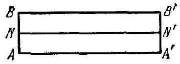
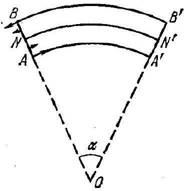
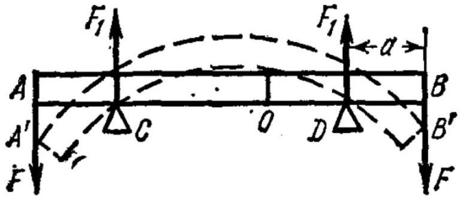
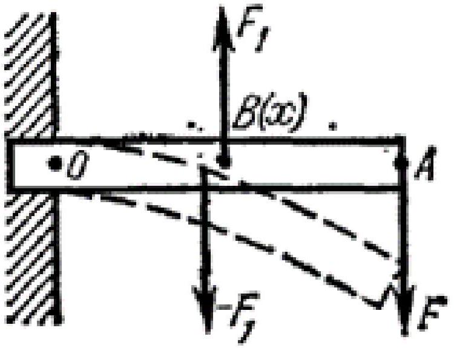

## Часть А. Определение модулей упругости

При различного рода деформациях в твёрдом теле возникают напряжения. Пусть при деформировании некоторая точка тела, которая имела координату $x$, смещается на величину $s$. Если бы смещение было одним и тем же для всех точек тела, мы получили бы просто параллельный перенос твёрдого тела. Предположим поэтому, что в соседней точке с координатой $x+d x$ смещение несколько отличается от $s$ и равно $s+d s$. Деформация в точке по определению равна:

$$
\varepsilon=\frac{d s}{d x} .
$$

Силы, которые производят деформации растяжения (сжатия), называются растягивающими (сжимающими) силами. Напряжения, соответствующие этим видам сил, определяются как сила, отнесённая к единице соответствующей площади:

$$
\sigma=\frac{F}{S}
$$

Понятие напряжения имеет перед понятием силы то преимущество, что его можно установить локально в каждой точке. Оно определяется как локальный вектор силы, действующей на единицу площади некоторой воображаемой плоскости внутри тела.
Деформации и напряжения твёрдого тела связаны соотношением:

$$
\sigma=E \varepsilon,
$$

где величина $E$ называется модулем Юнга.
Рассмотрим деформации и напряжения в бруске. Пусть однородное и изотропное тело имеет форму параллелепипеда. Перпендикулярно к его противоположным граням приложены силы $F_{x}, F_{y}$ и $F_{z}$. Соответствующие им напряжения обозначим $\sigma_{x}, \sigma_{y}$ и $\sigma_{z}$. Определим деформации, которые возникают под действием этих сил. Полагая деформации малыми, воспользуемся принципом суперпозиции малых деформаций.
Направим координатные оси параллельно рёбрам параллелепипеда. Пусть $l_{x}, l_{y}$ и $l_{z}$ - длины этих рёбер.
Если бы действовала только сила $F_{x}$, то ребро $l_{x}$ получило бы приращение $\Delta_{1} l_{x}$, определяемое соотношением

$$
\frac{\Delta_{1} l_{x}}{l_{x}}=\frac{\sigma_{x}}{E} .
$$

Если бы действовала только сила $F_{y}$, то размеры бруска, перпендикулряные к оси $y$, сократились бы. В частности, ребро $l_{x}$ при этом получило бы отрицательное приращение $\Delta_{2} l_{x}$, которое можно вычислить по формуле

$$
\frac{\Delta_{2} l_{x}}{l_{x}}=-\frac{\mu \sigma_{y}}{E},
$$

где $\mu$ называется коэффициентом Пуассона. Модуль Юнга и коэффициент Пуассона полностью характеризуют упругие свойства изотропного материала. Все прочие упругие постоянные могут быть выражены через $E$ и $\mu$. Относительное приращение ребра $l_{x}$ под действием только одной силы $F_{z}$ было бы равно

$$
\frac{\Delta_{3} l_{x}}{l_{x}}=-\frac{\mu \sigma_{z}}{E} .
$$

Если все силы действуют одновременно, то согласно принципу суперпозиции малых деформаций результирующее удлинение ребра $l_{x}$ будет равно

$$
\Delta l_{x}=\Delta_{1} l_{x}+\Delta_{2} l_{x}+\Delta_{3} l_{x} .
$$

Аналогично вычисляются удлинения рёбер $l_{y}$ и $l_{z}$. В результате находим

$$
\left\{\begin{array}{l}
\varepsilon_{x}=\frac{\sigma_{x}}{E}-\frac{\mu}{E}\left(\sigma_{y}+\sigma_{z}\right) \\
\varepsilon_{y}=\frac{\sigma_{y}}{E}-\frac{\mu}{E}\left(\sigma_{x}+\sigma_{z}\right) \\
\varepsilon_{z}=\frac{\sigma_{z}}{E}-\frac{\mu}{E}\left(\sigma_{x}+\sigma_{y}\right)
\end{array}\right.
$$

Эти уравнения называются обобщённым законом Гука.
В этой части задачи вам предлагается рассмотреть частные случае деформаций упругих тел и найти коэффициенты упругости в таких случаях.
А1 ${ }^{1.00}$ Рассмотрите случай деформации всестороннего сжатия, когда все напряжения $\sigma_{x}, \sigma_{y}, \sigma_{z}$ равны и отрицательны (на брусок действует постоянное давление со всех сторон $P=-\sigma_{x}=-\sigma_{y}=-\sigma_{z}$ ). Модулем всестороннего сжатия называется величина $K$, которая определяется из соотношения:

$$
\frac{\Delta V}{V}=-\frac{P}{K},
$$

где $V$ - объём бруска. Определите модуль всестороннего сжатия $K$ через $E$ и $\mu$.
А2 ${ }^{1.00}$ Рассмотрите случай деформации одноосного растяжения. В этом случае однородный стержень может растягиваться или сжиматься только в одном направлении, в направлении оси, которую примите за координатную ось $x$. Поперечные размеры стержня не меняются! (этому мешает окружающая среда). Модулем одностороннего растяжения называется величина $E^{\prime}$, которая определяется из соотношения:

$$
\frac{\Delta l_{x}}{l_{x}}=\frac{\sigma_{x}}{E^{\prime}} .
$$

Определите модуль одностороннего растяжения $E^{\prime}$ через $E$ и $\mu$.

## Часть В. Определение момента упругих сил при деформации изгиба

В этой части задачи требуется определить момент, который возникает в однородном брусе произвольного поперечного сечения при изгибе. Сечение бруса одинаковое на протяжении всей длины бруса. Пусть до деформации брус имел прямолинейную форму. Проведя сечения $A B$ и $A^{\prime} B^{\prime}$, нормальные к оси бруса, мысленно вырежем из него бесконечно малый элемент $A A^{\prime} B^{\prime} B$ (см.рис.) длину которого обозначим $l_{0}$. В виду бесконечной малости выделенного элемента будем считать, что в результате изгиба прямые $A A^{\prime}, N N^{\prime}, B B^{\prime}$ и все прямые, им параллельные, перейдут в окружности с центрами, лежащими на оси $O$,

перпендикулярной плоскости рисунка. Наружные волокна, лежащие выше линии $N N^{\prime}$, при изгибе удлиняются, волокна, лежащие ниже линии $N N^{\prime}$, - укорачиваются. Длина линии $N N^{\prime}$ остаётся неизменной. Эта линия называется нейтральной линией. Проходящее через неё сечение (недеформированного) бруса плоскостью, перпендикулярной к плоскости рисунка, называется нейтральным сечением. Пусть $R$ радиус кривизны нейтральной линии $N N^{\prime}$. Тогда $l_{0}=R \alpha$, где $\alpha$ - центральный угол, опирающийся на дугу $N N^{\prime}$.

В1 ${ }^{0.50}$ Рассмотрите волокно бруса, находящееся на расстоянии $\xi$ от нейтрального сечения (величина $\xi$ положительна, если волокно находится выше нейтрального сечения и отрицательна, если ниже). Найдите удлинение этого волокна $\Delta l(\xi)$. Выразите ответ через $l_{0}, \alpha, \xi$.

В2 ${ }^{0.50}$ Определите натяжение $\tau$, действующее вдоль рассматриваемого волокна. Выразите ответ через модуль Юнга $E, \xi, \alpha, R, l_{0}$.
В3 ${ }^{2.00}$ Пусть нейтральная линия и нейтральное сечение проходят через центр тяжести поперечного сечения бруса. Тогда сумма сил в одном сечении равно нулю. Выразите в интегральной (интеграл по площади сечения, $d S$ - элемент площади для интегрирования) форме момент сил натяжения действующих на сечение $A B$. Выразите ответ через $E, \xi, \alpha, R, l_{0}$.

B3 ${ }^{0.90}$
Обратите внимание на получившийся в предыдущем пункте интеграл. Введём обозначение $I=\int \xi^{2} d S$. Величина $I$ называется моментом инерции поперечного сечения бруса по аналогии с соответствующей величиной, вводимой при рассмотрении вращения тела вокруг неподвижной оси. Однако, в отличие от последней величины, имеющей размерность массы умноженной на квадрат длины, $I$ есть чисто геометрическая величина с размерностью четвертой степени длины. Определите $I$ для разных форм поперечных сечений бруса:

- Прямоугольное сечение с шириной $w$ и высотой $h$.
- Круговое сечение радиуса $r$.
- Сечение цилиндрической трубы с внутренним диаметром $r_{1}$ и наружным $r_{2}$.

Часть С. Определение параметров прогиба бруса
C1 ${ }^{1.50}$
Рассмотрите однородный стержень с модулем Юнга $E$ с круговым сечением радиуса $r$ и длиной $l_{0}$, который лежит на двух симметрично расположенных опорах $C$ и $D$. К концам стержня $A$ и $B$ приложены одинаково направленные силы $F$. Найдите радиус кривизны $R(x)$ изогнутого бруса в каждой его точке по длине (координату $x$ отсчитывайте по неизогнутому стержню от его центра). Выразите ответ через $E, F, a, r, l_{0}$.
Силой тяжести следует пренебречь по сравнению с $F$. Считайте также, что $R \gg l_{0}$.

Рассмотрите балку с прямоугольным сечением с шириной $w$ и высотой $h$ и длиной $l_{0}$, жёстко закреплённую в стене одним своим концом (перпендикулярно стене в месте крепления). На другой конец балки действует сосредоточенная сила $F$. Пусть $x$ - координата по длине неизогнутой балки, отсчитываемая от стены, $y(x)$ - отклонение по высоте от неизогнутого положения балки. Определите функцию $y(x)$. Выразите ответ через $E, F, l_{0}, w, h$.
Силой тяжести следует пренебречь по сравнению с $F$. Считайте также, что для любого $x$ выполнено: $y(x) \ll l_{0}$.
При решении Вам может понадобиться формула для радиуса кривизны линии заданной уравнением $y(x): R=\frac{\left(1+y^{\prime}(x)^{2}\right)^{3 / 2}}{y^{\prime \prime}(x)}$.

- Website in English

2020 - Мы те, кого должны превзойти.
