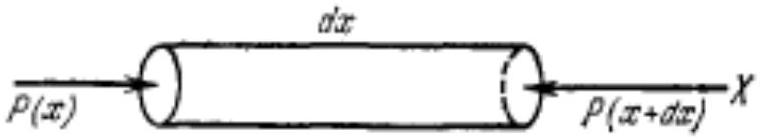

В этой задаче мы будем исследовать течение газа в сопле ракетного двигателя, а затем полет ракеты в воздушном пространстве и в пустоте.
Для начала вспомним несколько основополагающих соотношений, описывающих поведение текущих жидкостей или газов.
Часть А. Динамические соотношения для газа (1.0 балла)

Рассмотрим малый цилиндр вещества плотностью $\rho$ (см. рис), движущийся под действием разности давлений. Движение стационарное и одномерное.

А1 ${ }^{0.50}$ Запишите уравнение движения цилиндра. Определите градиент давления $d p / d x$. Ответ выразите через $\rho, v$ и $d v / d x$.
A2 ${ }^{0.50}$ Определите величину скорости звука $c$ в газе. Ответ выразите через $p, \rho$ и показатель адиабаты $\gamma$.
Часть В. Числа Маха и профиль сопла (2.0 балла)
Для описания течений газа удобно ввести параметр число Маха $M=v / c$, характеризующий отношение локальной скорости течения газа к скорости звука.
Теперь мы перейдем к качественному описанию сопла ракетного двигателя. В ракетном двигателе топливо сгорает в камере сгорания и попадает в сопло. Скорость продуктов сгорания увеличивается на всем протяжении сопла.

Решайте следующие пункты задачи в следующих предположениях:

- газ считается идеальным;
- газовый поток является изоэнтропным (то есть имеет постоянную энтропию, силы трения и диссипативные потери не учитываются) и адиабатическим (то есть теплота не подводится и не отводится);
- газовое течение является стационарным и одномерным, то есть в любой фиксированной точке сопла все параметры потока постоянны во времени и меняются только вдоль оси сопла, причём во всех точках выбранного поперечного сечения параметры потока одинаковы, а вектор скорости газа всюду параллелен оси симметрии сопла;
- массовый расход газа одинаков во всех поперечных сечениях потока;
- влияние всех внешних сил и полей (в том числе гравитационного) пренебрежимо мало;
- ось симметрии сопла является пространственной координатой $x$.

В1 ${ }^{1.00}$ Обозначим площадь поперечного сечения сопла за $A$. Определите величину $d A / d x$. Ответ выразите через $A, v, c$ и $d v / d x$.
В2 ${ }^{0.50}$ Качественно постройте профиль сечения сопла $A(x)$, когда скорость газа на выходе $v<c$. Можно считать, что при входе в сопло скорость газа пренебрежимо мала. Укажите особые точки (если они есть).

ВЗ ${ }^{0.50}$ Качественно постройте профиль сечения сопла $A(x)$, когда скорость газа на выходе $v>c$. Можно считать, что при входе в сопло скорость газа пренебрежимо мала. Укажите особые точки (если они есть).

Часть С. Анализ потока, выходящего из сопла (5.0 балла)
Рассмотрим более подробно процесс течения газа в сопле. Пусть на входе в сопло давление газа $p_{c}$, температура $T_{c}$ и плотность $\rho_{c}$. Показатель адиабаты газа $\gamma$.

С1 ${ }^{2.00}$ Изготавливая ракетный двигатель, задается желаемое давление на выходе из сопла $p$. Найдите скорость истечения газа $v$ из сопла в зависимости от отношения $p / p_{c}$. Ответ выразите через $p_{c}, \rho_{c}, \gamma$ и отношение $p / p_{c}$.

С2 ${ }^{0.40}$ При каком значении $p^{\prime}$ скорость истечения из сопла достигает максимального значения? Чему равна эта максимальная скорость $v_{\max }$ ? Ответы выразите через $p_{c}, \rho_{c}$ и $\gamma$.

С3 ${ }^{1.10}$ Как зависит площадь выходного сечения сопла $A$ от желаемого давления на выходе из сопла $p$ (при фиксированных параметрах на входе в сопло)? Т.е. найдите функцию $A\left(p / p_{c}\right)$, считая, что массовый расход в каждом сечении сопла постоянен и равен $\lambda$. Ответ выразите через $\lambda, p_{c}, \rho_{c}, \gamma$ и отношение $p / p_{c}$.

C4 ${ }^{1.50}$ Найдите отношение давлений $p_{t} / p_{c}$ в особых точках для пунктов В2 и ВЗ. Ответ выразите через показатель адиабаты газа $\gamma$. Такие давления называют критическими.

С5 ${ }^{0.70}$ Для формы сопла, определенной в пункте В3, определите зависимость величины $v / c$ от величины $p / p_{c}$. Ответ выразите через $\gamma$ и $p / p_{c}$.
Постройте качественные графики зависимости скорости течения газа $v / c$ вдоль сопла для случаев, когда давление на выходе больше критического ( $p / p_{c}>p_{t} / p_{c}$ ) и когда давление на выходе меньше критического ( $p / p_{c}<p_{t} / p_{c}$ ).

C6 ${ }^{0.80}$ Для формы сопла, определенной в пункте B3, массовый расход газа на выходе из сопла можно представить в виде:

$$
\lambda=C\left(A_{\text {ВЫХ }}, \gamma, p_{c}, \rho_{c}\right) \cdot f\left(p / p_{c}\right),
$$

где $C$ - постоянная величина, зависящая только от $A_{\text {вых }}, \gamma, p_{c}$ и $\rho_{c}$, а $f\left(p / p_{c}\right)$ - функция, зависящая только от отношения $p / p_{c}$ и $\gamma$.
Определите функцию $f\left(p / p_{c}\right)$. Ответ выразите через $p / p_{c}$ и $\gamma$.
Постройте качественный график массового расхода $\lambda$ от давления на выходе из сопла ( $p / p_{c} \in[0 ; 1]$ ). Если на графике имеются особые точки, то укажите их на графике и получите соответствующие им аналитические выражения $p / p_{c}$.

Часть D. Импульс, приобретаемый ракетой (0.5 балла)
Пусть теперь ракета летит в атмосфере. Атмосферное давление $p_{0}$, давление газа на выходе из сопла $p$, площадь сопла $A$, массовый расход газа $\lambda$, скорость истечения газов из сопла $v$.

D1 ${ }^{0.50}$ Найдите удельный импульс, приобретаемый ракетой, при полете в атмосфере. Ответ выразите через $p_{0}, p, A$ и $v$.
Удельный импульс - это дополнительный импульс, приобретаемый ракетой, при выбросе единицы массы топлива.

- Website in English

2020 - Мы те, кого должны превзойти.
