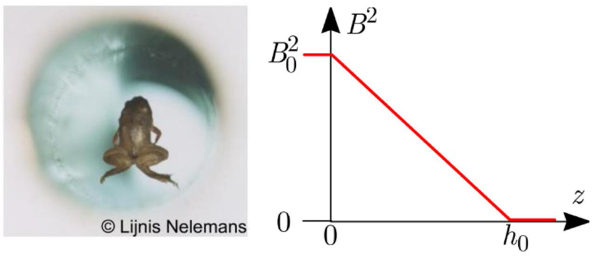
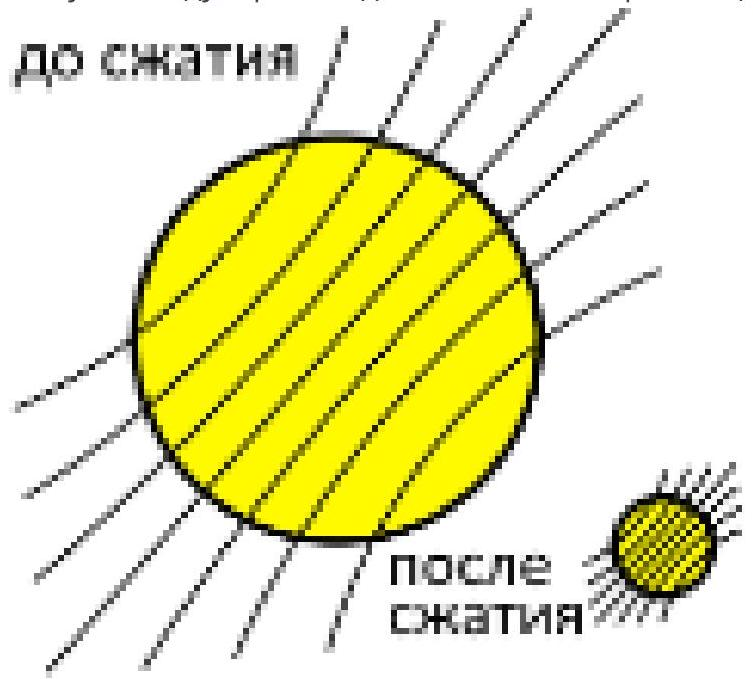
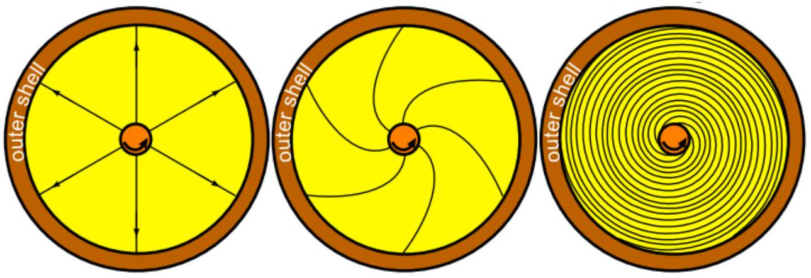

Магнитные поля можно найти повсюду. Например, магнитное поле Земли составляет $25-60$ мкТл, сильные постоянные магниты дают поле около 1 Тл, магнитные поля, создаваемые в лабораториях, могут достигать индукции в 45 Тл, магнитные поля нейтронных звезд и магнетаров - до $10^{11}$ Тл. В этой задаче мы рассмотрим несколько эффектов, связанные с сильными магнитными полями.
Плотность энергии магнитного поля $w=\frac{B^{2}}{2 \mu \mu_{0}}$, где $\mu_{0}=1,3 \cdot 10^{-6} \mathrm{H} / \mathrm{A}^{2}$ - магнитная постоянная, $\mu$ - относительная магнитная проницаемость среды.
Системы всегда пытаются занять состояние с более низкой энергией, из чего следует, что ферромагнетики $(\mu \gg 1)$ втягиваются в области сильных магнитных полей, в то время как диамагнитные вещества ( $\mu<1$ ) - выталкиваются. Магнитная восприимчивость $\chi=\mu-1$ диамагнетиков - это малая величина, $|\chi| \ll 1$, поэтому, чтобы сила выталкивания была значительной, магнитное поле должно быть сильным. Вода - диамагнетик ( $\chi=-9 \cdot 10^{-6}$ ), и животные состоят главным образом из воды. Поэтому лягушка может левитировать в достаточно сильном магнитном поле.

Пусть высота лягушки $H$ не превышает $h_{0}=10 \mathrm{ml}$, и положим, что квадрат индукции поля зависит от координаты так, как показано на рис.1.

Рис. 1. Левитирующая лягушка и зависимость квадрата магнитного поля $B^{2}$ от высоты $z$

А1 ${ }^{1.50}$ Найдите значения индукции поля $B_{0}$ (в Тл), при котором лягушка будет левитировать. Считайте, что лягушка состоит целиком из воды. Плотность воды $\rho=1000 \mathrm{кг} / \mathrm{м}^{3}$. Ускорение свободного падения $g=9.8 \mathrm{~m} / \mathrm{c}^{2}$.

Звезды состоят из плазмы, а она очень хороший проводник электричества. Поэтому линии магнитного поля как будто «вморожены» в движущуюся плазму (рис.2). Когда звезда сжимается и превращается в нейтронную звезду, происходит мгновенный рост индукции магнитного поля у звезды.

Рис. 2. Линии магнитного поля при сжимании плазмы

В1 ${ }^{1.00}$ Пусть индукция магнитного поля на полюсе звезды была $B_{s}=100$ мкТл и ее средняя плотность $\rho_{s}=1400$ кг/ $\mathrm{M}^{3}$. Какой станет индукция магнитного поля $B_{n}$ на полюсе, когда звезда превратится в нейтронную звезду? Плотность вещества нейтронной звезды $\rho_{n}=5 \cdot 10^{17}$ кг/М ${ }^{3}$.

В2 ${ }^{1.00}$ В действительности магнитные поля нейтронной звезды выглядят по-другому. Рассмотрим очень упрощенную модель. Внутренняя часть звезды сжимается до размеров нейтронной звезды, а внешняя - остается того же размера. Пусть до сжатия звезда вращалась с угловой скоростью $\omega_{s}$. Выразите новую угловую скорость вращения внутренней части звезды $\omega_{n}$ через $\omega_{s}, \rho_{s}$ и $\rho_{n}$.
Т.к. угловые скорости вращения внутренней и внешней части звезды разные, линии поля будут выглядеть, как показано на рисунке.

Рис. 3. Линии поля внутри нейтронной звезды

Проведите расчеты в следующих упрощающих предположениях:

1. решайте задачу в двумерном случае, т.е. считайте звезду цилиндрической;
2. считайте, что поле было цилиндрически симметричным в начальный момент времени;
3. линии поля начинаются на внутреннем цилиндре и заканчиваются на внешнем.

С1 ${ }^{1.00}$ Очень сильные магнитные поля могут влиять на химические свойства вещества, изменяя формы электронных орбит. Это происходит, когда сила Лоренца, действующая на электрон, становится больше кулоновского взаимодействия с ядром. Оцените индукцию магнитного поля $B_{H}$, необходимую для искривления орбиты в атоме водорода. Радиус орбиты электрона $R_{H}=5 \cdot 10^{-11}$ м. Заряд электрона $e=1,6 \cdot 10^{-19}$ Кл, масса электрона $m_{e}=9,1 \cdot 10^{-31}$ кг, электрическая постоянная $\varepsilon_{0}=8,85 \cdot 10^{-12} \Phi / \mathrm{m}$.

T

- Website in English

2020 - Мы те, кого должны превзойти.
