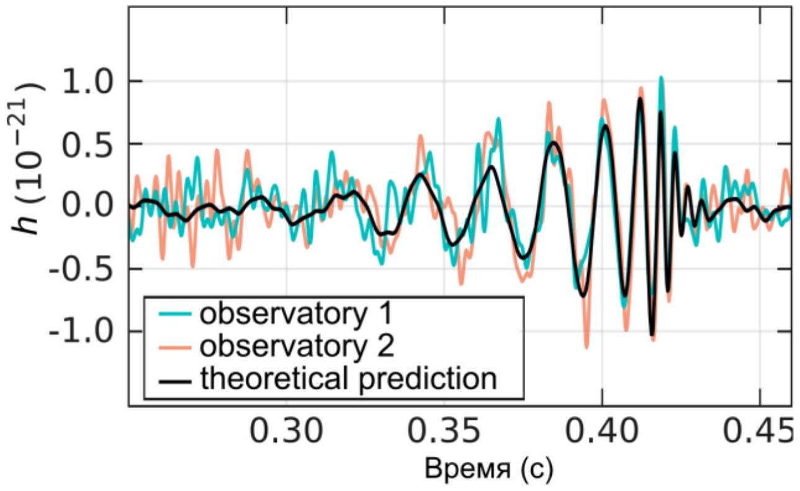

Постоянные электрические и гравитационные поля описываются похожим набором уравнений (пока мы рассматриваем поля вдали от черных дыр). Однако, если рассматривать изменения полей во времени, то уравнения изменяются. Поэтому нельзя просто перенести уравнения электромагнитных волн на гравитационные. Тем не менее, для выражений, приведенных ниже, отличие будет только в численном коэффициенте.

Часть А. Дипольное излучение
Заряды, которые движутся с ускорением, теряют кинетическую энергию, излучая электромагнитные волны. Это излучение называется дипольным. Мощность дипольного излучения выражается следующим образом:

$$
P_{e d}=\frac{\ddot{\vec{d}}^{2}}{6 \pi \varepsilon_{0} c^{3}}
$$

где $\ddot{\vec{d}}$ - вторая производная дипольного момента, $c$ - скорость света, $\varepsilon_{0}$ - электрическая постоянная. Дипольный момент системы зарядов определяется как $\vec{d}=\sum_{i} \vec{r}_{i} q_{i}$, где $\vec{r}_{i}$ - радиус вектор заряда $q_{i}$. Если диполь колеблется гармонически, то частота излученной волны будет равняться частоте колебаний.

А1 ${ }^{1.40}$ Пусть электрон зарядом - $e$ и массы $m$ вращается вокруг атомного ядра зарядом $+Z e$ на расстоянии $r$ от него. Считайте эту систему НЕквантовой. Найдите полную мощность излучения и длину волны излученных волн. Ответ выразите через $e, Z, m, r$ и фундаментальные постоянные.

А2 ${ }^{1.00}$ Можно попробовать рассчитать мощность дипольного излучения для гравитационных волн. Заряду $q_{i}$ будет соответствовать масса $m_{i}$, и гравитационный дипольный момент будет $\vec{d}_{g}=\sum_{i} \vec{r}_{i} m_{i}$. Покажите, что $P_{g d}=0$.

Часть В. Квадрупольное излучение
Пусть двойная звезда состоит из двух одинаковых звезд массы $M$, которые обращаются по круговой орбите радиуса $R$ с угловой частотой $\omega$.
В $1^{1.00}$ Выразите $\omega$ через $M, R$ и фундаментальные постоянные.
В2 ${ }^{0.50}$ В пункте А2 нужно было показать, что дипольного гравитационного излучения нет. Зато есть квадрупольное. По аналогии с дипольным излучением, его мощность должна быть пропорциональна второй производной (по времени) квадрупольного момента.
Гравитационный квадрупольный момент пропорционален величине $M R^{2}$. Так, мощности квадрупольного излучения будет $P_{g d}=A M^{2} R^{4}$, где параметр $A$ зависит от $\omega$ и фундаментальных постоянных. (Считайте $\omega$ независимой величиной, хотя для двойной звезды она будет функцией $M$ и $R$.) Найдите выражение для $P_{g d}$ методом размерностей.

Вз ${ }^{0.50}$ Гравитационные волны характеризуются следующей безразмерной величиной $h=\Delta l / l$, где $l$ - расстояние между двумя точками в пространстве, а $\Delta l$ - изменение этого расстояния из-за волны. Плотность потока энергии $S$ пропорциональна квадрату амплитуды $S=K h_{0}^{2}$. Методом размерностей найдите $K$, как функцию $\omega$ и фундаментальных постоянных.

В4 ${ }^{1.00}$ Распространение квадрупольного излучения, вообще говоря, анизотропно. В очень грубой модели, считая излучение изотропным, найдите амплитуду $h_{0}$ гравитационной волны на расстоянии $L$. Ответ выразите через $M, R$ и физические постоянные.

Часть С. Эксперимент LIGO
Энергия двойной звезды уменьшается из-за излучения гравитационных волн. Таким образом, расстояние между двумя звездами уменьшается. Процесс будет продолжаться до тех пор, пока звезды не столкнутся друг с другом. В эксперименте LIGO (11 февраля 2016 года) наблюдались гравитационные волны, которые были испущены непосредственно перед слиянием двух черных дыр. В качестве радиуса черной дыры можно взять Шварцшильдовский радиус $R_{s}$. Из-за гравитационного притяжения свет, распространяющийся в сфере этого радиуса, не может покинуть ее пределы. Чтобы корректно рассчитать значение $R_{s}$ нужны знания из общей теории относительности.

С1 ${ }^{1.00}$ Выразите $R_{s}$ через массу черной дыры $M$ и фундаментальные постоянные.
Примечание: Если произвести вычисления, используя только знания специальной теории относительности и закона всемирного тяготения, то верный ответ будет в два раза больше найденного.

В эксперименте LIGO с помощью лазерного интерферометра измерялась зависимость от времени параметра $h$ гравитационных волн (рис.1).

C2 ${ }^{1.50}$ Используя график, приведённый на рис.1, оцените массу $M$ черных дыр, которые слились, считая их массы одинаковыми. Гравитационная постоянная $G=6.67 \cdot 10^{-11} \mathrm{~m}^{3} /\left(\right.$ кг $\left.\cdot \mathrm{c}^{2}\right)$, скорость света $c=3 \cdot 10^{8} \mathrm{м} / \mathrm{c}$.

- Website in English

2020 - Мы те, кого должны превзойти.
