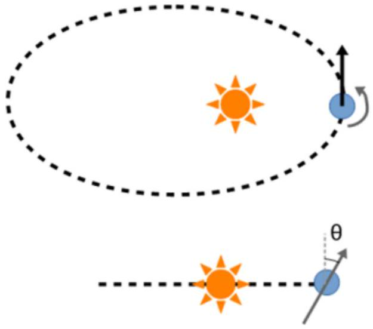
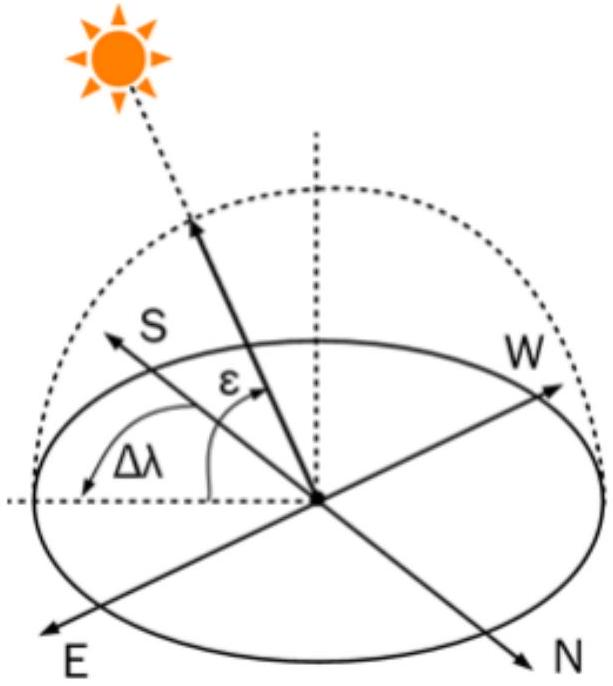
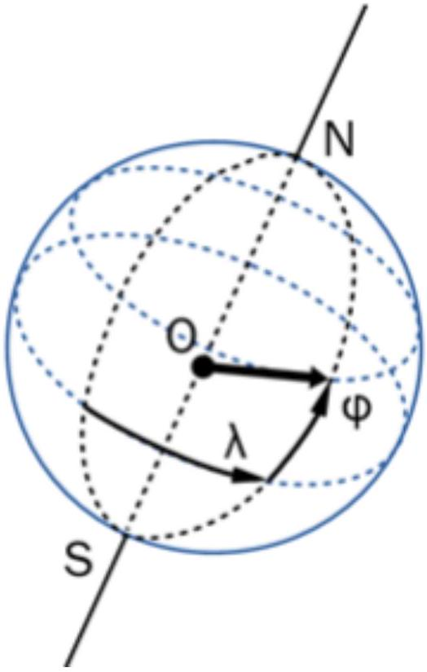
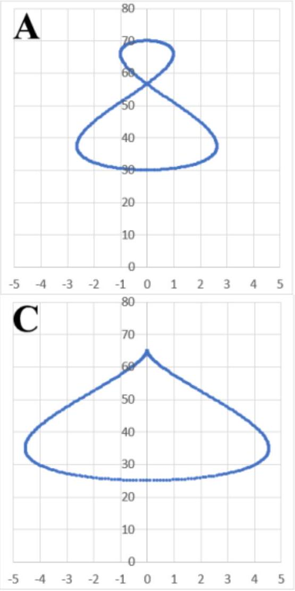
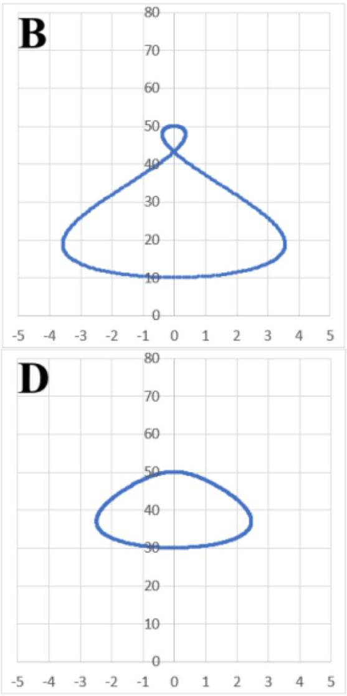

## Road to IPhO

## Аналемма

Люди древности и средневековья определяли время по положению Солнца на небе, связывали с ним сроки религиозных праздников и распорядок дня. Многие обряды совершались в полдень, который определялся как время, когда солнце занимает наивысшее положение на небосводе. В это время луч солнца, проходящий через отверстие в крыше храма или собора пересекал линию меридиана на полу, указывающую направление «север-юг» (см. рис.). В английском языке сохранились берущие начало в это время латинские обозначения времени до (a.m., ante meridiem) и после полудня (p.m., post meridiem). По угловой высоте солнца в полдень (как и по положению звезд в полночь) путешественники прошлого с помощью специальных астрономических приборов определяли географическую широту судна.

Система отсчета времени, связанная с солнцем, называется «истинным солнечным временем» (ИСВ) - в ней положение солнца определяется по азимуту, соответствующему положению солнца на небесной сфере. При появлении точных механических часов оказалось несложным убедиться, что истинное солнечное время неравномерно - в течение года продолжительность истинных солнечных суток (время между солнечными полуднями) меняется. Так появилась система усредненного солнечного времени (УСВ) - продолжительность суток в такой системе совпадает со средней продолжительностью суток в течение года, отсчет времени идет однородно.

Если в определенный момент синхронизировать усредненное солнечное время с истинным (в момент солнечной кульминации выставить на механических часах полдень), то в течение года возникнет расхождение между временем, определяемым двумя разными способами: например, солнце в 12:00 по местному времени в разные дни то западнее, то восточнее меридиональной линии. Если в течение года отмечать положение солнечного луча солнца в 12:00, вместо прямой линии получится «восьмерка» (см. рис. 1б). Очевидно, что эта восьмерка связана с положением солнца на небесной сфере, и если, применяя более современные технологии, делать в определенном месте фотографии небосвода с шагом в 12 часов, то солнце в течение года также описывает кривую, имеющую форму «восьмерки» (см. рис.), которую мы будем называть аналеммой.

В задаче предлагается проанализировать различные факторы, влияющие на расхождение между ИСВ и УСВ, оценить его величину и объяснить форму аналеммы. Хотя точный расчет искомого расхождения сложен и приводит к громоздким результатам, на практике это расхождение с хорошей точностью описывается суммой нескольких синусоид, параметры которых мы предлагаем вам найти. Для простоты будем рассматривать не Землю, а другую очень похожу планету (см. рис. 1), вращающуюся вокруг своей оси с периодом в $\tau=24$ земных часа, год на которой длится $\tau N_{0}$. Ось собственного вращения планеты образует с нормалью к плоскости орбиты малый угол $\theta(\theta \ll 1)$. Считайте его заданным. Также считайте, что задан эксцентриситет $e$.

Будем считать, что в первый день года ( $N=0$ ) планета находится ближе всего к звезде, а ось вращения лежит в плоскости, заданной радиус-вектором «планета-звезда» и нормалью к плоскости траектории. (Для Земли это условие неверно, хотя отклонение и невелико.) Направления вращения планеты вокруг звезды и вокруг своей оси совпадают (против часовой стрелки, если смотреть с «северного» полюса эклиптики). В северном полушарии в начале года день короче ночи.

## Road to IPhO

Рис. 1. Положение $N=0$ в первый день года. Орбита (с эксцентриситетом $e$ ) и ось вращения (наклоненная под углом $\theta$ к вектору нормали к траектории) гипотетической планеты, рассматриваемой в задаче. Направления вращения планеты вокруг звезды и вокруг собственной оси совпадают (против часовой стрелки, если смотреть с северного полюса эклиптики).

Рис. 2. Угловая система небесных координат: $\varepsilon$ - высота солнца, $\Delta \lambda$ - азимутальное отклонение от среднего (южного) направления на полуденное солнце.

Рис. 3. Долгота $\lambda$ и широта $\varphi$ некоторой точки на поверхности планеты.

## Road to IPhO

Часть А. Максимальная высота Солнца (1 балл)

А1 Наибольшая угловая высота солнца в течение суток зависит от времени года и от широты, на которой на- ходится наблюдатель. Решите задачу, достойную древнего мореплавателя и найдите коэффициенты $A_{0}, k_{0}$ и $\phi_{0}$ в приближенном выражении, описывающем зависимость отклонения этой угловой высоты (рис. 2) от усредненного по всем дням года значения ( $N$ - номер дня). Орбиту считайте круговой.

$$
\Delta \varepsilon=A_{0} \sin \left(k_{0} N+\phi_{0}\right)
$$

А2 Нарисуйте, какую кривую за год описывал бы луч света на полу храма, положения которого замеряются каждый день в 12:00 по ИСВ, отметьте положение сторон света на рисунке. (Стороны света на рассматриваемой планете определяются так же, как и на земле, в соответствии с направлением вращения планеты вокруг своей оси).

Часть В. Эксцентричная орбита при перпендикулярной оси (3 балла)
В части В считайте, что ось планеты перпендикулярна плоскости орбиты $(\theta=0)$, а орбита близка к окружности ( $0<e \ll 1$ ).

В1 Укажите, в какой точке орбиты истинные солнечные сутки будут длиннее всего? Короче всего? 0.1

В2 На сколько самые длинные истинные сутки длиннее самых коротких? 2.0

B3 Считая, что в первый день в году ( $N=0$ ) планета находится ближе всего к звезде, найдите параметры $A_{1}$, $k_{1}$ и $\phi_{1}$ приближенного уравнения, описывающего разницу в продолжительности истинных и усредненных солнечных суток в зависимости от номера дня в году $N(0 \leq N \leq 364)$ :

$$
t_{\text {сут ИСВ }}-t_{\text {сут УСВ }}=A_{1} \sin \left(k_{1} N+\phi_{1}\right)
$$

В4 Какая разница $\Delta_{1}(N)$ между ИСВ и УСВ накопится за $N$ дней, если в первый день в году системы были синхронизированы?

B5 Какой величины достигает наибольшее в течение года расхождение между ИСВ и УСВ $\left(\Delta_{1 \max }\right)$ ?

Часть С. Наклонная ось при круговой орбите (3 балла)
Пусть теперь планета совершает движение по круговой орбите ( $e=0$ ), а ось собственного вращения наклонена от нормали к плоскости траектории на малый угол $\theta(\theta \ll 1)$. Будем считать, что в первый день в году ( $N=0$ ) ось собственного вращения лежит в плоскости, образованной нормалью к плоскости траектории и радиус-вектором, соединяющим центры звезды и планеты. Будем считать, что направления вращения планеты вокруг звезды и вокруг своей оси совпадают (оба движения осуществляются против часовой стрелки, если смотреть с «северного» полюса эклиптики). В северном полушарии в начале года день короче ночи.

C1 Отметим точку на экваторе планеты, в которой звезда в некоторый момент времени находится в зените. Припишем этой точке нулевую долготу $\lambda=0$ и будем следить за точками, для которых звезда будет в зените ровно через 1 сутки УСВ, 2 суток УСВ и т.д. Эти точки образуют на поверхности планеты некоторую кривую, которую можно задать в терминах широты $\varphi$ и долготы $\lambda$ (см. рис. 3). Получите формулу этой кривой.

C2 Пусть в некоторый момент при построении кривой, описанной в пункте C1, в точке с долготой $\lambda$ звезда оказалась в зените. Найдите $\Delta \lambda / \Delta t$, где $\Delta \lambda$ - изменение долготы точки за время $\Delta t$ равное одним суткам.

## Road to IPhO

C3 Найдите параметры $A_{2}, k_{2}$ и $\phi_{2}$ приближенного уравнения, наилучшим образом описывающие разницу 1.5 между продолжительностью истинных и усредненных солнечных суток на такой планете:

$$
t_{\text {сут ИСВ }}-t_{\text {сут УСВ }}=A_{2} \sin \left(k_{2} N+\phi_{2}\right) .
$$

C4 Какая разница $\Delta_{2}(N)$ между ИСВ и УСВ накопится за $N$ дней, если в первый день в году обе системы были 0.2 синхронизированы?

C5 Какой величины $\Delta_{2 \text { max }}$ достигает наибольшее в течение года расхождение между ИСВ и УСВ? 0.1

## Часть D. Комбинация вкладов (3 балла)

В части D для простоты будем считать, что вклады от наклона оси и от эллиптичности орбиты в угловые координаты солнца на небесной сфере (см. рис.) складываются.

D1 Получите зависимости обеих угловых координат солнца $\varepsilon(N)$ и $\Delta \lambda(N)$ в полдень по УСВ (12:00) от номера 1.0 дня в году $N$ на широте $\varphi$.

D2 Схематично нарисуйте в угловых координатах небесной сферы $\varepsilon$ и $\Delta \lambda$ (с точностью до константы) аналеммы для случаев, описанных в частях B и C.

D3 С помощью рисунков и формул опишите метод, позволяющий из параметров аналеммы определить $e$ и $\theta$. 0.2
На рисунке ниже приведены аналеммы четырёх планет. По горизонтальной и вертикальной осям отложены $\Delta \lambda$ и $\varepsilon$ в градусах, соответственно.

D4 Определите числовые значения $e$ и $\theta$ для планет, аналеммы которых приведены на рисунке, а также укажите, на каких широтах $\varphi$ проводились измерения приведенных кривых (все измерения проводились в северном полушарии). По горизонтальной и вертикальной осям отложены $\Delta \lambda$ и $\varepsilon$ в градусах соответственно.
