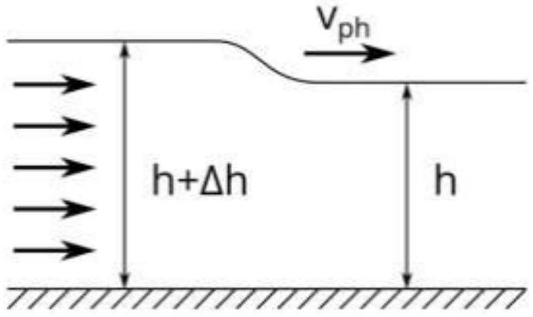
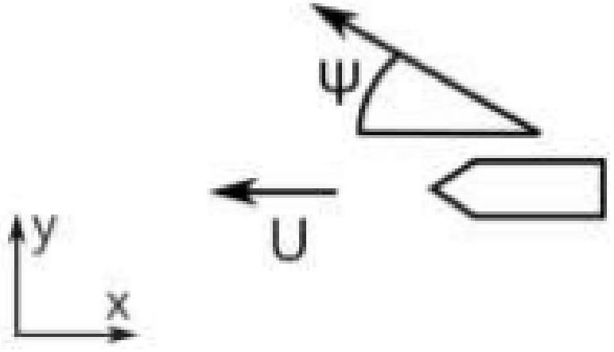

Часть А. Фазовая и групповая скорость
Колебания и волны - один из самых интересных и распространенных разделов физики.
Волновые процессы встречаются во всех областях и в механике, и в термодинамике, и в электродинамике, а оптика целиком является наукой о волнах. В этой задаче мы рассмотрим знакомые всем корабельные волны, обладающие некоторыми очень интересными и неочевидными особенностями.
Однако, сначала рассмотрим общие свойства волн. Простейшим типом волн, распространяющихся в линейной среде, являются плоские монохроматические волны - то есть волны с конкретной частотой и длиной волны. Зависимость их амплитуды от времени и координаты (пока рассматриваем одномерный случай) описывается следующим образом:

$$
A(t, x)=A_{0} \cos \theta=A_{0} \cos \left(k x-\omega t+\varphi_{0}\right)
$$

А1 ${ }^{1.00}$ Найдите скорость распространения постоянной фазы монохроматической волны (фазовая скорость).
Однако, в реальности чистые монохроматические волны никогда не существуют. На самом деле волны распространяются в волновых пакетах -суперпозицией многих волн близких частот. Волновой пакет в отличие от монохроматической волны локализован в некоторой области пространства и распространяется не с фазовой, а с так называемой групповой скоростью. Групповая скорость обычно интерпретируется как скорость перемещения максимума амплитудной огибающей квазимонохроматического волнового пакета. Для примера, рассмотрим волновой пакет из двух близких по частоте и волновому вектору монохроматических волн:

$$
A(t, x)=A_{0} \cos \left(k_{1} x-\omega_{1} t-\varphi_{1}\right)+A_{0} \cos \left(k_{2} x-\omega_{2} t-\varphi_{2}\right)
$$

А2 ${ }^{1.00}$ Предполагая, что существует некоторая функциональная зависимость $\omega(k)$, найдите групповую скорость через эту функцию в точке $k \approx k_{1} \approx k_{2}$.
Вышеупомянутая функция $\omega(k)$ называется дисперсионным соотношением для волн определенного типа и именно она полностью определяет их поведение. Именно поэтому исследование любых линейных волн начинается с нахождения этой зависимости.

Часть В. Дисперсионное соотношение для волн на воде

Распространение волн на воде определяется двумя физическими эффектами: поверхностным натяжением и гравитационным полем земли. Первый эффект вызывает так называемые капиллярные волны с маленькой длиной волны, который мы рассматривать не будем. Гравитация же приводит к существованию так называемых гравитационных волн.
Итак, рассмотрим волну, распространяющуюся как на рисунке. Считайте, что в невозмущенной области вода стоячая, а в возмущенной вся вода движется с некоторой скоростью.

В1 ${ }^{1.00}$ Найдите скорость распространения волны $v_{p h}$, если глубина воды $h$.
Если глубина воды много больше длины волны $\lambda$, то эффективно вода движется только в слое толщиной $\lambda / 2 \pi$.
В2 ${ }^{1.00}$ Найдите скорость распространения волны на глубокой воде. Найденная скорость является фазовой скоростью волны.
Теперь, зная фазовую скорость волны в зависимости от длины волны, мы можем легко найти дисперсионное соотношение $\omega(k)$, а из него, с помощью результата В2, и групповую скорость волн.

В3 ${ }^{1.00}$ Найдите дисперсионное соотношение и групповую скорость волн на мелкой воде $v_{g}(k)$.
В4 ${ }^{1.00}$ Найдите дисперсионное соотношение и групповую скорость волн на глубокой воде $v_{g}(k)$.
Часть С. Угол расхождения корабельных волн
Легко заметить, что для волн на глубокой воде соблюдается замечательное соотношение $v_{g}=v_{p h} / 2$ для волн с любой длиной волны. Это приводит к интересным эффектам. Рассмотрим обычные корабельные волны, которые каждый мог наблюдать. Известно, что они образуют конус по границам которого бегут волны. Для излучателей, движущихся со скоростью выше скорости распространения волн в среде с линейной дисперсией, широко известен эффект образования маховского конуса с углом раствора $\arcsin (c / v)$.

Однако, при нелинейном законе дисперсии нахождение угла становится сложнее, его величина определяется конструктивной интерференцией монохроматических волн.
Итак, рассмотрим плоскую монохроматическую волну, распространяющуюся под углом $\psi$ к скорости источника. Вода стоячая.

Представьте, что в некоторый момент времени источник излучил широкий спектр волн. Рассмотрим цуг с узким спектром, такой, что его фазовая скорость соответствует распространению под углом $\psi$.

С2 ${ }^{1.00}$ Найдите точку в которой будет находиться цуг через время $d t$.
с3 ${ }^{1.00}$ Найдите геометрическое место точек для цугов, испущенных под всевозможными углами.
Теперь представьте, что такие «элементарные волны» из пункта СЗ испускаются в каждый момент времени.
C4 ${ }^{1.00}$ Найдите угол раствора конуса, который ограничивает все распространяющиеся волны

T
Механика
Волны
2019
Сборы XY
Y
Распространение волн

- Website in English

2020 - Мы те, кого должны превзойти.
