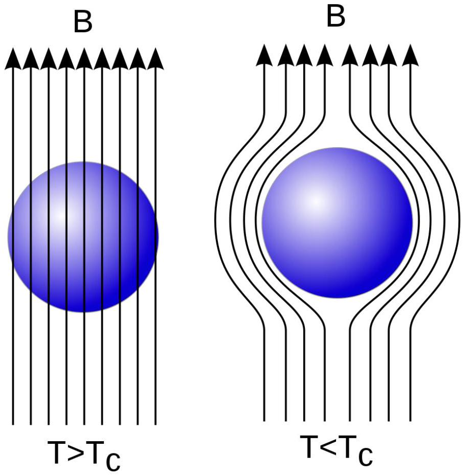

В этой задаче мы рассмотрим математические подобие при описании двух явлений: присоединенной массы при движении тела в жидкости и сверхпроводника в магнитном поле.

В гидродинамике для описания движения жидкости используется такая характеристика как циркуляция вектора скорости, равная $\Gamma=\oint_{L} \vec{v} \cdot \overrightarrow{d l}$, где $L$ - некий замкнутый контур. Циркуляция скорости служит мерой завихренности течения. Простое безвихревое движение несжимаемой жидкости без вязкости можно описать цикруляцией равной нулю: $\Gamma=0$.

Сверхпроводник - материал, электрическое сопротивление которого при понижении температуры до критической величины становится равным нулю. В 1933 году был открыт эффект Мейснера - полное вытеснение магнитного поля из объема проводника при его переходе в сверхпроводящее состояние (см. рис). Отсутствие магнитного поля в объёме проводника позволяет заключить из общих законов магнитного поля, что в сверхпроводнике существует только поверхностный ток. Магнитное поле тока уничтожает внутри сверхпроводника внешнее магнитное поле.

Во всех дальнейших пунктах задачи жидкость можно считать несжимаемой и без вязкости.

Часть А. Твердое тело в жидкости и сверхпроводник в магнитном поле
А1 ${ }^{0.40}$ Рассмотрим твердое тело, движущееся поступательно со скоростью $\overrightarrow{v_{0}}$ в жидкости. Перейдем в систему отсчета, в которой тело покоится. Чему равна нормальная составляющая скорости к поверхности твердого тела $v_{n}$ ? Чему равна скорость жидкости на бесконечном удалении от тела $\overrightarrow{v_{\infty}}$ в системе отсчета связанной с телом? Запишите ответы в таблицу в начале листа ответов.

А2 ${ }^{0.40}$ Рассмотрим неподвижное сверхпроводящее тело, помещенное в однородное поле с индукцией $\vec{B}_{0}$. Геометрические размеры тела и его ориентация по отношению к вектору $\vec{B}_{0}$ совпадают с размерами тела и ориентацией тела по отношению к вектору $\vec{v}_{0}$ из пункта А1. Чему равна нормальная составляющая индукции магнитного поля $B_{n}$ ? Чему равна индукция магнитного поля $\vec{B}_{\infty}$ на бесконечном удалении от сверхпроводника? Запишите ответы в таблицу в начале листа ответов.

А3 ${ }^{0.40}$ Пусть для пункта А2 во всем пространстве задано распределение индукции магнитного поля $\vec{B}=f\left(\vec{B}_{0}, \vec{r}\right)$. Считая, что вектора $\vec{B}_{0}$ и $\vec{v}_{0}$ сонаправлены, найдите распределение скорости жидкости в пространстве в системе отсчета связанной с телом.

Часть В. Шар в жидкости
При движении тела жидкость также приходит в движение, и, следовательно, обладает кинетической энергией. При поступательном движении эта величина не зависит от скорости движения тела и определяется соотношением $E_{k}=\frac{(m+\mu) v^{2}}{2}$, где $E_{k}$ - кинетическая энергия жидкости и тела, $m$ - масса движущегося тела, $\vec{v}$ - вектор скорости тела. В этой части задачи нужно найти присоединенную массу шара радиуса $R$, движущегося в жидкости, имеющей плотность $\rho$. До начала движения шара жидкость также была неподвижна. Для универсальности обозначений, считайте, что $\vec{r}$ - радиус-вектор, проведенный из центра шара в произвольную точку пространства.

Примечание: В этой и следующей частях задачи вам понадобятся результаты части A!
В1 ${ }^{1.80}$ Поместим сверхпроводящий шар радиуса $R$ в однородное магнитное поле с индукцией $\vec{B}_{0}$. Найдите индукцию магнитного поля во всем пространстве вне шара. Ответ выразите через $\vec{B}_{0}, \vec{r}$ и $R$.

В2 ${ }^{0.50}$ Найдите скорость жидкости во всем пространстве вне шара. Ответ выразите через $\vec{v}, \vec{r}$ и $R$.
В3 ${ }^{1.70}$ Найдите кинетическую энергию жидкости. Ответ выразите через $v, \rho$ и $R$.
В4 ${ }^{0.50}$ Найдите значение $\mu$ для шара. Ответ выразите через $\rho$ и $R$.
Часть С. Цилиндр в жидкости
В этой части задачи нужно найти присоединенную массу для цилиндра длины $L$ и радиуса $R$, движущегося поступательно в направлении, перпендикулярном его оси симметрии. При расчете скоростей жидкости краевыми эффектами пренебречь (считать, что цилиндр бесконечно длинный). Также считайте, что основной вклад в кинетическую энергию вносит жидкость, движущаяся между торцами цилиндра. Скорость цилиндра равна $\vec{v}$, плотность жидкости $\rho$. Для универсальности обозначений, считайте, что $\vec{r}$ - радиус-вектор, перпендикулярный оси цилиндра, проведенный от нее в произвольную точку пространства.

С1 ${ }^{2,80}$ Поместим бесконечно длинный сверхпроводящий цилиндр радиуса $R$ в однородное магнитное поле индукцией $\vec{B}_{0}$. Найдите индукцию магнитного поля во всем пространстве вне цилиндра. Ответ выразите через $\vec{B}_{0}, \vec{r}$ и $R$.

C2 ${ }^{0.40}$ Найдите скорость жидкости во всем пространстве вне цилиндра. Ответ выразите через $\vec{v}, \vec{r}$ и $R$.
С3 ${ }^{0.90}$ Найдите кинетическую энергию движения жидкости. Ответ выразите через $\rho, R, L$ и $v$.
С4 ${ }^{0.20}$ Найдите значение присоединенную массу $\mu$ для движущегося цилиндра. Ответ выразите через $\rho, R$ и $L$.

T Поле магнитного диполя
Электромагнетизм
2020
Сборы XY
Y
Магнитное поле

- Website in English

2020 - Мы те, кого должны превзойти.
