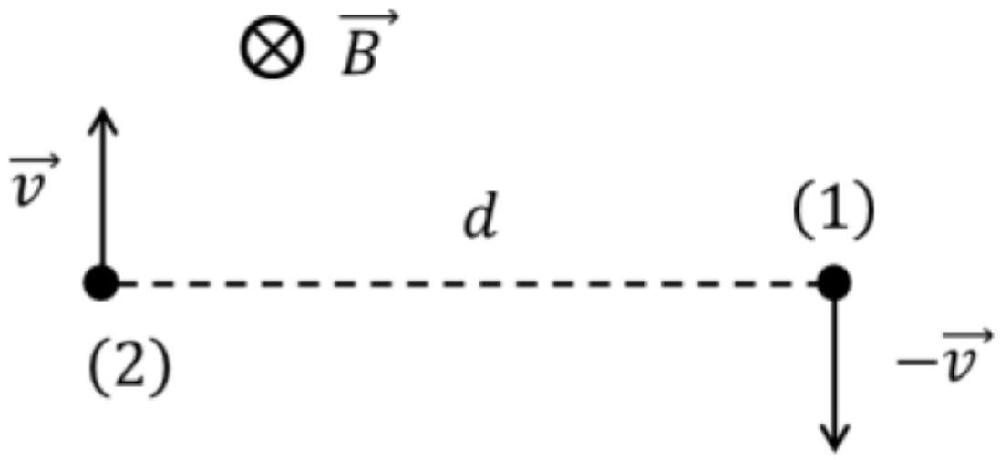
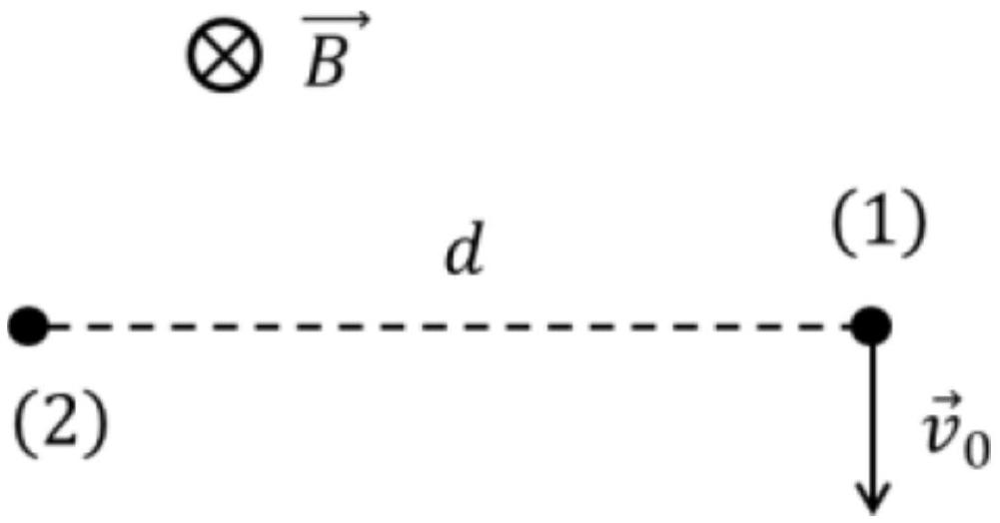
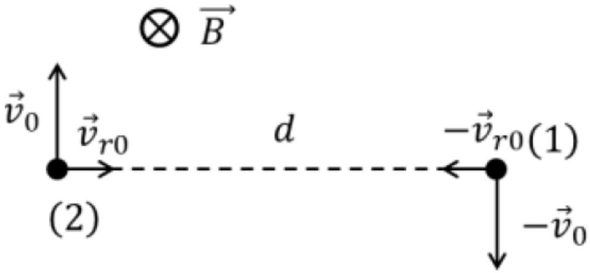

## Road to IPhO

## Электроны в магнитном поле (7 баллов)

Последние достижения в области нанотехнологий позволили создать «искусственные атомы», так называемые квантовые точки. Это нанометровые структуры, которые благодаря своим оптическим и электронным свойствам имеют разнообразные применения: от квантовых компьютеров, солнечных батарей до визуализации живых клеток. В этой задаче будет рассмотрена модель движения электронов в квантовой точке.

Рассмотрим движение двух электронов (массой $m$ и зарядом $q=-e$ ) в плоскости, перпендикулярной линиям однородного магнитного поля индукции $\vec{B}=B \vec{k}$. Электроны можно считать материальными точками, между которыми есть только кулоновское взаимодействие. Релятивистскими эффектами можно пренебречь.

Пусть в начальный момент электроны находятся на расстоянии $d$ друг от друга. Электронам сообщают одинаковые по модулю, но противоположные по направлению скорости, такие, что расстояние между ними не изменяется при дальнейшем движении.

А1 Каким может быть минимальное расстояние $d_{\min }$ между электронами, чтобы описанное выше движение 1.0 было возможным?

A2 Найдите скорость $v_{\mathrm{m}}$, которую нужно сообщить электронам, чтобы при их движении между ними сохра- 0.5 нялось найденное в А1 расстояние $d_{\text {min }}$.

Рассмотрим теперь случай, когда только одному электрону сообщают в начальный момент времени скорость $v_{0}$, такую, что расстояние между ними не изменяется и остается равным $d_{1}=2 \sqrt[3]{\frac{m}{4 \pi \varepsilon_{0} B^{2}}}$.

В1 Найдите угловую скорость центра масс $\omega$ во время движения электронов. 0.5

B2 Найдите время, через которое у обоих электронов сравняются абсолютные значения скорости в первый 1.0 раз.

## Road to IPhO

Вернемся к модели из части А. Электроны находятся на расстоянии $d$ друг от друга, и им сообщают противоположные скорости $v_{0}$.

С1 Получите выражение для кинетической энериии одного электрона $K=K\left(m, v_{r}, \omega, r\right)$, где $v_{r}=\frac{\mathrm{d} r}{\mathrm{~d} t}, \omega=\frac{\mathrm{d} \theta}{\mathrm{d} t}$, $\mathbf{0 . 2}$ а $r$ и $\theta$ - задают положение электрона в системе центра масс.
С2 Найдите, чему равна производная момента импульса по времени $\frac{\mathrm{d} L}{\mathrm{~d} t}$ при движении электронов.
C3 Найдите интеграл движения для рассматриваемого случая, т.е. найдите такую функцию $J$, для которой 0.5 справедливо $\frac{\mathrm{d} J}{\mathrm{~d} t}=0$.

Подсказка: Вспомните июньские занятия.

C4 Выразите полную энергию электрона в виде $E=K\left(v_{r}\right)+U(r)$. Выразите ее через $J, e, B, r$ и физические 1.0 постоянные.
С5 Схематично изобразите график зависимости $U(r)$, укажите его характерные особенности.
C6 Разложите функцию $U(r)$ в ряд Тейлора до первого нетривиального члена вблизи особых точек из пункта С5. Основываясь на разложении, схематично изобразите траекторию электронов, которым сообщили небольшую радиальную компоненту скорости $v_{r 0}$ вдобавок к скорости движения по окружности $v_{0}$.

