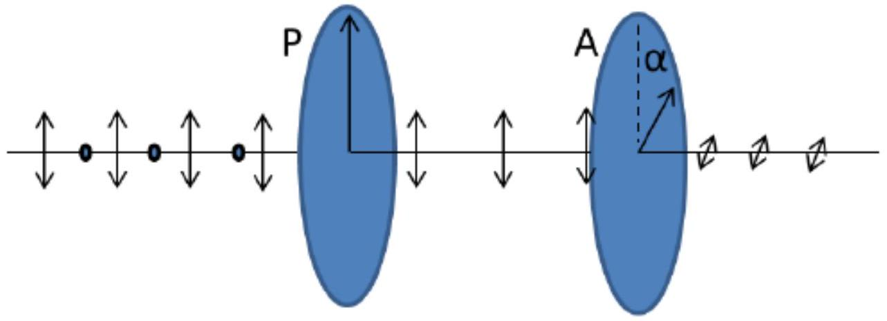
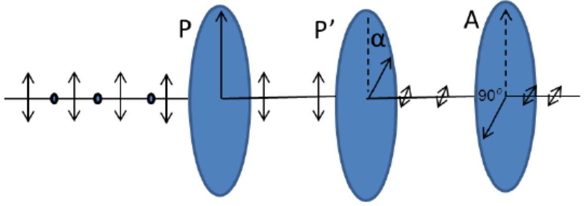
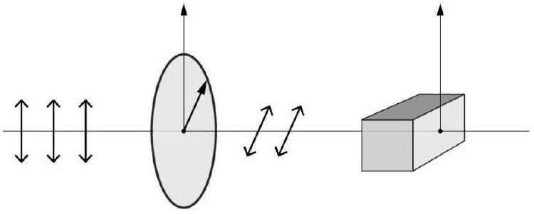
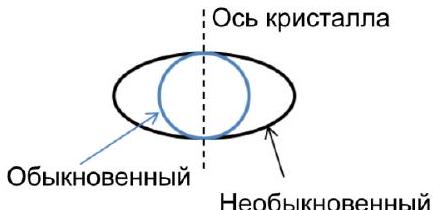
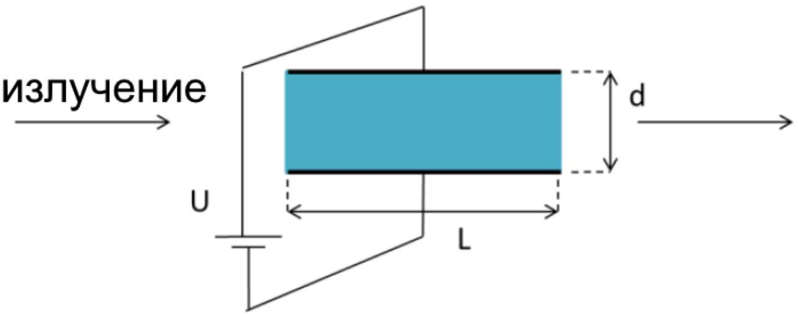
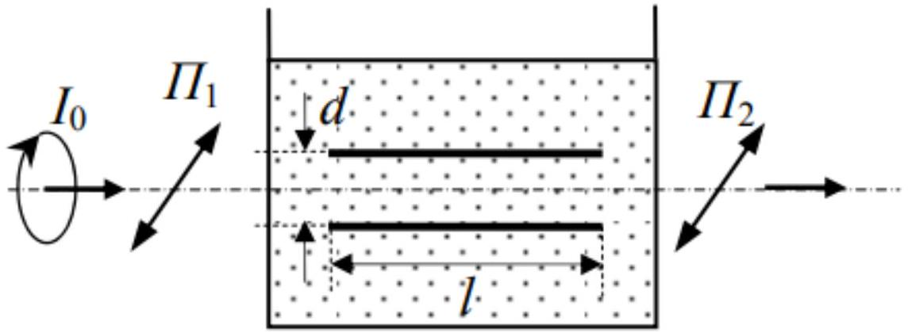
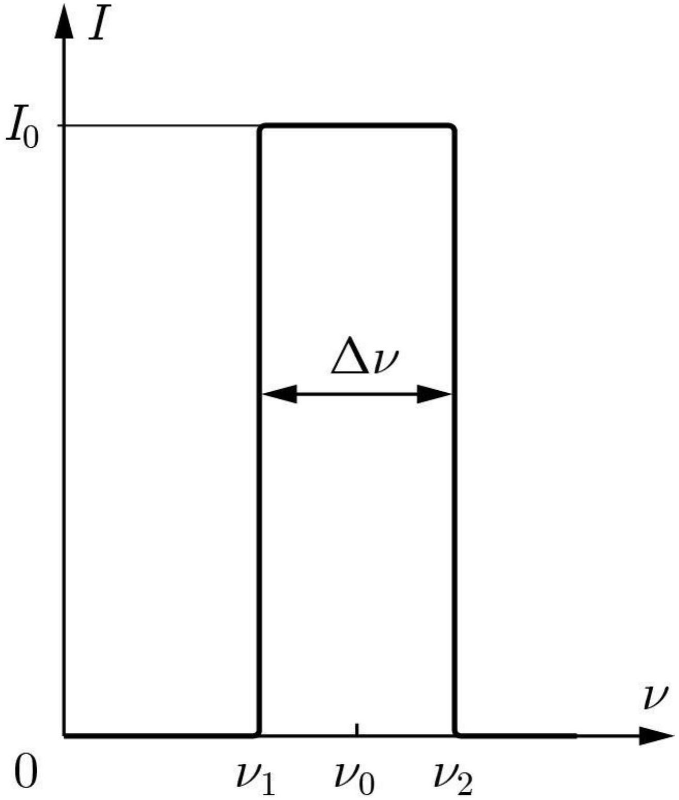
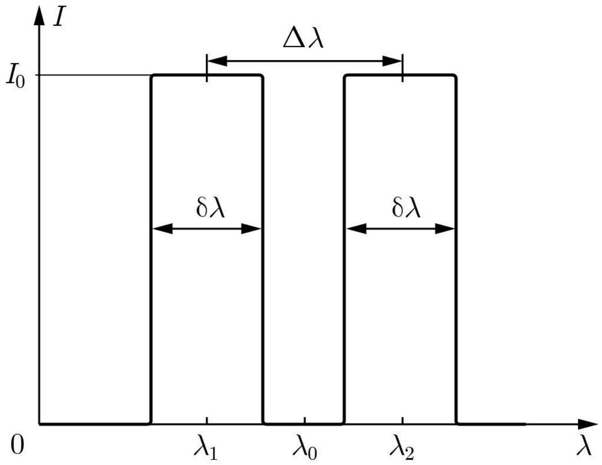

Часть А. Поляризация и кристаллооптика (2 балла)
При прохождении через поляризатор $P$ естественный свет преобразуется в линейно-поляризованный свет, плоскость поляризации параллельна оси поляризатора. В этой части задачи будем рассматривать только монохроматическое излучение.

А1 ${ }^{0.10}$ Линейно поляризованный свет интенсивностью $I_{0}$ падает на анализатор $A$, ось поляризации которого повернута на угол $\alpha$ по отношению к оси поляризатором $P$. Определите интенсивность света после прохождения через анализатор. Отражением и поглощением пренебречь.

A2 ${ }^{\mathbf{0 . 4 0}}$ Поляризатор и анализатор расположены перпендикулярно друг другу, и свет не проходит через анализатор. Если между двумя элементами поместить третий поляризатор $P^{\prime}$, свет начинает проходить через анализатор. Найдите интенсивность $I$ прошедшего света через интенсивность падающего света $I_{0}$ и угол $\alpha$, который составляет ось поляризатора $P^{\prime}$ с осью поляризатора $P$. Найдите максимальную интенсивность прошедшего света $I^{\prime}$ и угол $\alpha^{\prime}$, при котором она достигается.

Заменим теперь поляризатор $P^{\prime}$ на двулучепреломляющий кристалл. В таком кристалле падающий луч делится на два. Один из них распространяется с одинаковой скоростью в любом направлении, так называемый «обыкновенный» (ordinary) луч, а другой распространяется с разными скоростями в разных направлениях, «необыкновенный» (extraordinary) луч. На рисунке показаны волновые фронты для обыкновенного луча (сферический) и для необыкновенного (эллипсоидальная) для точечного источника, расположенного в кристалле. Направление, в котором лучи распространяются с одинаковой скоростью, называется осью кристалла. Показатель преломления для обыкновенного луча равен $n_{o}$, а показатель преломления для необыкновенного луча зависит от направления, и его значение находится между $n_{o}$ и $n_{e}$.

А3 ${ }^{0.30}$ Рассмотрим кристалл, грани которого параллельны оси кристалла. Линейно-поляризованный свет нормально так падает на поверхность кристалла. Два луча будут распространяться в одном направлении, но с разными скоростями. Они линейно поляризованы во взаимно перпендикулярных направлениях. На выходе из кристалла между двумя лучами появляется фазовый сдвиг. Выразите этот фазовый сдвиг $\delta$ через показатели преломления $n_{o}$ и $n_{e}$, а также длину волны излучения $\lambda$ и толщину кристалла $d$.

А4 ${ }^{1.20}$ Пусть амплитуды обеих волн (обыкновенной и необыкновенной), одинаковы и равны $E$. Найдите соотношение между напряженностью электрического поля необыкновенной волны $E_{e}$, напряженностю электрического поля обыкновенной волны $E_{o}$ и фазовым сдвигом $\delta$. Проанализируйте случаи, когда сдвиг фазы $\delta$ принимает значения $\delta=2 \pi k, \delta=(2 k+1) \pi, \delta=k \pi+\frac{\pi}{2}, k \in Z$. Для каждого из случаев укажите поляризацию света, выходящего из кристалла.

Часть В. Электрооптика (4 балла)
Некоторые вещества под действием электрического поля приобретают свойства одноосного кристалла, причем оптическая ось оказывается направлена по полю. Электрооптический эффект заключается в изменении значения показателя преломления среды в электрическом поле. Если показатель преломления линейно зависит от напряженности приложенного электрического поля, это явление называется эффектом Поккельса. Т.е. $n(E)=n_{0}+a E$, причем $a E \ll n_{0}$. Значение постоянной $a=-\frac{1}{2} r n_{0}^{3}$, где $r$ - коэффициент Поккельса. Для прикладных исследований удобно использовать следующую величину: $\eta=\frac{1}{n^{2}}$.

В1 ${ }^{0.50}$ Найдите приближенную функцию зависимости $\eta(E)$.

В2 ${ }^{0.50}$ Вариант ячейки Поккельса показан на рисунке. Показатель преломления вещества в отсутствие поля $n_{0}$, размеры ячейки $L$ и $d$. длина волны используемого излучения $\lambda$, и коэффициент Поккельса $r$. Какое напряжение нужно приложить, чтобы ячейка вносила разность фаз $\delta \phi=\phi-\phi_{0}=\pi$, где $\phi_{0}-$ фазовый сдвиг при отсутствии поля, $\phi$ - в присутствии поля.

Вз ${ }^{1.00}$ Пусть для некоторого анизотропного вещества два показателя преломления зависят от напряженности поля следующим образом $n_{e}=n_{e 0}-\frac{1}{2} r_{e} n_{e 0}^{3} E$ и $n_{o}=n_{o 0}-\frac{1}{2} r_{o} n_{o 0}^{3} E$. Кристалл был вырезан так, что в отсутствии поля на выходе получался линейно-поляризованный свет. Какое минимальное напряжение нужно приложить, чтобы получить на выходе линейно-поляризованный свет, поляризация которого повернута на $90^{\circ}$ относительно той, которая получается на выходе при отсутствии напряжения?

Если зависимость показателя преломления от напряженности поля носит квадратичный характер, то этот эффект называется эффектом Керра. И для одноосного кристалла выполняется следующее соотношение между показателями преломления обыкновенной и необыкновенной волной: $n_{e}-n_{o}=\lambda B E^{2}$, где $B$ - постоянная Керра.

B4 ${ }^{2.00}$ На рисунке изображена кювета с нитробензолом (который проявляет эффект Керра), в которой расположен конденсатор. С обеих сторон к кювете примыкают два идеальных поляроида, разрешенные направления которых параллельны и направлены под углом $\alpha=45^{\circ}$ к направлению поля в конденсаторе. Пластины конденсатора имеют длину $l=5 \mathrm{~cm}$, расстояние между ними $d=5$ мм. К конденсатору приложено напряжение $U=2910$ В. Определите интенсивность $I$ света на выходе второго поляроида, если на первый поляроид падает свет, поляризованный по кругу с интенсивностью $I_{0}$. Постоянная Керра для нитробензонла равна $B=2.2 \cdot 10^{-12} \mathrm{~m} / \mathrm{B}^{2}$.

## Часть С. Интерференция немонохроматического излучения (5 баллов)

Интерференционная двулучевая схема освещается красной линией кадмия $\lambda_{0}=6438,8 \mathrm{~A}$, спектральной ширины $\lambda=1.2 \cdot 10^{-} 3 \mathrm{~A}$. В частотном спектре интенсивность излучения представляет собой прямоугольник. Пусть $L$ - разность оптических путей между двумя волнами, которые интерферируют в некоторой точке наблюдения $M$, а $p \equiv L / \lambda_{0}$ - порядок интерференции в этой точке.

С1 ${ }^{1.00}$ Выразите интенсивность в точке $M$ в виде $I(M)=2 I_{0}[1+V(p) \cos (2 \pi p)]$. Найдите функцию видности $V(p)$ через $\lambda_{0}, \Delta \lambda$ и $p$.

C2 ${ }^{0.60}$ Найдите длину когерентности $\Delta l$, которая определяется как минимальная оптическая разность хода, при которой смазывается интерференционная картина. Найдите связь между времем когерентности $\Delta t=\Delta l / c$ и шириной спектра $\Delta \nu$.

C3 ${ }^{0.60}$ Определить наибольшее значение порядка интерференции $p$, для которого видность $V(p)$ наблюдаемых полос выше $90 \%$.

Эксперимент повторяется. Теперь интерференционная схема освещается дуплетом натрия ( $\lambda_{1}=5890 \mathrm{~A}, \lambda_{2}=5896 \mathrm{~A}, \delta \lambda=0.11 \mathrm{~A}$ ). Обозначим $\lambda_{0}-$ среднее арифметческое длин волн $\lambda_{1}$ и $\lambda_{2}$.

С4 ${ }^{1.00}$ Выразите интенсивность в точке наблюдения интерференционной картины $M$ в виде аналогичном пункту С1. Найдите функцию видности $V(p)$ через $\lambda_{0}, \delta \lambda, \Delta \lambda$ и $p$.

С5 ${ }^{0.40}$ Для какого порядка интерференции $p_{0}$ в точке $M$ будет наибольшая интенсивность?
С6 ${ }^{0.70}$ Для какого порядка интерференции $p_{1}$ в точке $M$ будет первое уменьшение интенсивности света до значения, равного половине наибольшей интесивности?

С7 ${ }^{0.70}$ Начиная с какого порядка интерференции $p_{2}$, контраст интерференционных полос начинает снова увеличиваться после того, как он всегда уменьшался?
