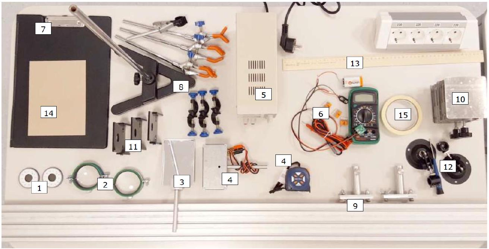

Этот эксперимент посвящен масштабному исследованию поляризации и ее применений.
Внимание! Во всех частях эксперимента оценка погрешностей НЕ требуется!
Внимание! Запрещено наносить надписи/пометки на транспортиры и прочие элементы оборудования! Предварительно приклеив малярный скотч, можно писать на нём.

Оборудование (общее для всех частей)

1. Поляризаторы (2 шт.) с известными плоскостями пропускания (разрешенное направление: $0^{\circ}-180^{\circ}\left( \pm 5^{\circ}\right)$ ). Поляризаторы заключены в круглые черные оправы с широким внутренним окошком: его диаметр 2 см
2. Линзы (2 шт.)
3. Зеркало
4. Лампа накаливания
5. Источник постоянного напряжения (не подавать на лампу напряжение выше 12 В!) (необходимую пару штекеров легко выбрать, испытав подключение каждой из пар к источнику)
6. Датчик освещенности: фотодиод на магните, мультиметр, батарейка Крона, клеммная колодка, зажимы Wago (3 шт.), резистор 10 кОм
7. Экран с магнитной поверхностью, с креплением для листа бумаги
8. Штатив с муфтами (3 шт.) и лапками (3+1 шт.)
9. Оптическая скамья с 2 рейтерами
10. Подъемные столики (2 шт.)
11. Магнитный держатель (3 шт.) поляризаторов и пластин
12. Держатель лазера (2 шт.) (с отверткой)
13. Линейка
14. Картон
15. Малярный скотч
16. Ножницы и бумага (по требованию)

Датчик освещенности следует собрать по приведенной схеме, включив в качестве резистора выданное вам сопротивление 10 кОм. Обратите внимание на полярность подключений!

Часть А. Стопа Столетова (7.0 баллов)
Оборудование (дополнительное для части А)

1. Пластины (10 шт.)
2. Канцелярская клипса

Часто возникает необходимость получить поляризованный свет большой мощности. К сожалению, обычные поляризаторы не могут выполнить эту задачу, так как сгорают при столь высокой интенсивности света, поэтому используется "стопа Столетова": набор прижатых друг к другу стеклянных пластинок, расположенных под углом Брюстера к падающему лучу. Из теории известно, что если на пластину падает луч под углом Брюстера, то отражённый свет является полностью поляризованным, а проходящий - частично поляризованным.

А1 ${ }^{1.00}$ Рассчитайте угол Брюстера теоретически (считая известным $n=1.5$ ).
А2 ${ }^{1.50}$ Определите угол Брюстера экспериментально. Нарисуйте схему вашей экспериментальной установки, приведите результаты измерений и ваш ответ.

Далее вам предстоит определить степень поляризации прошедшего через стопу Столетова света в зависимости от числа стеклянных пластинок в ее составе. При сборке экспериментальной установки вы можете использовать для регулировки высот любое выданное вам оборудование.

А3 ${ }^{1.00}$ Нарисуйте схему вашей экспериментальной установки.
А4 ${ }^{2.00}$ Как вы могли заметить, если частично поляризованный свет рассматривать через поляризатор, то наблюдаемая интенсивность света будет зависеть от ориентации поляризатора. Степенью поляризации называется величина $P=\frac{I_{\max }-I_{\min }}{I_{\max }+I_{\min }}$, где минимальная и максимальная величина интенсивности соответствуют определённым положениям поляризатора.

Для каждого размера стопы Столетова (от 1 до 10 стёкол) определите степень поляризации прошедшего через нее света.
А5 ${ }^{1.50}$ Какое число пластин необходимо использовать для получения степени поляризации $95 \%$ ?
Часть В. Сахариметр (4.0 балла)
Оборудование (дополнительное для части В)

1. Красный и зеленый лазеры с зажимом
2. 2 батарейки ААА (для лазеров)
3. Трубка со стеклянным дном
4. Сахарный сироп (2 баночки)
5. Контейнер (для слива)
6. Бумажные салфетки (по требованию)

Некоторые химические соединения обладают оптическими свойствами. В частности, в этой части задачи будет исследоваться поворот плоскости поляризации при прохождении линейно поляризованного света через сахарный сироп.

В $1^{3.00}$ Измерьте зависимость поворота плоскости поляризации от толщины слоя сиропа. Схематично изобразите вашу установку, приведите результаты всех измерений. Измерения следует провести при освещении раствора как красным, так и зеленым лазером (по отдельности). Точки обеих зависимостей нанесите на один график.

В2 ${ }^{1.00}$ Определите параметры полученных для разных лазеров зависимостей.
Часть С. Волновые пластинки (9.0 баллов)
Оборудование (дополнительное для части С)

1. Волновые пластинки №1, №2. Пластинки заключены в круглые черные оправы с узким внутренним окошком: его диаметр 1 см
2. 3D-очки №1, №2
3. Линза с дифракционной решеткой
4. Зеленый лазер с зажимом
5. 2 батарейки ААА (для лазера)

Волновой пластинкой называется пластина из одноосного кристалла, оптическая ось (направление зададим единичным вектором $\vec{y}$ ) которого лежит в ее плоскости. В волновой пластинке между обыкновенным лучем ( $\vec{E} \perp \vec{y}$ ) и необыкновенным ( $\vec{E} \| \vec{y}$ ) возникает разность хода $\Delta n l$, где $\Delta n$ - разность между показателем преломления для обыкновенного луча и необыкновенного, а $l$ - толщина пластины. Обычно эту разность хода формулируют в терминах некоторой длины волны:

1. Полуволновые $(\lambda / 2)$ пластинки $\Delta n \cdot l=\left(m+\frac{1}{2}\right) \lambda$;
2. Четвертьволновые $(\lambda / 4)$ пластинки $\Delta n \cdot l=\left(m+\frac{1}{4}\right) \lambda$ или $\Delta n \cdot l=\left(m+\frac{3}{4}\right) \lambda$.

В качестве опорной возьмем длину волны зеленого лазера: $\lambda_{\mathrm{g}}=532 \mathrm{H}$.
С1 ${ }^{0.50}$ Схематично зарисуйте и опишите эксперимент, позволяющий отличить друг от друга пластинки $\lambda / 2$ и $\lambda / 4$.
с2 ${ }^{1.00}$ Схематично зарисуйте и опишите эксперимент, позволяющий отличить одномодовую полуволновую пластинку $\left(\Delta n \cdot l=\frac{1}{2} \lambda\right)$ от многомодовой $\left(\Delta n \cdot l=\left(m+\frac{1}{2}\right) \lambda\right)$.

C3 ${ }^{5.00}$ В таблице в листе ответов отметьте, каким типам пластинок соответствуют пластинки №1, №2. Для каждой пластинки определите и запишите в таблицу направление оптической оси (с точностью до поворота на угол, кратный $90^{\circ}$ ). Если среди пластинок есть многомодовые, для них рассчитайте числа $m$. Опишите все ваши действия и наблюдения, приведите результаты всех измерений и обоснования всех ответов.

C4 ${ }^{0.50}$ Пользуясь приведенной таблицей, укажите вещество, из которого, по Вашему мнению, сделаны пластинки, если их толщина $l \approx 1$ мм.

Возможности, которые дает нам волновая оптика, давно используются в ежедневной жизни. В следующих пунктах вам придется строить предположения о том, каким образом устроены 3D-очки. Сделайте поясняющие рисунки, и для некоторых элементов, по возможности, проведите измерения их характеристик.

1. Если в Вашу схему входит плоскопараллельная пластинка, то укажите ее оптическую толщину $n l$.
2. Если в Вашу схему входит линза, то укажите ее фокусное расстояние $f$. litem Если в Вашу схему входит цветной фильтр, то укажите характерные длины волн полос пропускания и поглащения.
3. Если в Вашу схему входит поляризатор, то укажите угол между плоскостью пропускания и вертикалью.
4. Если в Вашу схему входит волновая пластинка, то укажите ее «оптическую толщину» $\Delta n \cdot l$ в терминах длины волны зеленого лазера. Например, $\Delta n \cdot l=20.21 \lambda_{\mathrm{g}}$.

C5 ${ }^{1.00}$ Предположите наиболее простое устройство 3D-очков №1. Предложите технологию создания стереоскопического (кажущегося объемным) изображения плоским экраном с помощью этих очков.

C6 ${ }^{1.00}$ Предположите наиболее простое устройство 3D-очков №2. Предложите технологию создания стереоскопического (кажущегося объемным) изображения плоским экраном с помощью этих очков.
